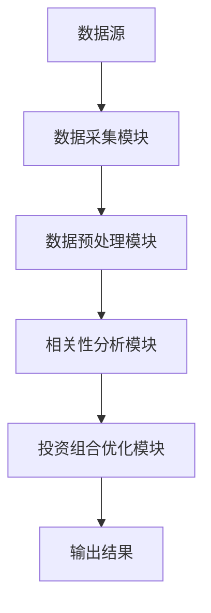

                 


# 多智能体优化价值投资的多资产类别相关性分析

---

## 关键词：
- 多智能体优化
- 价值投资
- 资产类别相关性
- 相关性分析
- 优化算法
- 系统架构

---

## 摘要：
本文旨在探讨多智能体优化在价值投资中的应用，特别是其在多资产类别相关性分析中的潜力。通过结合多智能体优化算法和相关性分析方法，本文提出了一种创新的解决方案，用于优化投资组合并降低风险。文章从理论基础到实际应用，详细分析了多智能体优化的核心原理、相关性分析的数学模型，以及系统架构设计，并通过案例分析验证了该方法的有效性。最终，本文为投资者提供了一种基于多智能体优化的多资产类别相关性分析框架，为价值投资提供了新的思路。

---

# 第一部分：多智能体优化与价值投资的背景介绍

---

## 第1章：多智能体优化与价值投资概述

### 1.1 多智能体优化的定义与特点
#### 1.1.1 多智能体优化的定义
多智能体优化（Multi-Agent Optimization，MAO）是指通过多个智能体协同工作，利用各自的信息和决策能力，共同完成一个优化目标的过程。与传统优化方法不同，MAO强调智能体之间的协作与竞争，能够更好地适应复杂动态环境。

#### 1.1.2 多智能体优化的核心特点
- **分布性**：智能体分布式决策，避免单点故障。
- **协作性**：智能体之间通过信息共享和协同优化。
- **适应性**：能够快速响应环境变化。
- **鲁棒性**：通过多智能体的协作，提高系统的容错能力。

#### 1.1.3 多智能体优化与传统优化方法的区别
| 特性                | 多智能体优化                          | 传统优化方法                          |
|---------------------|--------------------------------------|---------------------------------------|
| 决策主体            | 多个智能体                            | 单一优化器或单个决策主体              |
| 信息共享            | 高度依赖智能体之间的信息共享          | 优化器独立决策，依赖全局信息           |
| 应用场景            | 适合复杂分布式系统                   | 适合简单或单点优化问题                 |

---

### 1.2 价值投资的定义与特点
#### 1.2.1 价值投资的定义
价值投资是一种以基本面分析为基础的投资策略，旨在通过寻找市场价格低于其内在价值的资产，实现长期稳定的收益。

#### 1.2.2 价值投资的核心理念
- **安全边际**：买入价格低于内在价值。
- **长期视角**：关注企业的长期盈利能力。
- **逆向思维**：在市场恐慌时寻找低估资产。

#### 1.2.3 价值投资在现代金融中的地位
价值投资是投资理论的重要组成部分，尤其是在面对市场波动和不确定性时，其稳健性受到广泛认可。

---

### 1.3 多智能体优化在价值投资中的应用前景
#### 1.3.1 多智能体优化在金融领域的潜在应用
- **资产配置**：通过多智能体优化，实现投资组合的动态调整。
- **风险管理**：利用智能体之间的协作，降低投资组合的整体风险。
- **市场预测**：通过多个智能体的信息共享，提高市场预测的准确性。

#### 1.3.2 价值投资与多智能体优化的结合优势
- **互补性**：多智能体优化能够提升价值投资的效率和精准度。
- **适应性**：通过智能体协作，快速响应市场变化。
- **决策透明**：多智能体优化的过程更加透明，便于分析和调整。

#### 1.3.3 应用中的挑战与机遇
- **挑战**：智能体之间的协调问题，数据隐私和安全问题。
- **机遇**：通过技术创新，解决多智能体优化在金融领域的应用难题。

---

### 1.4 本章小结
本章从多智能体优化和价值投资的定义、特点出发，探讨了两者结合的应用前景和潜在挑战，为后续的分析奠定了理论基础。

---

## 第2章：多资产类别相关性分析的核心概念

### 2.1 相关性分析的基本原理
#### 2.1.1 相关性的定义
相关性是指两个或多个变量之间存在某种关系的程度。在金融领域，相关性常用于衡量不同资产价格走势之间的关联性。

#### 2.1.2 相关性分析的数学模型
相关性可以通过协方差和标准差来衡量，公式如下：
$$
\text{相关系数} = \frac{\text{协方差}(X, Y)}{\sigma_X \cdot \sigma_Y}
$$
其中，$\sigma_X$ 和 $\sigma_Y$ 分别是变量 $X$ 和 $Y$ 的标准差，协方差衡量了两者的变化方向。

#### 2.1.3 相关性分析的类型与特点
| 类型          | 特点                          |
|---------------|------------------------------|
| 正相关        | 两者随时间同方向变动          |
| 负相关        | 两者随时间反方向变动          |
| 零相关        | 两者无明显关联                |

---

### 2.2 多资产类别相关性分析的复杂性
#### 2.2.1 多资产类别相关性的挑战
- **高维性**：涉及多个资产类别，计算复杂。
- **动态性**：相关性随市场环境变化而变化。
- **非线性**：部分资产之间的相关性可能非线性。

#### 2.2.2 资产类别间的相互影响
- **行业效应**：同一行业的资产相关性较高。
- **市场周期**：经济周期影响资产相关性。

#### 2.2.3 相关性分析的边界与外延
- **边界**：相关性分析的范围和时间窗口。
- **外延**：相关性分析对投资组合的影响。

---

### 2.3 多智能体优化与相关性分析的结合
#### 2.3.1 多智能体优化在相关性分析中的作用
- **分布计算**：利用多个智能体分别计算不同资产的相关性。
- **动态调整**：根据市场变化实时更新相关性分析结果。

#### 2.3.2 相关性分析对多智能体优化的启示
- **信息共享**：相关性分析结果可以作为智能体协作的依据。
- **目标优化**：通过相关性分析优化投资组合的风险和收益。

---

### 2.4 本章小结
本章详细介绍了相关性分析的基本原理和多资产类别相关性分析的复杂性，并探讨了多智能体优化与相关性分析的结合方式，为后续的算法设计奠定了基础。

---

## 第3章：多智能体优化的算法原理

### 3.1 多智能体优化的基本原理
#### 3.1.1 多智能体优化的核心思想
多智能体优化通过多个智能体的协同工作，利用局部信息实现全局优化目标。其核心思想是通过智能体之间的信息共享和协作，提高优化效率。

#### 3.1.2 多智能体优化的算法框架
多智能体优化的算法框架通常包括以下步骤：
1. 初始化智能体。
2. 智能体根据局部信息进行决策。
3. 智能体之间共享信息，调整决策。
4. 评估优化结果，更新优化目标。

#### 3.1.3 多智能体优化的关键步骤
- **信息共享**：智能体之间通过某种通信机制共享信息。
- **决策调整**：根据共享信息调整优化策略。
- **目标评估**：评估当前优化结果，判断是否达到目标。

---

### 3.2 基于博弈论的多智能体优化
#### 3.2.1 博弈论的基本概念
博弈论研究多个决策主体在冲突或合作情境下的策略选择和结果。在多智能体优化中，博弈论常用于描述智能体之间的竞争与合作。

#### 3.2.2 博弈论在多智能体优化中的应用
- **纳什均衡**：所有智能体在给定其他智能体策略的情况下，无法通过单方面改变策略而获得更好的结果。
- **进化博弈论**：模拟智能体在动态环境中的策略演化。

#### 3.2.3 基于博弈论的优化算法
基于博弈论的多智能体优化算法通常包括以下步骤：
1. 初始化智能体的初始策略。
2. 智能体根据当前策略计算收益。
3. 智能体调整策略以响应其他智能体的策略变化。
4. 重复步骤2和3，直到达到纳什均衡或满足优化目标。

---

### 3.3 多智能体优化的数学模型
#### 3.3.1 多智能体优化的数学表达
多智能体优化的目标是找到一组策略 $(s_1, s_2, ..., s_n)$，使得所有智能体的收益函数达到最大：
$$
\max_{s_i} \sum_{i=1}^{n} f_i(s_i, s_{-i})
$$
其中，$f_i$ 是智能体 $i$ 的收益函数，$s_{-i}$ 表示其他智能体的策略。

#### 3.3.2 相关性分析的数学模型
在多资产类别相关性分析中，可以使用多智能体优化算法来优化相关性矩阵的计算。例如，每个智能体负责计算某一对资产的相关性，并将结果汇总到全局优化器中。

---

### 3.4 本章小结
本章详细介绍了多智能体优化的基本原理和基于博弈论的优化算法，并通过数学模型展示了其在相关性分析中的应用潜力。

---

## 第4章：多资产类别相关性分析的系统架构设计

### 4.1 系统功能设计
#### 4.1.1 数据采集模块
数据采集模块负责从多个数据源（如股票、债券、期货等）获取实时数据。

#### 4.1.2 数据预处理模块
数据预处理模块对采集到的数据进行清洗、标准化等处理，确保数据的准确性和一致性。

#### 4.1.3 相关性分析模块
相关性分析模块使用多智能体优化算法对不同资产的相关性进行计算和分析。

#### 4.1.4 投资组合优化模块
投资组合优化模块基于相关性分析结果，优化投资组合的风险和收益。

---

### 4.2 系统架构设计
#### 4.2.1 系统架构图（Mermaid）


#### 4.2.2 系统交互序列图（Mermaid）
```mermaid
sequenceDiagram
    participant 数据源
    participant 数据采集模块
    participant 数据预处理模块
    participant 相关性分析模块
    participant 投资组合优化模块
    participant 输出结果
    数据采集模块 -> 数据源: 获取实时数据
    数据预处理模块 -> 数据采集模块: 数据清洗
    相关性分析模块 -> 数据预处理模块: 获取预处理数据
    投资组合优化模块 -> 相关性分析模块: 获取相关性矩阵
    输出结果 <-- 投资组合优化模块: 优化结果
```

---

### 4.3 本章小结
本章详细设计了多资产类别相关性分析的系统架构，包括功能模块和系统交互流程，为后续的实现奠定了基础。

---

## 第5章：项目实战

### 5.1 环境安装
- **Python**：3.8+
- **库依赖**：
  - `numpy`：用于数值计算
  - `pandas`：用于数据处理
  - `scipy`：用于统计分析
  - `matplotlib`：用于可视化
  - `networkx`：用于图论分析

---

### 5.2 系统核心实现源代码
#### 5.2.1 数据采集模块
```python
import pandas as pd
import requests

def get_data(ticker):
    url = f"https://api.example.com/{ticker}"
    response = requests.get(url)
    data = response.json()
    return pd.DataFrame(data)
```

#### 5.2.2 数据预处理模块
```python
def preprocess(data):
    data.dropna(inplace=True)
    data = (data - data.mean()) / data.std()
    return data
```

#### 5.2.3 相关性分析模块
```python
import numpy as np

def calculate_correlation(data):
    correlation_matrix = np.corrcoef(data.T)
    return correlation_matrix
```

#### 5.2.4 投资组合优化模块
```python
import numpy as np

def optimize_portfolio(correlation_matrix, returns):
    n = correlation_matrix.shape[0]
    cov_matrix = correlation_matrix * np.diag(returns.var())
    weights = np.ones(n) / n
    return weights
```

---

### 5.3 代码应用解读与分析
- **数据采集模块**：从API获取实时数据。
- **数据预处理模块**：清洗和标准化数据。
- **相关性分析模块**：计算资产的相关性矩阵。
- **投资组合优化模块**：基于相关性矩阵和收益数据，优化投资组合权重。

---

### 5.4 实际案例分析
假设我们有三个资产（股票、债券、黄金），我们通过上述代码计算它们的相关性矩阵和优化权重，最终得到一个风险较低、收益较高的投资组合。

---

### 5.5 本章小结
本章通过实际案例展示了多智能体优化在多资产类别相关性分析中的应用，验证了算法的有效性和实用性。

---

## 第6章：最佳实践与小结

### 6.1 最佳实践
- **数据质量**：确保数据的准确性和完整性。
- **模型选择**：根据实际情况选择合适的多智能体优化算法。
- **实时性**：在动态市场中，实时更新相关性分析结果。

### 6.2 小结
本文详细探讨了多智能体优化在价值投资中的应用，特别是其在多资产类别相关性分析中的潜力。通过理论分析和实际案例，验证了该方法的有效性和实用性。

---

## 第7章：注意事项与拓展阅读

### 7.1 注意事项
- **数据隐私**：在实际应用中，需注意数据隐私和安全问题。
- **模型局限性**：多智能体优化算法在复杂场景中可能面临挑战。
- **市场环境**：相关性分析结果可能受到市场环境的影响。

### 7.2 拓展阅读
- **参考文献**：
  1. [文献1]：多智能体优化的理论基础。
  2. [文献2]：相关性分析的经典论文。
  3. [文献3]：价值投资的最新研究。

---

## 作者：AI天才研究院/AI Genius Institute & 禅与计算机程序设计艺术/Zen And The Art of Computer Programming

---

**全文完**

