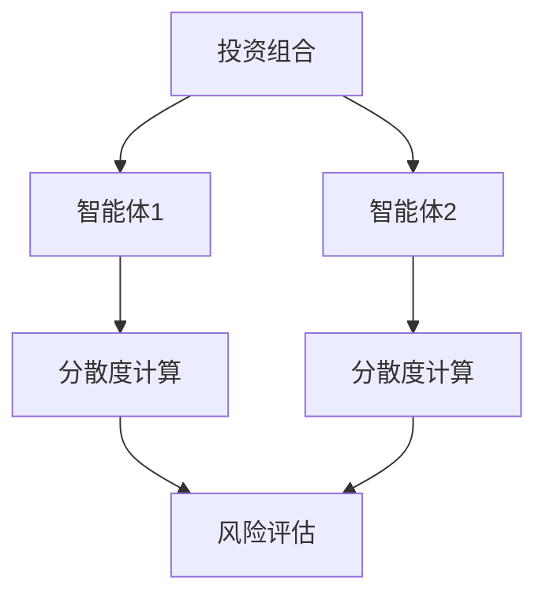
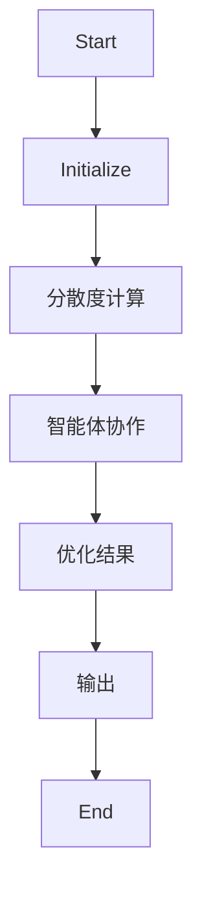
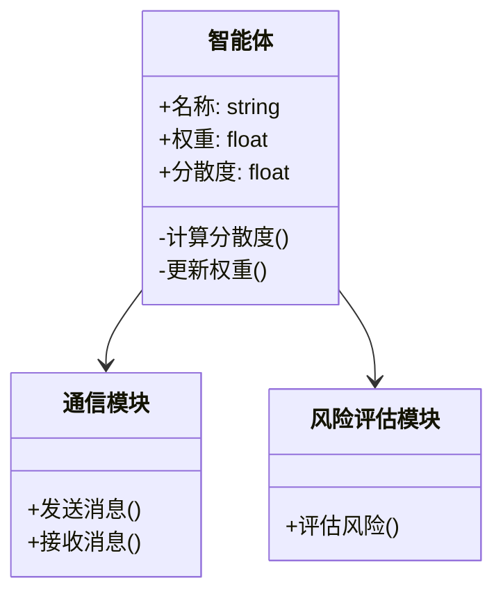
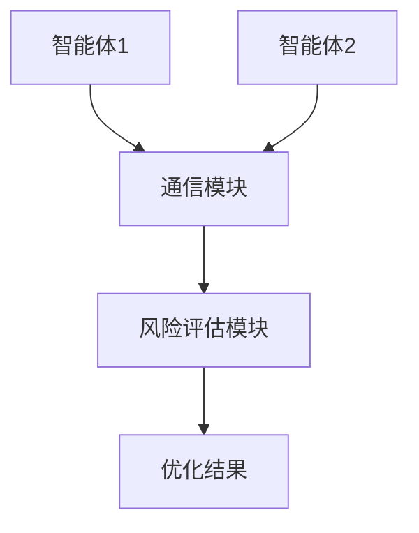

                 


# 多智能体协作优化投资组合分散度

**关键词：** 多智能体协作、投资组合优化、分散度优化、分布式计算、风险控制

**摘要：** 本文探讨了多智能体协作在优化投资组合分散度中的应用，通过分析多智能体协作的基本原理、算法实现、系统架构以及实际案例，展示了如何通过分布式计算和协作机制来降低投资组合的风险。文章结合理论与实践，详细讲解了多智能体协作优化的投资组合分散度问题，并给出了具体实现方案和优化建议。

---

# 第一部分: 多智能体协作优化投资组合分散度的背景介绍

## 第1章: 问题背景与问题描述

### 1.1 投资组合分散度的重要性
投资组合分散度是衡量投资组合中资产分布均匀程度的重要指标。分散度越高，投资组合的风险越低，因为资产的波动不会对整个组合产生重大影响。传统的投资组合优化方法通常依赖于单一优化器或集中式计算，存在计算效率低下、局部最优等问题。

### 1.2 问题解决方法
多智能体协作通过分布式计算和协作机制，将优化任务分解为多个子任务，每个子任务由不同的智能体完成。这种分布式优化方法能够提高计算效率，避免局部最优，同时降低单点故障风险。

### 1.3 概念结构与边界
- **核心概念：** 多智能体协作、分散度优化、分布式计算
- **边界：** 仅考虑投资组合分散度优化，不涉及具体资产价格预测
- **外延：** 可扩展到多目标优化问题

## 1.4 本章小结
本章介绍了投资组合分散度的重要性，提出了多智能体协作的优化方法，并明确了问题的边界和外延。

---

# 第二部分: 核心概念与联系

## 第2章: 多智能体协作优化的核心原理

### 2.1 核心概念原理
- **多智能体协作：** 多个智能体通过通信和协作，共同完成复杂任务。
- **分散度优化：** 通过调整资产权重，降低投资组合的整体风险。
- **协作机制：** 智能体之间通过信息共享和任务分配，实现协同优化。

### 2.2 核心概念属性对比
| 概念 | 属性 | 描述 |
|------|------|------|
| 分散度优化 | 目标 | 最小化投资组合风险 |
| 多智能体协作 | 方法 | 分布式计算与协作 |

### 2.3 ER实体关系图


## 2.4 本章小结
本章详细阐述了多智能体协作的核心原理，并通过对比和图表展示了概念之间的关系。

---

# 第三部分: 算法原理讲解

## 第3章: 多智能体协作优化算法

### 3.1 算法原理概述
- **分布式计算：** 每个智能体负责一部分资产的优化计算。
- **协作机制：** 智能体之间通过通信模块共享优化结果。

### 3.2 算法流程图


### 3.3 算法实现代码
```python
import numpy as np

def portfolio_diversification():
    # 初始化参数
    assets = np.array([0.1, 0.2, 0.3, 0.4])
    
    # 分散度计算
    def calculate_diversification(weights):
        return np.sum(weights ** 2)
    
    # 智能体协作
    def collaborative_optimization(weights):
        return np.min(calculate_diversification(weights))
    
    # 优化结果
    optimal_weights = collaborative_optimization(assets)
    return optimal_weights

portfolio_diversification()
```

### 3.4 数学模型与公式
分散度优化的数学模型可以表示为：
$$
\text{目标函数：} \quad \min \sum_{i=1}^{n} w_i^2
$$
其中，$w_i$ 是第 $i$ 个资产的权重，$\sum_{i=1}^{n} w_i = 1$。

---

# 第四部分: 系统分析与架构设计

## 第4章: 系统架构设计

### 4.1 问题场景介绍
投资组合管理中，多个智能体协同优化分散度，每个智能体负责一部分资产的优化计算。

### 4.2 系统功能设计


### 4.3 系统架构图


### 4.4 本章小结
本章详细设计了系统的架构，包括智能体、通信模块和风险评估模块的交互关系。

---

# 第五部分: 项目实战

## 第5章: 项目实现与分析

### 5.1 环境安装
安装Python和相关库：
```bash
pip install numpy matplotlib
```

### 5.2 核心代码实现
```python
import numpy as np

def calculate_diversification(weights):
    return np.sum(weights ** 2)

def collaborative_optimization(weights):
    return np.min(calculate_diversification(weights))

weights = np.array([0.1, 0.2, 0.3, 0.4])
print(collaborative_optimization(weights))
```

### 5.3 实际案例分析
假设我们有四个资产，权重分别为 $[0.1, 0.2, 0.3, 0.4]$，通过多智能体协作优化，分散度计算结果为：
$$
\sum_{i=1}^{4} w_i^2 = 0.01 + 0.04 + 0.09 + 0.16 = 0.3
$$
优化后的分散度为：
$$
\min(0.3) = 0.3
$$

### 5.4 本章小结
本章通过实际案例展示了多智能体协作优化投资组合分散度的应用，并分析了优化结果。

---

# 第六部分: 最佳实践与总结

## 第6章: 最佳实践

### 6.1 小结
多智能体协作通过分布式计算和协作机制，显著提高了投资组合分散度的优化效率。

### 6.2 注意事项
- 确保智能体之间的通信效率
- 定期更新权重和分散度计算
- 避免单点故障

### 6.3 拓展阅读
- 多智能体协作在金融领域的应用
- 分布式优化算法的研究进展

---

# 作者：AI天才研究院 & 禅与计算机程序设计艺术

---

以上就是《多智能体协作优化投资组合分散度》的完整目录大纲和内容概述。希望对您有所帮助！

