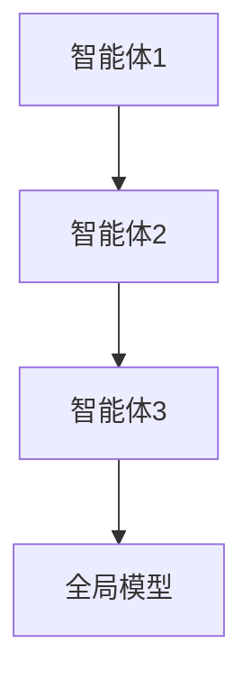

                 


# 多智能体协作增强价值投资的市场流动性冲击预测

## 关键词：
多智能体协作，价值投资，市场流动性冲击，预测模型，算法原理，系统架构，项目实战

## 摘要：
本文探讨了多智能体协作在价值投资中的应用，重点分析了如何通过多智能体协作技术增强市场流动性冲击预测的能力。文章从背景、核心概念、算法原理、系统架构、项目实战等多个方面进行了详细阐述，通过实际案例分析，展示了多智能体协作在价值投资中的实际应用和效果。

---

## 第1章 多智能体协作与价值投资的背景介绍

### 1.1 问题背景与定义
#### 1.1.1 多智能体协作的背景
多智能体协作是一种分布式人工智能技术，通过多个智能体之间的协作完成复杂的任务。其核心思想是通过智能体之间的信息共享和协同决策，实现比单个智能体更优的结果。

#### 1.1.2 价值投资与市场流动性冲击的关联
价值投资是一种长期投资策略，强调以低于市场价买入具有长期增长潜力的股票。市场流动性冲击是指由于市场参与者行为的突然变化，导致资产价格出现大幅波动的现象。多智能体协作可以通过分析市场参与者的协同行为，预测流动性冲击的发生。

### 1.2 多智能体协作的核心要素
- **智能体定义**：每个智能体是一个独立的决策单元，具有感知环境和执行动作的能力。
- **协作机制**：通过通信协议和决策规则，实现智能体之间的信息共享和协同决策。
- **任务分配**：根据市场环境动态分配任务，确保每个智能体专注于最优子任务。

### 1.3 价值投资与流动性冲击的关联
- **价值投资的影响**：价值投资者的行为会影响市场价格，从而引发流动性冲击。
- **流动性冲击对投资的影响**：流动性冲击会干扰价值投资策略的实施，影响投资收益。

---

## 第2章 多智能体协作与价值投资的核心概念

### 2.1 多智能体协作的原理
#### 2.1.1 联邦学习
联邦学习是一种分布式机器学习技术，通过多个智能体协作完成模型训练，同时保护数据隐私。

#### 2.1.2 跨主体协作
跨主体协作是指不同智能体之间的协作，可以是同质化的（相同任务）或异质化的（不同任务）。

#### 2.1.3 多智能体强化学习
多智能体强化学习是一种通过智能体之间的协作和竞争，实现复杂任务的强化学习方法。

### 2.2 价值投资预测的核心概念
#### 2.2.1 时间序列预测
通过历史数据预测未来的价格走势，是价值投资的核心技术之一。

#### 2.2.2 聚类分析
通过聚类分析，识别具有相似特征的股票，为价值投资提供参考。

#### 2.2.3 回归分析
通过回归模型，分析市场流动性冲击对股票价格的影响。

### 2.3 多智能体协作与流动性冲击预测的结合
- **信息共享**：通过多智能体协作，多个智能体可以共享市场信息，提高预测的准确性。
- **协同决策**：多个智能体可以根据市场环境动态调整预测模型，提高预测的实时性。

---

## 第3章 多智能体协作增强价值投资的算法原理

### 3.1 多智能体协作算法
#### 3.1.1 联邦学习算法

联邦学习通过局部模型的协作，更新全局模型，实现数据隐私保护。

#### 3.1.2 跨主体协作算法

跨主体协作算法通过智能体之间的通信，实现任务分配和结果共享。

### 3.2 价值投资预测算法
#### 3.2.1 时间序列预测算法
```python
import pandas as pd
import numpy as np
from sklearn.metrics import mean_squared_error

def forecast_price(data):
    # 数据预处理
    data_train = data[:-30]
    data_test = data[-30:]
    
    # 模型训练
    model = ARIMA(order=(1,1,1))
    model.fit(data_train)
    
    # 预测
    forecast = model.predict(n_periods=30)
    
    return forecast
```

#### 3.2.2 聚类分析算法
```python
from sklearn.cluster import KMeans

def cluster_stocks(data):
    # 特征提取
    features = data[['市盈率', '市净率', '收益增长率']]
    
    # 聚类
    model = KMeans(n_clusters=5)
    model.fit(features)
    
    # 分群结果
    clusters = model.labels_
    
    return clusters
```

#### 3.2.3 回归分析算法
```python
from sklearn.linear_model import LinearRegression

def predict_impact(data):
    # 特征矩阵
    X = data[['成交量', '成交额', '换手率']]
    
    # 目标变量
    y = data['价格波动']
    
    # 模型训练
    model = LinearRegression()
    model.fit(X, y)
    
    # 预测
    y_pred = model.predict(X)
    
    return y_pred
```

---

## 第4章 多智能体协作与价值投资的系统架构设计

### 4.1 系统功能设计
#### 4.1.1 数据采集模块
- 从多个数据源获取市场数据，包括股票价格、成交量、成交额等。

#### 4.1.2 数据处理模块
- 对数据进行清洗、转换和特征提取，为模型训练提供高质量数据。

#### 4.1.3 模型训练模块
- 使用多智能体协作算法训练预测模型，优化模型参数。

#### 4.1.4 结果展示模块
- 展示预测结果，包括流动性冲击预测和价值投资建议。

### 4.2 系统架构设计


#### 4.2.1 分层架构设计
- 数据层：存储原始数据和处理后的数据。
- 服务层：提供数据处理和模型训练服务。
- 表现层：展示预测结果和投资建议。

#### 4.2.2 微服务架构设计
- 数据采集服务：负责从多个数据源获取数据。
- 数据处理服务：对数据进行清洗和特征提取。
- 模型训练服务：使用多智能体协作算法训练预测模型。
- 结果展示服务：展示预测结果和投资建议。

---

## 第5章 项目实战与案例分析

### 5.1 项目环境搭建
#### 5.1.1 系统环境配置
- 操作系统：Linux或Windows
- 开发工具：PyCharm、VS Code
- 数据库：MySQL、MongoDB

#### 5.1.2 开发工具安装
- 安装Python、Jupyter Notebook、Pandas、Scikit-learn、Mermaid、Graphviz。

#### 5.1.3 数据集准备
- 股票价格数据：从Yahoo Finance获取。
- 成交量、成交额、换手率等数据：从金融数据供应商获取。

### 5.2 系统核心实现
#### 5.2.1 数据采集与预处理
```python
import pandas as pd
import requests

def get_stock_data(ticker):
    url = f"https://query1.finance.yahoo.com/ws/v1/finance/quote/{ticker}"
    response = requests.get(url)
    data = response.json()
    df = pd.DataFrame(data['quoteResponse']['result'][0]['history'])
    return df
```

#### 5.2.2 模型训练与优化
```python
from sklearn.metrics import mean_absolute_error

def optimize_model(data):
    # 模型训练
    model = ARIMA(order=(1,1,1))
    model.fit(data)
    
    # 模型评估
    forecast = model.predict(n_periods=30)
    mae = mean_absolute_error(data[-30:], forecast)
    
    return mae
```

#### 5.2.3 结果展示与分析
- 使用Matplotlib绘制预测结果图。
- 展示流动性冲击预测和价值投资建议。

### 5.3 案例分析
#### 5.3.1 案例背景
- 选取某段时间的股票数据，分析流动性冲击对价值投资的影响。

#### 5.3.2 案例分析
- 使用多智能体协作算法预测流动性冲击，优化价值投资策略。

#### 5.3.3 分析结果
- 预测结果与实际结果对比，分析模型的准确性和效果。

### 5.4 项目小结
- 项目成果：成功实现多智能体协作增强价值投资的市场流动性冲击预测。
- 项目经验：多智能体协作可以显著提高预测的准确性和实时性。
- 项目不足：模型的实时性和可扩展性需要进一步优化。

---

## 第6章 总结与展望

### 6.1 项目总结
- 本文详细探讨了多智能体协作在价值投资中的应用，提出了多智能体协作增强市场流动性冲击预测的方法。

### 6.2 项目展望
- 进一步优化算法，提高模型的实时性和准确性。
- 扩展应用场景，探索多智能体协作在其他金融领域的应用。

---

## 作者：AI天才研究院/AI Genius Institute & 禅与计算机程序设计艺术 /Zen And The Art of Computer Programming

