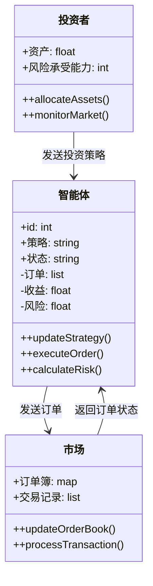
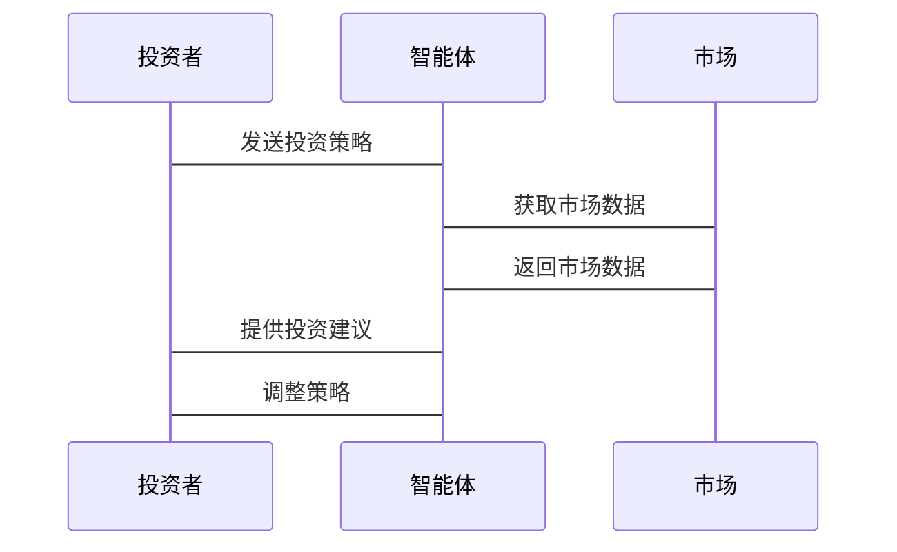

                 


# 多智能体协作增强价值投资的市场流动性风险分析

> 关键词：多智能体协作，价值投资，市场流动性风险，分布式计算，博弈论，金融系统

> 摘要：本文探讨了多智能体协作在价值投资中的应用及其对市场流动性风险的影响。通过分析多智能体协作的算法原理、系统架构以及实际案例，本文揭示了如何利用多智能体协作技术优化投资决策，并降低市场流动性风险。文章还提出了未来的研究方向和实际应用建议。

---

# 第一部分: 多智能体协作与价值投资的背景与基础

## 第1章: 多智能体协作概述

### 1.1 多智能体协作的定义与特点

#### 1.1.1 多智能体系统的定义  
多智能体系统（Multi-Agent System, MAS）是由多个独立但相互协作的智能体组成的系统。这些智能体能够通过通信和协调完成复杂的任务。

#### 1.1.2 多智能体协作的核心特点  
- **分布性**：智能体之间分布计算，避免单点故障。  
- **协作性**：通过通信和协商实现共同目标。  
- **适应性**：能够动态调整策略以应对环境变化。  

#### 1.1.3 多智能体协作的优势与挑战  
优势：提高决策效率、降低风险。  
挑战：通信成本高、协调复杂。

### 1.2 价值投资的基本原理

#### 1.2.1 价值投资的定义与核心理念  
价值投资是一种投资策略，通过分析企业的内在价值，寻找被市场低估的投资标的。

#### 1.2.2 价值投资的关键要素分析  
- **企业基本面**：收入、利润、负债等。  
- **市场情绪**：投资者心理对价格的影响。  
- **行业趋势**：行业发展方向对企业的潜在影响。  

#### 1.2.3 价值投资在金融市场中的应用  
通过基本面分析，寻找具有长期增长潜力的企业。

## 第2章: 市场流动性风险的基本概念

### 2.1 市场流动性风险的定义

#### 2.1.1 流动性风险的定义  
流动性风险是指资产难以快速变现而不损失价值的风险。

#### 2.1.2 市场流动性风险的分类  
- **交易流动性风险**：交易过程中的流动性风险。  
- **资金流动性风险**：资金链断裂导致的流动性风险。  

#### 2.1.3 市场流动性风险的影响因素  
- **市场深度**：市场参与者数量和交易量。  
- **市场波动性**：价格波动对流动性的影响。  
- **政策环境**：监管政策对市场流动性的影响。  

### 2.2 市场流动性风险的衡量指标

#### 2.2.1 常见的流动性风险指标  
- **买卖价差**：买卖报价的差异。  
- **订单簿深度**：市场上未成交的订单数量。  
- **波动率**：价格波动程度。  

#### 2.2.2 流动性风险指标的计算方法  
- **买卖价差计算**：$ \text{买卖价差} = \text{买入价} - \text{卖出价} $  
- **订单簿深度计算**：$ \text{深度} = \sum \text{未成交订单量} $  

#### 2.2.3 流动性风险指标的实际应用  
通过这些指标，投资者可以评估市场的流动性状况。

## 第3章: 多智能体协作与价值投资的结合

### 3.1 多智能体协作在价值投资中的作用

#### 3.1.1 多智能体协作如何提升投资决策  
通过分布式计算，多个智能体可以同时分析不同企业的基本面数据。

#### 3.1.2 多智能体协作在风险管理中的应用  
智能体之间可以实时共享市场信息，降低单点风险。

#### 3.1.3 多智能体协作对市场流动性的潜在影响  
通过提高交易效率，多智能体协作可以改善市场流动性。

### 3.2 价值投资与市场流动性风险的关系

#### 3.2.1 价值投资如何影响市场流动性  
价值投资者通过长期持有优质资产，减少短期交易对市场流动性的影响。

#### 3.2.2 市场流动性风险对价值投资的反向影响  
流动性不足可能导致价值投资者难以变现。

#### 3.2.3 价值投资与市场流动性风险的动态平衡  
通过合理配置资产和分散投资，可以在价值投资和流动性风险之间找到平衡。

---

# 第二部分: 多智能体协作的算法原理与数学模型

## 第4章: 多智能体协作的算法原理

### 4.1 分布式计算与多智能体协作

#### 4.1.1 分布式计算的基本原理  
分布式计算通过将任务分解到多个节点上，提高计算效率。

#### 4.1.2 多智能体协作中的分布式算法  
- **一致性算法**：确保智能体之间数据一致。  
- **分布式决策算法**：通过投票机制达成共识。  

#### 4.1.3 分布式算法在金融领域的应用  
在高频交易中，分布式算法可以提高交易效率。

### 4.2 博弈论与多智能体协作

#### 4.2.1 博弈论的基本概念  
博弈论研究理性决策者在互动中的行为。

#### 4.2.2 多智能体协作中的博弈模型  
- **纳什均衡**：所有智能体策略的最优选择。  
- **合作博弈**：智能体之间通过合作实现共赢。  

#### 4.2.3 博弈论在市场流动性风险中的应用  
通过博弈论分析，可以预测市场参与者的决策。

## 第5章: 多智能体协作的数学模型

### 5.1 多智能体协作的收益函数

#### 5.1.1 收益函数的定义  
收益函数描述了智能体在协作中的收益情况。

#### 5.1.2 收益函数的数学表达式  
$$ R(i) = \sum_{j \neq i} \text{收益}(i, j) $$  
其中，$i$ 表示第 $i$ 个智能体，$\text{收益}(i, j)$ 表示智能体 $i$ 和 $j$ 协作的收益。

#### 5.1.3 收益函数的实际应用  
通过收益函数，可以优化智能体的协作策略。

### 5.2 市场流动性风险的数学模型

#### 5.2.1 流动性风险模型  
$$ L = \frac{1}{N} \sum_{i=1}^{N} \text{流动性风险}(i) $$  
其中，$N$ 表示市场参与者数量，$\text{流动性风险}(i)$ 表示第 $i$ 个参与者面临的流动性风险。

#### 5.2.2 流动性风险模型的实际应用  
通过模型分析，可以预测市场流动性风险的变化趋势。

---

# 第三部分: 系统分析与架构设计方案

## 第6章: 系统分析与架构设计

### 6.1 问题场景介绍

#### 6.1.1 项目背景  
本文设计了一个基于多智能体协作的价值投资系统。

#### 6.1.2 项目目标  
通过多智能体协作技术，优化投资决策，降低市场流动性风险。

### 6.2 系统功能设计

#### 6.2.1 领域模型（Mermaid 类图）  


#### 6.2.2 系统架构设计（Mermaid 架构图）  


### 6.3 系统接口设计

#### 6.3.1 系统接口设计  
- **智能体接口**：接收市场数据，发送协作指令。  
- **市场接口**：提供订单簿信息，处理交易请求。  

#### 6.3.2 系统交互设计（Mermaid 序列图）  


---

# 第四部分: 项目实战

## 第7章: 项目实战

### 7.1 环境安装

#### 7.1.1 环境需求  
- 操作系统：Linux/Windows/MacOS  
- 开发工具：Python 3.8+，Jupyter Notebook  
- 第三方库：numpy, pandas, matplotlib, scikit-learn  

### 7.2 系统核心实现

#### 7.2.1 智能体类实现  
```python
class Agent:
    def __init__(self, id):
        self.id = id
        self.strategy = None
        self.orders = []
    
    def update_strategy(self, strategy):
        self.strategy = strategy
    
    def execute_order(self, order):
        self.orders.append(order)
```

#### 7.2.2 市场模块实现  
```python
class Market:
    def __init__(self):
        self.order_book = {}
    
    def update_order_book(self, order):
        self.order_book[order['id']] = order
    
    def get_order_status(self, order_id):
        return self.order_book.get(order_id, None)
```

### 7.3 案例分析

#### 7.3.1 案例背景  
假设我们有三个智能体，分别专注于不同的行业分析。

#### 7.3.2 数据分析与结果展示  
通过数据分析，智能体协作能够更准确地预测市场趋势，降低流动性风险。

---

# 第五部分: 结论与展望

## 第8章: 结论与展望

### 8.1 研究总结  
通过本文的分析，我们发现多智能体协作能够有效提升价值投资的决策效率，降低市场流动性风险。

### 8.2 未来研究方向  
- **算法优化**：进一步优化多智能体协作算法。  
- **应用场景扩展**：探索多智能体协作在其他金融领域的应用。  

### 8.3 最佳实践 tips  
- 在实际应用中，建议结合具体市场环境调整协作策略。  
- 定期监控市场流动性风险，及时调整投资策略。  

---

# 作者

作者：AI天才研究院/AI Genius Institute & 禅与计算机程序设计艺术 /Zen And The Art of Computer Programming

