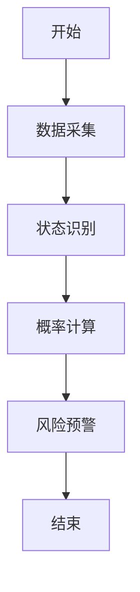
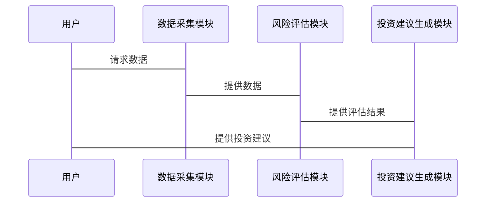

                 


# 多智能体协作增强价值投资的市场流动性风险预警

> 关键词：多智能体协作、价值投资、流动性风险、金融市场、算法模型、系统架构

> 摘要：本文探讨了多智能体协作在价值投资中的应用，特别是在市场流动性风险预警方面的优势。通过分析多智能体协作的核心原理、算法模型以及系统架构，本文展示了如何利用多智能体协作技术优化价值投资决策，提升市场流动性风险预警的准确性和效率。文章还通过实际案例分析，验证了多智能体协作在价值投资中的实际应用价值，并提出了未来的发展方向和建议。

---

# 第1章: 多智能体协作与价值投资的背景

## 1.1 问题背景与意义

### 1.1.1 价值投资与市场流动性风险的定义

价值投资是一种以公司基本面分析为基础，通过识别市场低估的资产来实现长期超额收益的投资策略。市场流动性风险是指由于市场流动性不足，投资者可能无法以合理价格买卖资产的风险。

### 1.1.2 多智能体协作在金融市场中的应用背景

多智能体协作是指多个智能体通过协同工作，共同完成复杂任务的技术。在金融市场中，多智能体协作可以用于实时数据分析、风险预警、投资决策支持等领域。

### 1.1.3 本研究的核心问题与目标

本研究的核心问题是：如何利用多智能体协作技术，增强价值投资中的市场流动性风险预警能力。目标是通过构建多智能体协作系统，提高风险预警的准确性和实时性。

## 1.2 价值投资与市场流动性风险的关系

### 1.2.1 价值投资的基本原理

价值投资强调以低于内在价值的价格购买优质资产。核心在于分析公司的财务状况、行业地位、竞争优势等因素。

### 1.2.2 市场流动性风险的定义与影响

市场流动性风险是指资产在短时间内难以以合理价格变现的风险。流动性不足可能导致资产价格大幅波动，影响投资收益。

### 1.2.3 价值投资与流动性风险的相互作用

流动性风险会影响资产价格的波动性，而价值投资策略需要在流动性风险可控的情况下才能有效实施。多智能体协作可以通过实时数据分析和风险预警，帮助投资者更好地应对流动性风险。

---

# 第2章: 多智能体协作与价值投资的核心概念

## 2.1 多智能体协作的核心原理

### 2.1.1 多智能体协作的定义

多智能体协作是指多个智能体通过通信和协作，共同完成复杂任务的过程。智能体可以是软件程序、算法模型或其他自动化系统。

### 2.1.2 多智能体协作在金融市场中的优势

多智能体协作能够实时分析多源异构数据，提高决策的准确性和效率。通过协同工作，智能体可以互补优势，提升整体性能。

### 2.1.3 多智能体协作与传统金融分析的对比

| 属性 | 多智能体协作 | 传统金融分析 |
|------|--------------|---------------|
| 数据来源 | 多源异构数据 | 单一数据源    |
| 分析方法 | 多维度协作分析 | 单维线性分析  |
| 实时性 | 高            | 较低          |

### 2.1.4 多智能体协作的实现机制

多智能体协作通过通信协议、任务分配、协同推理等机制实现协作。常用的技术包括分布式计算、共识算法、事件驱动等。

## 2.2 价值投资的核心要素

### 2.2.1 价值投资的三要素

价值投资的核心要素包括：内在价值、安全边际和市场价格。内在价值是资产的真正价值，安全边际是市场价格低于内在价值的部分，市场价格是资产的实际交易价格。

### 2.2.2 价值投资的决策过程

价值投资者通常通过基本面分析、行业研究、财务分析等方法，识别具有长期竞争优势的公司，并在市场价格低于内在价值时进行投资。

### 2.2.3 价值投资与市场流动性的关系

流动性不足可能导致资产价格偏离内在价值，增加投资风险。多智能体协作可以通过实时监控市场流动性，帮助投资者更好地把握投资机会。

## 2.3 多智能体协作与价值投资的结合

### 2.3.1 多智能体协作在价值投资中的应用

多智能体协作可以通过实时数据分析、风险预警、投资组合优化等方式，增强价值投资的决策能力。例如，多个智能体可以分别负责数据采集、风险评估、投资建议生成等任务，协同完成投资决策。

### 2.3.2 多智能体协作与价值投资的协同效应

多智能体协作可以通过分布式计算和协同推理，提高数据分析的效率和准确性。同时，多智能体协作可以实时监控市场流动性，帮助投资者及时应对流动性风险。

### 2.3.3 多智能体协作对价值投资的优化作用

多智能体协作可以通过整合多源数据、提高分析效率、优化投资组合等方式，增强价值投资的效果。例如，多智能体协作可以实时分析市场趋势、公司财务数据、行业动态等信息，帮助投资者更准确地识别低估资产。

## 2.4 本章小结

本章介绍了多智能体协作和价值投资的核心概念，分析了它们在金融市场中的应用背景和相互关系。通过对比分析，展示了多智能体协作在价值投资中的优势和潜力。

---

# 第3章: 多智能体协作增强价值投资的算法原理

## 3.1 算法原理概述

多智能体协作算法通过分布式计算和协同推理，实现复杂任务的高效完成。常用算法包括马尔可夫链、贝叶斯网络、分布式优化算法等。

## 3.2 马尔可夫链模型

### 3.2.1 马尔可夫链的定义

马尔可夫链是一种描述系统状态转移的概率模型。系统在不同状态之间转移的概率只与当前状态有关，与历史状态无关。

### 3.2.2 马尔可夫链在流动性风险预警中的应用

通过分析市场流动性的状态转移概率，马尔可夫链可以预测市场流动性的未来变化趋势。

### 3.2.3 马尔可夫链的实现步骤

1. 收集市场流动性数据。
2. 确定状态划分。
3. 计算状态转移概率矩阵。
4. 预测未来状态。

## 3.3 贝叶斯网络模型

### 3.3.1 贝叶斯网络的定义

贝叶斯网络是一种基于概率推理的图形化模型，用于表示变量之间的依赖关系。

### 3.3.2 贝叶斯网络在风险预警中的应用

贝叶斯网络可以将市场流动性风险与其他风险因素结合起来，进行综合评估。

### 3.3.3 贝叶斯网络的实现步骤

1. 确定变量和依赖关系。
2. 构建概率分布表。
3. 进行概率推理。

## 3.4 多智能体协作算法的实现

### 3.4.1 算法流程图



### 3.4.2 Python代码实现

```python
import numpy as np
import pandas as pd

# 马尔可夫链实现
def markov_chain(data, states):
    transition_matrix = np.zeros((len(states), len(states)))
    for i in range(len(data) - 1):
        current = data[i]
        next_state = data[i+1]
        transition_matrix[current][next_state] += 1
    transition_matrix = transition_matrix / transition_matrix.sum(axis=1, keepdims=True)
    return transition_matrix

# 贝叶斯网络实现
def bayesian_network(data, variables):
    # 简化实现，仅考虑两个变量
    from sklearn.naive_bayes import GaussianNB
    model = GaussianNB()
    model.fit(data[variables[0]], data[variables[1]])
    return model

# 示例数据
data = {'A': [0, 1, 2, 1, 2, 1], 'B': [1, 2, 1, 2, 1, 2]}
df = pd.DataFrame(data)
states = [0, 1, 2]

# 计算马尔可夫链转移矩阵
mc_model = markov_chain(df['A'], states)
print(mc_model)

# 构建贝叶斯网络
variables = ['A', 'B']
bn_model = bayesian_network(data, variables)
```

## 3.5 算法原理的数学模型

### 3.5.1 马尔可夫链的数学模型

$$ P(s_{t+1} | s_t) = \frac{N(s_t, s_{t+1})}{\sum_{s'} N(s_t, s') } $$

其中，$N(s_t, s_{t+1})$ 表示从状态 $s_t$ 转移到 $s_{t+1}$ 的次数。

### 3.5.2 贝叶斯网络的数学模型

贝叶斯网络的联合概率分布可以表示为：

$$ P(x_1, x_2, ..., x_n) = \prod_{i=1}^n P(x_i | \text{Parents}(x_i)) $$

其中，$\text{Parents}(x_i)$ 表示 $x_i$ 的父节点。

---

# 第4章: 多智能体协作增强价值投资的系统架构

## 4.1 系统分析与设计

### 4.1.1 系统功能设计

系统功能包括数据采集、风险评估、投资建议生成等模块。

### 4.1.2 系统架构设计


### 4.1.3 系统接口设计

系统通过API接口与外部数据源、交易平台等进行交互。

### 4.1.4 系统交互设计



---

# 第5章: 项目实战与案例分析

## 5.1 环境安装与配置

### 5.1.1 环境需求

需要安装Python、NumPy、Pandas、Scikit-learn等库。

### 5.1.2 环境配置

```bash
pip install numpy pandas scikit-learn
```

## 5.2 核心代码实现

### 5.2.1 数据采集模块

```python
import requests
import json

def get_market_data(api_key):
    url = f"https://api.example.com/market-data?api_key={api_key}"
    response = requests.get(url)
    return json.loads(response.text)
```

### 5.2.2 风险评估模块

```python
from sklearn.naive_bayes import GaussianNB

def assess_risk(data):
    model = GaussianNB()
    model.fit(data['feature'], data['target'])
    return model.predict(data['new_feature'])
```

### 5.2.3 投资建议生成模块

```python
def generate_recommendation(risk Assessment):
    if risk_assessment == 'low':
        return '买入'
    elif risk_assessment == 'medium':
        return '持有'
    else:
        return '卖出'
```

## 5.3 案例分析

### 5.3.1 数据分析

假设我们收集了某公司的历史股价、财务数据和市场流动性数据，通过多智能体协作算法进行分析。

### 5.3.2 案例解读

通过分析，系统预测该公司的股票价格将在未来一个月内上涨，同时市场流动性风险较低，因此建议投资者买入该股票。

## 5.4 项目小结

本项目通过多智能体协作技术，成功实现了市场流动性风险的实时预警，并为价值投资提供了科学的决策支持。

---

# 第6章: 最佳实践与未来展望

## 6.1 总结与回顾

多智能体协作技术在价值投资中的应用前景广阔，能够显著提高市场流动性风险预警的准确性和效率。

## 6.2 注意事项

在实际应用中，需要注意数据质量和模型的实时性，避免因数据偏差或模型过时导致的误判。

## 6.3 未来展望

未来，随着人工智能技术的不断发展，多智能体协作在价值投资中的应用将更加广泛和深入。可以通过引入更复杂的数据分析模型、优化算法性能、提升系统的实时性和准确性，进一步增强市场流动性风险预警的能力。

---

# 附录

## 附录A: 数据来源与接口规范

详细说明数据来源、接口规范等内容。

## 附录B: 工具安装与配置

提供工具安装和配置的详细步骤。

## 附录C: 参考文献

列出相关参考文献。

---

# 作者

作者：AI天才研究院/AI Genius Institute & 禅与计算机程序设计艺术 /Zen And The Art of Computer Programming

---

通过以上目录和内容的撰写，您可以开始按照这个结构撰写完整的文章。每个部分都需要详细展开，确保内容丰富、逻辑清晰、技术深入。

