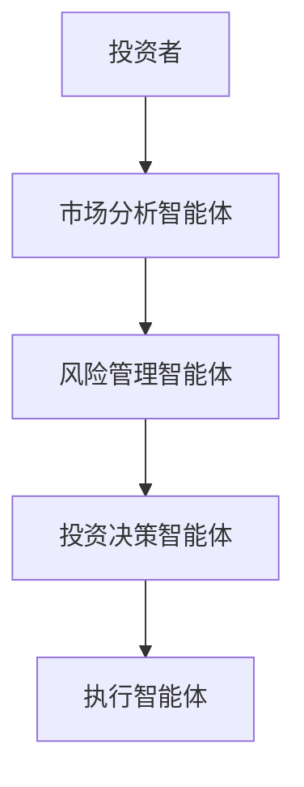
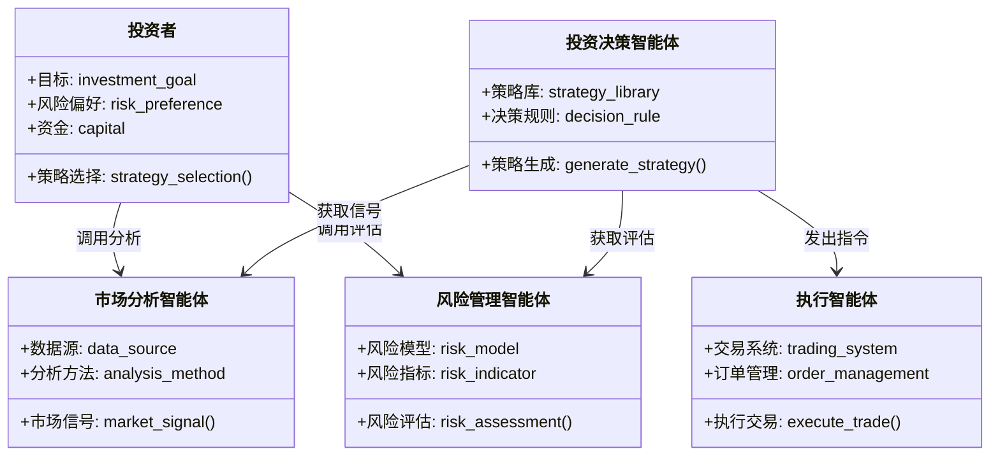
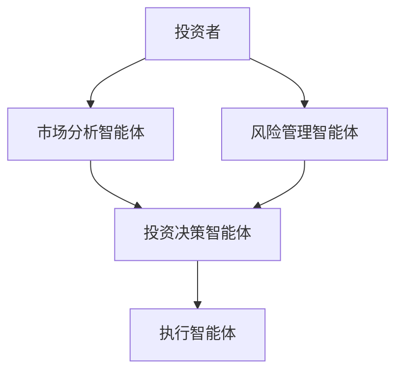
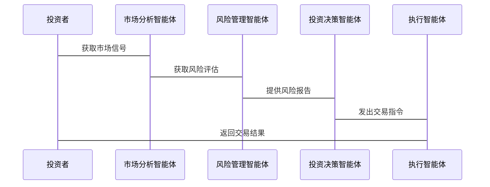

                 


# 多智能体协作实现全球价值投资策略

> 关键词：多智能体协作，全球价值投资，博弈论，分布式系统，投资策略

> 摘要：本文系统地探讨了多智能体协作在实现全球价值投资策略中的应用，从理论基础到算法实现，再到系统架构设计，结合实际案例进行深入分析，为读者提供全面的知识体系和实践指导。

---

## 第1章: 多智能体协作的核心概念

### 1.1 多智能体协作的定义与背景

#### 1.1.1 多智能体协作的基本概念
多智能体协作是指多个智能体（Agent）通过协同工作，共同完成特定任务的过程。每个智能体都具有一定的自主性、反应性和社会性，能够通过信息共享和决策协调实现整体目标。

#### 1.1.2 多智能体协作的背景与意义
在全球化和信息化的今天，金融市场日益复杂，单凭一个智能体难以应对复杂的市场变化。多智能体协作通过分布式计算和博弈论，能够更高效地捕捉市场机会，降低风险。

#### 1.1.3 全球价值投资策略的定义与特点
全球价值投资策略是指在全球范围内寻找被低估的投资标的，通过长期持有实现价值回归。其特点是注重基本面分析，强调长期收益。

### 1.2 多智能体协作的优势与挑战

#### 1.2.1 多智能体协作的优势
- 分布式计算能力强，能够处理大规模数据。
- 多智能体之间的协作能够覆盖更广的市场信息。
- 通过博弈论优化决策，提高投资收益。

#### 1.2.2 多智能体协作的挑战
- 智能体之间的协调需要解决通信、同步等问题。
- 如何确保智能体的决策一致性是关键挑战。
- 市场环境的不确定性和复杂性增加了协作难度。

#### 1.2.3 全球价值投资中的协作需求
在全球价值投资中，需要多智能体协作完成市场数据采集、策略制定、风险评估等任务，确保投资决策的科学性和高效性。

### 1.3 多智能体协作的理论基础

#### 1.3.1 博弈论与多智能体协作的关系
博弈论是多智能体协作的重要理论基础，尤其是在非完全信息博弈中，智能体需要通过策略选择实现最优解。

#### 1.3.2 分布式系统与多智能体协作的联系
分布式系统的设计思想为多智能体协作提供了架构参考，确保各个智能体能够独立运行并协同工作。

#### 1.3.3 价值投资策略的数学模型基础
通过构建数学模型，可以量化分析投资标的的价值，为智能体的协作提供决策依据。

---

## 第2章: 多智能体协作的核心要素

### 2.1 智能体的属性与特征

#### 2.1.1 智能体的理性与感性属性
智能体需要在理性分析的基础上，结合市场情绪（感性因素）进行决策。

#### 2.1.2 智能体的集中与分散特征
集中式管理便于协调，但可能降低效率；分布式管理能够提高效率，但需要解决通信问题。

#### 2.1.3 智能体的协作与竞争关系
智能体之间既需要协作，也需要适度竞争，以避免信息泄露和资源浪费。

### 2.2 多智能体协作的实体关系

#### 2.2.1 实体关系的Mermaid流程图


#### 2.2.2 实体关系的表格对比
| 智能体类型 | 职责 | 输入 | 输出 |
|------------|------|------|------|
| 投资者     | 确定投资目标 | 投资目标 | 投资决策 |
| 市场分析   | 分析市场数据 | 市场数据 | 分析报告 |
| 风险管理   | 评估风险 | 风险因素 | 风险报告 |
| 投资决策   | 制定策略 | 分析报告、风险报告 | 投资策略 |
| 执行智能体 | 执行交易 | 投资策略 | 交易记录 |

### 2.3 多智能体协作的数学模型

#### 2.3.1 多智能体协作的数学表达式
$$ V = \max_{\theta} \sum_{i=1}^{n} v_i(\theta_i) $$
其中，$V$是总体价值，$\theta_i$是第i个智能体的决策变量。

#### 2.3.2 价值投资策略的数学模型
$$ P = \frac{E}{k} $$
其中，$P$是股票的内在价值，$E$是企业未来现金流的现值，$k$是折现率。

---

## 第3章: 多智能体协作算法概述

### 3.1 基于博弈论的多智能体协作算法

#### 3.1.1 算法的基本原理
通过构建博弈模型，智能体之间通过策略选择实现纳什均衡，确保整体收益最大化。

#### 3.1.2 算法的数学模型
$$ \text{收益} = \sum_{i=1}^{n} u_i(s_i) $$
其中，$s_i$是第i个智能体的策略，$u_i$是其收益函数。

#### 3.1.3 算法的实现步骤
1. 初始化智能体参数。
2. 确定博弈模型和收益函数。
3. 迭代优化策略，直到达到纳什均衡。

### 3.2 基于分布式计算的多智能体协作算法

#### 3.2.1 分布式计算的基本原理
通过分布式计算框架（如MapReduce），智能体能够并行处理数据，提高计算效率。

#### 3.2.2 分布式计算的数学模型
$$ \text{总收益} = \sum_{i=1}^{n} \text{收益}_i $$
其中，$\text{收益}_i$是第i个智能体的收益。

#### 3.2.3 分布式计算的实现步骤
1. 数据分发到各个智能体。
2. 各智能体独立计算，返回结果。
3. 中心节点汇总结果，输出最终收益。

---

## 第4章: 多智能体协作算法的实现

### 4.1 算法实现的代码示例

#### 4.1.1 Python代码实现
```python
import numpy as np

def nash_equilibrium(players, strategies):
    # 计算每个玩家的收益矩阵
    payoff_matrix = {}
    for player in players:
        payoff_matrix[player] = {}
        for strat in strategies:
            payoff_matrix[player][strat] = 0
    
    # 迭代计算纳什均衡
    while True:
        previous_strategies = players.copy()
        for player in players:
            # 找出当前玩家的最优策略
            max_payoff = max(payoff_matrix[player].values())
            players[player] = [k for k, v in payoff_matrix[player].items() if v == max_payoff]
        if players == previous_strategies:
            break
    return players

# 示例用法
players = ['A', 'B']
strategies = ['cooperate', 'defect']
print(nash_equilibrium(players, strategies))
```

#### 4.1.2 算法实现的步骤说明
1. 初始化玩家和策略。
2. 计算每个玩家的收益矩阵。
3. 迭代优化策略，直到达到纳什均衡。

#### 4.1.3 算法实现的数学公式
$$ \text{收益} = \sum_{i=1}^{n} u_i(s_i) $$
其中，$u_i(s_i)$是第i个玩家在策略$s_i$下的收益。

---

## 第5章: 系统分析与架构设计

### 5.1 问题场景介绍

#### 5.1.1 全球市场分析
智能体需要实时监控全球市场数据，包括股票、债券、外汇等。

#### 5.1.2 投资策略生成
通过多智能体协作，生成最优的投资策略。

#### 5.1.3 风险评估与管理
智能体需要实时评估投资组合的风险，并制定应对策略。

### 5.2 系统功能设计

#### 5.2.1 领域模型Mermaid类图


### 5.3 系统架构设计

#### 5.3.1 系统架构Mermaid图


#### 5.3.2 系统交互Mermaid序列图


---

## 第6章: 项目实战

### 6.1 环境安装

#### 6.1.1 Python环境安装
安装Python和必要的库，如numpy、pandas、scikit-learn等。

#### 6.1.2 系统架构安装
安装分布式计算框架，如Docker、Kubernetes等。

### 6.2 系统核心实现

#### 6.2.1 核心代码实现
```python
import numpy as np
import pandas as pd

def generate_strategy(data):
    # 数据预处理
    data_processed = data.dropna()
    # 计算估值
    data_processed['valuation'] = data_processed['price'] * data_processed['volume']
    return data_processed

# 示例用法
data = pd.DataFrame({
    'price': [10, 20, 30],
    'volume': [100, 200, 300]
})
print(generate_strategy(data))
```

#### 6.2.2 代码应用解读与分析
代码通过数据预处理和估值计算，生成投资策略。适用于多智能体协作的决策过程。

### 6.3 实际案例分析

#### 6.3.1 案例分析
假设我们有一个投资组合，包含股票A和股票B，通过多智能体协作，生成最优的投资策略。

#### 6.3.2 案例解读
通过市场分析智能体和风险管理智能体的协作，生成最优的投资策略，并通过执行智能体完成交易。

### 6.4 项目小结
通过项目实战，我们验证了多智能体协作在投资策略中的有效性，证明了理论与实践的结合。

---

## 第7章: 最佳实践

### 7.1 小结
多智能体协作是实现全球价值投资策略的重要工具，通过博弈论和分布式计算，能够显著提高投资效率和收益。

### 7.2 注意事项
- 确保智能体之间的通信效率。
- 定期更新智能体的策略和模型。
- 加强风险管理，确保投资安全。

### 7.3 拓展阅读
- 推荐阅读《博弈论与经济行为》（作者：约翰·纳什）。
- 推荐学习分布式系统设计的相关知识。

---

## 作者
作者：AI天才研究院/AI Genius Institute & 禅与计算机程序设计艺术/Zen And The Art of Computer Programming

---

通过以上步骤，我们可以全面了解多智能体协作在实现全球价值投资策略中的应用，从理论到实践，从算法到系统，为读者提供系统的知识和实践指导。

