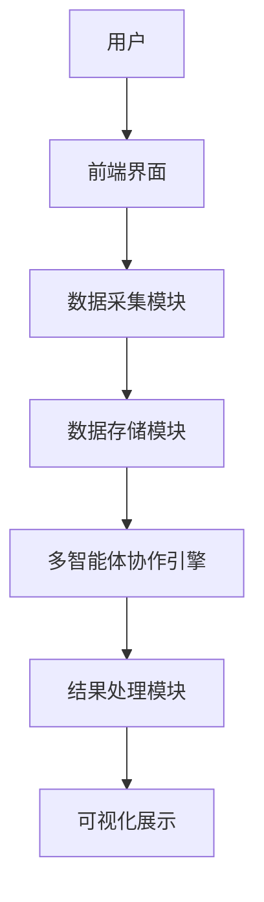

                 


# 多智能体协作实现全面的公司价值评估

> 关键词：多智能体协作、公司价值评估、分布式计算、博弈论、系统架构设计

> 摘要：  
本文探讨了如何通过多智能体协作技术实现对公司价值的全面评估。文章首先介绍了多智能体协作的基本概念和其在公司价值评估中的重要性，随后深入分析了多智能体协作的核心算法原理和系统架构设计。通过实际案例分析，展示了多智能体协作在公司价值评估中的应用场景，并提出了系统的实现方案和优化建议。本文旨在为读者提供一个全面的视角，理解多智能体协作如何在公司价值评估中发挥关键作用。

---

## 第一部分: 多智能体协作与公司价值评估概述

### 第1章: 多智能体协作的背景与意义

#### 1.1 多智能体协作的定义与特点
多智能体协作（Multi-Agent Collaboration）是指多个智能体通过相互协作，共同完成复杂任务的过程。与传统的单智能体系统相比，多智能体协作具有以下特点：
- **分布性**：多个智能体独立运行，协同完成任务。
- **智能性**：每个智能体具备一定的决策能力和问题解决能力。
- **动态性**：智能体之间可以通过动态交互，实时调整协作策略。
- **多样性**：智能体可以有不同的功能和能力，形成互补。

#### 1.2 公司价值评估的背景与挑战
公司价值评估是企业管理和金融领域中的重要任务，传统评估方法通常依赖于财务数据和静态分析。然而，这种方法往往忽视了企业的动态变化和多维度因素。多智能体协作通过整合实时数据、市场信息和内部管理数据，能够提供更加全面和动态的价值评估。

#### 1.3 多智能体协作在公司价值评估中的优势
- **数据整合能力**：多智能体协作可以整合来自不同部门和外部的数据，提供全面的视角。
- **实时分析**：通过分布式计算和实时交互，多智能体协作能够快速响应市场变化。
- **决策优化**：多智能体协作能够通过博弈论和优化算法，提供最优的决策支持。

### 第2章: 多智能体协作实现公司价值评估的必要性

#### 2.1 多智能体协作在公司价值评估中的应用场景
- **财务数据分析**：多智能体协作可以实时分析财务数据，发现潜在问题。
- **市场竞争分析**：通过整合市场数据，评估企业在市场中的竞争力。
- **内部管理优化**：通过分析内部管理数据，优化企业运营效率。

#### 2.2 多智能体协作的优势
- **分布式计算能力**：多智能体协作能够充分利用分布式计算的优势，提高处理效率。
- **多维度数据整合**：通过多智能体协作，可以整合财务、市场和内部管理等多种数据。
- **高效决策支持**：多智能体协作能够提供实时的决策支持，帮助企业在复杂环境中做出最优决策。

---

## 第二部分: 多智能体协作的算法原理

### 第3章: 多智能体协作的算法基础

#### 3.1 分布式计算与多智能体协作
分布式计算是多智能体协作的核心技术之一。通过将任务分解成多个子任务，并分配给不同的智能体执行，可以提高计算效率。例如，在公司价值评估中，不同的智能体可以分别负责财务分析、市场分析和内部管理优化。

#### 3.2 博弈论与多智能体协作
博弈论在多智能体协作中扮演着重要角色。通过分析不同智能体之间的博弈关系，可以制定最优的协作策略。例如，在市场竞争分析中，可以通过博弈论模型预测竞争对手的策略，并制定相应的应对措施。

### 第4章: 多智能体协作的数学模型与公式

#### 4.1 多智能体协作的基本数学模型
多智能体协作的数学模型通常包括以下几个部分：
- **状态表示**：每个智能体的状态可以用一个向量表示。
- **动作选择**：智能体根据当前状态选择一个动作。
- **奖励机制**：智能体通过奖励机制进行学习和优化。

#### 4.2 博弈论与多智能体协作的结合
博弈论在多智能体协作中的应用可以通过以下公式表示：
$$
\text{收益} = \sum_{i=1}^{n} v_i
$$
其中，$v_i$ 是第 $i$ 个智能体的收益。

---

## 第三部分: 系统架构设计与实现

### 第5章: 系统架构设计

#### 5.1 系统功能设计
系统功能设计包括以下几个方面：
- **数据采集**：从企业内部和外部获取数据。
- **数据处理**：对数据进行清洗和预处理。
- **协作计算**：通过多智能体协作算法进行计算。
- **结果展示**：将计算结果以可视化的方式展示出来。

#### 5.2 系统架构图
以下是系统的架构图：



---

## 第四部分: 项目实战与案例分析

### 第6章: 项目实战

#### 6.1 环境安装
以下是安装环境的步骤：
1. 安装Python和必要的库（如numpy、pandas、scikit-learn）。
2. 安装多智能体协作框架（如D-Agent）。

#### 6.2 核心代码实现
以下是核心代码实现：

```python
class Agent:
    def __init__(self, id):
        self.id = id
        self.state = None
        self.reward = 0

    def act(self):
        pass

    def receive_reward(self, reward):
        self.reward += reward

def collaboration(environment, agents):
    for agent in agents:
        agent.act()
    for agent in agents:
        agent.receive_reward(environment.calculate_reward(agent))
```

---

## 第五部分: 总结与展望

### 第7章: 总结与展望

#### 7.1 总结
通过多智能体协作技术，可以实现对公司价值的全面评估。本文详细介绍了多智能体协作的核心概念、算法原理和系统架构设计，并通过实际案例展示了其在公司价值评估中的应用。

#### 7.2 展望
未来的研究方向包括：
- **更复杂的协作算法**：如强化学习和自适应算法。
- **更高效的计算方法**：如边缘计算和雾计算。
- **更广泛的应用场景**：如金融、医疗和教育领域。

---

作者：AI天才研究院/AI Genius Institute & 禅与计算机程序设计艺术 /Zen And The Art of Computer Programming

