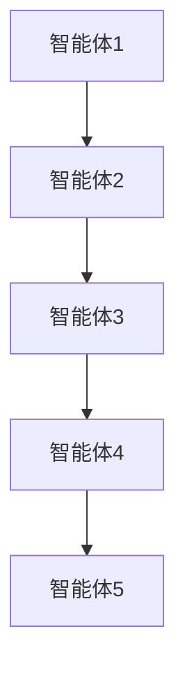
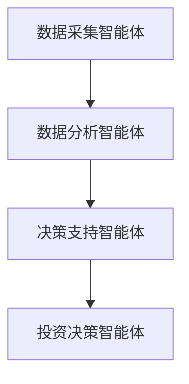
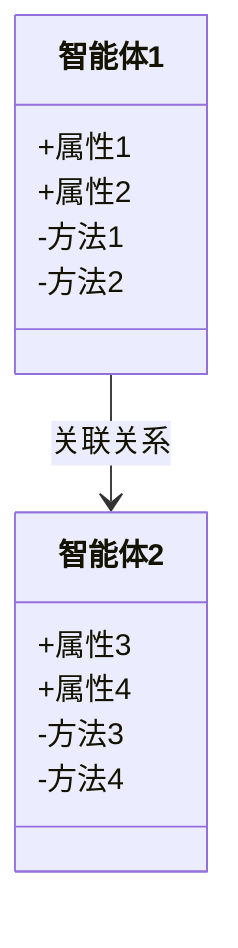
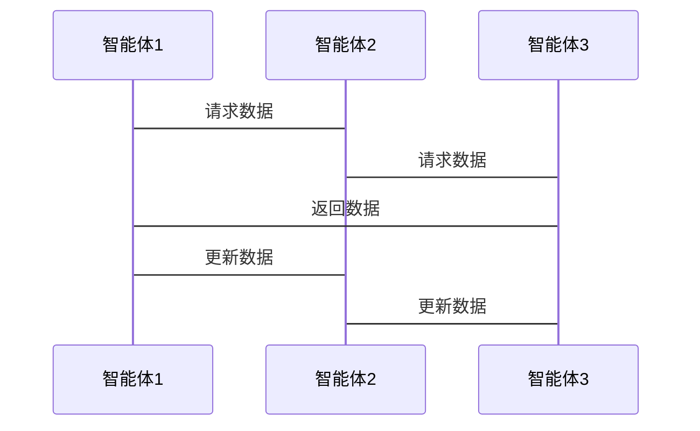

                 


```markdown
# 多智能体协作提升价值投资决策质量

> 关键词：多智能体协作、价值投资、投资决策、算法优化、系统架构

> 摘要：本文探讨了多智能体协作在价值投资中的应用，分析了多智能体协作的核心概念、算法原理及其对投资决策质量的提升。通过构建多智能体协作模型，优化投资决策流程，本文提出了基于强化学习和分布式计算的多智能体协作算法，旨在为投资者提供更高效、更精准的投资决策支持。

---

## 第1章: 多智能体协作与价值投资概述

### 1.1 多智能体协作的定义与背景

多智能体协作（Multi-Agent Collaboration）是指多个智能体通过共享信息、协同行动，共同完成复杂任务的过程。智能体可以是软件程序、算法模型或分布式系统中的组件。在金融领域，多智能体协作的应用潜力巨大，尤其是在投资决策中，通过多个智能体的协作，可以更高效地处理复杂的信息和数据，提升决策的准确性和可靠性。

#### 1.1.1 多智能体协作的定义

多智能体协作是指多个智能体通过信息共享、任务分配和协同决策，共同完成复杂任务的过程。智能体之间通过通信和协作，优化各自的行为，以达到整体目标的最优。

#### 1.1.2 多智能体协作的背景与现状

在金融领域，投资决策的复杂性日益增加，传统的单点决策方式难以应对市场的不确定性。多智能体协作通过分布式计算和信息共享，能够更高效地处理海量数据，发现潜在的投资机会，降低投资风险。

#### 1.1.3 多智能体协作在金融领域的应用潜力

多智能体协作在金融领域的应用潜力主要体现在以下几个方面：
1. **数据处理**：通过分布式计算，多智能体可以快速处理海量数据，提取有用信息。
2. **风险控制**：通过协作机制，智能体可以实时监控市场风险，优化投资组合。
3. **决策优化**：通过协同决策，多智能体可以提供更精准的投资建议，提升决策质量。

### 1.2 价值投资决策的核心问题

价值投资是一种以企业基本面分析为基础的投资策略，其核心在于识别被市场低估的优质企业。然而，传统的价值投资方法往往依赖个人经验，难以应对市场的复杂性和不确定性。

#### 1.2.1 价值投资的基本概念

价值投资是指以低于企业内在价值的价格买入优质股票，长期持有，等待市场价值回归。其核心在于对企业基本面的深入分析，寻找具有长期竞争优势的企业。

#### 1.2.2 投资决策中的不确定性与复杂性

投资决策过程中存在诸多不确定性，例如市场波动、企业经营状况变化、宏观经济环境等。这些不确定性使得投资决策过程复杂化，需要更加智能化的决策支持系统。

#### 1.2.3 多智能体协作在投资决策中的优势

多智能体协作通过分布式计算和信息共享，能够有效应对投资决策中的复杂性和不确定性。多个智能体可以分别负责不同的任务，例如数据采集、分析、预测等，通过协作机制，提供更全面、更精准的决策支持。

### 1.3 多智能体协作与价值投资的结合

多智能体协作与价值投资的结合，可以通过智能化的决策支持系统，优化投资决策流程，提升决策质量。

#### 1.3.1 多智能体协作在投资决策中的作用

多智能体协作在投资决策中的作用主要体现在以下几个方面：
1. **信息整合**：通过分布式计算，多智能体可以整合来自不同数据源的信息，提供全面的市场分析。
2. **协同决策**：智能体之间可以通过协作机制，共同制定投资策略，优化投资组合。
3. **实时监控**：通过实时数据共享，多智能体可以监控市场动态，及时调整投资策略。

#### 1.3.2 价值投资决策中的协作需求

价值投资决策中，协作需求主要体现在以下几个方面：
1. **数据共享**：智能体之间需要共享市场数据、企业基本面信息等。
2. **任务分配**：根据智能体的专长，分配不同的任务，例如数据采集、分析、预测等。
3. **协同优化**：通过协作机制，优化投资组合，降低风险，提高收益。

#### 1.3.3 多智能体协作提升决策质量的潜力

通过多智能体协作，可以实现以下目标：
1. **提高决策效率**：通过分布式计算和任务分配，缩短决策时间。
2. **增强决策准确性**：通过信息共享和协同分析，提高决策的准确性。
3. **降低投资风险**：通过实时监控和风险预警，降低投资风险。

---

## 第2章: 多智能体协作的核心概念与联系

### 2.1 多智能体协作的原理

多智能体协作的原理主要基于分布式计算和信息共享。通过智能体之间的协作，实现复杂任务的分解与优化。

#### 2.1.1 多智能体协作的基本原理

多智能体协作的基本原理包括以下几个方面：
1. **任务分解**：将复杂任务分解为多个子任务，分别由不同的智能体完成。
2. **信息共享**：智能体之间通过通信机制，共享信息和数据，支持协同决策。
3. **协同优化**：通过协作机制，优化各智能体的行为，实现整体目标的最优。

#### 2.1.2 多智能体协作的关键特征

多智能体协作的关键特征包括：
1. **分布式计算**：任务分解和计算分布在多个智能体上。
2. **信息共享**：智能体之间共享信息，支持协同决策。
3. **协作优化**：通过协作机制，优化各智能体的行为，提高整体效率。

#### 2.1.3 多智能体协作的数学模型

多智能体协作的数学模型可以表示为：

$$
\text{总效用} = \sum_{i=1}^{n} u_i
$$

其中，\( u_i \) 表示第 \( i \) 个智能体的效用，\( n \) 表示智能体的数量。

### 2.2 多智能体协作与价值投资的联系

多智能体协作与价值投资的联系主要体现在以下几个方面：
1. **信息整合**：通过多智能体协作，整合市场数据、企业基本面信息等，提供全面的市场分析。
2. **协同决策**：通过协作机制，制定投资策略，优化投资组合。
3. **实时监控**：通过实时数据共享，监控市场动态，及时调整投资策略。

#### 2.2.1 价值投资中的信息处理需求

价值投资中的信息处理需求主要体现在以下几个方面：
1. **数据采集**：获取企业的财务数据、市场数据等。
2. **数据分析**：对数据进行清洗、分析，提取有用信息。
3. **数据预测**：基于历史数据，预测未来市场走势。

#### 2.2.2 多智能体协作在信息整合中的作用

多智能体协作在信息整合中的作用主要体现在以下几个方面：
1. **分布式数据采集**：智能体分别负责不同的数据源，进行数据采集。
2. **数据共享**：智能体之间共享数据，提供全面的市场分析。
3. **数据融合**：通过协作机制，融合不同来源的数据，提高分析的准确性。

#### 2.2.3 多智能体协作对投资决策的影响

多智能体协作对投资决策的影响主要体现在以下几个方面：
1. **提高决策效率**：通过分布式计算和任务分配，缩短决策时间。
2. **增强决策准确性**：通过信息共享和协同分析，提高决策的准确性。
3. **降低投资风险**：通过实时监控和风险预警，降低投资风险。

### 2.3 多智能体协作的实体关系图

#### 2.3.1 实体关系图的构建

以下是多智能体协作的实体关系图：

```mermaid
erDiagram
    customer[CUSTOMER] {
        +string id
        +string name
        +string email
    }
    order[ORDER] {
        +string id
        +integer amount
        +date order_date
    }
    payment[PAYMENT] {
        +string id
        +string payment_method
        +date payment_date
    }
    CUSTOMER -> ORDER : places
    ORDER -> PAYMENT : requires
```

#### 2.3.2 实体关系图的分析

通过实体关系图可以看出，多智能体协作涉及多个实体，包括客户、订单、支付等。每个实体都有自己的属性和关系，通过协作机制，实现信息的共享和任务的分配。

#### 2.3.3 实体关系图对投资决策的启示

实体关系图对投资决策的启示主要体现在以下几个方面：
1. **信息共享**：通过实体关系图，可以看出不同实体之间的关系，支持信息的共享和协同决策。
2. **任务分配**：通过实体关系图，可以明确各智能体的任务分配，优化投资决策流程。
3. **协作优化**：通过实体关系图，可以优化智能体之间的协作机制，提高决策效率和准确性。

---

## 第3章: 多智能体协作的算法原理

### 3.1 多智能体协作算法概述

多智能体协作算法主要包括分布式计算和强化学习两种类型。

#### 3.1.1 多智能体协作算法的基本概念

多智能体协作算法的基本概念包括以下几个方面：
1. **分布式计算**：任务分解和计算分布在多个智能体上。
2. **强化学习**：通过强化学习，智能体可以学习最优策略，提高协作效率。
3. **协作机制**：通过协作机制，智能体之间可以共享信息，优化决策。

#### 3.1.2 多智能体协作算法的分类

多智能体协作算法的分类包括：
1. **基于分布式计算的算法**：如分布式优化、分布式搜索等。
2. **基于强化学习的算法**：如多智能体强化学习、协作强化学习等。

#### 3.1.3 多智能体协作算法的优缺点

多智能体协作算法的优缺点包括：
1. **优点**：提高决策效率，增强决策准确性，降低投资风险。
2. **缺点**：算法复杂度高，实现难度大，需要大量的计算资源。

### 3.2 基于强化学习的多智能体协作算法

基于强化学习的多智能体协作算法通过智能体之间的协作，实现复杂任务的优化。

#### 3.2.1 强化学习的基本原理

强化学习的基本原理包括以下几个方面：
1. **智能体与环境交互**：智能体通过与环境交互，获得奖励或惩罚。
2. **策略优化**：通过策略优化，智能体可以学习最优行为策略。
3. **价值函数**：通过价值函数，智能体可以评估不同行为的优劣。

#### 3.2.2 多智能体协作中的强化学习模型

多智能体协作中的强化学习模型可以通过以下步骤实现：



#### 3.2.3 强化学习在投资决策中的应用

强化学习在投资决策中的应用主要体现在以下几个方面：
1. **市场预测**：通过强化学习，智能体可以预测市场走势，优化投资策略。
2. **风险控制**：通过强化学习，智能体可以实时监控市场风险，调整投资组合。
3. **收益最大化**：通过强化学习，智能体可以最大化投资收益，实现最优投资决策。

### 3.3 基于分布式计算的多智能体协作算法

基于分布式计算的多智能体协作算法通过任务分解和分布式计算，实现复杂任务的优化。

#### 3.3.1 分布式计算的基本原理

分布式计算的基本原理包括以下几个方面：
1. **任务分解**：将复杂任务分解为多个子任务，分别由不同的智能体完成。
2. **分布式计算**：通过分布式计算，提高计算效率，降低计算成本。
3. **信息共享**：智能体之间通过通信机制，共享信息和数据，支持协同决策。

#### 3.3.2 多智能体协作中的分布式计算模型

多智能体协作中的分布式计算模型可以通过以下步骤实现：


#### 3.3.3 分布式计算在投资决策中的应用

分布式计算在投资决策中的应用主要体现在以下几个方面：
1. **数据处理**：通过分布式计算，智能体可以快速处理海量数据，提取有用信息。
2. **任务分配**：通过任务分配，智能体可以分别负责不同的任务，优化投资决策流程。
3. **协同优化**：通过协同优化，智能体可以共同制定投资策略，优化投资组合。

---

## 第4章: 多智能体协作的数学模型与公式

### 4.1 多智能体协作的数学模型

多智能体协作的数学模型可以表示为：

$$
\text{总效用} = \sum_{i=1}^{n} u_i
$$

其中，\( u_i \) 表示第 \( i \) 个智能体的效用，\( n \) 表示智能体的数量。

#### 4.1.1 多智能体协作的基本数学模型

多智能体协作的基本数学模型包括以下几个方面：
1. **效用函数**：通过效用函数，可以评估各智能体的贡献，优化协作效果。
2. **优化目标**：通过优化目标，可以实现整体效用的最大化。
3. **约束条件**：通过约束条件，可以确保智能体的行为符合决策要求。

#### 4.1.2 多智能体协作的优化模型

多智能体协作的优化模型可以通过以下公式表示：

$$
\max \sum_{i=1}^{n} u_i
$$

$$
\text{subject to} \quad \sum_{i=1}^{n} x_i \leq X
$$

其中，\( x_i \) 表示第 \( i \) 个智能体的资源分配，\( X \) 表示总资源。

#### 4.1.3 多智能体协作的评估模型

多智能体协作的评估模型可以通过以下公式表示：

$$
\text{协作效率} = \frac{\text{总效用}}{\text{总资源}}
$$

---

## 第5章: 多智能体协作的系统分析与架构设计

### 5.1 问题场景介绍

在价值投资中，多智能体协作可以通过以下方式实现：
1. **数据采集**：智能体分别负责不同的数据源，进行数据采集。
2. **数据分析**：通过协作机制，智能体可以共享数据，提供全面的市场分析。
3. **决策支持**：通过协同决策，智能体可以共同制定投资策略，优化投资组合。

#### 5.1.1 问题场景介绍

在价值投资中，多智能体协作可以通过以下方式实现：



#### 5.1.2 系统功能设计

系统功能设计包括以下几个方面：
1. **数据采集**：智能体分别负责不同的数据源，进行数据采集。
2. **数据分析**：通过协作机制，智能体可以共享数据，提供全面的市场分析。
3. **决策支持**：通过协同决策，智能体可以共同制定投资策略，优化投资组合。

### 5.2 系统架构设计

系统架构设计包括以下几个方面：
1. **领域模型**：通过领域模型，可以明确各智能体的任务和职责。
2. **系统架构**：通过系统架构图，可以展示智能体之间的协作关系。
3. **接口设计**：通过接口设计，可以实现智能体之间的通信和协作。

#### 5.2.1 领域模型设计

领域模型设计可以通过以下步骤实现：



#### 5.2.2 系统架构图

系统架构图可以通过以下步骤实现：


#### 5.2.3 接口设计与交互流程

接口设计与交互流程可以通过以下步骤实现：



---

## 第6章: 多智能体协作的项目实战

### 6.1 环境安装与配置

为了实现多智能体协作，需要安装以下工具和库：
1. **Python**：编程语言。
2. **PyTorch**：深度学习框架。
3. **Distributed Computing Tools**：分布式计算工具。

#### 6.1.1 环境安装

在安装环境中，可以使用以下命令：

```bash
pip install python torch distributed
```

### 6.2 核心代码实现

以下是多智能体协作的核心代码实现：

```python
import torch
import torch.distributed as dist

# 初始化智能体
def init_agent(rank, world_size):
    torch.distributed.init_process_group("gloo", rank=rank, world_size=world_size)

# 智能体协作算法
def collaborate(rank, world_size):
    init_agent(rank, world_size)
    # 任务分解
    task = rank % world_size
    # 数据共享
    data = torch.randn(1, 3, 224, 224)
    # 分布式计算
    output = data[rank]
    # 协作优化
    dist.all_reduce(output, op=dist.ReduceOp.SUM)
    return output

# 程序入口
def main():
    world_size = 5
    for rank in range(world_size):
        collaborate(rank, world_size)

if __name__ == "__main__":
    main()
```

### 6.3 代码解读与分析

代码解读与分析如下：
1. **环境安装**：安装所需的Python库和工具。
2. **智能体初始化**：通过`init_agent`函数，初始化智能体。
3. **协作算法**：通过`collaborate`函数，实现智能体之间的协作。
4. **程序入口**：通过`main`函数，启动协作过程。

### 6.4 实际案例分析

以下是多智能体协作在实际投资决策中的应用案例：

1. **数据采集**：智能体1负责采集市场数据，智能体2负责采集企业基本面数据。
2. **数据分析**：智能体3负责数据分析，智能体4负责数据预测。
3. **决策支持**：智能体5负责制定投资策略，优化投资组合。

### 6.5 项目小结

通过多智能体协作，可以实现以下目标：
1. **提高决策效率**：通过分布式计算和任务分配，缩短决策时间。
2. **增强决策准确性**：通过信息共享和协同分析，提高决策的准确性。
3. **降低投资风险**：通过实时监控和风险预警，降低投资风险。

---

## 第7章: 多智能体协作的最佳实践

### 7.1 小结

通过本文的探讨，我们可以看到，多智能体协作在价值投资中的应用潜力巨大。通过多智能体协作，可以实现高效的信息整合、协同决策和实时监控，提升投资决策的质量。

### 7.2 注意事项

在实际应用中，需要注意以下几点：
1. **算法选择**：选择合适的多智能体协作算法，确保协作效果。
2. **数据安全**：确保数据的安全性，防止数据泄露。
3. **系统稳定性**：确保系统的稳定性，避免因系统故障导致投资损失。

### 7.3 拓展阅读

以下是拓展阅读的建议：
1. **强化学习**：深入学习强化学习的相关知识。
2. **分布式计算**：深入学习分布式计算的相关知识。
3. **多智能体协作**：深入学习多智能体协作的相关知识。

---

## 作者信息

作者：AI天才研究院/AI Genius Institute & 禅与计算机程序设计艺术 /Zen And The Art of Computer Programming

---

* 文章目录结束
```

