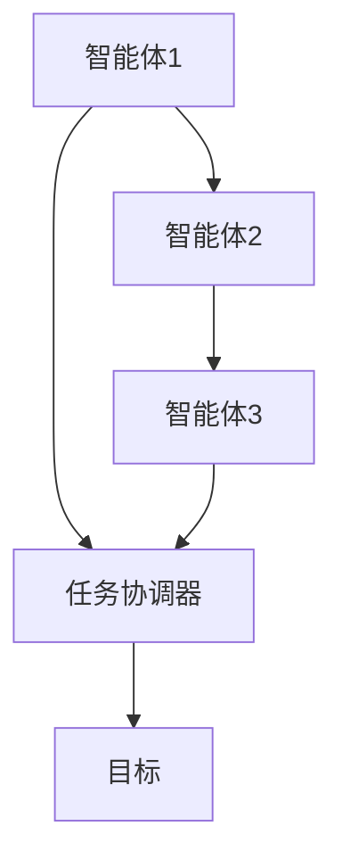
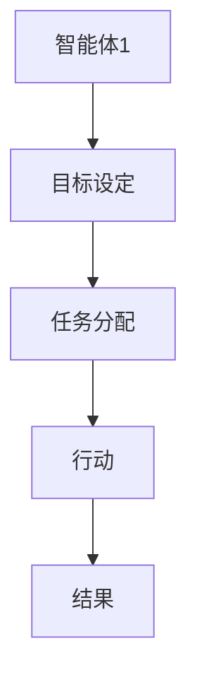
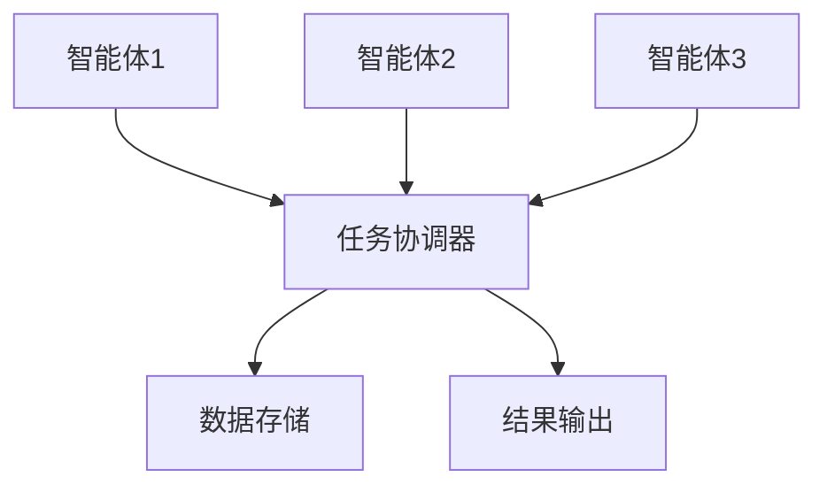

                 


# 多智能体协作提升市场分析效率

> 关键词：多智能体协作、市场分析效率、人工智能、系统架构设计、算法原理

> 摘要：本文深入探讨了多智能体协作在提升市场分析效率中的应用。通过背景介绍、核心概念、算法原理、系统架构设计、项目实战等多方面的分析，揭示了多智能体协作在市场分析中的巨大潜力和实际价值。本文还提供了详细的数学公式、流程图和系统架构图，帮助读者全面理解多智能体协作的实现过程和应用场景。

---

## 第一部分: 多智能体协作的背景与概念

### 第1章: 多智能体协作的背景

#### 1.1 多智能体协作的定义
多智能体协作是指多个智能体通过协调和合作，共同完成复杂任务的过程。智能体可以是软件程序、算法或实体设备，它们通过通信和协作机制，共享信息、分配任务，并最终实现目标。

#### 1.2 多智能体协作的应用领域
多智能体协作广泛应用于多个领域，包括：
- 机器人协作
- 分布式计算
- 金融市场分析
- 智能交通系统
- 团队协作管理

#### 1.3 多智能体协作在市场分析中的重要性
市场分析是一个复杂的过程，涉及大量数据的收集、处理和分析。多智能体协作可以通过分工合作，提高数据处理效率和准确性，从而提升市场分析的整体效率。

---

### 第2章: 市场分析效率提升的必要性

#### 2.1 当前市场分析的挑战
- 数据量大：市场数据来自多种渠道，包括社交媒体、新闻、交易数据等，数据量庞大且复杂。
- 数据实时性要求高：市场分析需要实时处理数据，以捕捉市场动态。
- 数据多样性：市场数据包括文本、图像、数值等多种类型，处理难度大。

#### 2.2 多智能体协作的优势
- 提高数据处理速度：多个智能体可以同时处理不同数据源，提高效率。
- 增强决策准确性：通过协作，智能体可以互补优势，提供更准确的分析结果。
- 支持复杂任务：多智能体协作能够处理复杂的市场分析任务，如预测市场趋势、识别风险等。

---

## 第二部分: 多智能体协作的核心概念与联系

### 第3章: 多智能体协作的核心原理

#### 3.1 多智能体协作的基本原理
多智能体协作的核心在于智能体之间的通信与合作。智能体通过共享信息、分配任务和协调行动，共同完成目标。

#### 3.2 多智能体协作的协作机制
- 信息共享：智能体之间共享数据和知识，以便更好地协作。
- 任务分配：根据智能体的能力和当前任务需求，分配不同的任务。
- 协调与同步：智能体之间需要协调行动，确保任务的顺利进行。

---

### 第4章: 多智能体协作的概念结构

#### 4.1 多智能体协作的层次结构
多智能体协作可以分为以下几个层次：
- 智能体层：单个智能体的决策和行动。
- 协作层：智能体之间的协作与通信。
- 系统层：整个多智能体系统的架构和管理。

#### 4.2 多智能体协作的流程图
以下是多智能体协作的基本流程图：



---

## 第三部分: 多智能体协作的算法原理

### 第5章: 多智能体协作的算法原理

#### 5.1 协作算法的分类
多智能体协作算法主要分为以下几类：
- 基于规则的协作算法
- 基于目标的协作算法
- 基于学习的协作算法

#### 5.2 基于目标的协作算法
基于目标的协作算法通过设定共同目标，指导智能体的协作行为。以下是基于目标的协作算法的流程图：



---

### 第6章: 多智能体协作的数学模型与公式

#### 6.1 多智能体协作的数学模型
多智能体协作的数学模型可以用以下公式表示：

$$
\text{总效率} = \sum_{i=1}^{n} \text{智能体}_i \text{的效率}
$$

其中，n为智能体的数量。

#### 6.2 基于目标的协作算法公式
基于目标的协作算法可以通过以下公式计算：

$$
\text{目标} = \sum_{i=1}^{m} \text{任务}_i
$$

其中，m为任务的数量。

---

## 第四部分: 多智能体协作的系统架构设计

### 第7章: 系统架构设计

#### 7.1 系统功能设计
多智能体协作系统的主要功能包括：
- 数据采集与处理
- 任务分配与协调
- 智能体协作与通信
- 结果分析与输出

#### 7.2 系统架构图
以下是多智能体协作系统的架构图：



---

## 第五部分: 多智能体协作的项目实战

### 第8章: 项目实战

#### 8.1 环境安装
需要安装以下工具和库：
- Python编程语言
- 多智能体协作框架（如MAST）
- 数据处理库（如Pandas、NumPy）

#### 8.2 核心代码实现
以下是核心代码示例：

```python
import pandas as pd
from mast import Agent

class MarketAnalyzer(Agent):
    def __init__(self):
        super().__init__()
        self.data = pd.DataFrame()

    def collect_data(self):
        # 数据采集逻辑
        pass

    def analyze(self):
        # 数据分析逻辑
        pass

# 初始化智能体
agent = MarketAnalyzer()
agent.collect_data()
agent.analyze()
```

#### 8.3 代码解读与分析
- `MarketAnalyzer`类继承自`Agent`，实现了数据采集和分析功能。
- `collect_data`方法负责从不同数据源采集市场数据。
- `analyze`方法对数据进行处理和分析，生成分析结果。

---

## 第六部分: 最佳实践与总结

### 第9章: 最佳实践

#### 9.1 小结
多智能体协作通过分工合作，显著提升了市场分析的效率和准确性。通过合理设计协作机制和算法，可以充分发挥多智能体的优势。

#### 9.2 注意事项
- 确保智能体之间的通信高效可靠。
- 合理分配任务，避免资源浪费。
- 定期优化协作算法，适应市场变化。

#### 9.3 拓展阅读
建议进一步阅读以下内容：
- 多智能体协作的经典论文
- 相关技术书籍
- 最新研究进展

---

## 作者信息

作者：AI天才研究院 & 禅与计算机程序设计艺术

---

通过以上内容，您可以全面了解多智能体协作在市场分析中的应用及其提升效率的实现过程。希望本文对您有所帮助！

