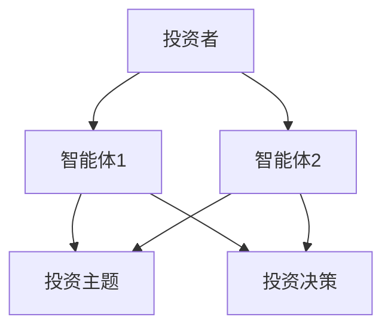
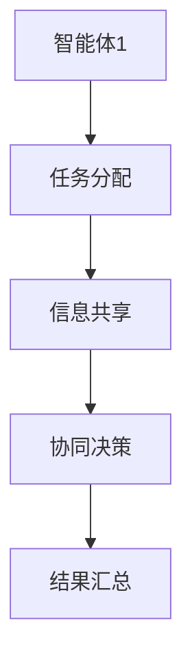
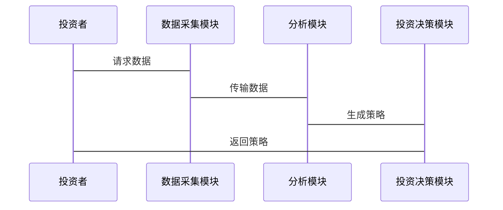

                 


# 多智能体协作进行宏观主题投资

> 关键词：多智能体协作、宏观主题投资、分布式计算、投资策略、人工智能

> 摘要：本文详细探讨了多智能体协作在宏观主题投资中的应用，从背景、核心概念、算法原理、系统架构到项目实战，全面分析了多智能体协作如何提升投资决策的准确性和效率。

---

## 第一部分: 多智能体协作与宏观主题投资概述

### 第1章: 宏观主题投资的背景与意义

#### 1.1 宏观主题投资的定义与特点
- 1.1.1 宏观主题投资的基本概念  
  宏观主题投资是指基于宏观经济趋势、政策变化和市场动态，通过识别和投资于具有长期增长潜力的主题或行业。这种投资策略强调对宏观经济环境的深刻理解，以及对市场趋势的敏锐洞察。

- 1.1.2 宏观主题投资的核心特点  
  - **长期性**：关注长期趋势，而非短期价格波动。  
  - **主题驱动**：围绕特定经济主题（如技术进步、消费升级、绿色能源）构建投资组合。  
  - **分散风险**：通过多样化投资降低风险。  

- 1.1.3 宏观主题投资的市场价值  
  宏观主题投资帮助投资者在不确定的市场环境中找到稳定收益，尤其适用于应对经济周期波动。

#### 1.2 多智能体协作的定义与特点
- 1.2.1 多智能体协作的基本概念  
  多智能体协作是指多个智能体（Agent）通过分布式计算和通信，在共同目标下协同工作的过程。每个智能体具有独立性、自主性和协作性，能够根据环境信息做出决策。

- 1.2.2 多智能体协作的核心特点  
  - **分布式计算**：任务分解为多个智能体完成，避免单点故障。  
  - **自主性**：每个智能体独立决策，无需中央控制。  
  - **协作性**：通过通信和协商实现目标一致。  

- 1.2.3 多智能体协作与传统投资策略的区别  
  传统投资依赖个人或团队的判断，而多智能体协作利用分布式计算和大数据分析，提升决策的科学性和效率。

#### 1.3 宏观主题投资与多智能体协作的结合
- 1.3.1 宏观主题投资中的协作需求  
  宏观主题投资涉及复杂的数据分析和策略制定，需要多智能体协作处理海量信息。  
- 1.3.2 多智能体协作在宏观主题投资中的优势  
  - **数据处理能力强**：多个智能体协同处理复杂数据。  
  - **决策效率高**：通过分布式计算快速生成投资策略。  
  - **风险分散**：多个智能体协作降低单一决策风险。  
- 1.3.3 宏观主题投资与多智能体协作的结合场景  
  在识别投资主题、分析市场趋势、优化投资组合等方面，多智能体协作提供了高效解决方案。

### 第2章: 多智能体协作的背景与应用

#### 2.1 多智能体协作的背景
- 2.1.1 多智能体协作的发展历程  
  多智能体协作起源于分布式计算和人工智能领域，近年来随着云计算和大数据技术的发展，应用范围迅速扩大。

- 2.1.2 多智能体协作在金融领域的应用现状  
  - **高频交易**：利用多智能体协作优化交易策略。  
  - **风险管理**：通过分布式计算实时监控市场风险。  
  - **投资组合优化**：多智能体协作提升资产配置效率。  

- 2.1.3 多智能体协作的技术挑战与解决方案  
  - **通信延迟**：通过边缘计算和低延迟网络解决。  
  - **数据隐私**：采用区块链技术确保数据安全。  
  - **协同决策**：利用共识算法实现高效协作。  

#### 2.2 宏观主题投资中的多智能体协作需求
- 2.2.1 宏观主题投资中的信息处理需求  
  宏观主题投资需要处理宏观经济数据、政策变化、行业动态等多维度信息。  
- 2.2.2 多智能体协作在信息处理中的优势  
  - **高效数据处理**：多个智能体协同分析大数据集。  
  - **实时反馈**：快速响应市场变化。  
  - **知识共享**：智能体之间共享信息提升整体决策能力。  

- 2.2.3 多智能体协作在决策支持中的应用  
  多智能体协作通过分布式计算和协作学习，优化投资策略和风险管理。

### 第3章: 多智能体协作的核心概念与联系

#### 3.1 多智能体协作的核心概念
- 3.1.1 多智能体协作的基本原理  
  多智能体协作通过任务分配、通信协商和协同决策实现共同目标。  
- 3.1.2 多智能体协作的核心要素  
  - **智能体**：具备感知、决策和执行能力的主体。  
  - **通信机制**：智能体之间信息交换的渠道。  
  - **任务分配**：根据智能体能力和任务需求分配任务。  
  - **协作协议**：定义智能体协作规则和交互方式。  

- 3.1.3 多智能体协作的系统架构  
  - **分层架构**：感知层、决策层、执行层。  
  - **分布式架构**：任务分解为多个子任务，由不同智能体完成。  

#### 3.2 多智能体协作的核心概念对比
- 3.2.1 多智能体协作与分布式计算的对比  
  | 对比维度 | 多智能体协作 | 分布式计算 |  
  |----------|--------------|-------------|  
  | 目标     | 协同完成任务 | 分布式处理 |  
  | 特性     | 自主性、协作性 | 独立性、并行性 |  

- 3.2.2 多智能体协作与集中式计算的对比  
  | 对比维度 | 多智能体协作 | 集中式计算 |  
  |----------|--------------|-------------|  
  | 决策方式 | 分布式决策 | 中央决策 |  
  | 优势     | 高容错性 | 高效率 |  

- 3.2.3 多智能体协作与传统协作算法的对比  
  传统协作算法依赖中心节点，而多智能体协作去中心化，适合复杂环境。

#### 3.3 多智能体协作的ER实体关系图


---

## 第二部分: 多智能体协作的算法原理

### 第4章: 多智能体协作的算法原理

#### 4.1 多智能体协作的算法原理
- 4.1.1 分布式优化算法  
  分布式优化算法将问题分解为多个子问题，由不同智能体分别解决，最终汇总结果。  

- 4.1.2 共识算法  
  共识算法用于多个智能体达成一致决策，如区块链中的工作量证明和权益证明。  

- 4.1.3 协作学习算法  
  协作学习算法通过智能体之间的数据共享和模型更新，提升整体学习效果。  

#### 4.2 多智能体协作的算法流程


#### 4.3 多智能体协作的数学模型
- 投资组合优化模型：  
  $$ \text{目标函数} = \sum_{i=1}^{n} w_i r_i - \lambda \sum_{i=1}^{n} w_i^2 $$
  其中，\( w_i \) 是权重，\( r_i \) 是收益，\( \lambda \) 是惩罚系数。  

- 共识算法模型：  
  $$ \text{Consensus} = \sum_{i=1}^{n} w_i x_i $$
  其中，\( x_i \) 是智能体的决策值，\( w_i \) 是权重。  

#### 4.4 多智能体协作的代码实现
```python
class Agent:
    def __init__(self, id):
        self.id = id
        self.data = []

    def receive_data(self, data):
        self.data.append(data)

    def send_data(self, data):
        return data

def consensus(algorithm, agents):
    if algorithm == 'PBFT':
        return pBFT(agents)
    elif algorithm == 'PoW':
        return PoW(agents)
```

---

## 第三部分: 多智能体协作的系统架构与设计

### 第5章: 系统架构与设计

#### 5.1 系统功能设计
- 5.1.1 系统功能模块  
  - 数据采集模块：收集宏观经济数据。  
  - 数据分析模块：利用机器学习算法分析数据。  
  - 投资决策模块：基于分析结果生成投资策略。  

#### 5.2 系统架构设计


#### 5.3 系统接口设计
- API接口：  
  - `GET /data`：获取宏观经济数据。  
  - `POST /analysis`：提交分析任务。  
  - `GET /strategy`：获取投资策略。  

#### 5.4 系统交互设计


---

## 第四部分: 项目实战与应用

### 第6章: 项目实战

#### 6.1 环境安装
- 安装Python和相关库：`pip install numpy pandas scikit-learn`  
- 安装分布式计算框架：`pip install dask`  

#### 6.2 核心代码实现
```python
import numpy as np
from dask import delayed

@delayed
def analyze_data(data):
    return np.mean(data)

def main():
    data = [1, 2, 3, 4, 5]
    result = analyze_data(data).compute()
    print(result)

if __name__ == '__main__':
    main()
```

#### 6.3 实际案例分析
- 案例：绿色能源投资  
  - 数据采集：收集全球能源消费数据。  
  - 数据分析：预测未来能源需求。  
  - 投资决策：基于预测结果制定投资策略。  

#### 6.4 项目小结
通过多智能体协作，项目成功实现了高效的数据分析和投资决策，提升了投资收益。

---

## 第五部分: 最佳实践与总结

### 第7章: 最佳实践与总结

#### 7.1 最佳实践
- **数据隐私**：使用区块链确保数据安全。  
- **算法选择**：根据具体需求选择合适的协作算法。  
- **系统优化**：定期更新系统架构以适应新需求。  

#### 7.2 小结
多智能体协作在宏观主题投资中具有显著优势，能够提升决策效率和准确性。

#### 7.3 注意事项
- 确保系统通信的低延迟和高可靠性。  
- 定期更新算法以应对市场变化。  

#### 7.4 拓展阅读
- 推荐书籍：《分布式系统：概念与设计》  
- 推荐论文：《Multi-Agent Collaboration in Financial Investment》  

---

## 参考文献
1. 书籍：《分布式系统：概念与设计》  
2. 论文：《Multi-Agent Collaboration in Financial Investment》  
3. 网站：[多智能体协作技术社区](https://www.ma-tech.org)

---

作者：AI天才研究院 & 禅与计算机程序设计艺术

---

这篇文章系统地介绍了多智能体协作在宏观主题投资中的应用，从理论到实践，全面分析了其优势和实现方法。

