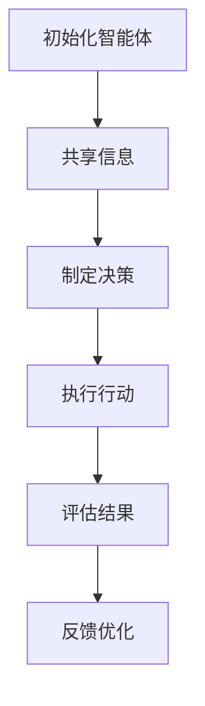
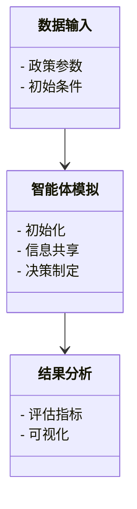

                 


# 多智能体协作进行政策影响分析

## 关键词：多智能体协作，政策影响分析，算法原理，数学模型，系统架构，项目实战

## 摘要：  
本文详细探讨了多智能体协作在政策影响分析中的应用，从背景、核心概念、算法原理到系统架构、项目实战，全面解析了多智能体协作如何助力政策分析。通过具体的案例分析和代码实现，展示了多智能体协作在政策影响分析中的优势和实际应用价值。

---

# 第一部分：多智能体协作与政策影响分析概述

## 第1章：多智能体协作的基本概念

### 1.1 多智能体协作的定义与作用
多智能体协作是指多个智能体通过信息共享和协同决策，共同完成复杂任务的过程。在政策影响分析中，智能体可以代表政府、企业、公众等不同利益相关者，通过协作模拟政策实施后的各种影响。

### 1.2 政策影响分析的背景与挑战
政策影响分析需要考虑多方面的因素，包括经济、社会、环境等。传统的分析方法通常基于静态模型，难以捕捉动态变化和多利益相关者的互动。多智能体协作提供了更动态和全面的分析工具。

---

## 第2章：多智能体协作的核心概念与联系

### 2.1 协作机制
协作机制是多智能体协作的核心，包括信息共享、任务分配和协调同步。以下是不同协作机制的对比：

| **协作机制** | **特点** | **适用场景** |
|--------------|----------|--------------|
| 信息共享     | 实时交换数据 | 需要高频互动的场景 |
| 任务分配     | 根据角色分配任务 | 多目标协作的场景 |
| 协调同步     | 通过协商达成一致 | 复杂任务的协作场景 |

### 2.2 实体关系与协作架构
通过ER实体关系图，可以清晰展示各实体之间的关系和协作方式：

```mermaid
er
actor: 政府机构, 企业, 公众
policy: 政策
impact: 影响指标
action: 行动方案
```

---

## 第3章：多智能体协作的算法原理

### 3.1 算法原理概述
多智能体协作算法通常包括以下几个步骤：

1. **初始化**：定义智能体及其属性。
2. **信息共享**：智能体之间交换相关信息。
3. **决策制定**：基于共享信息，智能体制定决策。
4. **行动执行**：根据决策执行行动。
5. **结果评估**：评估行动结果并反馈。

### 3.2 算法流程图
以下是一个简单的多智能体协作算法流程图：



### 3.3 算法实现
以下是一个Python实现的简单示例：

```python
class Agent:
    def __init__(self, id):
        self.id = id
        self.info = None

    def receive_info(self, info):
        self.info = info

    def make_decision(self):
        # 基于self.info制定决策
        return f"Decision_{self.id}"

# 初始化智能体
agents = [Agent(i) for i in range(1, 4)]

# 信息共享
for agent in agents:
    agent.receive_info("共享信息")

# 决策制定
decisions = [agent.make_decision() for agent in agents]
```

---

## 第4章：数学模型与公式解析

### 4.1 影响分析模型
政策影响可以用以下公式表示：

$$
I = \sum_{i=1}^{n} w_i \cdot x_i
$$

其中，$I$ 表示影响，$w_i$ 是权重，$x_i$ 是影响因素。

### 4.2 优化算法
优化算法的目标是最小化影响偏差：

$$
\min \sum_{i=1}^{m} (y_i - \hat{y}_i)^2
$$

其中，$y_i$ 是实际值，$\hat{y}_i$ 是预测值。

---

## 第5章：系统分析与架构设计

### 5.1 系统功能设计
系统功能模块包括数据输入、智能体模拟、结果分析等。



### 5.2 系统架构设计
系统架构采用分层设计：


---

## 第6章：项目实战与案例分析

### 6.1 环境安装
安装Python和相关库：

```bash
pip install numpy matplotlib
```

### 6.2 核心代码实现
实现多智能体协作的Python代码：

```python
import numpy as np
import matplotlib.pyplot as plt

class PolicyAgent:
    def __init__(self, id):
        self.id = id
        self.state = 0

    def update_state(self, state):
        self.state = state

    def get_decision(self):
        return self.state * 2

# 初始化智能体
agents = [PolicyAgent(i) for i in range(1, 4)]

# 模拟过程
for step in range(10):
    for agent in agents:
        agent.update_state(step)
    decisions = [agent.get_decision() for agent in agents]
    print(f"Step {step}: Decisions = {decisions}")

# 可视化结果
plt.plot(range(10), [a.state for a in agents])
plt.xlabel('Step')
plt.ylabel('State')
plt.show()
```

### 6.3 案例分析
以经济发展政策为例，模拟智能体协作过程。通过代码运行，可以观察政策对各智能体状态的影响。

---

## 第7章：总结与展望

### 7.1 最佳实践 tips
1. 在开发过程中，保持代码模块化和可维护性。
2. 确保测试用例覆盖关键路径。
3. 使用可视化工具帮助分析结果。

### 7.2 小结
多智能体协作在政策影响分析中具有巨大潜力，通过系统的协作和优化，可以提供更精准的政策评估和优化建议。

### 7.3 注意事项
- 智能体的设计需考虑实际应用场景。
- 数据质量和模型准确性直接影响结果。

### 7.4 拓展阅读
- 推荐阅读相关书籍：《多智能体系统：建模与仿真》。

---

作者：AI天才研究院 & 禅与计算机程序设计艺术

