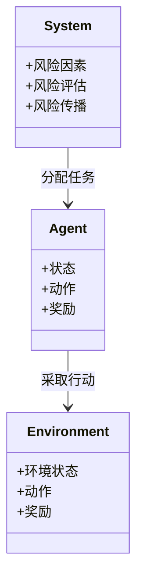
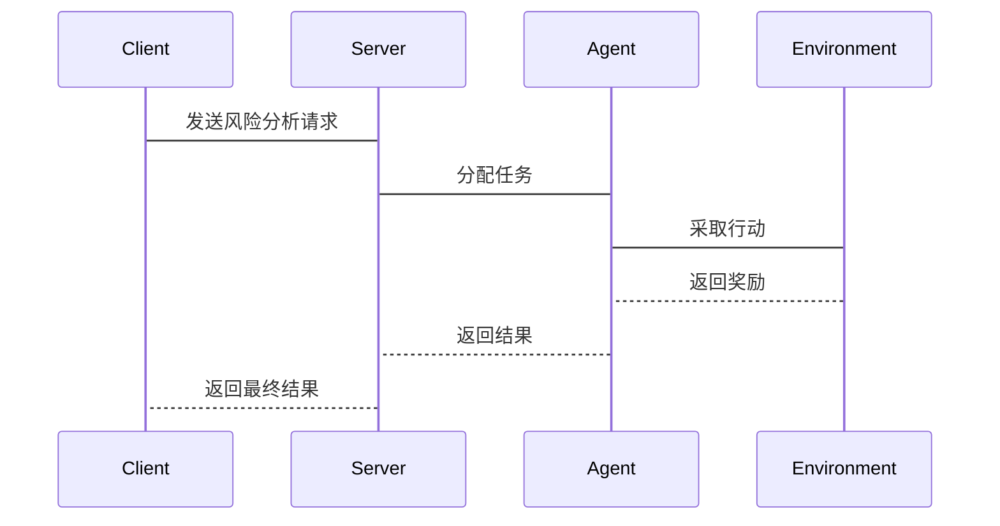

                 


# 多智能体协作进行系统性风险分析

> 关键词：多智能体协作，系统性风险分析，分布式计算，博弈论，强化学习，系统架构设计

> 摘要：本文系统性地探讨了多智能体协作在系统性风险分析中的应用，从背景、核心概念、算法原理到系统架构设计，全面解析了多智能体协作如何助力系统性风险的量化、传播与防控。文章结合实际案例，深入分析了多智能体协作的优势与挑战，并提出了优化建议。

---

# 第一部分：多智能体协作与系统性风险分析基础

## 第1章：多智能体协作与系统性风险分析概述

### 1.1 多智能体协作的背景与意义
#### 1.1.1 系统性风险的定义与特征
系统性风险是指由于系统中某些关键部分的故障或崩溃，导致整个系统发生连锁反应的风险。其主要特征包括：
- **系统性**：风险影响范围广泛，涉及多个子系统。
- **关联性**：系统中的各个部分相互关联，风险在各部分之间传播。
- **复杂性**：系统结构复杂，风险来源多样。
- **不可预测性**：系统性风险往往难以提前预测。

#### 1.1.2 多智能体协作的优势与挑战
多智能体协作通过多个智能体的分工合作，能够更高效地处理复杂问题。其优势包括：
- **分布式计算**：通过分布式计算，提高系统的并行处理能力。
- **协同决策**：多个智能体协同决策，能够覆盖更全面的风险分析。
- **鲁棒性**：多智能体协作能够容忍部分智能体的故障，保证系统整体的稳定性。

#### 1.1.3 多智能体协作在系统性风险分析中的应用前景
随着复杂系统的日益增多，系统性风险分析的需求也在不断增加。多智能体协作能够通过分工合作，高效地应对复杂系统的风险分析与防控。

---

### 1.2 系统性风险分析的核心概念
#### 1.2.1 系统性风险的来源与传播机制
系统性风险的来源包括：
- **内部故障**：系统内部某个子系统的故障。
- **外部冲击**：外部环境的突然变化导致系统崩溃。
- **人为错误**：操作失误导致系统故障。

系统性风险的传播机制包括：
- **链式反应**：一个部分的故障导致其他部分相继故障。
- **网络效应**：系统中的网络结构导致风险迅速扩散。

#### 1.2.2 多智能体协作的数学模型与框架
多智能体协作的数学模型包括：
- **协作目标函数**：$f(x_1, x_2, ..., x_n)$，表示多个智能体协作的目标。
- **约束条件**：$g_i(x_i) \leq 0$，表示每个智能体的约束条件。

#### 1.2.3 系统性风险分析的边界与外延
系统性风险分析的边界包括：
- **时间范围**：风险分析的时间跨度。
- **空间范围**：风险分析的空间范围。
- **系统范围**：风险分析涉及的系统范围。

---

## 第2章：多智能体协作的核心概念与联系

### 2.1 多智能体协作的原理
#### 2.1.1 分布式计算与协作机制
分布式计算通过将任务分解为多个子任务，并分配给不同的智能体执行，从而实现高效计算。协作机制包括：
- **任务分配**：将任务分配给不同的智能体。
- **信息交换**：智能体之间通过信息交换进行协作。
- **协同决策**：智能体基于信息交换结果进行协同决策。

#### 2.1.2 多智能体之间的信息交换与决策过程
信息交换的方式包括：
- **同步通信**：智能体之间同步交换信息。
- **异步通信**：智能体之间异步交换信息。
- **混合通信**：智能体之间既同步又异步交换信息。

决策过程包括：
- **信息处理**：对信息进行处理，生成决策依据。
- **决策制定**：基于处理后的信息，制定决策。
- **决策执行**：将决策付诸实施。

#### 2.1.3 协作目标的分解与任务分配
协作目标的分解包括：
- **目标分解**：将协作目标分解为多个子目标。
- **任务分配**：将子目标分配给不同的智能体。

---

### 2.2 系统性风险分析的数学模型
#### 2.2.1 系统性风险的量化方法
系统性风险的量化方法包括：
- **风险指数法**：通过风险指数量化系统性风险。
- **概率法**：通过概率模型量化系统性风险。
- **网络法**：通过网络模型量化系统性风险。

#### 2.2.2 多智能体协作的数学表达式
多智能体协作的数学表达式包括：
- **协作目标函数**：$f(x_1, x_2, ..., x_n)$。
- **约束条件**：$g_i(x_i) \leq 0$。

#### 2.2.3 系统性风险传播的网络模型
系统性风险传播的网络模型包括：
- **网络结构**：系统的网络结构。
- **节点属性**：每个节点的风险属性。
- **边属性**：节点之间的关联性。

---

### 2.3 多智能体协作与系统性风险分析的联系
#### 2.3.1 多智能体协作在风险传播中的作用
多智能体协作在风险传播中的作用包括：
- **信息共享**：通过信息共享，降低风险传播的不确定性。
- **协同防控**：通过协同决策，实现风险的联合防控。

#### 2.3.2 系统性风险分析对多智能体协作的反馈机制
系统性风险分析对多智能体协作的反馈机制包括：
- **风险预警**：通过风险预警，指导多智能体协作的调整。
- **风险评估**：通过风险评估，优化多智能体协作的策略。

#### 2.3.3 多智能体协作的优化与改进
多智能体协作的优化与改进包括：
- **算法优化**：优化多智能体协作的算法。
- **系统优化**：优化多智能体协作的系统结构。
- **策略优化**：优化多智能体协作的策略。

---

## 第3章：多智能体协作的算法原理

### 3.1 分布式计算算法
#### 3.1.1 分布式计算的基本原理
分布式计算的基本原理包括：
- **任务分解**：将任务分解为多个子任务。
- **任务分配**：将子任务分配给不同的计算节点。
- **任务执行**：各个计算节点并行执行子任务。
- **结果汇总**：将各个计算节点的结果汇总，得到最终结果。

#### 3.1.2 分布式计算在多智能体协作中的应用
分布式计算在多智能体协作中的应用包括：
- **任务分配**：将协作任务分解为多个子任务，分配给不同的智能体。
- **信息交换**：通过分布式计算实现智能体之间的信息交换。
- **协同决策**：通过分布式计算实现智能体的协同决策。

#### 3.1.3 分布式计算的实现步骤与代码示例
分布式计算的实现步骤包括：
1. **任务分解**：将协作任务分解为多个子任务。
2. **任务分配**：将子任务分配给不同的智能体。
3. **任务执行**：各个智能体并行执行子任务。
4. **结果汇总**：将各个智能体的结果汇总，得到最终结果。

代码示例：
```python
import concurrent.futures

def task(i):
    return i * 2

with concurrent.futures.ThreadPoolExecutor() as executor:
    futures = [executor.submit(task, i) for i in range(10)]
    for future in concurrent.futures.as_completed(futures):
        print(future.result())
```

---

### 3.2 博弈论与协作算法
#### 3.2.1 博弈论的基本概念
博弈论的基本概念包括：
- **博弈**：参与者在一定规则下进行决策的过程。
- **策略**：参与者在博弈中采取的行动。
- **收益**：参与者在博弈中获得的收益。

#### 3.2.2 协作博弈的数学模型
协作博弈的数学模型包括：
- **收益函数**：$R(i) = \sum_{j=1}^{n} a_{ij} x_j$，表示参与者i的收益。
- **约束条件**：$g_j(x_j) \leq 0$，表示参与者j的约束条件。

#### 3.2.3 博弈论在多智能体协作中的应用
博弈论在多智能体协作中的应用包括：
- **策略制定**：通过博弈论制定协作策略。
- **收益分配**：通过博弈论进行收益分配。
- **冲突解决**：通过博弈论解决协作中的冲突。

---

### 3.3 强化学习与协作算法
#### 3.3.1 强化学习的基本原理
强化学习的基本原理包括：
- **环境**：智能体所处的环境。
- **动作**：智能体在环境中采取的行动。
- **奖励**：智能体采取行动后获得的奖励。
- **策略**：智能体采取行动的概率分布。

#### 3.3.2 强化学习在多智能体协作中的应用
强化学习在多智能体协作中的应用包括：
- **多智能体协作策略**：通过强化学习制定多智能体协作策略。
- **多智能体协同决策**：通过强化学习实现多智能体协同决策。
- **多智能体协作优化**：通过强化学习优化多智能体协作。

#### 3.3.3 强化学习的代码实现与案例分析
强化学习的代码实现包括：
```python
import numpy as np

class Agent:
    def __init__(self, state_space, action_space):
        self.state_space = state_space
        self.action_space = action_space
        self.theta = np.random.randn(4, 1)

    def act(self, state):
        return np.argmax(state @ self.theta)
```

---

## 第4章：系统性风险分析的数学模型与公式

### 4.1 系统性风险的量化模型
#### 4.1.1 系统性风险的度量公式
系统性风险的度量公式包括：
- **风险指数**：$R = \sum_{i=1}^{n} w_i r_i$，其中$w_i$是权重，$r_i$是风险因素。
- **概率模型**：$P(r) = \sum_{i=1}^{n} p_i r_i$，其中$p_i$是概率，$r_i$是风险因素。

#### 4.1.2 系统性风险的传播模型
系统性风险的传播模型包括：
- **网络模型**：$R_i = \sum_{j=1}^{n} a_{ij} R_j$，其中$a_{ij}$是网络中的边权重。
- **链式反应模型**：$R_{i+1} = R_i + \epsilon_i$，其中$\epsilon_i$是随机误差。

#### 4.1.3 系统性风险的网络模型
系统性风险的网络模型包括：
- **网络结构**：系统的网络结构。
- **节点属性**：每个节点的风险属性。
- **边属性**：节点之间的关联性。

---

### 4.2 多智能体协作的数学模型
#### 4.2.1 多智能体协作的目标函数
多智能体协作的目标函数包括：
- **协作目标函数**：$f(x_1, x_2, ..., x_n)$。
- **约束条件**：$g_i(x_i) \leq 0$。

#### 4.2.2 多智能体协作的约束条件
多智能体协作的约束条件包括：
- **资源限制**：每个智能体的资源限制。
- **时间限制**：协作的时间限制。
- **通信限制**：智能体之间的通信限制。

#### 4.2.3 多智能体协作的优化算法
多智能体协作的优化算法包括：
- **梯度下降法**：通过梯度下降优化协作目标函数。
- **遗传算法**：通过遗传算法优化协作策略。
- **粒子群算法**：通过粒子群算法优化协作目标函数。

---

### 4.3 系统性风险分析的公式推导
#### 4.3.1 系统性风险的数学推导
系统性风险的数学推导包括：
- **风险传播公式**：$R_i = \sum_{j=1}^{n} a_{ij} R_j$。
- **风险传播网络**：系统的网络结构。

#### 4.3.2 多智能体协作的数学推导
多智能体协作的数学推导包括：
- **协作目标函数**：$f(x_1, x_2, ..., x_n) = \sum_{i=1}^{n} f_i(x_i)$。
- **协作约束条件**：$g_i(x_i) \leq 0$。

#### 4.3.3 系统性风险传播的数学
系统性风险传播的数学包括：
- **风险传播网络**：系统的网络结构。
- **风险传播公式**：$R_i = \sum_{j=1}^{n} a_{ij} R_j$。

---

## 第5章：系统性风险分析的系统架构设计

### 5.1 问题场景介绍
系统性风险分析的场景包括：
- **金融系统**：金融系统的风险分析。
- **电力系统**：电力系统的风险分析。
- **交通系统**：交通系统的风险分析。

---

### 5.2 项目介绍
项目名称：多智能体协作进行系统性风险分析。

---

### 5.3 系统功能设计
#### 5.3.1 领域模型（Mermaid类图）


#### 5.3.2 系统架构设计（Mermaid架构图）


#### 5.3.3 系统接口设计
- **输入接口**：接收系统性风险分析的请求。
- **输出接口**：输出系统性风险分析的结果。

#### 5.3.4 系统交互设计（Mermaid序列图）


---

## 第6章：多智能体协作进行系统性风险分析的项目实战

### 6.1 环境安装
- **Python**：安装Python 3.8及以上版本。
- **依赖库**：安装numpy、concurrent.futures等依赖库。

```bash
pip install numpy concurrent.futures
```

---

### 6.2 系统核心实现源代码
```python
import concurrent.futures

def analyze_risk(factor):
    return factor * 2

with concurrent.futures.ThreadPoolExecutor() as executor:
    futures = [executor.submit(analyze_risk, factor) for factor in range(10)]
    for future in concurrent.futures.as_completed(futures):
        print(future.result())
```

---

### 6.3 代码应用解读与分析
- **代码功能**：通过多线程实现多智能体协作，对系统性风险因素进行分析。
- **代码实现**：使用ThreadPoolExecutor实现多线程协作。
- **代码结果**：输出每个风险因素的分析结果。

---

### 6.4 实际案例分析与详细讲解
- **案例背景**：假设我们有一个金融系统，需要分析其系统性风险。
- **案例分析**：通过多智能体协作，对金融系统的各个风险因素进行分析，最终得出系统性风险的结果。

---

### 6.5 项目小结
通过本项目的实战，我们掌握了多智能体协作在系统性风险分析中的具体应用，了解了如何通过多线程实现多智能体协作，以及如何通过代码实现系统性风险的分析。

---

## 第7章：最佳实践与小结

### 7.1 小结
本文系统性地探讨了多智能体协作在系统性风险分析中的应用，从背景、核心概念、算法原理到系统架构设计，全面解析了多智能体协作如何助力系统性风险的量化、传播与防控。

---

### 7.2 注意事项
- **系统性风险分析的复杂性**：系统性风险分析涉及多个复杂因素，需要谨慎处理。
- **多智能体协作的优化**：多智能体协作需要不断优化算法和系统结构。
- **系统性风险分析的实践**：系统性风险分析需要结合实际应用场景进行优化。

---

### 7.3 拓展阅读
- **推荐书籍**：《多智能体协作与系统性风险分析》。
- **推荐论文**：《Multi-agent Collaboration for Systemic Risk Analysis》。
- **推荐博客**：AI Genius Institute的博客文章。

---

作者：AI天才研究院/AI Genius Institute & 禅与计算机程序设计艺术 /Zen And The Art of Computer Programming

