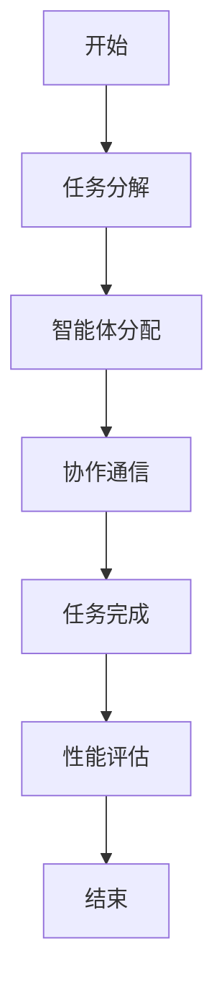

                 


# 多智能体协作进行跨境投资分析

> 关键词：多智能体协作、跨境投资分析、人工智能、分布式系统、金融建模、投资优化、风险管理

> 摘要：多智能体协作是一种新兴的分布式计算范式，其在跨境投资分析中的应用为金融领域带来了新的视角和解决方案。本文将详细探讨多智能体协作的基本概念、算法原理、系统架构设计以及实际项目中的应用场景，通过案例分析和最佳实践，揭示其在跨境投资分析中的巨大潜力和实际价值。

---

## 第一部分: 多智能体协作与跨境投资分析基础

### 第1章: 多智能体协作的背景与概念

#### 1.1 多智能体协作的背景
- **多智能体系统的起源与发展**  
  多智能体系统（Multi-Agent System, MAS）的概念起源于分布式计算领域，最早可以追溯到20世纪80年代。随着计算能力的提升和分布式系统的普及，多智能体协作逐渐成为解决复杂问题的重要工具。

- **多智能体协作的定义与特点**  
  多智能体协作是指多个智能体通过协同工作，共同完成复杂任务的过程。其特点包括分布式性、自治性、协作性和智能性。

- **多智能体协作在金融领域的应用潜力**  
  在金融领域，多智能体协作可以用于实时数据分析、风险评估、投资决策优化等场景，尤其是在跨境投资分析中，其优势更加明显。

#### 1.2 跨境投资分析的背景
- **跨境投资的基本概念**  
  跨境投资是指投资者将资金投向其他国家或地区的市场，以寻求更高的收益或分散风险。

- **跨境投资分析的复杂性**  
  跨境投资涉及多个国家的经济指标、市场波动、政策变化等多种因素，分析的复杂性较高。

- **多智能体协作与跨境投资分析的结合**  
  通过多智能体协作，可以将复杂的跨境投资分析任务分解为多个子任务，由不同的智能体分别负责，从而提高分析的效率和准确性。

### 第2章: 多智能体协作的核心概念与联系

#### 2.1 多智能体协作的核心概念
- **多智能体系统的组成要素**  
  多智能体系统由多个智能体、通信机制、协作协议和环境组成。智能体是系统的核心单元，负责执行具体任务。

- **多智能体协作的目标与任务**  
  目标是通过智能体的协作，实现复杂任务的最优解。任务包括信息收集、数据分析、决策优化等。

- **多智能体协作的通信机制**  
  智能体之间的通信可以通过直接交互或通过中间媒介进行。通信机制的设计直接影响系统的效率和性能。

#### 2.2 跨境投资分析的核心要素
- **数据来源与特征**  
  跨境投资分析涉及多个市场的数据，包括股票价格、汇率、经济指标等。数据的多样性和实时性是分析的关键。

- **投资决策的关键因素**  
  包括市场趋势、政策变化、企业财务状况等。这些因素需要通过多智能体协作进行综合分析。

- **风险评估与管理**  
  跨境投资的风险来源于市场的不确定性，通过多智能体协作可以实时监控和评估风险，制定相应的管理策略。

#### 2.3 多智能体协作与跨境投资分析的关联
- **多智能体协作如何支持跨境投资分析**  
  多智能体协作可以通过分布式计算和智能体的协同，实现对多个市场的实时监控和数据分析。

- **多智能体协作在风险评估中的作用**  
  多智能体协作可以实时收集和分析多个市场的风险因素，提供更准确的风险评估结果。

- **多智能体协作对投资决策的优化**  
  通过智能体的协作，可以快速响应市场变化，优化投资决策，提高收益。

#### 2.4 核心概念对比表格
| 概念 | 属性 | 描述 |
|------|------|------|
| 多智能体系统 | 组成 | 多个智能体协同工作 |
| 跨境投资分析 | 数据来源 | 多国经济指标、市场数据等 |

#### 2.5 ER实体关系图
```mermaid
erd
actor: 投资者
agent: 多智能体
market_data: 市场数据
risk_factors: 风险因素
investment_decision: 投资决策
```

---

## 第三部分: 算法原理与实现

### 第3章: 分布式计算模型与多智能体协作算法

#### 3.1 分布式计算模型
- **分布式计算的基本概念**  
  分布式计算是指将计算任务分布在多个计算节点上，通过协作完成任务。

- **分布式计算在多智能体协作中的应用**  
  多智能体协作可以看作是一种分布式计算的应用，每个智能体相当于一个计算节点。

- **分布式计算模型的优缺点**  
  优点包括高扩展性、容错性；缺点包括通信开销大、协调困难。

#### 3.2 强化学习算法
- **强化学习的基本原理**  
  强化学习是一种通过试错机制来优化决策的算法。智能体通过与环境交互，学习最优策略。

- **强化学习在多智能体协作中的应用**  
  多智能体可以通过强化学习实现协作，例如通过共享策略或竞争机制。

- **强化学习算法的数学模型**  
  $$ Q(s, a) = r + \gamma \max Q(s', a') $$

#### 3.3 多智能体协作算法
- **多智能体协作算法的分类**  
  包括基于任务分解的算法、基于博弈论的算法等。

- **基于任务分解的多智能体协作算法**  
  通过将任务分解为多个子任务，分配给不同的智能体完成。

- **多智能体协作算法的实现步骤**  
  1. 任务分解；2. 智能体分配；3. 协作通信；4. 任务完成；5. 性能评估。

#### 3.4 多智能体协作算法的流程图


---

## 第四部分: 系统架构与设计

### 第4章: 系统架构设计

#### 4.1 系统功能设计
- **系统功能模块**  
  包括数据采集模块、数据分析模块、智能体协作模块、投资决策模块等。

- **系统功能流程图**  
  ```mermaid
  graph TD
  A[数据采集] --> B[数据分析]
  B --> C[智能体协作]
  C --> D[投资决策]
  ```

- **系统功能模块的实现**  
  数据采集模块负责收集多个市场的数据，数据分析模块对数据进行处理和分析，智能体协作模块协调多个智能体的工作，投资决策模块基于分析结果制定投资策略。

#### 4.2 系统架构设计
- **系统架构的层次划分**  
  包括数据层、业务逻辑层和应用层。

- **系统架构设计的实现**  
  使用分层架构，数据层负责数据存储和管理，业务逻辑层负责数据分析和智能体协作，应用层负责用户交互和结果展示。

- **系统架构设计的优缺点**  
  优点包括高扩展性、易维护；缺点包括开发复杂度高、通信开销大。

#### 4.3 系统接口设计
- **系统接口的设计原则**  
  包括标准化、模块化、可扩展性等。

- **系统接口的实现**  
  使用RESTful API进行接口设计，确保不同模块之间的通信高效可靠。

- **系统接口的优缺点**  
  优点包括接口标准化、易于集成；缺点包括接口设计复杂、调试困难。

#### 4.4 系统交互设计
- **系统交互的流程图**  
  ```mermaid
  graph TD
  A[用户请求] --> B[数据采集]
  B --> C[数据分析]
  C --> D[智能体协作]
  D --> E[投资决策]
  E --> F[结果展示]
  ```

---

## 第五部分: 项目实战与案例分析

### 第5章: 项目实战

#### 5.1 环境安装
- **开发环境的选择**  
  建议使用Python和相关库（如Dask、Falcon、Ray等）进行开发。

- **环境安装的步骤**  
  1. 安装Python和相关库；2. 配置开发环境；3. 初始化项目。

#### 5.2 核心代码实现
- **核心代码的实现步骤**  
  1. 数据采集模块的实现；2. 数据分析模块的实现；3. 智能体协作模块的实现；4. 投资决策模块的实现。

- **核心代码示例**  
  ```python
  import dask.distributed as dd

  def collect_data():
      # 数据采集逻辑
      pass

  def analyze_data(data):
      # 数据分析逻辑
      pass

  def collaborate_agents(data):
      # 智能体协作逻辑
      pass

  def make_decision(data):
      # 投资决策逻辑
      pass

  if __name__ == '__main__':
      cluster = dd.LocalCluster()
      client = dd.Client(cluster)
      data = collect_data()
      result = client.submit(analyze_data, data).result()
      result = client.submit(collaborate_agents, result).result()
      decision = client.submit(make_decision, result).result()
      print(decision)
  ```

#### 5.3 案例分析与结果解读
- **实际案例分析**  
  通过具体案例分析多智能体协作在跨境投资分析中的应用效果。

- **结果解读**  
  对分析结果进行解读，验证系统的有效性和优化空间。

#### 5.4 项目小结
- **项目总结**  
  总结项目实施过程中的经验和教训，提出改进建议。

---

## 第六部分: 最佳实践与总结

### 第6章: 最佳实践与总结

#### 6.1 小结
- **总结多智能体协作在跨境投资分析中的应用**  
  多智能体协作通过分布式计算和智能体协作，显著提高了跨境投资分析的效率和准确性。

#### 6.2 注意事项
- **实际应用中的注意事项**  
  包括数据安全、系统性能优化、智能体协作的通信效率等。

#### 6.3 拓展阅读
- **推荐的拓展阅读资料**  
  包括多智能体协作、分布式计算、金融建模等相关领域的书籍和论文。

---

## 第七部分: 作者简介

**作者：AI天才研究院/AI Genius Institute & 禅与计算机程序设计艺术 /Zen And The Art of Computer Programming**

---

### 总结
本文通过详细探讨多智能体协作的基本概念、算法原理、系统架构设计以及实际项目中的应用场景，揭示了多智能体协作在跨境投资分析中的巨大潜力和实际价值。通过案例分析和最佳实践，为读者提供了宝贵的经验和启示。

