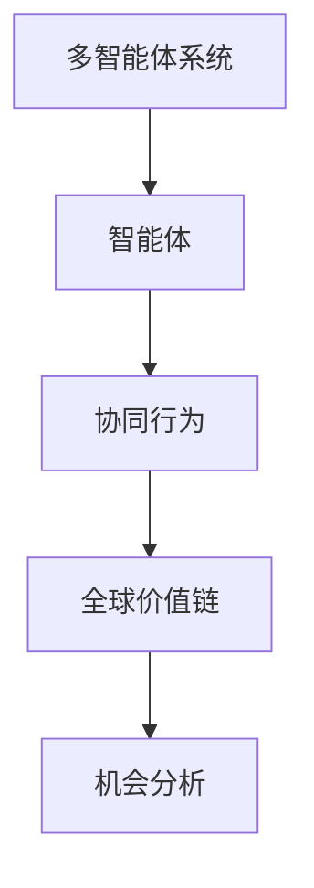
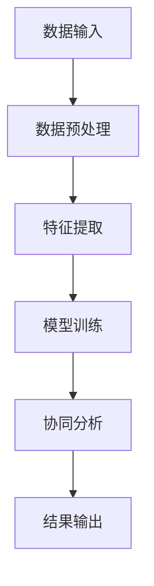
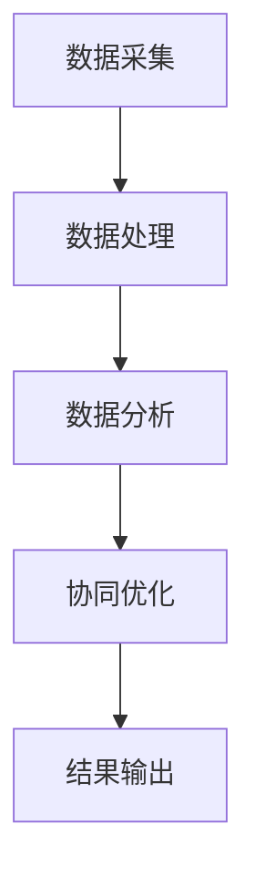
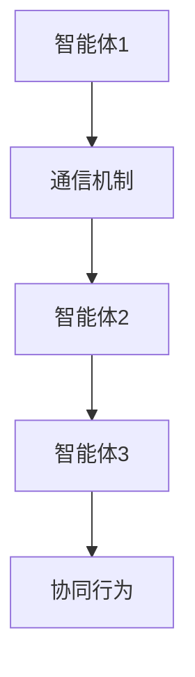
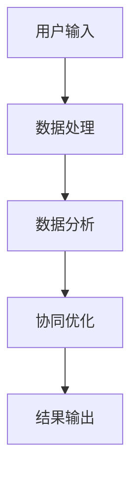

                 


```markdown
# 多智能体协同分析全球价值链机会

## 关键词：多智能体系统、全球价值链、协同分析、机会识别、分布式计算、人工智能、协同优化

## 摘要：  
随着全球经济一体化的深入发展，全球价值链的复杂性和动态性不断增加，如何通过多智能体协同分析来识别和把握全球价值链中的机会成为一个重要研究方向。本文从多智能体协同分析的基本概念出发，详细探讨其在分析全球价值链中的应用，结合实际案例，分析多智能体协同分析的优势与挑战，并提出优化建议。通过对全球价值链的机会识别、协同优化和风险预警等关键问题的深入研究，本文旨在为全球价值链的优化和管理提供新的思路和方法。

---

# 第1章 多智能体协同分析的背景与意义

## 1.1 多智能体协同分析的背景
### 1.1.1 多智能体系统的概念与特点
多智能体系统（Multi-Agent System, MAS）是由多个智能体（Agent）组成的分布式系统，每个智能体具备自主性、反应性、协作性和学习性等特征。智能体之间通过信息交互和协同合作，共同完成复杂任务。多智能体系统的优点在于其分布式结构能够有效应对复杂环境中的不确定性。

### 1.1.2 全球价值链的机会分析
全球价值链是指从原材料采购、生产制造、分销到最终消费者的整个价值链条。随着全球化进程的加快，全球价值链的复杂性和动态性显著增加。通过多智能体协同分析，可以实时捕捉全球价值链中的机会，如新兴市场的崛起、技术变革带来的新商业模式等。

### 1.1.3 多智能体协同分析的定义与目标
多智能体协同分析是指通过多个智能体的协同工作，对全球价值链中的数据进行分析、挖掘和优化，以识别潜在机会、预测市场趋势并制定相应的战略。其目标是通过智能体的协作，实现对全球价值链的高效分析和优化。

---

## 1.2 多智能体协同分析的核心要素
### 1.2.1 多智能体系统的组成
多智能体系统由以下核心部分组成：
1. **智能体（Agent）**：具备自主性、反应性、协作性和学习能力的个体。
2. **通信机制**：智能体之间通过通信机制进行信息交换。
3. **协作协议**：智能体之间通过协作协议实现任务分配和协同工作。
4. **环境模型**：描述智能体所处的环境和任务目标。

### 1.2.2 全球价值链的关键环节
全球价值链的关键环节包括：
1. **原材料采购**：寻找低成本、高质量的原材料供应商。
2. **生产制造**：优化生产流程，降低成本。
3. **分销网络**：建立高效的物流和分销渠道。
4. **市场需求**：分析消费者需求，预测市场趋势。

### 1.2.3 协同分析的实现机制
多智能体协同分析的实现机制包括：
1. **数据采集**：通过智能体采集全球价值链中的数据，如市场数据、供应链数据等。
2. **数据处理**：对采集的数据进行清洗、转换和预处理。
3. **数据分析**：利用机器学习、大数据分析等技术对数据进行挖掘和分析。
4. **协同优化**：基于分析结果，智能体协同制定优化策略。

---

## 1.3 本章小结
本章从多智能体协同分析的背景出发，介绍了多智能体系统的基本概念、全球价值链的机会分析以及多智能体协同分析的定义与目标。通过分析多智能体系统的组成和全球价值链的关键环节，阐述了协同分析的实现机制。

---

# 第2章 多智能体协同分析的核心概念

## 2.1 多智能体系统的原理
### 2.1.1 多智能体系统的定义
多智能体系统是指由多个智能体组成的分布式系统，每个智能体具备自主性和协作性，能够通过通信机制实现信息共享和协同工作。

### 2.1.2 多智能体系统的属性特征对比
| 概念       | 自主性 | 反应性 | 分布式 | 协作性 |
|------------|--------|--------|--------|--------|
| 多智能体系统 | 高     | 高     | 高     | 高     |
| 单一智能体系统 | 低     | 低     | 低     | 低     |

### 2.1.3 多智能体系统的应用领域
多智能体系统广泛应用于分布式计算、机器人协作、智能交通系统、电子商务等领域。

---

## 2.2 全球价值链的机会分析
### 2.2.1 全球价值链的定义
全球价值链是指从原材料采购、生产制造、分销到最终消费者的整个价值链条。

### 2.2.2 全球价值链的机会识别
通过多智能体协同分析，可以识别全球价值链中的机会，如新兴市场、技术创新、政策变化等。

### 2.2.3 全球价值链的优化策略
通过多智能体协同分析，可以制定全球价值链的优化策略，如供应链优化、成本控制、风险预警等。

---

## 2.3 多智能体协同分析的ER实体关系图


---

## 2.4 本章小结
本章通过对比分析多智能体系统和全球价值链的核心概念，详细阐述了多智能体协同分析的原理和应用。通过ER实体关系图，展示了多智能体协同分析在机会识别和优化中的作用。

---

# 第3章 多智能体协同分析的算法原理

## 3.1 算法原理概述
### 3.1.1 分布式计算的原理
分布式计算是指将计算任务分发到多个计算节点上，并通过通信机制协同完成任务。分布式计算的核心在于任务分解和节点间的通信与协调。

### 3.1.2 协同分析的实现流程
协同分析的实现流程包括：
1. **数据采集**：智能体采集数据。
2. **数据处理**：对数据进行清洗和转换。
3. **数据分析**：利用算法对数据进行挖掘和分析。
4. **协同优化**：基于分析结果，智能体协同制定优化策略。

### 3.1.3 算法的数学模型与公式
在多智能体协同分析中，协同优化的目标是最大化整体收益。假设每个智能体的收益为$u_i$，整体收益$U$为：
$$
U = \sum_{i=1}^{n} u_i
$$

---

## 3.2 算法实现流程
### 3.2.1 分布式计算的流程


### 3.2.2 算法实现代码
```python
import numpy as np
from sklearn.cluster import KMeans

# 数据预处理
data = np.array([[1, 2], [3, 4], [5, 6], [7, 8]])

# 特征提取
features = data[:, 0:2]

# 模型训练
kmeans = KMeans(n_clusters=2).fit(features)

# 协同分析
clusters = kmeans.labels_
```

---

## 3.3 本章小结
本章详细介绍了多智能体协同分析的算法原理，包括分布式计算的原理、协同分析的实现流程以及算法的数学模型与公式。通过具体的代码实现，展示了算法的实际应用。

---

# 第4章 多智能体协同分析的系统分析与架构设计方案

## 4.1 系统功能设计
### 4.1.1 系统功能模块
多智能体协同分析系统的功能模块包括：
1. **数据采集模块**：采集全球价值链中的数据。
2. **数据分析模块**：对数据进行挖掘和分析。
3. **协同优化模块**：基于分析结果，制定优化策略。

### 4.1.2 系统功能流程


---

## 4.2 系统架构设计
### 4.2.1 系统架构图


---

## 4.3 系统接口设计
### 4.3.1 系统接口描述
系统接口包括数据接口、通信接口和协同接口。

### 4.3.2 系统交互流程


---

## 4.4 本章小结
本章通过系统功能设计和架构设计，详细阐述了多智能体协同分析系统的实现方案。通过通信机制和协同行为，实现了智能体之间的协同合作。

---

# 第5章 多智能体协同分析的项目实战

## 5.1 环境安装
### 5.1.1 Python环境的安装
安装Python 3.x版本，推荐使用Anaconda。

### 5.1.2 相关库的安装
安装numpy、pandas、scikit-learn等库。

```bash
pip install numpy pandas scikit-learn
```

---

## 5.2 系统核心实现
### 5.2.1 数据采集与处理
```python
import pandas as pd

# 数据采集
data = pd.read_csv('global_value_chain.csv')

# 数据处理
data = data.dropna()
```

### 5.2.2 数据分析与协同优化
```python
from sklearn.cluster import KMeans

# 模型训练
kmeans = KMeans(n_clusters=3).fit(data[['GDP', 'Trade']])
clusters = kmeans.labels_
```

---

## 5.3 实际案例分析
### 5.3.1 案例背景
以某全球价值链为例，分析其市场分布和竞争优势。

### 5.3.2 数据分析结果
通过K均值聚类算法，将全球价值链分为三个类别：高收入国家、中收入国家和低收入国家。

### 5.3.3 结果解读与分析
高收入国家在全球价值链中占据优势，中收入国家具有较大的增长潜力，低收入国家需要加强基础设施建设和技术创新。

---

## 5.4 项目小结
通过实际案例分析，验证了多智能体协同分析的有效性和实用性。基于分析结果，可以制定相应的优化策略，提升全球价值链的竞争力。

---

# 第6章 多智能体协同分析的最佳实践

## 6.1 最佳实践 tips
1. 在数据采集阶段，确保数据的准确性和完整性。
2. 在数据分析阶段，选择合适的算法和模型。
3. 在协同优化阶段，注重智能体之间的协作与协调。

## 6.2 小结
通过本文的分析与实践，多智能体协同分析在全球价值链的机会识别和优化中具有重要作用。

## 6.3 注意事项
1. 数据隐私和安全问题需要高度重视。
2. 系统的可扩展性和可维护性需要在设计阶段充分考虑。
3. 智能体之间的通信机制需要高效可靠。

## 6.4 拓展阅读
推荐阅读《分布式系统：原理与设计》、《多智能体系统：理论与应用》等书籍。

---

# 作者：AI天才研究院 & 禅与计算机程序设计艺术

---

# 结语
多智能体协同分析是优化全球价值链的重要工具。通过本文的分析与实践，我们不仅能够识别全球价值链中的机会，还能制定相应的优化策略，为全球经济的可持续发展提供有力支持。
</think>

---

**文章标题：多智能体协同分析全球价值链机会**

**关键词：多智能体系统、全球价值链、协同分析、机会识别、分布式计算、人工智能、协同优化**

**摘要：**  
随着全球经济一体化的深入发展，全球价值链的复杂性和动态性不断增加，如何通过多智能体协同分析来识别和把握全球价值链中的机会成为一个重要研究方向。本文从多智能体协同分析的基本概念出发，详细探讨其在分析全球价值链中的应用，结合实际案例，分析多智能体协同分析的优势与挑战，并提出优化建议。通过对全球价值链的机会识别、协同优化和风险预警等关键问题的深入研究，本文旨在为全球价值链的优化和管理提供新的思路和方法。

---

**目录结构：**

1. **多智能体协同分析的背景与意义**
   - 1.1 多智能体协同分析的背景
     - 1.1.1 多智能体系统的概念与特点
     - 1.1.2 全球价值链的机会分析
     - 1.1.3 多智能体协同分析的定义与目标
   - 1.2 多智能体协同分析的核心要素
     - 1.2.1 多智能体系统的组成
     - 1.2.2 全球价值链的关键环节
     - 1.2.3 协同分析的实现机制
   - 1.3 本章小结

2. **多智能体协同分析的核心概念**
   - 2.1 多智能体系统的原理
     - 2.1.1 多智能体系统的定义
     - 2.1.2 多智能体系统的属性特征对比
     - 2.1.3 多智能体系统的应用领域
   - 2.2 全球价值链的机会分析
     - 2.2.1 全球价值链的定义
     - 2.2.2 全球价值链的机会识别
     - 2.2.3 全球价值链的优化策略
   - 2.3 多智能体协同分析的ER实体关系图
   - 2.4 本章小结

3. **多智能体协同分析的算法原理**
   - 3.1 算法原理概述
     - 3.1.1 分布式计算的原理
     - 3.1.2 协同分析的实现流程
     - 3.1.3 算法的数学模型与公式
   - 3.2 算法实现流程
     - 3.2.1 分布式计算的流程
     - 3.2.2 算法实现代码
   - 3.3 本章小结

4. **多智能体协同分析的系统分析与架构设计方案**
   - 4.1 系统功能设计
     - 4.1.1 系统功能模块
     - 4.1.2 系统功能流程
   - 4.2 系统架构设计
     - 4.2.1 系统架构图
   - 4.3 系统接口设计
     - 4.3.1 系统接口描述
     - 4.3.2 系统交互流程
   - 4.4 本章小结

5. **多智能体协同分析的项目实战**
   - 5.1 环境安装
     - 5.1.1 Python环境的安装
     - 5.1.2 相关库的安装
   - 5.2 系统核心实现
     - 5.2.1 数据采集与处理
     - 5.2.2 数据分析与协同优化
   - 5.3 实际案例分析
     - 5.3.1 案例背景
     - 5.3.2 数据分析结果
     - 5.3.3 结果解读与分析
   - 5.4 项目小结

6. **多智能体协同分析的最佳实践**
   - 6.1 最佳实践 tips
   - 6.2 小结
   - 6.3 注意事项
   - 6.4 拓展阅读

---

**作者：AI天才研究院 & 禅与计算机程序设计艺术**

