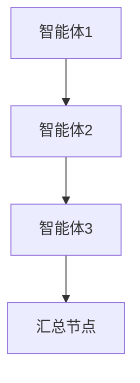
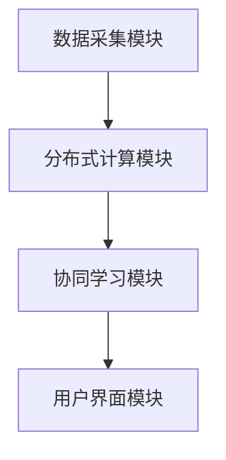
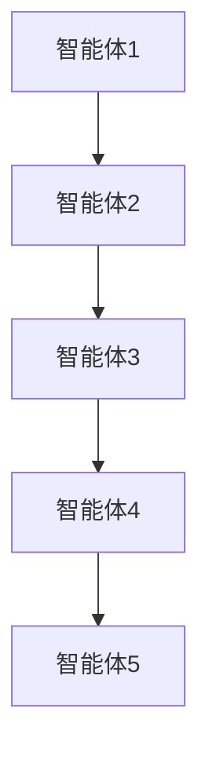

                 


# 多智能体协同评估ESG因素影响

## 关键词：
多智能体系统, ESG评估, 协同学习, 分布式算法, 系统架构设计, ESG影响分析

## 摘要：
随着全球对企业社会责任的关注度不断提高，ESG（环境、社会、治理）评估成为衡量企业可持续发展能力的重要指标。然而，传统的ESG评估方法往往依赖于单一智能体的分析，存在数据分散、评估复杂度高、实时性差等问题。本文提出了一种基于多智能体协同的ESG评估方法，通过多个智能体的协作，实现对ESG因素的高效、精准评估。文章详细探讨了多智能体协同评估的核心算法、系统架构设计、项目实战案例以及未来研究方向，为相关领域的研究和实践提供了新的思路。

---

# 第一部分：引言

## 1.1 ESG因素的重要性
### 1.1.1 ESG的定义与背景
ESG（Environmental, Social, Governance）是衡量企业可持续发展能力的重要指标，包括环境表现（如碳排放、资源利用效率）、社会责任（如员工权益、社区贡献）和公司治理（如董事会结构、透明度）等方面。

### 1.1.2 多智能体协同的优势
传统的ESG评估方法通常依赖于单一智能体的分析，存在数据分散、计算复杂度高、实时性差等问题。而多智能体协同可以通过分布式计算和协作学习，提高评估的效率和准确性。

### 1.1.3 研究的意义与应用前景
通过对多智能体协同技术的研究，可以实现对ESG因素的实时监控和动态评估，为企业和社会提供更精准的决策支持，推动可持续发展。

---

## 1.2 多智能体系统的基本概念
### 1.2.1 多智能体系统的定义
多智能体系统（Multi-Agent System, MAS）是由多个相互作用的智能体组成的系统，每个智能体都能独立决策并与其他智能体协作完成复杂任务。

### 1.2.2 多智能体与单智能体的区别
| 特性                | 单智能体             | 多智能体             |
|---------------------|----------------------|----------------------|
| 决策主体           | 单一主体             | 多个主体             |
| 信息处理方式       | 中央化               | 分布化               |
| 任务协作           | 独立完成             | 协作完成             |

### 1.2.3 多智能体系统的分类
1. **分布式计算型**：智能体之间通过分布式计算完成任务。
2. **协作学习型**：智能体通过协作学习共同优化结果。
3. **混合型**：结合分布式计算和协作学习的混合系统。

---

## 1.3 多智能体协同评估的背景
### 1.3.1 ESG评估的挑战
- 数据分散：ESG数据来源广泛，难以集中处理。
- 评估复杂性高：ESG涉及多个维度，传统方法难以全面覆盖。
- 实时性要求高：企业ESG表现需要实时监控和评估。

### 1.3.2 多智能体协同的优势
- 分布式计算能力：多智能体可以并行处理大规模数据。
- 协作学习能力：通过协作学习，可以提高评估的准确性和鲁棒性。
- 动态适应性：多智能体系统能够快速响应数据变化。

### 1.3.3 研究现状与未来趋势
目前，多智能体协同在ESG评估中的应用仍处于起步阶段，未来的研究方向包括优化协同算法、提高系统的实时性和准确性。

---

# 第二部分：多智能体协同评估ESG因素的核心算法

## 2.1 分布式评估算法
### 2.1.1 分布式评估的基本原理
分布式评估算法通过将ESG数据分散到多个智能体中，每个智能体负责计算局部影响，最后通过通信汇总全局结果。

### 2.1.2 分布式评估的数学模型
$$
\text{全局影响} = \sum_{i=1}^{n} (\text{智能体}_i \text{的局部影响})
$$

### 2.1.3 分布式评估的实现步骤
1. 数据分配：将ESG数据分配给多个智能体。
2. 局部计算：每个智能体计算自己的局部影响。
3. 通信汇总：智能体之间通过通信汇总全局结果。



---

## 2.2 协同学习算法
### 2.2.1 协同学习的基本原理
协同学习算法通过多个智能体之间的协作，共同优化ESG评估结果。

### 2.2.2 协同学习的优化过程
$$
\text{优化公式：} \quad \theta^{(t+1)} = \theta^{(t)} + \alpha (y - y_{\text{pred}})
$$

### 2.2.3 协同学习的实现步骤
1. 初始化：设置智能体的初始参数。
2. 本地训练：每个智能体在本地数据上进行训练。
3. 参数同步：智能体之间同步参数，更新模型。
4. 预测与优化：基于同步后的参数进行预测，不断优化模型。

---

# 第三部分：多智能体协同评估ESG因素的系统架构设计

## 3.1 系统功能设计
### 3.1.1 系统功能模块
| 模块名称           | 功能描述           |
|--------------------|--------------------|
| 数据采集模块       | 采集ESG相关数据     |
| 分布式计算模块     | 分布式评估ESG因素   |
| 协同学习模块       | 优化评估结果       |
| 用户界面模块       | 展示评估结果       |

### 3.1.2 系统功能流程


---

## 3.2 系统架构设计
### 3.2.1 系统架构图


### 3.2.2 系统交互流程
1. 数据采集模块从多个数据源采集ESG数据。
2. 分布式计算模块将数据分配给多个智能体。
3. 智能体之间通过通信模块进行数据交换。
4. 协同学习模块优化评估结果。
5. 用户界面模块展示最终结果。

---

# 第四部分：多智能体协同评估ESG因素的项目实战

## 4.1 项目需求分析
### 4.1.1 项目目标
实现一个多智能体协同系统，用于评估企业的ESG表现。

### 4.1.2 项目范围
- 数据来源：企业公开数据、社会责任报告。
- 评估指标：环境、社会、治理三个维度。

## 4.2 系统核心实现
### 4.2.1 环境数据采集与处理
```python
class EnvironmentalDataCollector:
    def collect_data(self):
        # 从环境数据源采集数据
        pass

    def process_data(self, data):
        # 数据预处理
        pass
```

### 4.2.2 社会数据采集与处理
```python
class SocialDataCollector:
    def collect_data(self):
        # 从社会数据源采集数据
        pass

    def process_data(self, data):
        # 数据预处理
        pass
```

### 4.2.3 治理数据采集与处理
```python
class GovernanceDataCollector:
    def collect_data(self):
        # 从治理数据源采集数据
        pass

    def process_data(self, data):
        # 数据预处理
        pass
```

## 4.3 系统实现与优化
### 4.3.1 分布式评估实现
```python
def distributed_assessment(data):
    # 分配数据到多个智能体
    agents = [Agent(i) for i in range(n)]
    results = [agent.assess(local_data) for agent in agents]
    return sum(results)
```

### 4.3.2 协同学习优化
```python
def collaborative_learning(agents, data):
    # 初始化参数
    theta = initial_theta()
    for _ in range(iterations):
        # 本地训练
        thetas = [agent.train(theta, data) for agent in agents]
        # 参数同步
        theta = average(thetas)
    return theta
```

---

# 第五部分：多智能体协同评估ESG因素影响的高级主题

## 5.1 强化学习在ESG评估中的应用
### 5.1.1 强化学习的基本原理
强化学习通过智能体与环境的交互，不断优化决策策略。

### 5.1.2 强化学习在ESG评估中的应用
智能体可以通过强化学习优化ESG评估的策略，提高评估的准确性和效率。

---

## 5.2 多智能体协同评估的动态适应性
### 5.2.1 动态环境下的协同机制
智能体需要能够动态调整策略，适应环境的变化。

### 5.2.2 自适应算法的设计
通过自适应算法，智能体可以在动态环境中保持高效的协同能力。

---

## 5.3 多智能体协同与区块链的结合
### 5.3.1 区块链在多智能体系统中的应用
区块链可以为多智能体系统提供去中心化的信任机制。

### 5.3.2 区块链在ESG评估中的潜在应用
通过区块链技术，可以实现ESG数据的透明共享和可信评估。

---

# 第六部分：结论与展望

## 6.1 结论
本文提出了一种基于多智能体协同的ESG评估方法，通过分布式计算和协作学习，提高了评估的效率和准确性。

## 6.2 未来展望
未来的研究方向包括优化协同算法、提高系统的实时性和准确性，以及探索多智能体协同在其他领域的应用。

---

# 作者：AI天才研究院/AI Genius Institute & 禅与计算机程序设计艺术 /Zen And The Art of Computer Programming

