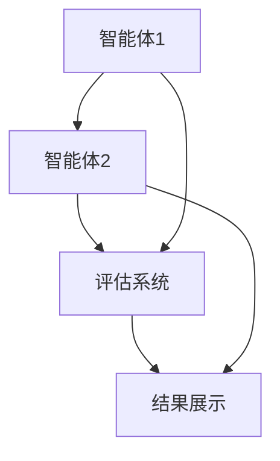
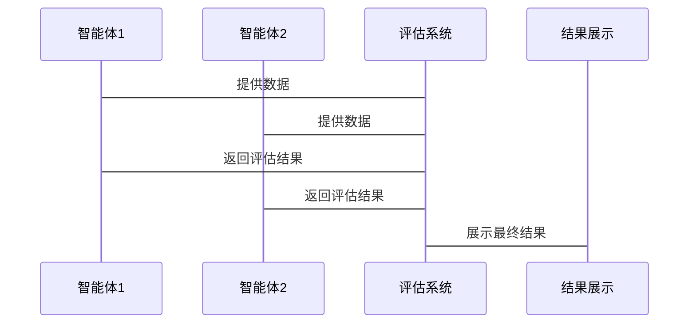

                 


```markdown
# 多智能体协同评估企业创新能力

> 关键词：多智能体、协同评估、企业创新、创新能力、智能体系统

> 摘要：本文章深入探讨了多智能体协同评估企业创新能力的理论基础、算法实现、系统架构及实际应用。通过详细的分析与案例研究，展示了如何利用多智能体系统的优势，构建高效、准确的企业创新能力评估模型。文章还提供了丰富的代码示例和系统设计图，帮助读者全面理解和掌握这一技术。

---

# 第一部分：多智能体协同评估企业创新能力概述

## 第1章：多智能体协同评估概述

### 1.1 多智能体协同的基本概念
- 1.1.1 多智能体系统的定义与特点
  - 多智能体系统是由多个智能体组成的分布式系统
  - 每个智能体具有自主性、反应性、协作性和学习能力
- 1.1.2 多智能体系统与单智能体系统的区别
  - 单智能体系统：单一决策主体，信息处理集中
  - 多智能体系统：分布式决策，信息共享与协同

### 1.2 企业创新能力评估的背景与意义
- 1.2.1 企业创新能力的定义
  - 包括技术创新、管理创新、产品创新等多个维度
- 1.2.2 传统评估方法的局限性
  - 数据单一、维度不足、难以量化
- 1.2.3 多智能体协同评估的优势
  - 全面性：多维度数据采集与分析
  - 实时性：动态评估企业创新能力
  - 精准性：基于协同的多智能体算法提高评估精度

### 1.3 多智能体协同评估的目标与任务
- 1.3.1 评估目标的设定
  - 量化企业创新能力，提供可操作的评估结果
- 1.3.2 评估任务的分解
  - 数据采集、特征提取、模型训练、结果分析
- 1.3.3 评估结果的应用场景
  - 企业战略规划、资源配置、风险预警

### 1.4 多智能体协同评估的边界与外延
- 1.4.1 系统边界
  - 评估范围：企业内部创新能力
  - 评估对象：企业各部门、产品、团队
- 1.4.2 外延与相关领域
  - 与企业绩效评估、战略管理的关联
- 1.4.3 与其他评估方法的对比
  - 传统方法：基于专家评分，主观性强
  - 多智能体方法：数据驱动，客观性高

### 1.5 核心要素与概念结构
- 1.5.1 多智能体协同的核心要素
  - 智能体：具有独立决策能力的个体
  - 协同机制：智能体之间的通信与协作规则
  - 评估模型：基于多智能体的评估算法
- 1.5.2 企业创新能力的评估维度
  - 技术创新：研发投入、专利数量
  - 管理创新：组织结构、管理效率
  - 市场创新：产品创新、市场表现
- 1.5.3 概念结构与核心要素的关联
  - 通过协同机制，智能体共享信息，共同完成企业创新能力的综合评估

---

## 第2章：多智能体协同评估的核心概念与联系

### 2.1 多智能体协同的原理
- 2.1.1 博弈论基础
  - Nash均衡：智能体在博弈中的策略选择
- 2.1.2 分布式计算与协同机制
  - 分布式计算：任务分解与协同处理
  - 协同机制：智能体之间的信息交换与合作
- 2.1.3 多智能体之间的通信与协调
  - 通信协议：定义智能体之间的信息交换规则
  - 协调算法：实现智能体的协同行为

### 2.2 实体关系与ER图分析

```mermaid
erDiagram
    actor 智能体1 {
        string id
        string 状态
        string 行为
    }
    actor 智能体2 {
        string id
        string 状态
        string 行为
    }
    actor 评估系统 {
        string id
        string 评估结果
        string 评估指标
    }
    智能体1 --> 评估系统 : 提供数据
    智能体2 --> 评估系统 : 提供数据
    评估系统 --> 智能体1 : 返回评估结果
    评估系统 --> 智能体2 : 返回评估结果
```

### 2.3 多智能体协同评估的核心算法
- 2.3.1 分布式评估算法
  - 智能体各自收集数据，通过通信协议交换信息
  - 评估系统整合数据，输出综合评估结果
- 2.3.2 协同学习算法
  - 基于分布式机器学习，优化评估模型

### 2.4 多智能体协同的数学模型

$$
\text{评估结果} = \sum_{i=1}^{n} \lambda_i \cdot f_i(x)
$$

其中：
- $\lambda_i$：第i个智能体的权重
- $f_i(x)$：第i个智能体对输入x的评估函数
- $x$：企业创新能力相关的特征向量

---

## 第3章：多智能体协同评估的算法实现

### 3.1 算法原理
- 3.1.1 多智能体协同算法的数学模型
  - 基于博弈论的多智能体协作模型
  - 分布式评估算法的实现步骤
- 3.1.2 算法实现的关键步骤
  - 数据预处理
  - 智能体通信
  - 协同评估

### 3.2 算法实现的代码示例

```python
class MultiAgentEvaluator:
    def __init__(self, agents):
        self.agents = agents

    def evaluate(self, input_data):
        results = []
        for agent in self.agents:
            result = agent.evaluate(input_data)
            results.append(result)
        return self.aggregate(results)

    def aggregate(self, results):
        # 示例：加权平均
        weights = [1 for _ in range(len(results))]
        total = sum(result * weight for result, weight in zip(results, weights))
        return total / sum(weights)

# 示例智能体
class Agent:
    def __init__(self, id):
        self.id = id

    def evaluate(self, input_data):
        # 示例评估逻辑
        return sum(input_data) / len(input_data)
```

### 3.3 算法实现的详细解读
- 3.3.1 数据预处理
  - 对企业创新能力数据进行清洗和特征提取
- 3.3.2 智能体通信
  - 定义智能体之间的通信协议
  - 实现数据的交换与共享
- 3.3.3 协同评估
  - 各智能体独立评估，评估系统整合结果
  - 基于权重的综合评估方法

---

## 第4章：多智能体协同评估的系统架构设计

### 4.1 系统应用场景
- 企业创新能力评估
- 企业战略规划与资源配置
- 企业风险预警与决策支持

### 4.2 系统功能设计
- 数据采集模块：收集企业创新能力相关数据
- 评估模型模块：基于多智能体的评估算法
- 结果展示模块：可视化评估结果

### 4.3 系统架构图



### 4.4 系统交互序列图



---

## 第5章：多智能体协同评估的项目实战

### 5.1 项目环境安装
- 安装Python
- 安装必要的库：numpy, matplotlib, scikit-learn

### 5.2 项目核心实现

```python
import numpy as np

class Agent:
    def __init__(self, id):
        self.id = id

    def evaluate(self, input_data):
        return np.mean(input_data)

class MultiAgentEvaluator:
    def __init__(self, agents):
        self.agents = agents

    def evaluate(self, input_data):
        results = []
        for agent in self.agents:
            result = agent.evaluate(input_data)
            results.append(result)
        return self.aggregate(results)

    def aggregate(self, results):
        return np.mean(results)

# 示例使用
agents = [Agent(1), Agent(2), Agent(3)]
evaluator = MultiAgentEvaluator(agents)
input_data = np.array([1, 2, 3, 4, 5])
result = evaluator.evaluate(input_data)
print("评估结果:", result)
```

### 5.3 代码解读与分析
- 代码实现：多智能体协同评估算法
- 评估结果：综合各智能体的评估结果

### 5.4 实际案例分析
- 某企业的创新能力评估案例
- 评估结果的应用与解读

---

## 第6章：总结与展望

### 6.1 小结
- 多智能体协同评估的优势与应用场景
- 系统架构设计与实现要点

### 6.2 最佳实践 tips
- 系统设计中的关键点
- 代码实现中的注意事项

### 6.3 注意事项
- 数据隐私与安全
- 系统性能优化
- 算法可扩展性

### 6.4 拓展阅读
- 推荐的相关书籍与论文
- 行业动态与未来趋势

---

# 作者：AI天才研究院/AI Genius Institute & 禅与计算机程序设计艺术 /Zen And The Art of Computer Programming
```

