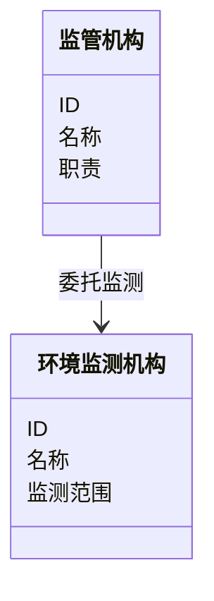
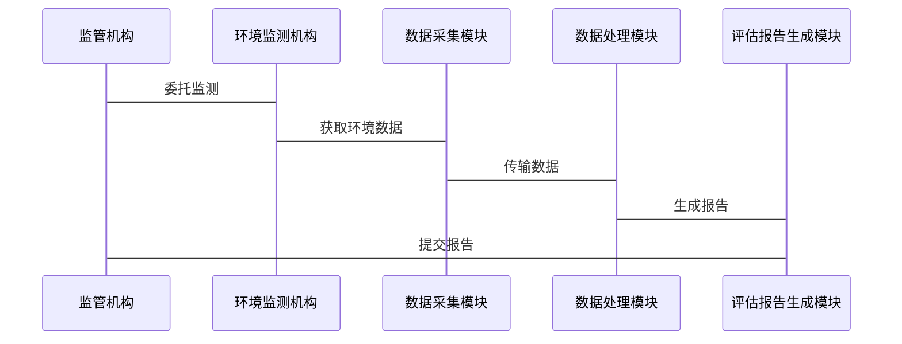

                 


```markdown
# 多智能体协同评估监管环境影响

> 关键词：多智能体系统、环境影响评估、协同监管、智能体算法、监管决策优化

> 摘要：本文探讨多智能体协同在环境影响评估中的应用，分析其算法原理、系统架构设计及实际应用案例，强调其在优化监管决策中的重要性。

---

# 第1章: 多智能体协同评估监管环境影响的背景介绍

## 1.1 多智能体协同的基本概念

### 1.1.1 多智能体系统的定义
多智能体系统（Multi-Agent System, MAS）是由多个智能体（Agent）组成的系统，这些智能体能够通过协作完成复杂任务。智能体具备自主性、反应性和协作性等特征。

### 1.1.2 多智能体系统的特征
- **自主性**：智能体能够自主决策。
- **反应性**：能够感知环境并实时响应。
- **协作性**：多个智能体协同完成任务。
- **分布式性**：智能体分布在不同的位置，通过通信协作。

### 1.1.3 多智能体系统的核心要素
- **智能体**：具备感知、决策和执行能力。
- **通信机制**：智能体之间的信息交换。
- **协作协议**：定义智能体之间的协作规则。

## 1.2 监管环境影响评估的背景与问题描述

### 1.2.1 监管环境的定义与作用
监管环境是指监管机构对经济、社会和环境进行监督和管理的环境。其作用在于确保政策的正确实施和环境的可持续发展。

### 1.2.2 环境影响评估的必要性
随着工业化和城市化的快速发展，环境问题日益突出，评估监管环境对环境的影响变得至关重要。

### 1.2.3 多智能体协同在环境影响评估中的应用
通过多智能体系统，可以实现对环境影响的实时监测和评估，提高监管效率和准确性。

## 1.3 多智能体协同评估监管环境影响的意义

### 1.3.1 提高评估效率
多智能体系统能够同时处理大量数据，显著提高评估效率。

### 1.3.2 增强评估的全面性
通过多个智能体的协作，可以实现对环境影响的全面评估。

### 1.3.3 优化监管决策
基于多智能体协同的评估结果，监管机构可以制定更科学的决策。

## 1.4 本章小结
本章介绍了多智能体系统的基本概念和特征，分析了监管环境影响评估的背景和问题，探讨了多智能体协同在环境影响评估中的应用及其重要意义。

---

# 第2章: 多智能体协同评估监管环境影响的核心概念与联系

## 2.1 多智能体系统的原理与机制

### 2.1.1 多智能体系统的通信机制
智能体之间通过通信协议进行信息交换，常见的通信机制包括发布-订阅模式。

### 2.1.2 多智能体系统的协作机制
智能体通过协作协议进行任务分配和协作，常见的协作机制包括基于协商的协作和基于规则的协作。

### 2.1.3 多智能体系统的决策机制
智能体基于感知信息和决策模型进行决策，常见的决策模型包括基于Q-learning的决策模型。

## 2.2 监管环境影响评估的模型与方法

### 2.2.1 监管环境影响的评估模型
环境影响评估模型通常包括环境监测数据、监管政策和经济影响分析。

### 2.2.2 多智能体协同评估的方法
通过智能体协作，实现对环境影响的实时监测和评估。

### 2.2.3 智能体之间的信息交互
智能体通过共享信息和协同决策，提高评估的准确性和全面性。

## 2.3 多智能体协同评估的ER实体关系图

```mermaid
erDiagram
    监管机构 *[m=1..n]--<|拥有>| 环境监测机构
    环境监测机构 *[m=1..n]--<|监测>| 环境数据
    环境数据 *[m=1..n]--<|被评估>| 监管报告
```

---

# 第3章: 多智能体协同评估监管环境影响的算法原理

## 3.1 多智能体协同评估的算法概述

### 3.1.1 分布式计算算法
通过分布式计算实现智能体之间的协作，常见的算法包括分布式协商算法。

### 3.1.2 博弈论模型
利用博弈论模型分析智能体之间的协作和竞争关系，常见的模型包括纳什均衡模型。

## 3.2 多智能体协同评估的具体算法

### 3.2.1 分布式协商算法
智能体通过协商确定各自的任务分工，实现协作。

### 3.2.2 博弈论模型的应用
利用博弈论模型分析智能体之间的策略选择和结果。

## 3.3 算法实现与优化

### 3.3.1 算法实现
通过Python代码实现分布式协商算法。

```python
def distributed_negotiation(agent, target):
    # 实现分布式协商算法的代码
    pass
```

### 3.3.2 算法优化
通过对算法的时间复杂度和空间复杂度进行优化，提高计算效率。

## 3.4 本章小结
本章介绍了多智能体协同评估的算法原理，详细讲解了分布式计算算法和博弈论模型的应用，并给出了算法实现和优化的建议。

---

# 第4章: 多智能体协同评估监管环境影响的系统架构设计

## 4.1 系统分析与设计

### 4.1.1 问题场景介绍
在监管环境影响评估中，需要对多个环境因素进行实时监测和评估。

### 4.1.2 系统功能设计
系统功能包括环境数据采集、数据处理、评估报告生成等。

### 4.1.3 领域模型类图



## 4.2 系统架构设计

### 4.2.1 系统架构图


### 4.2.2 系统接口设计
系统接口包括数据采集接口、数据处理接口和报告生成接口。

### 4.2.3 系统交互序列图



## 4.3 本章小结
本章分析了系统的架构设计，包括系统功能设计、架构图和交互图，为系统的实现提供了指导。

---

# 第5章: 多智能体协同评估监管环境影响的项目实战

## 5.1 项目背景与目标

### 5.1.1 项目背景
本项目旨在利用多智能体协同技术，实现对某区域环境影响的实时评估。

### 5.1.2 项目目标
实现环境数据的采集、处理和评估报告的生成。

## 5.2 项目环境与工具

### 5.2.1 环境安装
需要安装Python、Mermaid和相关开发工具。

## 5.3 项目核心实现

### 5.3.1 核心代码实现
实现分布式协商算法和环境数据处理模块。

```python
class Agent:
    def __init__(self, id):
        self.id = id
        self.role = "monitor"

    def negotiate(self, target):
        # 分布式协商算法实现
        pass
```

### 5.3.2 代码解读与分析
详细解读代码的功能和实现逻辑。

## 5.4 项目案例分析

### 5.4.1 案例介绍
以某区域的环境监测为例，展示系统的实际应用。

### 5.4.2 实际应用分析
分析系统在实际应用中的表现和效果。

## 5.5 项目小结
本章通过实际案例展示了多智能体协同评估监管环境影响的应用，验证了系统的可行性和有效性。

---

# 第6章: 多智能体协同评估监管环境影响的最佳实践与总结

## 6.1 最佳实践

### 6.1.1 系统设计建议
在系统设计中，建议采用模块化设计，便于后续维护和扩展。

### 6.1.2 算法优化建议
建议在算法实现中加入并行计算和缓存机制，提高计算效率。

## 6.2 小结

### 6.2.1 本文总结
总结本文的主要内容和研究成果。

### 6.2.2 未来展望
展望多智能体协同评估监管环境影响的未来发展方向。

## 6.3 注意事项

### 6.3.1 系统安全性
在系统设计中，需要注意数据的安全性和系统的稳定性。

### 6.3.2 算法的适用性
在选择算法时，需要考虑算法的适用性和效果。

## 6.4 拓展阅读

### 6.4.1 推荐书籍
推荐相关领域的书籍和论文，供读者进一步学习。

---

# 附录: 参考文献与索引

[此处列出参考文献和相关资源]

---

作者：AI天才研究院 & 禅与计算机程序设计艺术
```

