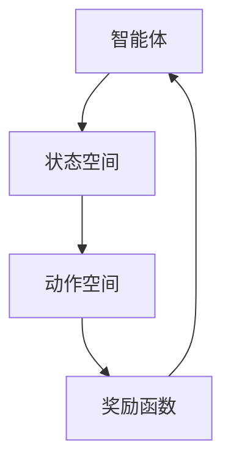
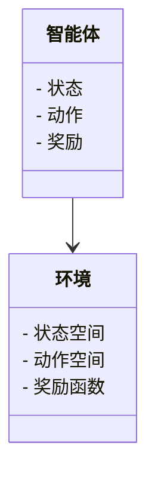
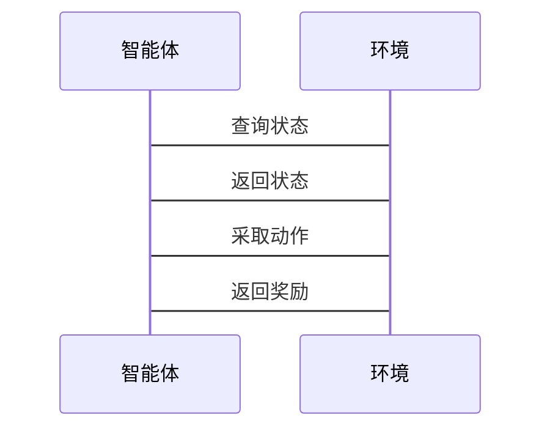

                 


# 多智能体在宏观经济分析中的应用

## 关键词：多智能体系统、宏观经济分析、人工智能、经济模型、算法、系统架构

## 摘要：本文探讨了多智能体系统（Multi-Agent Systems, MAS）在宏观经济分析中的应用。通过分析宏观经济分析的复杂性，介绍了多智能体系统的核心概念、算法原理、数学模型以及在经济预测、政策模拟等领域的实际应用。文章结合具体案例，详细讲解了多智能体系统的实现过程，包括系统架构设计、算法实现、数学公式推导等，并展望了未来的发展方向。

---

## 第1章: 多智能体系统与宏观经济分析概述

### 1.1 多智能体系统的基本概念
#### 1.1.1 多智能体系统的定义
多智能体系统（MAS）是由多个具有自主性、反应性、社会性的智能体组成的分布式系统。这些智能体能够通过通信和协作完成复杂的任务。

#### 1.1.2 多智能体系统的特征
- **自主性**：智能体能够自主决策。
- **反应性**：智能体能够感知环境并实时响应。
- **社会性**：智能体之间可以通过通信协作。
- **分布性**：系统由多个智能体组成，不存在中心控制节点。

#### 1.1.3 多智能体系统与传统经济模型的区别
传统经济模型通常基于假设和简化，而多智能体系统能够模拟复杂的个体行为和交互，更接近现实经济系统。

### 1.2 宏观经济分析的基本概念
#### 1.2.1 宏观经济分析的定义
宏观经济分析是研究整体经济系统的运行规律，包括GDP、失业率、通胀率等宏观指标。

#### 1.2.2 宏观经济分析的主要内容
- 经济预测
- 经济政策模拟
- 经济系统优化

#### 1.2.3 宏观经济分析的常用方法
- 统计分析
- 微观基础构建
- 数学建模

### 1.3 多智能体系统在宏观经济分析中的应用背景
#### 1.3.1 宏观经济分析的复杂性
经济系统涉及众多个体行为，具有非线性、动态性和不确定性。

#### 1.3.2 多智能体系统的优势
- 能够模拟个体行为
- 能够处理复杂的交互关系
- 能够进行实时模拟和预测

#### 1.3.3 多智能体系统在宏观经济分析中的应用案例
- 经济政策模拟
- 市场供需预测
- 经济波动分析

## 第2章: 多智能体系统的核心概念与联系

### 2.1 多智能体系统的原理
#### 2.1.1 多智能体系统的组成要素
- 智能体
- 环境
- 通信机制
- 协作机制

#### 2.1.2 多智能体系统的通信机制
- 消息传递
- 事件驱动
- 黑板机制

#### 2.1.3 多智能体系统的协作机制
- 协作协议
- 协作策略
- 协作任务分配

### 2.2 多智能体系统的数学模型
#### 2.2.1 多智能体系统的状态表示
状态空间可以表示为一个向量，每个维度对应一个状态变量。

#### 2.2.2 多智能体系统的动作选择
智能体的动作选择可以通过策略函数表示：$$ a = \pi(s) $$

#### 2.2.3 多智能体系统的奖励机制
奖励函数用于衡量智能体的行为是否符合目标：$$ r = f(a, s) $$

### 2.3 多智能体系统与宏观经济分析的联系
#### 2.3.1 多智能体系统在宏观经济建模中的应用
- 模拟个体行为
- 构建微观基础

#### 2.3.2 多智能体系统在经济政策模拟中的作用
- 政策效果评估
- 政策敏感性分析

#### 2.3.3 多智能体系统在经济预测中的优势
- 能够模拟非线性关系
- 能够处理复杂交互

---

## 第3章: 多智能体系统的算法原理

### 3.1 多智能体系统的算法概述
#### 3.1.1 多智能体系统的分类
- 基于博弈论的算法
- 基于强化学习的算法
- 基于分布式计算的算法

#### 3.1.2 多智能体系统的算法特点
- 分布式计算
- 协作性
- 实时性

### 3.2 多智能体系统的具体算法
#### 3.2.1 基于Q-learning的多智能体算法


代码实现：
```python
import numpy as np

class QLearning:
    def __init__(self, state_space, action_space):
        self.state_space = state_space
        self.action_space = action_space
        self.q_table = np.zeros((state_space, action_space))

    def choose_action(self, state):
        return np.argmax(self.q_table[state])

    def update_q_table(self, state, action, reward):
        self.q_table[state][action] += reward
```

#### 3.2.2 基于博弈论的多智能体算法
博弈论算法通过纳什均衡来寻找最优策略。

#### 3.2.3 基于强化学习的多智能体算法
强化学习算法通过智能体与环境的交互来优化策略。

### 3.3 多智能体系统算法的宏观经济应用
#### 3.3.1 经济政策模拟中的算法应用
- 模拟不同政策的效果
- 评估政策的敏感性

#### 3.3.2 经济预测中的算法应用
- 预测经济指标的变化
- 分析经济波动的原因

#### 3.3.3 经济优化中的算法应用
- 优化资源配置
- 优化经济政策

## 第4章: 多智能体系统的数学模型与公式

### 4.1 多智能体系统的状态空间
状态空间可以表示为一个向量，每个维度对应一个状态变量。

### 4.2 多智能体系统的动作空间
动作空间可以表示为一个向量，每个维度对应一个动作变量。

### 4.3 多智能体系统的奖励函数
奖励函数用于衡量智能体的行为是否符合目标：$$ r = f(a, s) $$

### 4.4 多智能体系统的转移概率
转移概率表示智能体在状态s下采取动作a后转移到状态s'的概率：$$ P(s' | s, a) $$

---

## 第5章: 多智能体系统的系统分析与架构设计

### 5.1 系统功能设计


### 5.2 系统架构设计


### 5.3 系统交互设计


---

## 第6章: 多智能体系统的项目实战

### 6.1 环境安装
安装必要的依赖：
```bash
pip install numpy matplotlib
```

### 6.2 核心代码实现
```python
import numpy as np
import matplotlib.pyplot as plt

class MultiAgentSystem:
    def __init__(self, num_agents):
        self.num_agents = num_agents
        self.states = np.random.randn(num_agents)
        self.actions = np.random.randn(num_agents)

    def update_states(self):
        self.states = self.states + self.actions

    def plot_states(self):
        plt.plot(self.states)
        plt.show()

if __name__ == "__main__":
    mas = MultiAgentSystem(10)
    mas.update_states()
    mas.plot_states()
```

### 6.3 代码解读与分析
- 初始化智能体数量
- 初始化状态和动作
- 更新状态
- 可视化结果

### 6.4 实际案例分析
模拟经济政策对市场供需的影响：
```python
class EconomicPolicy:
    def __init__(self, agents):
        self.agents = agents

    def apply_policy(self, policy):
        for agent in self.agents:
            agent.update_policy(policy)

# 示例
agents = [Agent() for _ in range(10)]
policy = EconomicPolicy(agents)
policy.apply_policy(new_policy)
```

### 6.5 结果解读与优化
通过模拟结果分析政策效果，优化经济模型。

---

## 第7章: 总结与展望

### 7.1 本章小结
本文详细介绍了多智能体系统在宏观经济分析中的应用，包括核心概念、算法原理、数学模型以及实际案例。

### 7.2 未来展望
- 更加复杂的经济模型
- 更高效的算法优化
- 更广泛的应用场景

---

## 最佳实践 tips

- 在进行宏观经济分析时，建议结合多智能体系统进行模拟。
- 在选择算法时，需要根据具体问题选择合适的方法。
- 在实现系统时，要注意智能体之间的通信和协作机制。

---

## 作者：AI天才研究院 & 禅与计算机程序设计艺术

--- 

希望这篇文章能够帮助读者深入了解多智能体系统在宏观经济分析中的应用，并为实际应用提供参考。

