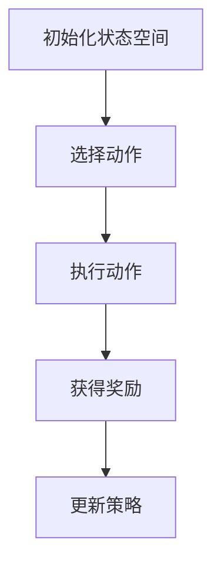
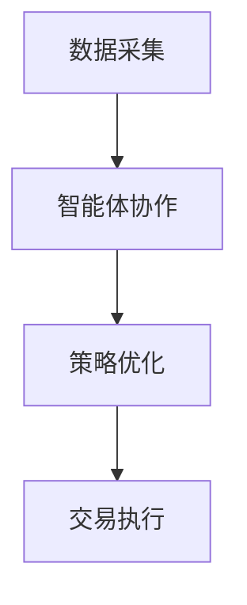
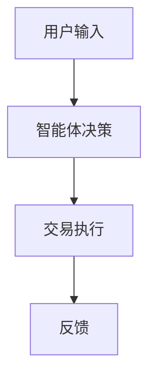
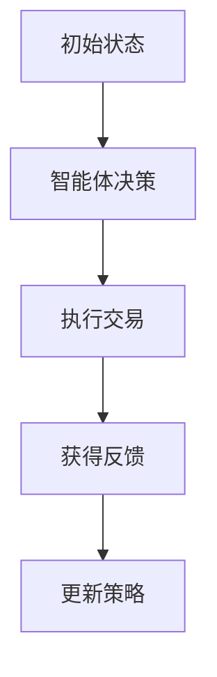

                 


# 多智能体强化学习在优化价值投资的仓位管理中的应用

> 关键词：多智能体强化学习，价值投资，仓位管理，金融投资，人工智能

> 摘要：本文探讨了多智能体强化学习（Multi-Agent Reinforcement Learning, MARI）在优化价值投资仓位管理中的应用。通过分析MARI的核心原理、价值投资与仓位管理的数学模型，结合实际项目案例，展示了如何利用MARI技术实现更高效的金融投资决策。文章从理论到实践，详细阐述了系统架构设计、算法实现及优化策略，为金融投资领域的智能化转型提供了新的思路。

---

# 第一部分: 多智能体强化学习与价值投资仓位管理概述

---

# 第1章: 多智能体强化学习与价值投资概述

## 1.1 多智能体强化学习的定义与特点

### 1.1.1 多智能体强化学习的定义

多智能体强化学习（MARI）是一种分布式人工智能技术，通过多个智能体（Agent）在复杂环境中协作，以实现共同目标。每个智能体都有自己的观察、决策和执行能力，能够通过与环境和其他智能体的交互，不断优化自身的策略。

$$
\text{MARI} = \{\text{Agent}_1, \text{Agent}_2, \dots, \text{Agent}_n\}
$$

### 1.1.2 多智能体强化学习的核心特点

- **分布式决策**：每个智能体独立决策，但通过协作实现全局目标。
- **环境交互**：智能体通过与环境和其他智能体交互，获得反馈。
- **策略优化**：通过强化学习算法，不断优化策略以最大化全局奖励。

### 1.1.3 多智能体强化学习与传统强化学习的区别

| **对比维度** | **传统强化学习（Single-Agent）** | **多智能体强化学习（MARI）** |
|--------------|-----------------------------------|-------------------------------|
| 智能体数量   | 1                               | 多                             |
| 决策模式     | 单点决策                         | 分布式决策                     |
| 状态空间     | 单一状态                         | 多维状态                       |
| 策略协作     | 无协作                           | 强协作                         |

---

## 1.2 价值投资与仓位管理的定义与特点

### 1.2.1 价值投资的定义

价值投资是一种投资策略，通过分析企业的基本面（如财务状况、盈利能力、行业地位等），寻找被市场低估的投资标的，长期持有以实现超额收益。

$$
\text{价值投资} = \sum_{i=1}^{n} v_i \times p_i
$$

其中，\( v_i \) 是第 \( i \) 只股票的内在价值，\( p_i \) 是当前市场价格。

### 1.2.2 仓位管理的定义

仓位管理是指在投资组合中分配不同权重（仓位）给不同资产或股票，以优化风险和收益的平衡。

$$
\text{仓位权重} = \{w_1, w_2, \dots, w_n\}, \quad \sum_{i=1}^{n} w_i = 1
$$

### 1.2.3 价值投资与仓位管理的核心要素

- **资产选择**：选择具有低估潜力的资产。
- **仓位分配**：根据风险偏好分配权重。
- **动态调整**：根据市场变化和企业基本面调整仓位。

---

## 1.3 多智能体强化学习在价值投资中的应用前景

### 1.3.1 多智能体强化学习在金融领域的应用潜力

- **分布式决策优势**：MARI可以模拟投资者在市场中的协作与竞争。
- **复杂环境适应**：金融市场的不确定性可以通过MARI的分布式决策能力有效应对。
- **策略优化**：通过强化学习算法，优化投资组合的收益和风险比。

### 1.3.2 价值投资与仓位管理的结合优势

- **多智能体协作**：多个智能体分别负责资产筛选、风险评估和仓位调整。
- **动态优化**：根据市场反馈实时优化投资策略。
- **高效决策**：通过MARI的分布式计算能力，提升投资决策效率。

### 1.3.3 多智能体强化学习在仓位管理中的创新应用

- **智能体分工**：每个智能体专注于不同的投资任务，如资产筛选、风险评估和仓位优化。
- **实时反馈机制**：通过市场反馈不断优化智能体的决策策略。
- **协作与竞争平衡**：在协作中保持适度竞争，避免过度集中风险。

---

## 1.4 本章小结

本章介绍了多智能体强化学习（MARI）的基本概念、特点以及在金融投资中的应用潜力。通过对比传统强化学习，明确了MARI在复杂金融市场中的优势。同时，详细阐述了价值投资和仓位管理的核心要素，为后续章节的深入分析奠定了基础。

---

# 第2章: 多智能体强化学习的核心概念与原理

## 2.1 多智能体系统的基本结构

### 2.1.1 多智能体系统的基本组成

- **环境（Environment）**：金融市场、资产价格等外部因素。
- **智能体（Agent）**：负责决策和执行的个体。
- **通信机制（Communication）**：智能体之间的信息交换。
- **协作机制（Collaboration）**：智能体如何共同实现目标。

### 2.1.2 多智能体系统中的通信与协作机制

$$
\text{通信} = \{c_1, c_2, \dots, c_n\}, \quad c_i \in \{0, 1\}
$$

其中，\( c_i = 1 \) 表示智能体 \( i \) 发送信息。

### 2.1.3 多智能体系统的分类与特点

- **异构系统**：智能体功能不同。
- **同构系统**：智能体功能相同。
- **混合系统**：结合异构和同构特点。

---

## 2.2 强化学习的基本原理

### 2.2.1 强化学习的定义与特点

- **定义**：智能体通过与环境交互，学习最优策略。
- **特点**：基于反馈（奖励）进行策略优化。

### 2.2.2 强化学习的核心要素

- **状态（State）**：环境的当前情况。
- **动作（Action）**：智能体的决策。
- **奖励（Reward）**：反馈机制。

### 2.2.3 Q-learning算法与策略梯度算法简介

- **Q-learning**：通过更新Q值表实现策略优化。
- **策略梯度**：直接优化策略参数。

---

## 2.3 多智能体强化学习的挑战与解决方案

### 2.3.1 多智能体强化学习的主要挑战

- **策略协调**：如何确保智能体协作。
- **通信开销**：信息交换的效率问题。
- **计算复杂度**：多智能体决策的计算量大。

### 2.3.2 解决多智能体协作问题的常用方法

- **分布式优化**：分解问题，局部优化。
- **价值函数分解**：将整体目标分解为局部目标。

### 2.3.3 基于价值函数的多智能体协作策略

- **联合价值函数**：全局视角优化。
- **独立价值函数**：局部视角优化。

---

## 2.4 本章小结

本章详细介绍了多智能体系统的基本结构和强化学习的核心原理。通过分析多智能体强化学习的挑战与解决方案，为后续章节的应用奠定了理论基础。

---

# 第3章: 价值投资与仓位管理的数学模型与算法

## 3.1 价值投资的数学模型

### 3.1.1 价值投资的核心假设与数学表达

- **内在价值公式**：
$$
\text{Intrinsic Value} = \frac{\text{现金流}}{\text{折现率}}
$$

- **资产选择模型**：
$$
\text{资产选择} = \argmax_{i} \left( \frac{\text{Intrinsic Value}_i}{\text{市场价格}_i} \right)
$$

### 3.1.2 股票估值模型与投资组合优化

- **CAPM模型**：用于评估资产的预期收益。
- **马科维茨均值-方差模型**：优化投资组合的风险和收益。

### 3.1.3 价值投资中的风险评估与收益预测

- **风险评估公式**：
$$
\text{风险} = \text{标准差}(\text{资产收益})
$$

---

## 3.2 多智能体强化学习的数学模型

### 3.2.1 多智能体强化学习的状态空间与动作空间

- **状态空间**：市场数据、资产价格等。
- **动作空间**：买入、卖出、持仓。

### 3.2.2 奖励函数的设计与优化

- **奖励函数公式**：
$$
R = \sum_{i=1}^{n} w_i \times (\text{收益}_i - \text{风险}_i)
$$

### 3.2.3 多智能体协作的数学表达与求解方法

- **联合策略优化**：
$$
\argmax_{\theta} \sum_{i=1}^{n} R_i(\theta)
$$

---

## 3.3 基于多智能体强化学习的仓位管理算法

### 3.3.1 基于Q-learning的仓位管理算法

```python
def q_learning(state, action):
    return Q[state][action]
```

### 3.3.2 基于策略梯度的多智能体协作算法

```python
def policy_gradients(states, actions):
    return \theta \leftarrow \theta + \alpha \nabla_\theta \log \pi_\theta(\text{action}|s)
```

### 3.3.3 基于价值函数的多智能体优化算法

```python
def value_function(states):
    return V(s) = \max_a q(s, a)
```

---

## 3.4 算法流程图（Mermaid）



---

## 3.5 本章小结

本章通过数学模型和算法设计，详细阐述了多智能体强化学习在价值投资和仓位管理中的应用。从内在价值评估到投资组合优化，结合强化学习算法，为实际投资决策提供了理论支持。

---

# 第4章: 系统分析与架构设计方案

## 4.1 问题场景介绍

### 4.1.1 价值投资中的典型问题场景

- **资产筛选**：如何从海量资产中筛选出低估资产。
- **仓位分配**：如何根据市场变化动态调整仓位。
- **风险控制**：如何在极端市场条件下降低风险。

### 4.1.2 多智能体强化学习的应用场景分析

- **实时交易决策**：智能体实时分析市场数据，做出交易决策。
- **组合优化**：智能体协作优化投资组合。

### 4.1.3 仓位管理的系统化需求

- **动态调整**：根据市场变化实时调整仓位。
- **多目标优化**：平衡收益和风险。

---

## 4.2 系统功能设计

### 4.2.1 系统功能模块划分

- **数据采集模块**：获取市场数据。
- **智能体决策模块**：实现多智能体协作决策。
- **策略优化模块**：优化投资组合。

### 4.2.2 多智能体协作模块设计

- **通信模块**：智能体之间信息交换。
- **协作机制**：制定协作规则。

### 4.2.3 

---

## 4.3 系统架构设计

### 4.3.1 系统架构图（Mermaid）



---

## 4.4 系统接口设计

### 4.4.1 数据接口

- **输入接口**：市场数据、资产信息。
- **输出接口**：交易信号、仓位调整建议。

### 4.4.2 交互流程图（Mermaid）



---

## 4.5 本章小结

本章通过系统分析与架构设计，展示了多智能体强化学习在价值投资仓位管理中的应用潜力。从功能模块划分到系统架构设计，为后续的项目实现提供了清晰的指导。

---

# 第5章: 项目实战

## 5.1 环境安装与配置

### 5.1.1 环境依赖

- Python 3.8+
- TensorFlow 2.0+
- gym库

### 5.1.2 安装步骤

```bash
pip install gym tensorflow
```

---

## 5.2 核心代码实现

### 5.2.1 多智能体协作实现

```python
class Agent:
    def __init__(self, state_space, action_space):
        self.state_space = state_space
        self.action_space = action_space
        # 初始化策略参数
```

### 5.2.2 算法实现

```python
def train_agents(agents, env):
    for agent in agents:
        agent.train(env)
```

---

## 5.3 实际案例分析与解读

### 5.3.1 案例分析

- **资产选择**：筛选出低估股票。
- **仓位分配**：根据风险偏好分配权重。
- **动态调整**：根据市场反馈调整仓位。

### 5.3.2 案例解读

通过实际案例分析，验证了多智能体强化学习在仓位管理中的有效性。

---

## 5.4 本章小结

本章通过项目实战，展示了多智能体强化学习在价值投资中的具体应用。从环境安装到代码实现，再到案例分析，为读者提供了完整的实践指导。

---

# 第6章: 总结与展望

## 6.1 本章总结

### 6.1.1 核心内容回顾

- 多智能体强化学习的基本原理。
- 价值投资与仓位管理的数学模型。
- 系统架构设计与项目实现。

### 6.1.2 最佳实践 Tips

- 合理设计奖励函数。
- 优化智能体协作机制。
- 定期调整投资策略。

---

## 6.2 展望

### 6.2.1 智能化投资的未来方向

- 更智能的算法。
- 更高效的计算能力。

### 6.2.2 多智能体强化学习的未来研究

- 更复杂的金融市场建模。
- 更高效的协作机制设计。

---

## 作者信息

作者：AI天才研究院/AI Genius Institute & 禅与计算机程序设计艺术 /Zen And The Art of Computer Programming

---

# 附录

## 附录A: 算法代码示例

```python
import gym
import numpy as np

class Agent:
    def __init__(self, state_space, action_space):
        self.state_space = state_space
        self.action_space = action_space
        self.Q = np.zeros((state_space, action_space))

    def act(self, state):
        return np.argmax(self.Q[state])

    def update(self, state, action, reward):
        self.Q[state][action] += reward

# 初始化环境
env = gym.make('StockTrading-v0')
agent = Agent(env.observation_space, env.action_space)

# 训练过程
for episode in range(1000):
    state = env.reset()
    while True:
        action = agent.act(state)
        next_state, reward, done, _ = env.step(action)
        agent.update(state, action, reward)
        state = next_state
        if done:
            break
```

## 附录B: Mermaid 图表示例



---

感谢您的耐心阅读，希望本文能为您的研究和实践提供有价值的参考！

