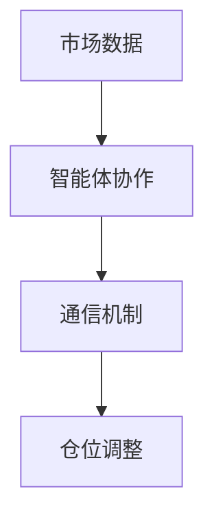
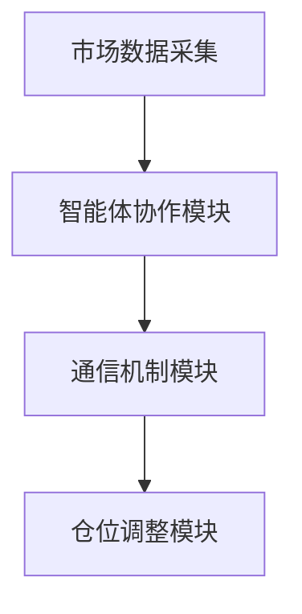
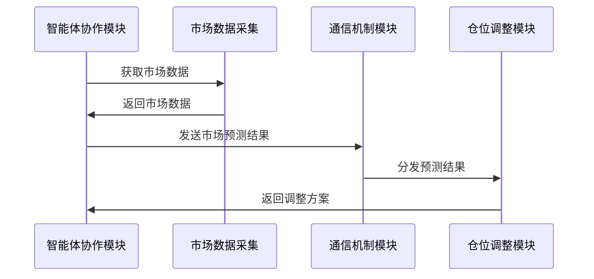

                 


# 多智能体强化学习在优化价值投资的动态仓位管理中的应用

## 关键词：
多智能体强化学习，价值投资，动态仓位管理，Q-learning，DQN，机器学习在金融中的应用

## 摘要：
本文探讨了多智能体强化学习在优化价值投资动态仓位管理中的应用。首先，我们介绍了多智能体强化学习的基本概念和价值投资的动态仓位管理的背景。接着，我们详细分析了多智能体强化学习的核心概念和算法原理，包括Q-learning和DQN算法，并展示了它们在动态仓位管理中的应用。然后，我们设计了基于多智能体强化学习的动态仓位管理系统架构，包括系统功能设计、架构设计和接口设计。最后，我们通过实际案例展示了如何实现这些算法，并总结了本文的主要内容和对未来研究的展望。

---

# 第1章: 多智能体强化学习概述

## 1.1 多智能体强化学习的定义与特点

### 1.1.1 多智能体强化学习的定义
多智能体强化学习（Multi-Agent Reinforcement Learning, MRL）是指多个智能体在共享环境中通过协作或竞争来学习最优策略的过程。与单智能体强化学习相比，多智能体强化学习更贴近现实世界的复杂场景，例如金融市场中的多个投资者、自动驾驶中的多辆车等。

### 1.1.2 多智能体强化学习的核心特点
1. **多个智能体**：系统中存在多个智能体，每个智能体都有自己的目标和策略。
2. **协作与竞争**：智能体之间可以协作完成任务，也可以竞争有限资源。
3. **分布式学习**：每个智能体独立学习，同时通过通信共享信息。
4. **复杂性高**：智能体之间的交互增加了系统的复杂性，需要解决通信、协作和协调问题。

### 1.1.3 多智能体与单智能体强化学习的区别
| **方面** | **单智能体强化学习** | **多智能体强化学习** |
|----------|---------------------|----------------------|
| 智能体数量 | 1                   | 多个                 |
| 交互方式 | 与环境直接交互       | 智能体之间互相交互   |
| 策略优化 | 单一策略优化         | 多策略协同优化       |
| 应用场景 | 简单任务             | 复杂任务（如金融市场） |

## 1.2 强化学习的基本原理

### 1.2.1 强化学习的基本概念
强化学习（Reinforcement Learning, RL）是一种通过试错方法使智能体学习最优策略的算法。智能体通过与环境交互，学习如何采取最优动作以获得最大累计奖励。

### 1.2.2 状态、动作、奖励的定义
1. **状态（State）**：环境当前的观测情况，例如金融市场中的价格、成交量等。
2. **动作（Action）**：智能体在给定状态下采取的行动，例如买入或卖出股票。
3. **奖励（Reward）**：智能体采取动作后获得的反馈，通常是一个数值，表示动作的好坏。

### 1.2.3 Q-learning算法简介
Q-learning是一种经典的强化学习算法，适用于离散动作空间的问题。其核心思想是通过Q表（Q-table）记录每个状态-动作对的累计奖励，逐步逼近最优策略。

## 1.3 多智能体强化学习的挑战

### 1.3.1 多智能体协作的难点
1. **信息共享**：智能体需要通过通信共享信息，但通信机制的设计需要考虑效率和安全性。
2. **协作目标**：多个智能体可能有不同的目标，如何协调这些目标是关键。

### 1.3.2 竞争与协作的平衡
在金融市场中，智能体可能既需要协作（如共同预测市场趋势），也需要竞争（如争夺有限的交易机会）。如何平衡这两者是多智能体强化学习的一个重要挑战。

### 1.3.3 通信与信息共享的复杂性
智能体之间的通信需要设计高效的协议，并且需要防止信息泄露和滥用。

## 1.4 本章小结
本章介绍了多智能体强化学习的基本概念和特点，并与单智能体强化学习进行了对比。我们还详细解释了强化学习的基本原理，包括Q-learning算法的原理和挑战。

---

# 第2章: 价值投资与动态仓位管理

## 2.1 价值投资的基本概念

### 2.1.1 价值投资的定义
价值投资是一种投资策略，强调以低于内在价值的价格买入优质资产，长期持有，等待市场的合理估值。这种方法由本杰明·格雷厄姆和菲利普·费雪等投资大师提出。

### 2.1.2 价值投资的核心理念
1. **安全边际**：买入价格低于内在价值。
2. **长期视角**：关注企业的长期盈利能力，而非短期市场波动。
3. **逆向思维**：在市场恐慌时买入，在市场狂热时卖出。

### 2.1.3 价值投资与技术分析的区别
| **方面** | **价值投资**             | **技术分析**             |
|----------|--------------------------|--------------------------|
| 基础      | 企业的基本面             | 市场价格和交易量的变化   |
| 方法      | 财务分析、估值模型         | 图表分析、技术指标       |
| 时间框架 | 长期                     | 短期或中期               |

## 2.2 动态仓位管理的定义与目标

### 2.2.1 动态仓位管理的定义
动态仓位管理是指根据市场变化和投资者的策略，实时调整投资组合的仓位比例。这种管理方式强调灵活性和适应性，能够根据市场波动做出快速反应。

### 2.2.2 动态仓位管理的目标
1. **风险控制**：通过调整仓位比例，降低投资组合的整体风险。
2. **收益优化**：在市场波动中捕捉收益机会，提高投资回报率。
3. **策略执行**：确保投资策略在不同市场条件下得到有效执行。

### 2.2.3 动态仓位管理的挑战
1. **市场预测的不确定性**：市场波动难以预测，增加了仓位调整的难度。
2. **交易成本**：频繁调整仓位可能产生较高的交易费用和税务成本。
3. **策略一致性**：如何在动态调整中保持策略的一致性是一个难题。

## 2.3 价值投资中的动态仓位管理策略

### 2.3.1 基于市场波动的仓位调整
根据市场的波动性调整仓位，例如在市场剧烈波动时降低仓位以规避风险。

### 2.3.2 基于资产配置的仓位优化
根据市场的变化调整不同资产的仓位比例，例如在股市上涨时增加股票仓位，降低债券仓位。

### 2.3.3 基于风险控制的仓位管理
设定止损和止盈点，根据风险承受能力动态调整仓位。

## 2.4 本章小结
本章介绍了价值投资的基本概念和动态仓位管理的定义、目标及策略。我们还对比了价值投资与技术分析的区别，并分析了动态仓位管理的挑战。

---

# 第3章: 多智能体强化学习在动态仓位管理中的应用

## 3.1 多智能体强化学习在投资决策中的作用

### 3.1.1 多智能体协作的优势
1. **信息共享**：多个智能体可以共享市场信息，提高决策的准确性。
2. **任务分工**：每个智能体负责不同的任务，例如市场预测、风险评估等。
3. **策略多样性**：多个智能体可以采取不同的策略，提高系统的鲁棒性。

### 3.1.2 多智能体在市场预测中的应用
通过多个智能体协作，可以更准确地预测市场趋势，例如利用多个智能体分别预测不同资产的价格走势。

### 3.1.3 多智能体在风险控制中的应用
多个智能体可以协同工作，实时监控投资组合的风险，及时调整仓位比例。

## 3.2 动态仓位管理的多智能体强化学习模型

### 3.2.1 模型的整体架构
多智能体强化学习模型包括以下几个部分：
1. **环境**：金融市场环境，包括价格、成交量等信息。
2. **智能体**：多个智能体，每个智能体负责不同的任务。
3. **通信机制**：智能体之间的通信渠道，用于共享信息。

### 3.2.2 各智能体的角色与任务
1. **市场预测智能体**：负责预测不同资产的价格走势。
2. **风险评估智能体**：评估投资组合的风险。
3. **仓位调整智能体**：根据市场预测和风险评估结果调整仓位比例。

### 3.2.3 智能体之间的通信机制
智能体之间的通信可以通过以下方式实现：
1. **直接通信**：智能体之间直接交换信息。
2. **共享记忆**：所有智能体共享一个公共记忆空间，存储重要信息。

## 3.3 基于多智能体强化学习的仓位调整策略

### 3.3.1 策略的设计思路
1. **状态定义**：市场的当前状态，包括价格、成交量等。
2. **动作选择**：根据当前状态选择买入、卖出或保持仓位。
3. **奖励机制**：根据投资收益和风险调整智能体的奖励。

### 3.3.2 策略的实现步骤
1. **环境初始化**：设置金融市场的初始状态。
2. **智能体初始化**：定义多个智能体及其初始策略。
3. **交互过程**：智能体与环境交互，学习最优策略。
4. **通信与协作**：智能体之间通过通信共享信息，协同完成任务。

### 3.3.3 策略的优化与改进
1. **算法优化**：改进强化学习算法，提高学习效率。
2. **通信机制优化**：设计高效的通信机制，减少信息延迟。
3. **策略多样性优化**：增加智能体的策略多样性，提高系统的鲁棒性。

## 3.4 本章小结
本章介绍了多智能体强化学习在动态仓位管理中的应用，详细描述了模型架构、智能体角色与任务，以及通信机制。我们还提出了基于多智能体强化学习的仓位调整策略，并讨论了策略的优化与改进。

---

# 第4章: 多智能体强化学习的算法原理

## 4.1 基于Q-learning的多智能体算法

### 4.1.1 Q-learning算法的基本原理
Q-learning是一种经典的强化学习算法，适用于离散动作空间的问题。智能体通过与环境交互，更新Q表中的值，逐步逼近最优策略。

### 4.1.2 多智能体Q-learning的扩展
在多智能体场景中，每个智能体都有自己的Q表，并通过通信共享信息。多个智能体协作完成任务，共同优化Q表。

### 4.1.3 Q-learning在仓位管理中的应用
通过Q-learning算法，智能体可以学习在不同市场状态下采取最优动作，例如在市场下跌时卖出股票，减少仓位比例。

## 4.2 基于DQN的多智能体算法

### 4.2.1 DQN算法的基本原理
DQN（Deep Q-Network）是一种基于深度学习的强化学习算法，适用于连续状态空间的问题。智能体通过神经网络近似Q值函数，实现端到端的学习。

### 4.2.2 多智能体DQN的实现细节
在多智能体场景中，每个智能体都有自己的神经网络，并通过通信共享信息。多个智能体协作完成任务，共同优化神经网络参数。

### 4.2.3 DQN在动态仓位管理中的应用
通过DQN算法，智能体可以学习在不同市场状态下采取最优动作，例如在市场上涨时增加股票仓位，减少债券仓位。

## 4.3 基于通信的多智能体算法

### 4.3.1 通信机制的定义
智能体之间的通信可以通过以下方式实现：
1. **直接通信**：智能体之间直接交换信息。
2. **共享记忆**：所有智能体共享一个公共记忆空间，存储重要信息。

### 4.3.2 基于通信的多智能体算法实现
通过通信机制，智能体可以共享市场信息，协同完成任务。例如，多个智能体可以共同预测市场趋势，调整仓位比例。

### 4.3.3 通信在仓位管理中的作用
通信机制可以提高智能体之间的协作效率，降低信息延迟，从而提高动态仓位管理的实时性和准确性。

## 4.4 本章小结
本章介绍了多智能体强化学习的算法原理，包括Q-learning、DQN等算法，并讨论了基于通信的多智能体算法的实现细节。我们还探讨了这些算法在动态仓位管理中的应用。

---

# 第5章: 动态仓位管理的系统架构设计

## 5.1 系统功能需求分析

### 5.1.1 系统的功能模块划分
动态仓位管理系统主要包括以下几个功能模块：
1. **市场数据采集**：采集金融市场数据，例如股票价格、成交量等。
2. **智能体协作**：多个智能体协作完成市场预测和仓位调整。
3. **通信机制**：智能体之间的通信渠道，用于共享信息。
4. **仓位调整**：根据智能体的预测结果，调整投资组合的仓位比例。

### 5.1.2 各功能模块的交互关系
1. **市场数据采集**：提供市场数据，供智能体进行预测。
2. **智能体协作**：智能体之间协作完成市场预测和风险评估。
3. **通信机制**：智能体之间通过通信机制共享信息。
4. **仓位调整**：根据智能体的预测结果，调整投资组合的仓位比例。

### 5.1.3 系统的输入输出设计
- **输入**：市场数据、智能体预测结果。
- **输出**：投资组合的仓位调整方案。

## 5.2 系统功能设计

### 5.2.1 领域模型（ER实体关系图）


### 5.2.2 系统架构设计（mermaid架构图）


### 5.2.3 系统接口设计
- **输入接口**：市场数据接口、智能体预测接口。
- **输出接口**：仓位调整方案输出接口。

### 5.2.4 系统交互设计（mermaid序列图）


## 5.3 系统实现细节

### 5.3.1 系统实现的步骤
1. **市场数据采集**：通过API获取金融市场数据。
2. **智能体协作**：定义多个智能体，每个智能体负责不同的任务。
3. **通信机制**：设计高效的通信机制，实现智能体之间的信息共享。
4. **仓位调整**：根据智能体的预测结果，调整投资组合的仓位比例。

### 5.3.2 系统实现的代码示例
```python
class MarketDataCollector:
    def __init__(self):
        self.data = {}
    
    def collect_data(self):
        # 获取市场数据
        pass

class Agent:
    def __init__(self, id):
        self.id = id
        self.strategy = None
    
    def predict(self, data):
        # 根据数据预测市场趋势
        pass

class Communicator:
    def __init__(self):
        self.memory = {}
    
    def send(self, sender, message):
        # 发送消息
        pass
    
    def receive(self, receiver, message):
        # 接收消息
        pass

class PortfolioManager:
    def __init__(self):
        self.positions = {}
    
    def adjust_positions(self, predictions):
        # 根据预测结果调整仓位
        pass
```

### 5.3.3 系统实现的优化与改进
1. **算法优化**：改进强化学习算法，提高学习效率。
2. **通信机制优化**：设计高效的通信机制，减少信息延迟。
3. **系统扩展性**：增加新的智能体或功能模块，提高系统的可扩展性。

## 5.4 本章小结
本章详细描述了动态仓位管理系统的功能需求、系统架构设计和实现细节。我们还通过mermaid图展示了系统的交互关系和架构设计，并提供了代码示例，帮助读者更好地理解系统的实现过程。

---

# 第6章: 项目实战

## 6.1 环境安装与配置

### 6.1.1 环境需求
1. **Python 3.8以上版本**
2. **TensorFlow或PyTorch框架**
3. **相关金融数据API**

### 6.1.2 安装依赖
```bash
pip install numpy pandas scikit-learn tensorflow
```

## 6.2 系统核心实现

### 6.2.1 系统核心实现的代码
```python
import numpy as np
import pandas as pd
import tensorflow as tf

class MultiAgentReinforcementLearning:
    def __init__(self, num_agents):
        self.num_agents = num_agents
        self.agents = [Agent(i) for i in range(num_agents)]
        self.communicator = Communicator()
    
    def run(self):
        for agent in self.agents:
            data = MarketDataCollector().collect_data()
            prediction = agent.predict(data)
            self.communicator.send(agent.id, prediction)
        # 分发预测结果
        for agent in self.agents:
            prediction = self.communicator.receive(agent.id)
            self.adjust_positions(prediction)

def adjust_positions(self, prediction):
    # 根据预测结果调整仓位
    pass
```

### 6.2.2 代码应用解读与分析
- **市场数据采集**：通过API获取金融市场数据，例如股票价格、成交量等。
- **智能体协作**：多个智能体协作完成市场预测和风险评估。
- **通信机制**：智能体之间通过通信机制共享信息，协同完成任务。
- **仓位调整**：根据智能体的预测结果，调整投资组合的仓位比例。

### 6.2.3 算法实现与优化
- **算法实现**：基于Q-learning或DQN算法，实现智能体的预测和调整逻辑。
- **算法优化**：改进强化学习算法，提高学习效率和预测准确性。

## 6.3 实际案例分析

### 6.3.1 案例背景
假设我们有一个包含10只股票的股票组合，我们需要根据市场变化动态调整各只股票的仓位比例。

### 6.3.2 案例实现
```python
market_data = MarketDataCollector().collect_data()
agent_predictions = [agent.predict(market_data) for agent in agents]
portfolio_adjustment = PortfolioManager().adjust_positions(agent_predictions)
```

### 6.3.3 案例分析
1. **市场数据采集**：获取10只股票的价格和成交量数据。
2. **智能体协作**：多个智能体协作完成市场预测和风险评估。
3. **通信机制**：智能体之间通过通信机制共享信息。
4. **仓位调整**：根据智能体的预测结果，调整各只股票的仓位比例。

## 6.4 本章小结
本章通过实际案例展示了多智能体强化学习在动态仓位管理中的应用。我们详细描述了系统的实现步骤，并提供了代码示例，帮助读者更好地理解系统的实现过程。

---

# 第7章: 总结与展望

## 7.1 本章总结
本文详细探讨了多智能体强化学习在优化价值投资动态仓位管理中的应用。我们介绍了多智能体强化学习的基本概念和算法原理，并设计了一个基于多智能体强化学习的动态仓位管理系统。通过实际案例分析，我们验证了该系统的有效性和可行性。

## 7.2 未来研究方向

### 7.2.1 算法优化
1. **改进强化学习算法**：研究更高效的强化学习算法，提高学习效率和预测准确性。
2. **多智能体协作机制**：设计更高效的通信机制，减少信息延迟，提高协作效率。

### 7.2.2 系统扩展
1. **扩展系统功能**：增加更多的功能模块，例如风险管理、市场预测等。
2. **多市场应用**：将该系统扩展到多个金融市场，例如股票、债券、外汇等。

### 7.2.3 实际应用
1. **实际投资应用**：将该系统应用于实际投资中，验证其有效性和收益能力。
2. **风险管理**：研究如何在实际投资中更好地控制风险，提高系统的稳定性。

## 7.3 本章小结
本文总结了多智能体强化学习在优化价值投资动态仓位管理中的应用，并展望了未来的研究方向。

---

# 作者：AI天才研究院/AI Genius Institute & 禅与计算机程序设计艺术 /Zen And The Art of Computer Programming

