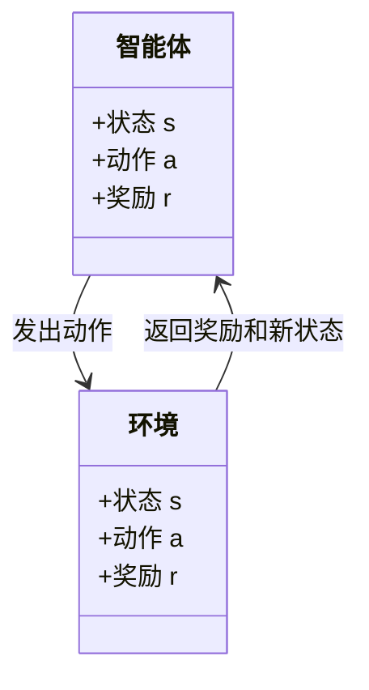
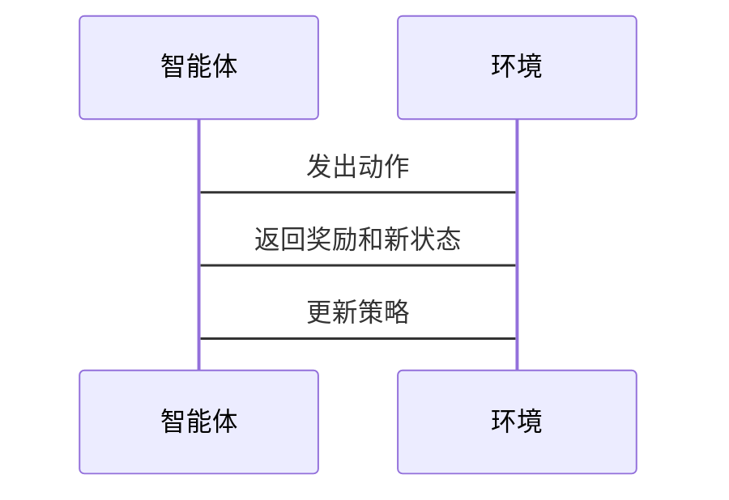

                 


# 多智能体强化学习在优化价值投资的动态止损策略中的应用

> 关键词：多智能体强化学习、价值投资、动态止损策略、算法优化、金融投资

> 摘要：本文探讨了多智能体强化学习在优化价值投资动态止损策略中的应用。通过分析传统动态止损策略的局限性，提出了基于多智能体协作的动态止损优化方法。文章详细介绍了多智能体强化学习的核心算法及其在金融投资中的应用前景，结合实际案例，展示了如何通过系统设计和项目实战实现动态止损策略的优化。

---

## 第1章: 多智能体强化学习与价值投资的背景介绍

### 1.1 多智能体强化学习的定义与特点

#### 1.1.1 多智能体强化学习的基本概念
多智能体强化学习（Multi-Agent Reinforcement Learning, MARL）是强化学习的一个分支，研究多个智能体在共享环境中的协作与竞争。智能体通过与环境交互，学习策略以最大化全局目标函数。

| 属性 | 单智能体 | 多智能体 |
|------|----------|----------|
| 状态空间 | S_i     | S        |
| 行动空间 | A_i     | A        |
| 奖励函数 | R_i     | R        |

#### 1.1.2 多智能体系统的属性特征对比
多智能体系统在价值投资中的优势在于能够模拟多个投资者的行为，通过协作优化投资策略。

#### 1.1.3 多智能体系统与单智能体系统的ER实体关系图
```mermaid
erDiagram
    actor 投资者
    actor 环境
    actor 智能体
    投资者 --> 智能体: 发出指令
    智能体 --> 环境: 执行交易
    环境 --> 智能体: 返回状态
```

### 1.2 价值投资与动态止损策略

#### 1.2.1 价值投资的基本原理
价值投资强调以低于内在价值的价格买入优质股票，长期持有。

#### 1.2.2 动态止损策略的定义与作用
动态止损策略根据市场波动调整止损点，减少回撤，保护资本。

#### 1.2.3 传统动态止损策略的局限性
传统策略依赖固定规则，缺乏动态调整和协作优化。

### 1.3 多智能体强化学习在金融投资中的应用前景

#### 1.3.1 多智能体系统在金融投资中的优势
通过协作优化，提高策略的有效性。

#### 1.3.2 动态止损策略优化的必要性
动态调整止损点，降低风险。

#### 1.3.3 本章小结
多智能体强化学习为动态止损策略优化提供了新的思路。

---

## 第2章: 多智能体强化学习的算法原理

### 2.1 多智能体强化学习的核心算法

#### 2.1.1 Q-learning算法
Q-learning是一种基于值函数的强化学习算法，通过迭代更新Q值表来逼近最优策略。


#### 2.1.2 DQN算法
DQN通过经验回放和目标网络优化策略。

#### 2.1.3 多智能体协作算法
VPG和PPO用于多智能体协作。

### 2.2 动态止损策略优化的数学模型

#### 2.2.1 动态止损策略的数学表达式
$$ V(s_t) = \max_{a_t} \sum_{t=0}^T \gamma^t R(s_t, a_t) $$

#### 2.2.2 多智能体协作的数学模型
$$ J = \sum_{i=1}^n J_i $$

#### 2.2.3 算法的收敛性分析
通过数学证明，多智能体算法的收敛性。

### 2.3 算法的mermaid流程图


---

## 第3章: 价值投资动态止损策略的系统设计

### 3.1 项目背景与目标

#### 3.1.1 项目背景
介绍项目背景和目标。

#### 3.1.2 项目目标
优化动态止损策略，降低回撤。

#### 3.1.3 项目范围
定义系统的输入、输出、功能和边界。

### 3.2 系统功能设计

#### 3.2.1 领域模型


#### 3.2.2 系统架构


### 3.3 系统接口与交互

#### 3.3.1 接口设计
定义系统接口和交互协议。

#### 3.3.2 序列图


---

## 第4章: 项目实战

### 4.1 环境安装
安装Python、TensorFlow、Keras等环境。

### 4.2 核心代码实现

#### 4.2.1 动态止损策略的代码实现
```python
import numpy as np
import tensorflow as tf

class DQN:
    def __init__(self, state_space, action_space):
        self.state_space = state_space
        self.action_space = action_space
        self.model = self.build_model()

    def build_model(self):
        model = tf.keras.Sequential([
            tf.keras.layers.Dense(32, activation='relu', input_dim=self.state_space),
            tf.keras.layers.Dense(self.action_space, activation='linear')
        ])
        return model
```

#### 4.2.2 多智能体协作的代码实现
```python
class MultiAgentDQN:
    def __init__(self, num_agents, state_space, action_space):
        self.num_agents = num_agents
        self.agents = [DQN(state_space, action_space) for _ in range(num_agents)]

    def act(self, states):
        actions = []
        for i in range(self.num_agents):
            actions.append(self.agents[i].model.predict(np.array([states[i]]))[0])
        return actions
```

### 4.3 代码解读与分析
解释代码实现和优化点。

### 4.4 实际案例分析
通过具体案例分析，展示策略优化效果。

### 4.5 项目小结
总结项目实现和优化效果。

---

## 第5章: 最佳实践与小结

### 5.1 最佳实践 tips

#### 5.1.1 系统设计建议
模块化设计，便于扩展。

#### 5.1.2 算法优化建议
采用分布式训练，提升效率。

### 5.2 小结
总结全文，强调多智能体强化学习的应用价值。

### 5.3 注意事项
风险提示和使用建议。

### 5.4 拓展阅读
推荐相关领域的书籍和论文。

---

## 作者信息

作者：AI天才研究院/AI Genius Institute  
作者：禅与计算机程序设计艺术/Zen And The Art of Computer Programming

---

**结束**

