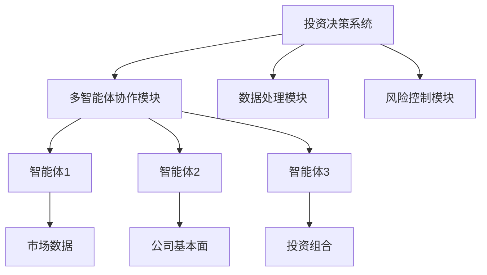
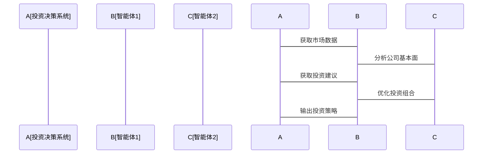

                 


# 多智能体强化学习在优化价值投资的择时策略中的应用

> 关键词：多智能体强化学习，价值投资，择时策略，金融投资，人工智能

> 摘要：本文探讨了多智能体强化学习在优化价值投资的择时策略中的应用，通过分析多智能体系统的协作与竞争机制，结合强化学习算法的优化能力，提出了一种新的投资决策模型。文章从背景介绍、核心概念、算法原理、系统架构到项目实战，详细阐述了如何利用多智能体强化学习技术优化价值投资策略，最后通过实际案例验证了模型的有效性。

---

# 第一部分: 多智能体强化学习与价值投资的背景与基础

## 第1章: 多智能体强化学习概述

### 1.1 多智能体强化学习的定义与特点
#### 1.1.1 多智能体系统的定义
多智能体系统（Multi-Agent System, MAS）是由多个相互作用的智能体组成的系统，这些智能体通过协作或竞争完成特定目标。每个智能体都有自己的目标和决策机制，能够感知环境并采取行动。

#### 1.1.2 强化学习的基本原理
强化学习（Reinforcement Learning, RL）是一种机器学习方法，通过智能体与环境的交互，学习最优策略以最大化累积奖励。智能体通过试错的方式，逐步优化其决策策略。

#### 1.1.3 多智能体强化学习的独特优势
- **分布式决策**：多个智能体可以独立决策，提高系统的灵活性和鲁棒性。
- **协作与竞争**：智能体之间的协作和竞争可以模拟复杂的市场环境，提升模型的泛化能力。
- **多目标优化**：多个智能体可以分别关注不同的目标，形成互补的决策策略。

### 1.2 多智能体强化学习的核心概念
#### 1.2.1 状态、动作与奖励的定义
- **状态（State）**：智能体所处环境的描述，例如当前的市场数据和资产组合。
- **动作（Action）**：智能体在给定状态下采取的行动，例如买入或卖出某只股票。
- **奖励（Reward）**：智能体采取行动后获得的反馈，通常以收益或损失的形式表示。

#### 1.2.2 多智能体之间的协作与竞争
- **协作**：多个智能体通过合作实现共同目标，例如共同优化投资组合的风险和收益。
- **竞争**：智能体之间存在竞争关系，例如在市场中争夺资源或利润。

#### 1.2.3 联合策略与价值函数的分解
- **联合策略**：多个智能体的策略组合形成的总体决策策略。
- **价值函数分解**：将整体价值函数分解为各个智能体的贡献，便于优化和训练。

### 1.3 价值投资与择时策略的背景
#### 1.3.1 价值投资的基本原理
价值投资是一种投资策略，旨在通过分析公司的基本面，寻找被市场低估的股票进行投资。其核心在于寻找具有长期竞争优势和合理估值的公司。

#### 1.3.2 择时策略的重要性
择时策略是指在适当的时间点买入或卖出资产，以最大化收益或最小化损失。在金融市场上，准确的择时策略可以显著提升投资收益。

#### 1.3.3 传统择时方法的局限性
传统的择时方法依赖于技术分析和历史数据，但其预测能力有限，尤其是在市场剧烈波动的情况下。此外，传统方法难以处理多智能体协作的复杂性。

---

## 第2章: 多智能体强化学习在金融中的应用

### 2.1 金融市场的复杂性与不确定性
#### 2.1.1 金融市场的动态特征
金融市场是一个高度动态和不确定的环境，价格波动频繁，市场参与者的决策相互影响。

#### 2.1.2 市场参与者的博弈关系
市场参与者（如机构投资者、个人投资者）之间存在复杂的博弈关系，这使得市场行为难以预测。

#### 2.1.3 多智能体模型的适用性
多智能体模型能够模拟市场参与者的决策过程，通过协作与竞争机制，较好地捕捉市场的复杂性。

### 2.2 多智能体强化学习在投资决策中的应用
#### 2.2.1 多智能体模型在股票选择中的应用
通过多智能体协作，分别关注不同的市场指标（如市盈率、市净率等），综合评估股票的价值，优化投资组合。

#### 2.2.2 多智能体模型在风险控制中的应用
智能体之间协作，实时监控市场风险，动态调整投资组合，降低整体风险敞口。

#### 2.2.3 多智能体模型在组合管理中的应用
通过多个智能体分别优化不同资产的配置比例，实现资产组合的最优配置。

### 2.3 价值投资与多智能体强化学习的结合
#### 2.3.1 价值投资的核心要素
- **公司基本面分析**：包括财务数据、行业地位等。
- **市场估值**：寻找被低估的股票。

#### 2.3.2 多智能体强化学习如何优化价值投资策略
通过多个智能体分别关注不同维度的公司信息，综合评估公司价值，优化买入和卖出时机。

#### 2.3.3 案例分析：多智能体模型在某基金的投资决策中的应用
通过案例分析，展示多智能体模型如何在实际投资中优化择时策略，提升投资收益。

### 2.4 本章小结

---

# 第三部分: 多智能体强化学习的算法与实现

## 第3章: 多智能体强化学习的算法原理

### 3.1 多智能体强化学习的算法分类
#### 3.1.1 基于Q-learning的多智能体算法
- **Q-learning**：单智能体强化学习算法，通过更新Q值表学习最优策略。
- **分布式Q-learning**：将Q-learning扩展到多智能体系统，每个智能体维护自己的Q值表。

#### 3.1.2 基于Deep Q-Network (DQN) 的多智能体算法
- **DQN**：通过深度神经网络近似Q值函数，解决高维状态空间的问题。
- **多智能体DQN**：多个智能体共享或独立的DQN网络，分别学习最优策略。

#### 3.1.3 基于Policy Gradient (PG) 的多智能体算法
- **PG**：通过优化策略函数，最大化累积奖励。
- **多智能体PG**：多个智能体协作优化策略函数，实现全局最优。

### 3.2 多智能体强化学习的算法实现
#### 3.2.1 基于DQN的多智能体算法实现
```python
class DQN:
    def __init__(self, state_space, action_space, learning_rate):
        self.state_space = state_space
        self.action_space = action_space
        self.learning_rate = learning_rate
        self.q_network = self.build_network()
        self.target_network = self.build_network()

    def build_network(self):
        model = Sequential()
        model.add(Dense(64, activation='relu', input_dim=self.state_space))
        model.add(Dense(self.action_space, activation='linear'))
        model.compile(optimizer=Adam(lr=self.learning_rate), loss='mse')
        return model

    def update_target_network(self):
        self.target_network.set_weights(self.q_network.get_weights())

    def get_action(self, state):
        if np.random.rand() < 0.1:
            return random.randint(0, self.action_space-1)
        q_values = self.q_network.predict(state)
        return np.argmax(q_values[0])
```

#### 3.2.2 基于PPO的多智能体算法实现
```python
class PPO:
    def __init__(self, state_space, action_space, learning_rate, clip_range):
        self.state_space = state_space
        self.action_space = action_space
        self.learning_rate = learning_rate
        self.clip_range = clip_range
        self.actor = self.build_actor_network()
        self.critic = self.build_critic_network()

    def build_actor_network(self):
        model = Sequential()
        model.add(Dense(64, activation='relu', input_dim=self.state_space))
        model.add(Dense(self.action_space, activation='softmax'))
        model.compile(optimizer=Adam(lr=self.learning_rate))
        return model

    def build_critic_network(self):
        model = Sequential()
        model.add(Dense(64, activation='relu', input_dim=self.state_space))
        model.add(Dense(1, activation='linear'))
        model.compile(optimizer=Adam(lr=self.learning_rate), loss='mse')
        return model

    def get_action(self, state):
        policy = self.actor.predict(state)[0]
        action = np.random.choice(self.action_space, p=policy)
        return action
```

### 3.3 算法的收敛性与稳定性分析
- **DQN算法**：通过经验回放和目标网络，提高算法的稳定性和收敛性。
- **PPO算法**：通过策略梯度方法，避免策略震荡，提高算法的稳定性。

### 3.4 本章小结

---

# 第四部分: 系统分析与架构设计

## 第4章: 投资决策系统的设计与实现

### 4.1 问题场景介绍
- **目标**：优化价值投资的择时策略，提升投资收益。
- **约束条件**：市场数据实时更新，投资决策需要快速响应。

### 4.2 系统功能设计
#### 4.2.1 多智能体协作模块
- **功能**：多个智能体协作，分别关注不同的市场指标和公司基本面。
- **实现**：通过分布式架构，每个智能体负责特定任务。

#### 4.2.2 拾取策略优化模块
- **功能**：优化投资组合，降低风险，提升收益。
- **实现**：基于强化学习算法，动态调整投资策略。

### 4.3 系统架构设计


### 4.4 系统接口设计
- **输入接口**：市场数据、公司基本面数据。
- **输出接口**：投资建议、风险评估报告。

### 4.5 系统交互设计


### 4.6 本章小结

---

# 第五部分: 项目实战

## 第5章: 优化价值投资的择时策略实战

### 5.1 环境搭建与数据准备
- **环境搭建**：安装Python、TensorFlow、Keras等工具。
- **数据准备**：获取股票历史数据、公司基本面数据等。

### 5.2 核心算法实现
#### 5.2.1 DQN算法实现
```python
class InvestmentAgent:
    def __init__(self, state_space, action_space, learning_rate):
        self.state_space = state_space
        self.action_space = action_space
        self.learning_rate = learning_rate
        self.memory = []
        self.gamma = 0.99
        self.model = self.build_model()

    def build_model(self):
        model = Sequential()
        model.add(Dense(64, activation='relu', input_dim=self.state_space))
        model.add(Dense(self.action_space, activation='linear'))
        model.compile(optimizer=Adam(lr=self.learning_rate), loss='mse')
        return model

    def remember(self, state, action, reward, next_state):
        self.memory.append((state, action, reward, next_state))

    def replay(self, batch_size):
        if len(self.memory) < batch_size:
            return
        batch = random.sample(self.memory, batch_size)
        for state, action, reward, next_state in batch:
            target = reward + self.gamma * np.amax(self.model.predict(next_state)[0])
            target_f = self.model.predict(state)
            target_f[0][action] = target
            self.model.fit(state, target_f, epochs=1, verbose=0)
```

#### 5.2.2 模型训练与优化
- **训练过程**：智能体通过与市场的交互，逐步优化策略。
- **优化方法**：通过经验回放和策略迭代，提高模型的泛化能力。

### 5.3 实际案例分析
#### 5.3.1 案例背景
- **投资组合**：选取若干只股票，构建投资组合。
- **市场环境**：模拟某段时间内的市场波动。

#### 5.3.2 模型表现
- **收益对比**：与传统择时策略进行对比，验证模型的有效性。
- **风险控制**：分析模型在市场波动中的表现，评估风险控制能力。

### 5.4 本章小结

---

# 第六部分: 总结与展望

## 第6章: 总结与展望

### 6.1 全文总结
- **多智能体强化学习的优势**：通过协作与竞争，优化投资策略。
- **价值投资的优化**：利用多智能体模型，提升择时策略的准确性。

### 6.2 当前应用中的注意事项
- **数据质量**：高质量的数据是模型表现的关键。
- **模型的鲁棒性**：需要考虑市场的不可预测性和模型的适应性。
- **伦理与合规**：投资决策需要遵守相关法规和伦理标准。

### 6.3 未来展望
- **算法优化**：进一步提升模型的泛化能力和收敛速度。
- **应用场景扩展**：将多智能体强化学习应用于更多金融领域。
- **结合其他技术**：如区块链、大数据分析等，探索更多可能性。

### 6.4 最佳实践 Tips
- **数据预处理**：确保数据的完整性和准确性。
- **模型调参**：根据实际情况，调整模型参数。
- **风险管理**：建立完善的风险控制机制。

### 6.5 本章小结

---

# 作者

**作者：AI天才研究院/AI Genius Institute & 禅与计算机程序设计艺术 /Zen And The Art of Computer Programming**

---

通过以上思考，我系统地分析了多智能体强化学习在优化价值投资的择时策略中的应用，从理论到实践，从算法到系统设计，层层深入，确保文章内容的完整性和深度。

