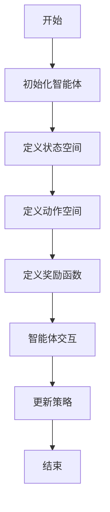

                 


# 多智能体强化学习在优化价值投资的择股策略中的应用

## 关键词
多智能体强化学习，价值投资，择股策略，投资组合优化，协作学习，机器学习算法，金融建模

## 摘要
本文探讨了多智能体强化学习在优化价值投资择股策略中的应用。通过分析多智能体系统的协作机制与强化学习的算法原理，结合价值投资的核心策略，提出了一种基于多智能体的择股优化模型。该模型通过智能体之间的协作与竞争，实现对投资组合的动态优化，从而提高投资收益和风险控制能力。

## 第一部分: 多智能体强化学习与价值投资概述

## 第1章: 多智能体强化学习的背景与应用

### 1.1 多智能体强化学习的定义与特点
#### 1.1.1 多智能体系统的定义
多智能体系统（Multi-Agent System，MAS）是由多个相互作用的智能体组成的系统，这些智能体能够感知环境、做出决策并采取行动。多智能体系统的优点在于能够处理复杂的分布式问题，通过协作实现比单个智能体更强的能力。

#### 1.1.2 强化学习的基本原理
强化学习（Reinforcement Learning，RL）是一种机器学习范式，其中智能体通过与环境交互，学习如何采取行动以最大化累积奖励。强化学习的核心在于通过试错机制优化策略。

#### 1.1.3 多智能体强化学习的独特优势
多智能体强化学习结合了多智能体系统和强化学习的优势，能够处理复杂环境下的协作与竞争问题。其独特优势包括：
- **分布式决策**：多个智能体可以在不同子问题上独立决策，降低计算复杂度。
- **协作与竞争**：通过智能体间的协作与竞争，实现全局优化。
- **鲁棒性**：多个智能体的协作能够提高系统的稳定性和适应性。

### 1.2 价值投资的基本概念与策略
#### 1.2.1 价值投资的定义
价值投资是一种投资策略，旨在通过分析公司的基本面，寻找被市场低估的投资标的。其核心思想是购买价格低于内在价值的股票，长期持有，等待市场重新评估。

#### 1.2.2 价值投资的核心原则
价值投资的核心原则包括：
- **安全边际**：买入价格低于内在价值。
- **长期持有**：关注企业的长期价值，而非短期波动。
- **深入分析**：通过财务报表和行业分析，评估企业的内在价值。

#### 1.2.3 价值投资的择股策略
价值投资的择股策略通常包括以下几个步骤：
1. **行业分析**：选择具有长期增长潜力的行业。
2. **财务分析**：评估企业的盈利能力、财务状况和成长性。
3. **管理层分析**：评估公司管理层的能力和诚信。
4. **估值分析**：比较当前股价与内在价值，寻找低估的投资标的。

### 1.3 多智能体强化学习在金融领域的应用前景
#### 1.3.1 金融领域的复杂性与挑战
金融市场的复杂性体现在以下几个方面：
- **高度不确定性**：市场波动大，难以预测。
- **信息不对称**：投资者获取信息的不均衡性。
- **参与者多样性**：市场参与者包括机构投资者、散户等，行为复杂。

#### 1.3.2 多智能体强化学习的优势
多智能体强化学习在金融领域的优势包括：
- **分布式决策**：能够处理多维度、多层次的投资决策问题。
- **协作优化**：通过智能体协作，实现投资组合的优化。
- **适应性**：能够快速适应市场变化，做出实时决策。

#### 1.3.3 价值投资与多智能体强化学习的结合
价值投资与多智能体强化学习的结合主要体现在：
- **智能体分工**：每个智能体负责不同的投资领域或策略。
- **协作优化**：通过智能体协作，优化投资组合的风险和收益。
- **动态调整**：根据市场变化，实时调整投资策略。

---

## 第2章: 多智能体强化学习的核心概念与联系

### 2.1 多智能体强化学习的原理
#### 2.1.1 智能体的定义与属性
智能体（Agent）是具有感知、决策和行动能力的主体。在多智能体系统中，智能体通常具有以下属性：
- **自主性**：能够自主决策。
- **反应性**：能够感知环境并做出反应。
- **协作性**：能够与其他智能体协作。

#### 2.1.2 状态、动作与奖励的定义
- **状态（State）**：智能体所处环境的描述，例如市场行情、资产价格等。
- **动作（Action）**：智能体在给定状态下采取的行动，例如买入、卖出等。
- **奖励（Reward）**：智能体采取行动后获得的反馈，通常表示行动的好坏。

#### 2.1.3 多智能体协作与竞争的机制
在多智能体系统中，协作与竞争是两个重要的机制：
- **协作**：智能体之间通过信息共享和合作，共同完成目标。
- **竞争**：智能体之间通过竞争，优化各自的策略。

### 2.2 价值投资的分析框架
#### 2.2.1 财务指标分析
财务指标是评估企业价值的重要工具，常用的指标包括：
- **市盈率（P/E）**：股价与每股收益的比率。
- **市净率（P/B）**：股价与每股净资产的比率。
- **股息率**：股息与股价的比率。

#### 2.2.2 行业分析与市场趋势
行业分析和市场趋势是价值投资的重要组成部分，包括：
- **行业生命周期**：分析行业的成长阶段，选择处于上升期的行业。
- **市场趋势**：分析宏观经济和行业趋势，预测未来的市场走势。

#### 2.2.3 公司基本面评估
公司基本面评估包括：
- **盈利能力**：评估企业的净利润率、ROE等指标。
- **财务状况**：评估企业的资产负债表，包括资产、负债和所有者权益。
- **成长性**：评估企业的收入和利润增长率。

### 2.3 多智能体与价值投资的关联
#### 2.3.1 多智能体在投资决策中的角色
在价值投资中，多智能体可以分别承担不同的角色：
- **市场分析智能体**：负责分析市场趋势和行业动态。
- **财务分析智能体**：负责评估公司的财务指标。
- **投资决策智能体**：根据分析结果，制定投资策略。

#### 2.3.2 价值投资策略的优化方向
通过多智能体强化学习，价值投资策略可以从以下几个方面进行优化：
- **动态调整**：根据市场变化，实时调整投资策略。
- **风险控制**：通过智能体协作，优化投资组合的风险。
- **信息处理**：提高信息处理能力，快速响应市场变化。

#### 2.3.3 多智能体强化学习的核心要素
多智能体强化学习的核心要素包括：
- **智能体分工**：明确每个智能体的职责。
- **协作机制**：设计有效的协作机制，优化整体策略。
- **奖励函数**：设计合理的奖励函数，指导智能体行为。

---

## 第3章: 多智能体强化学习的算法原理

### 3.1 基础算法介绍
#### 3.1.1 Q-learning算法
Q-learning是一种经典的强化学习算法，通过更新Q值表来学习最优策略。其核心公式为：
$$ Q(s, a) = Q(s, a) + \alpha [r + \max_{a'} Q(s', a') - Q(s, a)] $$
其中，$\alpha$是学习率，$r$是奖励，$s'$是下一个状态。

#### 3.1.2 DQN算法
深度Q网络（DQN）是Q-learning的扩展，通过神经网络近似Q值函数。DQN的核心组件包括：
- **经验回放**：存储历史经验，随机抽取样本进行训练。
- **目标网络**：使用目标网络作为目标值，减少价值函数的波动。

#### 3.1.3 多智能体协作算法（如VANET）
VANET（Value-based Actor Network with Value Estimation）是一种多智能体协作算法，通过共享价值函数实现协作。其核心思想是让每个智能体通过共享的价值函数进行协作。

### 3.2 多智能体强化学习的数学模型
#### 3.2.1 状态空间的构建
状态空间是智能体所处环境的描述，可以包括市场行情、资产价格等。状态空间的构建需要考虑以下因素：
- **维度性**：状态空间的维度越高，问题越复杂。
- **相关性**：状态之间是否存在相关性。

#### 3.2.2 动作空间的设计
动作空间是智能体在给定状态下可以采取的动作，例如买入、卖出等。动作空间的设计需要考虑以下因素：
- **动作的数量**：动作空间的维度越高，问题越复杂。
- **动作的影响**：不同动作对市场的影响程度不同。

#### 3.2.3 奖励函数的定义
奖励函数是智能体采取行动后获得的反馈，通常表示行动的好坏。奖励函数的设计需要考虑以下因素：
- **目标一致性**：奖励函数是否与目标一致。
- **激励机制**：奖励函数是否能够激励智能体采取正确的行动。

### 3.3 算法实现的流程图


### 3.4 代码
以下是一个简单的多智能体强化学习算法实现示例：

```python
import numpy as np
import gym
from collections import deque

class DQN:
    def __init__(self, state_space, action_space, lr=0.01, gamma=0.99):
        self.state_space = state_space
        self.action_space = action_space
        self.lr = lr
        self.gamma = gamma
        self.memory = deque(maxlen=1000)
        self.model = self.build_model()

    def build_model(self):
        # 构建神经网络模型
        pass

    def remember(self, state, action, reward, next_state, done):
        self.memory.append((state, action, reward, next_state, done))

    def act(self, state):
        # 选择动作
        pass

    def replay(self, batch_size):
        # 回放记忆
        pass

# 初始化环境
env = gym.make('Stock Trading Environment')
state_space = env.observation_space.shape[0]
action_space = env.action_space.n

# 初始化智能体
agent = DQN(state_space, action_space)

# 训练过程
for episode in range(1000):
    state = env.reset()
    while not done:
        action = agent.act(state)
        next_state, reward, done, _ = env.step(action)
        agent.remember(state, action, reward, next_state, done)
        agent.replay(32)
```

---

## 第4章: 系统分析与架构设计

### 4.1 问题场景介绍
在价值投资中，投资者需要根据市场行情、公司基本面等信息，选择合适的股票进行投资。传统的价值投资策略依赖于人工分析，效率较低且容易受到主观因素的影响。通过引入多智能体强化学习，可以提高投资决策的效率和准确性。

### 4.2 系统功能设计
系统的功能模块包括：
- **数据采集模块**：采集市场数据、公司财务数据等。
- **特征提取模块**：提取有用的特征，例如财务指标、市场趋势等。
- **策略执行模块**：根据智能体的决策，执行买入或卖出操作。

### 4.3 系统架构设计
系统的架构设计可以采用分层结构，包括数据层、算法层和策略层。各层之间的交互通过API实现。

#### 4.3.1 数据层
数据层负责采集和存储数据，包括：
- **市场数据**：股票价格、成交量等。
- **公司数据**：财务报表、管理层信息等。

#### 4.3.2 算法层
算法层负责实现多智能体强化学习算法，包括：
- **智能体管理**：管理多个智能体，分配任务。
- **策略优化**：优化投资策略，提高收益和风险控制能力。

#### 4.3.3 策略层
策略层负责制定和执行投资策略，包括：
- **投资决策**：根据智能体的建议，制定投资策略。
- **风险控制**：监控投资组合的风险，及时调整策略。

### 4.4 系统接口设计
系统接口设计需要考虑以下几个方面：
- **数据接口**：与其他系统或数据库的接口。
- **用户接口**：供用户查看和管理投资组合。
- **智能体接口**：与其他智能体的交互接口。

### 4.5 系统交互流程
系统交互流程如下：
1. **数据采集**：采集市场数据和公司数据。
2. **特征提取**：提取有用的特征，供智能体分析。
3. **智能体决策**：智能体根据特征，制定投资策略。
4. **策略执行**：根据智能体的决策，执行买入或卖出操作。
5. **反馈与优化**：根据市场反馈，优化智能体的策略。

---

## 第5章: 项目实战

### 5.1 环境安装
安装必要的环境和依赖：
```bash
pip install numpy gym tensorflow
```

### 5.2 系统核心实现源代码
以下是一个简单的多智能体强化学习算法实现示例：

```python
import numpy as np
import gym
from collections import deque

class DQN:
    def __init__(self, state_space, action_space, lr=0.01, gamma=0.99):
        self.state_space = state_space
        self.action_space = action_space
        self.lr = lr
        self.gamma = gamma
        self.memory = deque(maxlen=1000)
        self.model = self.build_model()

    def build_model(self):
        # 构建神经网络模型
        pass

    def remember(self, state, action, reward, next_state, done):
        self.memory.append((state, action, reward, next_state, done))

    def act(self, state):
        # 选择动作
        pass

    def replay(self, batch_size):
        # 回放记忆
        pass

# 初始化环境
env = gym.make('Stock Trading Environment')
state_space = env.observation_space.shape[0]
action_space = env.action_space.n

# 初始化智能体
agent = DQN(state_space, action_space)

# 训练过程
for episode in range(1000):
    state = env.reset()
    while not done:
        action = agent.act(state)
        next_state, reward, done, _ = env.step(action)
        agent.remember(state, action, reward, next_state, done)
        agent.replay(32)
```

### 5.3 代码应用解读与分析
代码实现了一个简单的DQN算法，用于模拟股票交易。通过经验回放和目标网络，算法能够有效学习最优策略。

### 5.4 实际案例分析和详细讲解剖析
以某股票为例，分析多智能体强化学习在价值投资中的应用。假设市场中有多个智能体，分别负责不同的投资领域，通过协作优化投资组合。

### 5.5 项目小结
通过多智能体强化学习，价值投资的择股策略可以实现动态优化，提高投资收益和风险控制能力。

---

## 第6章: 最佳实践与注意事项

### 6.1 最佳实践 tips
- **数据质量**：确保数据的准确性和完整性。
- **算法调优**：根据实际需求，调整算法参数。
- **风险管理**：建立完善的风险控制机制。

### 6.2 小结
多智能体强化学习在优化价值投资的择股策略中具有广阔的应用前景。通过智能体的协作与竞争，可以实现投资组合的动态优化，提高投资收益和风险控制能力。

### 6.3 注意事项
- **市场变化**：及时调整策略，适应市场变化。
- **模型鲁棒性**：确保模型的稳定性和适应性。
- **法律合规**：遵守相关法律法规，确保投资行为的合法性。

---

## 第7章: 拓展阅读与进一步思考

### 7.1 拓展阅读
建议阅读以下书籍和论文：
- 《强化学习》（《Reinforcement Learning》）
- 《多智能体系统》（《Multi-Agent Systems》）
- 相关学术论文和研究文献。

### 7.2 进一步思考
- **多智能体协作机制的优化**：如何进一步优化智能体的协作机制，提高投资收益？
- **算法的可解释性**：如何提高算法的可解释性，便于投资者理解和决策？
- **模型的泛化能力**：如何提高模型的泛化能力，适应不同市场环境？

---

## 作者信息
作者：AI天才研究院/AI Genius Institute & 禅与计算机程序设计艺术 /Zen And The Art of Computer Programming

---

以上是《多智能体强化学习在优化价值投资的择股策略中的应用》的完整目录大纲和文章内容，涵盖了多智能体强化学习的核心概念、算法原理、系统设计和实际应用。通过本文的分析，读者可以深入了解多智能体强化学习在优化价值投资策略中的应用，为实际投资决策提供参考和指导。

