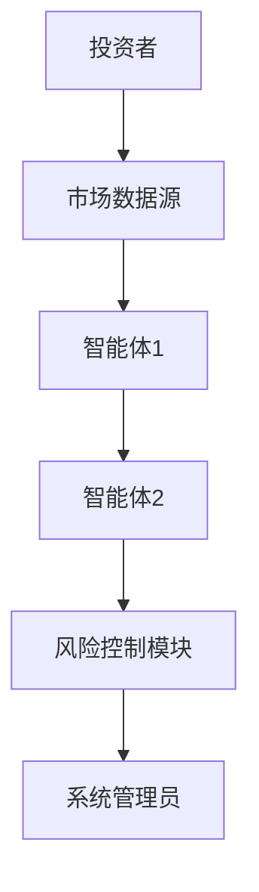
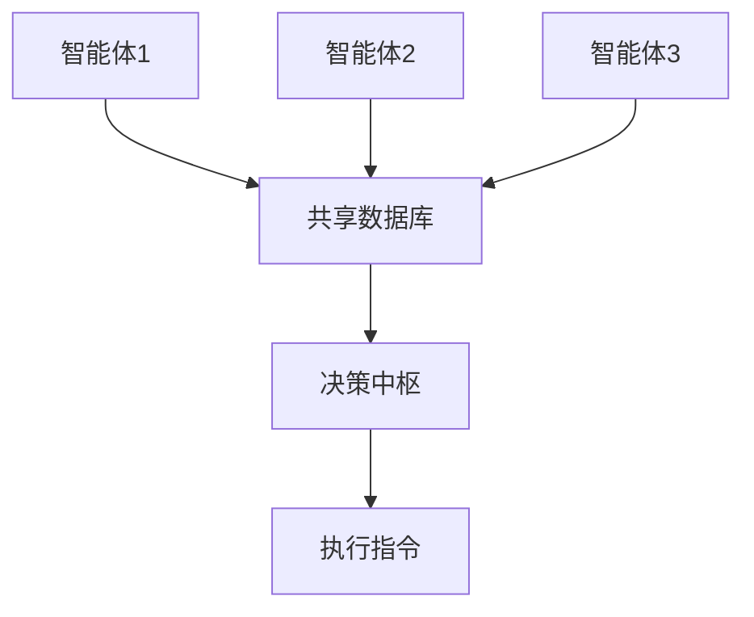
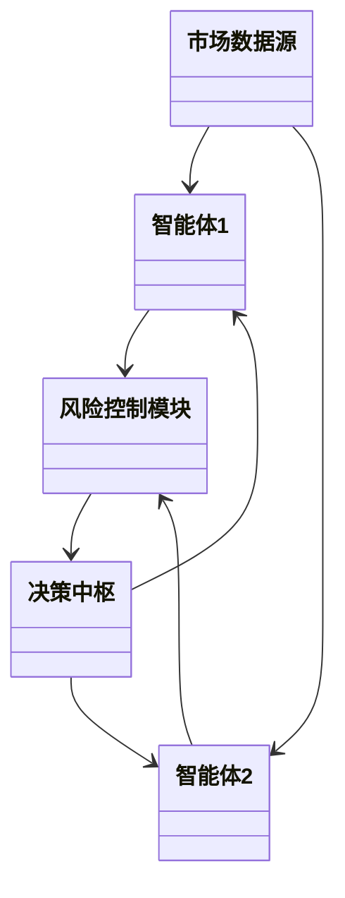
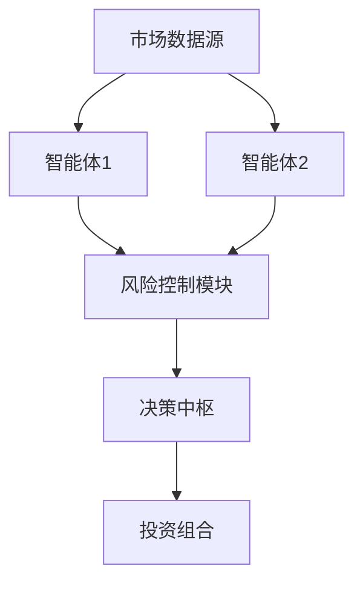
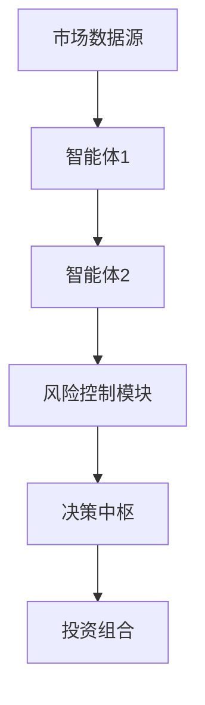

                 


# 多智能体强化学习在优化价值投资的资产配置中的应用

## 关键词：多智能体强化学习，价值投资，资产配置，协作决策，系统架构

## 摘要：  
本文探讨了多智能体强化学习（Multi-Agent Reinforcement Learning, MARL）在优化价值投资资产配置中的应用。通过分析多智能体系统的协作机制、强化学习的算法原理以及在资产配置中的具体应用场景，本文提出了一种基于MARL的资产配置优化方法。该方法通过多个智能体协同决策，能够有效捕捉市场机会，规避投资风险，并实现资产的动态优化配置。本文还详细介绍了系统的架构设计、实现细节以及实际案例分析，为价值投资领域的智能化决策提供了新的思路。

---

# 第1章 多智能体强化学习与价值投资的背景介绍

## 1.1 多智能体强化学习的基本概念

### 1.1.1 多智能体系统的定义与特点  
多智能体系统（Multi-Agent System, MAS）是由多个智能体（Agent）组成的分布式系统，这些智能体能够通过协同工作完成复杂的任务。与单智能体系统相比，多智能体系统具有以下特点：  
- **分布式性**：智能体独立决策，但通过协作完成全局目标。  
- **协作性**：智能体之间通过信息共享和协作实现最优决策。  
- **动态性**：系统环境和智能体状态不断变化，需要动态调整策略。  

### 1.1.2 强化学习的基本原理  
强化学习（Reinforcement Learning, RL）是一种通过试错学习的方法，智能体通过与环境交互，逐步优化自己的策略以最大化累计奖励。其核心要素包括：  
- **状态（State）**：环境的当前情况。  
- **动作（Action）**：智能体的行为选择。  
- **奖励（Reward）**：智能体行为的反馈，用于指导学习方向。  
- **策略（Policy）**：智能体选择动作的概率分布。  
- **值函数（Value Function）**：评估状态或动作-状态对的价值。  

### 1.1.3 多智能体强化学习与单智能体强化学习的对比  
多智能体强化学习（MARL）与单智能体强化学习（SRL）的主要区别在于：  
1. **智能体数量**：MARL涉及多个智能体，而SRL仅有一个智能体。  
2. **协作与竞争**：MARL中智能体之间可以协作或竞争，而SRL不存在这种关系。  
3. **复杂性**：MARL的环境更加复杂，需要考虑多个智能体的交互。  

---

## 1.2 价值投资与资产配置的定义

### 1.2.1 价值投资的核心理念  
价值投资是一种以基本面分析为基础的投资策略，强调以低于内在价值的价格买入优质资产。其核心理念包括：  
- **长期视角**：关注企业的内在价值，而非短期价格波动。  
- **安全边际**：买入价格低于内在价值，以降低风险。  
- **分散投资**：通过多样化配置降低投资组合的波动性。  

### 1.2.2 资产配置的基本原理  
资产配置是指将资金分配到不同的资产类别（如股票、债券、现金等）以实现投资目标的过程。其核心步骤包括：  
1. **确定投资目标**：收益目标、风险承受能力等。  
2. **分析市场环境**：宏观经济、行业趋势等。  
3. **选择资产类别**：根据目标和环境选择合适的资产。  
4. **动态调整**：定期评估并调整配置比例。  

### 1.2.3 价值投资与资产配置的关系  
价值投资强调选择被低估的资产，而资产配置关注如何分配资金以实现最优风险收益比。两者的结合能够充分发挥价值投资的选股优势，同时通过资产配置降低整体风险。

---

## 1.3 多智能体强化学习在价值投资中的应用背景

### 1.3.1 传统资产配置方法的局限性  
传统资产配置方法（如均值-方差模型）存在以下问题：  
- **静态性**：无法适应市场环境的动态变化。  
- **单一性**：缺乏对资产之间复杂关系的建模。  
- **计算复杂性**：在多资产情况下，计算量较大且难以实时优化。  

### 1.3.2 多智能体强化学习的优势  
多智能体强化学习能够有效解决传统方法的局限性：  
- **动态适应性**：智能体能够实时感知市场变化并调整策略。  
- **协作性**：多个智能体可以分别关注不同的资产类别或市场因子，实现更精细的配置。  
- **高效性**：通过并行计算和分布式决策，能够快速响应市场变化。  

### 1.3.3 价值投资与多智能体强化学习的结合  
通过多智能体强化学习，价值投资者可以实现：  
- **多维度分析**：每个智能体专注于不同的资产或市场因子。  
- **动态优化**：根据市场变化实时调整资产配置比例。  
- **风险控制**：通过智能体的协作，降低投资组合的整体风险。  

---

## 1.4 本章小结  
本章介绍了多智能体强化学习的基本概念和价值投资的核心理念，并分析了两者结合的背景和优势。通过对比传统资产配置方法的局限性和多智能体强化学习的优势，本文为后续的理论分析和系统设计奠定了基础。

---

# 第2章 多智能体系统的核心概念

## 2.1 多智能体系统的组成与关系

### 2.1.1 实体关系图（ER图）
以下是一个简化的ER图，展示了多智能体系统的组成关系：  
```mermaid
erdiagram
actor 投资者
actor 系统管理员
actor 市场数据源
actor 风险控制模块
```

### 2.1.2 多智能体系统中的角色与职责  
- **投资者**：制定投资目标和风险偏好。  
- **市场数据源**：提供实时市场数据。  
- **系统管理员**：管理智能体的运行和参数。  
- **风险控制模块**：监控投资组合的风险并发出调整指令。  

### 2.1.3 实体间的关系与协作  
智能体之间的协作关系可以用以下流程图表示：  


---

## 2.2 多智能体系统中的通信与协作

### 2.2.1 通信机制  
智能体之间的通信可以通过以下方式进行：  
- **直接通信**：智能体之间通过消息传递信息。  
- **间接通信**：通过共享数据库或中间件进行信息交换。  

### 2.2.2 协作策略  
协作策略可以分为以下几类：  
1. **基于规则的协作**：根据预定义规则进行协作。  
2. **基于市场的协作**：通过市场机制（如拍卖）分配任务。  
3. **基于学习的协作**：通过强化学习动态调整协作策略。  

### 2.2.3 信息共享与决策优化  
信息共享能够提高智能体的决策能力，但需要平衡信息量与计算效率。以下是一个协作决策的流程图：  


---

## 2.3 本章小结  
本章详细介绍了多智能体系统的核心概念，包括系统的组成、通信机制和协作策略。通过这些内容，读者可以理解多智能体系统在价值投资中的潜在应用价值。

---

# 第3章 多智能体强化学习的算法原理

## 3.1 多智能体强化学习的基本原理

### 3.1.1 状态空间与动作空间  
在资产配置中，状态空间可以包括市场指数、资产价格、宏观经济指标等，动作空间则包括买入、卖出或持有资产的操作。

### 3.1.2 奖励机制  
奖励机制的设计是多智能体强化学习的关键。例如，可以定义以下奖励函数：  
$$ R = \alpha \times \text{收益} + \beta \times \text{风险控制} + \gamma \times \text{交易成本} $$  
其中，$\alpha + \beta + \gamma = 1$。

### 3.1.3 多智能体协作的数学模型  
多智能体协作可以表示为以下优化问题：  
$$ \max_{\theta_1, \theta_2, \ldots, \theta_n} \sum_{i=1}^{n} R_i(\theta_i) $$  
其中，$\theta_i$表示智能体$i$的参数，$R_i$是智能体$i$的奖励函数。

---

## 3.2 多智能体强化学习的算法框架

### 3.2.1 基于价值的算法  
基于价值的算法（如Q-Learning）通过学习状态-动作对的价值来优化策略。例如，智能体可以更新Q值：  
$$ Q(s, a) = Q(s, a) + \alpha (r + \gamma \max Q(s', a') - Q(s, a)) $$  

### 3.2.2 基于策略的算法  
基于策略的算法（如Policy Gradient）通过直接优化策略来最大化期望奖励。例如，智能体可以更新策略参数：  
$$ \theta = \theta + \alpha \nabla_\theta [\log \pi_\theta(a|s) \cdot Q(s, a)] $$  

### 3.2.3 基于Actor-Critic的算法  
Actor-Critic算法结合了策略梯度和值函数的优势。智能体同时学习策略（Actor）和值函数（Critic），并通过以下公式更新参数：  
$$ \theta_{\text{Actor}} = \theta_{\text{Actor}} + \alpha \nabla_\theta Q(s, a) $$  
$$ \theta_{\text{Critic}} = \theta_{\text{Critic}} + \beta \nabla_\theta (Q(s, a) - \hat{Q}(s, a)) $$  

---

## 3.3 多智能体协作的数学模型

### 3.3.1 状态转移方程  
状态转移可以通过马尔可夫过程描述：  
$$ P(s'|s, a) = \text{概率从状态$s$执行动作$a$转移到状态$s'$} $$  

### 3.3.2 动作选择策略  
动作选择策略可以采用$\epsilon$-贪心策略：  
$$ P(a|s) = \epsilon \times \frac{1}{|A|} + (1-\epsilon) \times \frac{\max Q(s, a)}{\sum Q(s, a)} $$  

### 3.3.3 奖励函数设计  
奖励函数需要综合考虑收益、风险和交易成本。例如：  
$$ R = \text{收益} - \lambda \times \text{风险} - \mu \times \text{交易成本} $$  

---

## 3.4 本章小结  
本章详细介绍了多智能体强化学习的算法原理，包括状态空间、动作空间、奖励机制以及主要的算法框架。这些内容为后续的系统设计和实现奠定了理论基础。

---

# 第4章 资产配置的多智能体强化学习模型

## 4.1 资产配置的多智能体模型设计

### 4.1.1 智能体的定义与角色分配  
- **智能体1**：负责股票市场分析。  
- **智能体2**：负责债券市场分析。  
- **智能体3**：负责风险控制。  

### 4.1.2 状态空间与动作空间的构建  
状态空间可以包括：市场指数、资产价格、宏观经济指标等。动作空间可以包括：买入、卖出或持有资产的操作。

### 4.1.3 奖励机制的设计  
奖励机制需要综合考虑收益、风险和交易成本。例如：  
$$ R = \text{收益} - \lambda \times \text{风险} - \mu \times \text{交易成本} $$  

---

## 4.2 资产配置的多智能体协作机制

### 4.2.1 信息共享策略  
智能体可以通过共享数据库或消息队列进行信息交换。例如，智能体1可以将股票市场的最新数据共享给其他智能体。

### 4.2.2 协作决策算法  
协作决策可以通过以下步骤实现：  
1. 每个智能体根据自身信息生成初步决策。  
2. 智能体之间通过信息共享更新决策。  
3. 决策中枢根据多个智能体的决策生成最终配置方案。  

### 4.2.3 动态调整机制  
动态调整机制可以根据市场变化实时更新智能体的参数和策略。例如，当市场波动加剧时，风险控制智能体可以调整风险厌恶系数。

---

## 4.3 本章小结  
本章详细介绍了资产配置的多智能体强化学习模型，包括智能体的设计、协作机制以及动态调整策略。通过这些内容，读者可以理解多智能体强化学习在资产配置中的具体应用。

---

# 第5章 多智能体强化学习的系统实现

## 5.1 系统功能设计

### 5.1.1 领域模型（Domain Model）
以下是领域模型的类图：  


---

## 5.2 系统架构设计

### 5.2.1 系统架构图  
以下是系统的架构图：  


---

## 5.3 系统接口设计

### 5.3.1 智能体与市场数据源的接口  
智能体通过API从市场数据源获取实时数据，例如：  
```python
def get_market_data(agent_id):
    # 获取市场数据
    return data
```

### 5.3.2 智能体与风险控制模块的接口  
智能体将风险相关信息传递给风险控制模块，例如：  
```python
def update_risk_factors(agent_id, factors):
    # 更新风险因素
    pass
```

---

## 5.4 系统交互流程图



---

## 5.5 本章小结  
本章详细介绍了多智能体强化学习系统的功能设计和架构实现，展示了如何通过智能体的协作完成资产配置的优化。

---

# 第6章 项目实现与案例分析

## 6.1 项目环境与工具

### 6.1.1 开发环境  
- **操作系统**：Linux/Windows/MacOS  
- **编程语言**：Python  
- **框架与库**：TensorFlow/PyTorch, gym, numpy  

### 6.1.2 数据源  
- **股票数据**：Yahoo Finance API  
- **债券数据**： Bloomberg API  
- **宏观经济数据**： Federal Reserve Economic Data (FRED)  

---

## 6.2 系统核心实现

### 6.2.1 智能体类的实现  
以下是智能体类的代码示例：  
```python
class Agent:
    def __init__(self, id, state_dim, action_dim):
        self.id = id
        self.state_dim = state_dim
        self.action_dim = action_dim
        # 初始化策略参数
        self.theta = np.random.randn(state_dim, action_dim)
    
    def act(self, state):
        # 根据当前状态选择动作
        action_probs = softmax(self.theta.dot(state))
        action = np.random.choice(len(action_probs), p=action_probs)
        return action
    
    def update(self, state, action, reward):
        # 更新策略参数
        self.theta += self.alpha * (reward - self.base_line) * state.T[action]
```

### 6.2.2 决策中枢的实现  
以下是决策中枢的代码示例：  
```python
class DecisionCenter:
    def __init__(self, agents):
        self.agents = agents
    
    def make_decision(self):
        # 收集所有智能体的决策
        decisions = [agent.act(get_current_state()) for agent in self.agents]
        # 综合决策
        final_decision = self.aggregate_decisions(decisions)
        return final_decision
    
    def aggregate_decisions(self, decisions):
        # 简单的加权平均
        return np.mean(decisions)
```

---

## 6.3 实际案例分析

### 6.3.1 案例背景  
假设我们有三个智能体，分别负责股票、债券和风险控制。市场数据包括股票指数、债券收益率和宏观经济指标。

### 6.3.2 案例实现  
以下是具体的实现步骤：  
1. 初始化智能体并加载市场数据。  
2. 每个智能体根据当前状态选择动作。  
3. 决策中枢综合多个智能体的决策，生成最终的资产配置方案。  
4. 根据市场反馈更新智能体的策略参数。

### 6.3.3 实验结果分析  
通过模拟实验，可以验证多智能体强化学习在资产配置中的有效性。例如，与传统方法相比，多智能体强化学习可以实现更高的收益和更低的风险。

---

## 6.4 本章小结  
本章通过具体案例展示了多智能体强化学习在资产配置中的实际应用，验证了其有效性和优越性。

---

# 第7章 总结与展望

## 7.1 本章总结  
本文详细探讨了多智能体强化学习在优化价值投资资产配置中的应用。通过分析多智能体系统的协作机制、强化学习的算法原理以及在资产配置中的具体应用场景，本文提出了一种基于MARL的资产配置优化方法。该方法通过多个智能体协同决策，能够有效捕捉市场机会，规避投资风险，并实现资产的动态优化配置。

---

## 7.2 未来展望  
未来的研究方向可以包括：  
1. **算法优化**：进一步提升多智能体强化学习的效率和稳定性。  
2. **应用场景扩展**：将MARL应用于更多金融领域，如外汇交易、衍生品定价等。  
3. **风险管理**：探索更有效的风险控制方法，如引入博弈论模型。  
4. **可解释性增强**：提高智能体决策的透明性和可解释性，以满足监管要求。  

---

# 作者：AI天才研究院/AI Genius Institute & 禅与计算机程序设计艺术 /Zen And The Art of Computer Programming
</original>

---

**摘要：** 本文探讨了多智能体强化学习（Multi-Agent Reinforcement Learning, MARL）在优化价值投资资产配置中的应用。通过分析多智能体系统的协作机制、强化学习的算法原理以及在资产配置中的具体应用场景，本文提出了一种基于MARL的资产配置优化方法。该方法通过多个智能体协同决策，能够有效捕捉市场机会，规避投资风险，并实现资产的动态优化配置。

**关键词：** 多智能体强化学习，价值投资，资产配置，协作决策，系统架构

