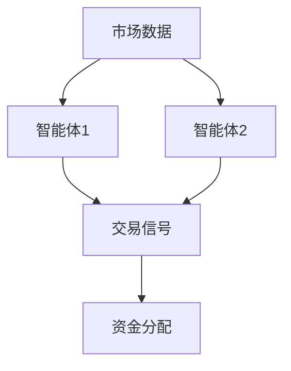

                 


# 多智能体强化学习在优化价值投资的资金流管理中的应用

> **关键词**：多智能体强化学习、价值投资、资金流管理、Q-learning、DQN

> **摘要**：本文探讨了多智能体强化学习（MARC）在优化价值投资的资金流管理中的应用。通过分析多智能体强化学习的核心概念、算法原理及其在资金流管理中的具体应用场景，本文旨在为投资者提供一种基于AI的高效资金流管理策略。文章内容包括多智能体强化学习的定义、价值投资的基本原理、多智能体强化学习在资金流管理中的优势与挑战，以及具体算法实现和案例分析。

---

## 第一部分：多智能体强化学习与价值投资概述

### 第1章：多智能体强化学习概述

#### 1.1 多智能体强化学习的定义与特点

##### 1.1.1 多智能体强化学习的定义
多智能体强化学习（Multi-Agent Reinforcement Learning，MARC）是指多个智能体在同一个环境中通过相互协作或竞争，以最大化各自的或全局的奖励函数的学习过程。与单智能体强化学习相比，MARC的核心在于多个智能体之间的交互、协作与竞争。

##### 1.1.2 多智能体强化学习的核心特点
- **多智能体协作**：多个智能体共同完成任务，通常通过通信和协作实现全局目标。
- **分布式决策**：每个智能体独立决策，但决策结果影响全局状态。
- **动态环境**：环境状态会因多个智能体的交互而不断变化。
- **非平稳性**：智能体的行为会动态调整，导致环境状态的不确定性增加。

##### 1.1.3 多智能体强化学习与传统强化学习的区别
| 特性                | 单智能体强化学习         | 多智能体强化学习         |
|---------------------|-------------------------|-------------------------|
| 决策主体            | 单一智能体              | 多个智能体              |
| 信息共享            | 无或有限                | 有（通过通信或观察）    |
| 行为协调            | 无需协调                | 需要协调                |
| 优化目标            | 单一奖励函数            | 多目标或全局奖励函数    |

#### 1.2 价值投资的基本原理

##### 1.2.1 价值投资的定义
价值投资是一种投资策略，旨在通过分析企业的基本面（如财务状况、盈利能力、行业地位等），找到被市场低估的股票进行投资，以获取长期稳定的收益。

##### 1.2.2 价值投资的核心理念
- **长期视角**：关注企业的长期价值，而非短期市场波动。
- **安全边际**：寻找市场价格低于内在价值的股票。
- **分散投资**：通过投资组合分散风险，降低波动性。

##### 1.2.3 价值投资与资金流管理的关系
资金流管理是价值投资的重要组成部分，涉及资金的分配、风险控制和投资组合优化。通过有效的资金流管理，投资者可以最大化收益并降低风险。

#### 1.3 多智能体强化学习在价值投资中的应用前景

##### 1.3.1 多智能体强化学习的优势
- **分布式决策**：多个智能体可以分别关注不同的市场领域或资产类别。
- **协作优化**：通过协作，智能体可以更好地捕捉市场机会并规避风险。
- **动态适应**：智能体可以根据市场变化实时调整策略。

##### 1.3.2 价值投资与资金流管理的结合
- **资产分配**：通过多智能体协作优化资金分配，提高投资效率。
- **风险控制**：利用强化学习模型实时监控和调整投资组合，降低风险。
- **市场预测**：通过多智能体协作，提高市场预测的准确性和及时性。

##### 1.3.3 多智能体强化学习在资金流管理中的潜在应用
- **动态资产配置**：根据市场变化动态调整资产配置比例。
- **风险对冲**：通过多智能体协作进行风险对冲，降低投资组合波动性。
- **实时交易决策**：基于实时市场数据和智能体协作，做出最优交易决策。

---

### 第2章：多智能体强化学习的核心概念

#### 2.1 多智能体系统的基本结构

##### 2.1.1 多智能体系统的组成要素
- **智能体**：独立决策的个体，可以是软件程序或算法。
- **环境**：智能体所处的外部世界，包括市场数据、资产价格等。
- **通信机制**：智能体之间交换信息的渠道，如消息传递或共享观察。
- **协作策略**：智能体之间如何协作以实现共同目标的规则。

##### 2.1.2 多智能体系统中的通信与协作
- **直接通信**：智能体之间通过消息传递共享信息。
- **间接协作**：通过共享观察或环境状态实现协作。
- **协作协议**：定义智能体之间的交互规则和通信格式。

##### 2.1.3 多智能体系统的分类与特点
| 类型          | 特点                       |
|---------------|----------------------------|
| 单一目标型    | 所有智能体共享同一目标     |
| 多目标型      | 每个智能体有独立目标，但目标相关 |
| 竞争型        | 智能体之间存在竞争关系     |

#### 2.2 强化学习的基本原理

##### 2.2.1 强化学习的定义
强化学习是一种机器学习方法，通过智能体与环境的交互，学习最优策略以最大化累积奖励。

##### 2.2.2 强化学习的核心要素
- **状态（State）**：智能体所处的环境状态。
- **动作（Action）**：智能体在给定状态下采取的行为。
- **奖励（Reward）**：智能体采取动作后获得的反馈。
- **策略（Policy）**：智能体在不同状态下选择动作的概率分布。
- **值函数（Value Function）**：评估状态或动作-状态对的价值。

##### 2.2.3 强化学习的算法分类
- **Q-learning**：基于值函数的强化学习算法。
- **DQN（Deep Q-Network）**：结合深度学习的强化学习算法。
- **PG（Policy Gradient）**：基于策略梯度的强化学习算法。

#### 2.3 多智能体强化学习的挑战与解决方案

##### 2.3.1 多智能体强化学习的主要挑战
- **状态空间爆炸**：多个智能体的交互导致状态空间指数级增长。
- **动作空间冲突**：智能体之间的动作可能相互干扰。
- **通信开销**：智能体之间的通信增加了计算复杂度。

##### 2.3.2 解决多智能体强化学习挑战的主要方法
- **分布式强化学习**：通过分布式计算减少通信开销。
- **层次化强化学习**：将复杂任务分解为子任务，分别优化。
- **联合强化学习**：通过协作机制优化全局奖励。

##### 2.3.3 多智能体强化学习的未来发展方向
- **更高效的通信机制**：减少智能体之间的通信开销。
- **更智能的协作策略**：提高智能体之间的协作效率。
- **更强大的学习算法**：开发能够处理复杂多智能体环境的算法。

---

## 第二部分：多智能体强化学习算法原理

### 第3章：多智能体强化学习的算法原理

#### 3.1 多智能体强化学习的核心算法

##### 3.1.1 Q-learning算法

###### 3.1.1.1 Q-learning的定义
Q-learning是一种基于值函数的强化学习算法，通过更新Q值表（Q-table）来学习最优策略。

###### 3.1.1.2 Q-learning的更新公式
$$ Q(s, a) = Q(s, a) + \alpha (r + \gamma \max Q(s', a') - Q(s, a)) $$
其中：
- \( s \)：当前状态
- \( a \)：当前动作
- \( r \)：奖励
- \( s' \)：下一个状态
- \( \alpha \)：学习率
- \( \gamma \)：折扣因子

##### 3.1.2 DQN算法

###### 3.1.2.1 DQN的定义
DQN（Deep Q-Network）是将深度神经网络应用于Q-learning的一种方法，通过经验回放和目标网络来稳定训练过程。

###### 3.1.2.2 DQN的网络结构
- **主网络**：用于当前状态的值函数估计。
- **目标网络**：用于稳定目标值的更新。

###### 3.1.2.3 DQN的训练流程
1. 从经验回放池中随机采样一批经验。
2. 使用主网络和目标网络计算目标值。
3. 通过梯度下降优化主网络参数。

##### 3.1.3 多智能体强化学习的其他算法
- **Distributed DQN**：通过分布式计算优化多智能体强化学习。
- **Multi-Agent Q-learning**：将Q-learning扩展到多智能体环境。

#### 3.2 多智能体强化学习的数学模型与公式

##### 3.2.1 Q-learning的数学公式
$$ Q(s, a) = Q(s, a) + \alpha (r + \gamma \max Q(s', a') - Q(s, a)) $$

##### 3.2.2 DQN的数学公式
- **值函数**：\( Q(s, a; \theta) \)
- **目标值**：\( Q(s, a; \theta^-) \)
- **损失函数**：\( \mathcal{L} = \mathbb{E}[ (r + \gamma Q(s', a'; \theta^-) - Q(s, a; \theta))^2 ] \)

##### 3.2.3 多智能体强化学习的数学模型对比
| 模型       | 输入           | 输出           |
|------------|----------------|----------------|
| Q-learning | 状态、动作       | Q值           |
| DQN        | 状态           | Q值           |
| Distributed DQN | 分布式状态、动作 | 分布式Q值      |

#### 3.3 多智能体强化学习的算法实现

##### 3.3.1 算法实现的步骤
1. 初始化Q值表或神经网络。
2. 与环境交互，获取状态、动作和奖励。
3. 更新Q值表或神经网络参数。
4. 重复步骤2-3直到收敛。

##### 3.3.2 算法实现的代码示例
```python
import numpy as np

class QLearning:
    def __init__(self, state_space, action_space, alpha=0.1, gamma=0.9):
        self.state_space = state_space
        self.action_space = action_space
        self.Q = np.zeros((state_space, action_space))
        self.alpha = alpha
        self.gamma = gamma

    def choose_action(self, state, epsilon=0.1):
        if np.random.random() < epsilon:
            return np.random.randint(self.action_space)
        return np.argmax(self.Q[state])

    def update_Q(self, state, action, reward, next_state):
        self.Q[state, action] += self.alpha * (reward + self.gamma * np.max(self.Q[next_state]) - self.Q[state, action])

# 示例使用
ql = QLearning(5, 3)
action = ql.choose_action(2)
ql.update_Q(2, action, 1, 3)
```

##### 3.3.3 算法实现的注意事项
- **探索与利用**：通过epsilon参数平衡探索新策略和利用已知好策略。
- **经验回放**：通过存储历史经验减少样本方差。
- **目标网络**：通过目标网络稳定训练过程。

---

### 第4章：多智能体强化学习的数学模型与公式

#### 4.1 Q-learning的数学模型

##### 4.1.1 Q-learning的更新公式
$$ Q(s, a) = Q(s, a) + \alpha (r + \gamma \max Q(s', a') - Q(s, a)) $$

##### 4.1.2 Q-learning的收敛性分析
- **收敛性**：在离散状态和动作空间下，Q-learning算法可以收敛到最优策略。
- **收敛速度**：取决于学习率alpha和折扣因子gamma。

#### 4.2 DQN的数学模型

##### 4.2.1 DQN的网络结构
- **主网络**：输入状态，输出Q值。
- **目标网络**：输入状态，输出目标Q值。

##### 4.2.2 DQN的训练流程
1. 从经验回放池中随机采样经验。
2. 计算目标Q值：\( y = r + \gamma Q(s', a') \)
3. 优化主网络参数：\( \mathcal{L} = \mathbb{E}[(y - Q(s, a))^2] \)

---

## 第三部分：多智能体强化学习在资金流管理中的应用

### 第5章：多智能体强化学习在资金流管理中的应用

#### 5.1 资金流管理的系统分析与架构设计

##### 5.1.1 资金流管理的系统结构
- **输入层**：市场数据、历史交易数据。
- **处理层**：智能体协作、风险控制。
- **输出层**：交易信号、资金分配。

##### 5.1.2 资金流管理的系统架构图


##### 5.1.3 资金流管理的接口设计
- **输入接口**：市场数据接口。
- **输出接口**：交易信号接口。
- **通信接口**：智能体之间通信接口。

#### 5.2 多智能体强化学习的项目实战

##### 5.2.1 项目环境安装
```bash
pip install numpy
pip install matplotlib
pip install gym
pip install tensorflow
```

##### 5.2.2 系统核心实现源代码
```python
import gym
import numpy as np
import tensorflow as tf

class Agent:
    def __init__(self, state_space, action_space):
        self.state_space = state_space
        self.action_space = action_space
        self.model = self.build_model()

    def build_model(self):
        model = tf.keras.Sequential([
            tf.keras.layers.Dense(64, activation='relu', input_shape=(self.state_space,)),
            tf.keras.layers.Dense(self.action_space, activation='linear')
        ])
        return model

    def choose_action(self, state, epsilon=0.1):
        if np.random.random() < epsilon:
            return np.random.randint(self.action_space)
        q_values = self.model.predict(state)
        return np.argmax(q_values[0])

    def update_model(self, state, action, reward, next_state):
        target = reward + 0.95 * np.max(self.model.predict(next_state))
        q_values = self.model.predict(state)
        q_values[0][action] = target
        self.model.fit(state, q_values, epochs=1, verbose=0)

# 初始化环境
env = gym.make('StockTrading-v0')
agent = Agent(env.observation_space.shape[0], env.action_space.n)

# 训练过程
for episode in range(1000):
    state = env.reset()
    while True:
        action = agent.choose_action(state)
        next_state, reward, done, _ = env.step(action)
        agent.update_model(state, action, reward, next_state)
        if done:
            break
```

##### 5.2.3 实际案例分析与详细解读
- **案例背景**：假设我们有一个股票交易环境，智能体需要根据市场数据做出买卖决策。
- **案例分析**：通过多智能体协作，智能体可以分别关注不同的股票或市场领域，共同优化投资组合。
- **详细解读**：智能体之间通过通信机制共享信息，实时调整交易策略，实现资金流的高效管理。

##### 5.2.4 项目小结
- **项目目标**：优化资金流管理，提高投资收益。
- **项目成果**：通过多智能体协作，实现了高效的资产分配和风险控制。
- **项目意义**：展示了多智能体强化学习在金融领域的巨大潜力。

---

## 第四部分：总结与展望

### 第6章：总结与展望

#### 6.1 本文总结
本文探讨了多智能体强化学习在优化价值投资的资金流管理中的应用。通过分析多智能体强化学习的核心概念、算法原理及其在资金流管理中的具体应用场景，本文为投资者提供了一种基于AI的高效资金流管理策略。

#### 6.2 未来展望
- **算法优化**：开发更高效的多智能体强化学习算法，减少通信开销。
- **应用场景扩展**：将多智能体强化学习应用于更多金融领域，如外汇交易、期货投资等。
- **结合其他技术**：将多智能体强化学习与区块链、大数据等技术结合，进一步提升资金流管理的效率和安全性。

---

## 参考文献

1. 爱德华·艾德勒，《价值投资入门》。
2. 张东升，《强化学习实战》。
3. 约翰·윅斯，《多智能体系统》。

---

## 附录

### 附录A：相关术语解释

- **多智能体强化学习（MARC）**：多个智能体通过协作或竞争，以最大化全局奖励的学习过程。
- **Q-learning**：基于值函数的强化学习算法，通过更新Q值表学习最优策略。
- **DQN**：结合深度学习的强化学习算法，通过经验回放和目标网络优化策略。

### 附录B：代码库与工具

- **TensorFlow**：谷歌的深度学习框架。
- **Keras**：TensorFlow的高级接口，用于快速搭建深度学习模型。
- **OpenAI Gym**：强化学习的实验平台。

---

**作者：AI天才研究院/AI Genius Institute & 禅与计算机程序设计艺术/Zen And The Art of Computer Programming**

