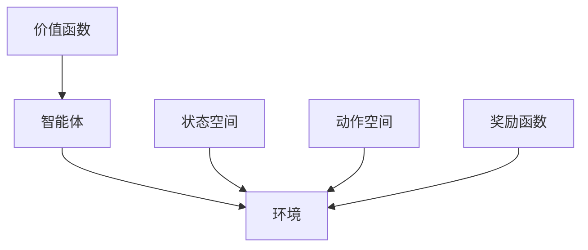
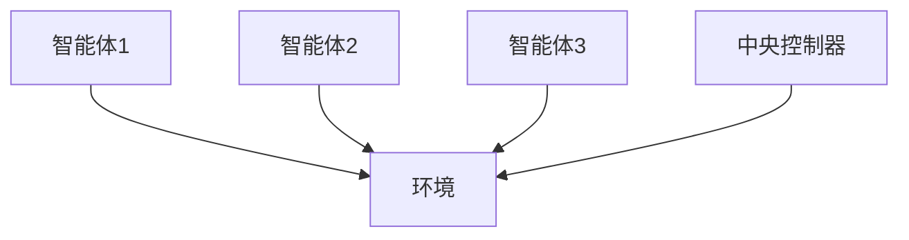

                 

<think>
好的，我现在需要帮用户撰写一篇关于《多智能体强化学习在动态调整投资组合中的应用》的技术博客文章。用户要求文章结构清晰，内容详实，涵盖从背景到算法实现再到项目实战的各个方面。让我一步一步地思考如何组织和撰写这篇文章。

首先，我需要理解用户的需求。用户希望文章分为几个部分，包括背景介绍、核心概念、算法原理、系统分析与架构设计、项目实战以及总结与展望。每个部分都需要详细展开，确保内容完整且技术深度足够。

1. **文章标题和关键词**：标题已经明确，是《多智能体强化学习在动态调整投资组合中的应用》。关键词应该包括“多智能体强化学习”、“动态投资组合”、“风险管理”、“收益最大化”、“协同学习”等，确保覆盖文章的核心内容。

2. **摘要部分**：摘要需要简洁明了地概括文章的核心内容和主题思想。我需要总结多智能体强化学习如何应用于投资组合管理，以及其优势和应用场景。

3. **目录大纲**：用户已经提供了一个详细的目录，我需要按照这个目录来组织内容。每个章节和子章节都需要详细展开，确保覆盖所有必要的主题。

4. **内容撰写**：每个章节需要详细讲解，包括背景、概念、算法、系统设计、项目实战等。我需要确保每个部分都有足够的技术深度，同时用清晰易懂的语言表达。

5. **数学公式和图表**：文章中需要包含数学公式和图表，如ER实体关系图、算法流程图、系统架构图等。这些图表需要用mermaid或类似的工具来表示，并嵌入到文章中。

6. **项目实战部分**：需要提供Python代码示例，展示如何实现动态调整投资组合。这部分需要详细解释代码的功能，分析案例，并给出实际应用中的注意事项。

7. **总结与展望**：总结文章的主要内容，提出未来的研究方向和应用前景，同时给出读者一些建议和注意事项。

现在，我开始撰写文章。

---

# 多智能体强化学习在动态调整投资组合中的应用

## 关键词：多智能体强化学习，动态投资组合，风险管理，收益最大化，协同学习

## 摘要：  
本文探讨了多智能体强化学习（Multi-Agent Reinforcement Learning, MRL）在动态调整投资组合中的应用。通过分析投资组合管理的动态性与复杂性，结合MRL的核心原理与技术，本文提出了一种基于多智能体的动态投资组合调整方法，旨在实现风险控制与收益最大化。本文不仅详细阐述了MRL在投资组合管理中的应用原理，还通过实际案例分析展示了该方法的有效性，并对未来研究方向进行了展望。

---

## 第一部分：多智能体强化学习与动态投资组合管理概述

### 第1章：多智能体强化学习与动态投资组合管理概述

#### 1.1 动态投资组合管理的背景与挑战

##### 1.1.1 投资组合管理的基本概念  
投资组合管理是金融领域中的核心任务之一，旨在通过合理配置不同资产（如股票、债券、基金等）来实现收益最大化和风险最小化。传统的投资组合管理通常基于现代投资组合理论（Modern Portfolio Theory, MPT），通过优化资产配置来实现风险调整后的收益最大化。

##### 1.1.2 动态投资组合管理的必要性  
金融市场具有高度的不确定性和动态变化性，传统的静态投资组合管理方法难以应对市场波动和突发事件。动态投资组合管理能够根据市场环境的变化实时调整资产配置，从而更好地应对市场风险。

##### 1.1.3 强化学习在投资组合管理中的应用前景  
强化学习（Reinforcement Learning, RL）是一种通过试错机制优化决策的机器学习方法，非常适合应用于动态环境下的投资组合管理。多智能体强化学习（MRL）通过多个智能体的协同与竞争，进一步增强了系统在复杂环境下的适应能力和优化能力。

#### 1.2 多智能体强化学习的核心概念

##### 1.2.1 多智能体系统的定义与特点  
多智能体系统是由多个智能体组成的分布式系统，智能体之间通过协同与竞争实现目标。与单智能体系统相比，多智能体系统具有更高的灵活性和适应性，能够更好地应对复杂问题。

##### 1.2.2 强化学习的基本原理  
强化学习的核心是通过智能体与环境的交互，学习最优策略。智能体通过执行动作，观察环境状态和接收奖励信号，逐步优化决策策略。

##### 1.2.3 多智能体强化学习与单智能体强化学习的对比  
| 对比维度          | 单智能体强化学习                      | 多智能体强化学习                      |
|-------------------|--------------------------------------|--------------------------------------|
| 智能体数量        | 1                                    | 多                                    |
| 决策空间          | 简单，适用于单任务                   | 复杂，适用于多任务                   |
| 协作与竞争        | 无                                  | 有                                  |
| 应用场景          | 简单环境                            | 复杂环境                            |

#### 1.3 多智能体强化学习在投资组合管理中的应用

##### 1.3.1 投资组合管理中的多智能体架构  
在投资组合管理中，每个智能体可以代表一种资产或资产类别。智能体通过协同与竞争，优化整体投资组合的收益与风险。

##### 1.3.2 多智能体在风险分散与收益优化中的作用  
通过多智能体的协同，系统能够更好地分散风险，同时优化整体收益。每个智能体专注于特定资产类别，通过协作实现全局最优。

##### 1.3.3 动态调整投资组合的挑战与解决方案  
动态调整投资组合需要实时感知市场变化，并快速做出决策。多智能体强化学习通过分布式决策和协同优化，能够有效应对动态环境下的挑战。

#### 1.4 本章小结  
本章介绍了动态投资组合管理的背景与挑战，阐述了多智能体强化学习的核心概念，并探讨了其在投资组合管理中的应用。通过多智能体系统的协作与竞争，可以实现更优的投资组合调整。

---

## 第二部分：多智能体强化学习的核心原理

### 第2章：多智能体强化学习的核心概念与联系

#### 2.1 多智能体强化学习的核心概念

##### 2.1.1 智能体的定义与角色  
智能体（Agent）是多智能体系统的核心单元，负责感知环境、做出决策并执行动作。在投资组合管理中，每个智能体可以代表一种资产或资产类别。

##### 2.1.2 环境与状态空间  
环境是智能体所处的外部世界，状态空间是环境的所有可能状态的集合。在投资组合管理中，环境可以是金融市场，状态可以是资产价格、市场波动率等。

##### 2.1.3 动作与奖励机制  
动作是智能体在给定状态下执行的操作，奖励是智能体执行动作后获得的反馈信号。在投资组合管理中，奖励可以是投资组合的收益或风险指标。

##### 2.1.4 价值函数与策略  
价值函数是智能体对状态或动作-状态对的评估，策略是智能体在给定状态下选择动作的规则。在多智能体系统中，价值函数和策略需要考虑多个智能体的协同。

#### 2.2 多智能体系统中的实体关系图



#### 2.3 多智能体系统中的协同与竞争

##### 2.3.1 协同机制  
智能体之间通过共享信息、协作决策来实现全局最优。例如，不同智能体可以协同调整资产配置，以分散风险。

##### 2.3.2 竞争机制  
智能体之间也可以通过竞争来优化决策。例如，每个智能体竞争分配更多的投资权重，以获得更高的收益。

##### 2.3.3 协作与竞争的平衡  
在多智能体系统中，协作与竞争需要平衡，以避免单一智能体的过度优化影响整体性能。

#### 2.4 本章小结  
本章详细阐述了多智能体强化学习的核心概念，包括智能体、环境、状态、动作、奖励和价值函数，并通过实体关系图展示了系统的组成部分。

---

## 第三部分：多智能体强化学习的算法原理

### 第3章：多智能体强化学习的算法原理

#### 3.1 多智能体强化学习的数学模型

##### 3.1.1 状态转移概率  
状态转移概率描述了智能体在执行动作后从当前状态转移到下一个状态的概率。数学表示为：
$$ P(s' | s, a) $$

##### 3.1.2 奖励函数  
奖励函数是智能体执行动作后获得的反馈信号，数学表示为：
$$ R(s, a) $$

#### 3.2 多智能体强化学习的价值函数

##### 3.2.1 单智能体价值函数  
单智能体的价值函数表示智能体在状态s下的最大期望收益：
$$ V(s) = \max_a Q(s, a) $$

##### 3.2.2 多智能体价值函数  
多智能体的价值函数需要考虑多个智能体的协同，数学表示为：
$$ V_{i}(s) = \max_{a_i} \sum_{j} V_{j}(s') $$

#### 3.3 多智能体强化学习的策略梯度方法

##### 3.3.1 策略梯度的基本原理  
策略梯度方法通过优化策略参数，最大化期望奖励。数学表示为：
$$ \nabla_{\theta} J(\theta) = \mathbb{E}[\nabla_{\theta} \log \pi(a|s; \theta) Q(s, a)] $$

##### 3.3.2 多智能体策略梯度的实现  
在多智能体系统中，策略梯度需要考虑多个智能体的协同，数学表示为：
$$ \nabla_{\theta_i} J(\theta) = \sum_{j} \nabla_{\theta_i} J_j(\theta) $$

#### 3.4 多智能体协同学习机制

##### 3.4.1 基于价值函数的协同  
智能体通过共享价值函数信息，实现协同决策。例如，使用Q-learning算法更新价值函数：
$$ Q(s, a) = Q(s, a) + \alpha (r + \gamma \max_{a'} Q(s', a') - Q(s, a)) $$

##### 3.4.2 基于策略的协同  
智能体通过共享策略信息，实现协同决策。例如，使用策略梯度法优化策略参数：
$$ \nabla_{\theta} J(\theta) = \mathbb{E}[\nabla_{\theta} \log \pi(a|s; \theta) Q(s, a)] $$

##### 3.4.3 基于价值函数与策略的混合协同  
智能体同时使用价值函数和策略信息，实现更优的协同决策。

#### 3.5 本章小结  
本章详细讲解了多智能体强化学习的数学模型和算法原理，包括状态转移概率、奖励函数、价值函数和策略梯度方法。通过协同学习机制，系统能够实现全局最优。

---

## 第四部分：系统分析与架构设计

### 第4章：系统分析与架构设计

#### 4.1 问题场景介绍

##### 4.1.1 投资组合管理的动态性  
金融市场具有高度的动态性，投资组合需要实时调整以应对市场波动。

##### 4.1.2 多智能体系统的必要性  
通过多智能体系统的协同，可以更好地分散风险，优化投资组合。

#### 4.2 系统功能设计

##### 4.2.1 领域模型  
领域模型描述了系统的组成部分及其关系。以下是一个简单的领域模型示例：


##### 4.2.2 系统架构设计  
系统架构设计描述了系统的整体结构和组件之间的关系。以下是一个简单的系统架构图：



##### 4.2.3 系统接口设计  
系统接口设计描述了系统各组件之间的交互接口。例如，智能体与环境之间的接口定义了状态、动作和奖励的传递方式。

##### 4.2.4 系统交互设计  
系统交互设计描述了系统在运行过程中的交互流程。例如，智能体通过感知环境状态，执行动作，获得奖励，逐步优化策略。

#### 4.3 本章小结  
本章分析了投资组合管理的动态性，设计了系统的领域模型和架构图，描述了系统各组件之间的交互关系。

---

## 第五部分：项目实战

### 第5章：项目实战

#### 5.1 环境安装与配置

##### 5.1.1 安装Python与必要的库  
需要安装Python 3.8及以上版本，并安装以下库：
- `numpy`
- `pandas`
- `tensorflow`
- `scikit-learn`

##### 5.1.2 安装强化学习框架  
可以使用`tensorflow`或`pytorch`作为强化学习框架。

#### 5.2 系统核心实现源代码

##### 5.2.1 多智能体强化学习框架  
以下是一个简单的多智能体强化学习框架代码：

```python
import numpy as np
import tensorflow as tf

class Agent:
    def __init__(self, state_dim, action_dim):
        self.state_dim = state_dim
        self.action_dim = action_dim
        self.model = self.build_model()
    
    def build_model(self):
        model = tf.keras.Sequential([
            tf.keras.layers.Dense(64, activation='relu', input_dim=self.state_dim),
            tf.keras.layers.Dense(self.action_dim, activation='softmax')
        ])
        return model
    
    def act(self, state):
        state = np.array(state)
        state = np.expand_dims(state, axis=0)
        action_probs = self.model.predict(state)[0]
        action = np.random.choice(self.action_dim, p=action_probs)
        return action
    
    def update(self, state, action, reward, next_state):
        # 简单的策略梯度更新方法
        pass

class Environment:
    def __init__(self, assets):
        self.assets = assets
        self.current_state = self.get_state()
    
    def get_state(self):
        # 返回当前市场状态
        pass
    
    def step(self, action):
        # 执行动作，返回新的状态和奖励
        pass
```

##### 5.2.2 投资组合管理的动态调整代码  
以下是一个投资组合管理的动态调整代码示例：

```python
import numpy as np
import pandas as pd

def dynamic_portfolio_adjustment():
    # 初始化环境
    environment = Environment(assets=['stock', 'bond', 'gold'])
    
    # 初始化智能体
    agent = Agent(state_dim=3, action_dim=3)
    
    # 训练智能体
    for episode in range(1000):
        state = environment.get_state()
        action = agent.act(state)
        reward = environment.step(action)
        next_state = environment.get_state()
        agent.update(state, action, reward, next_state)
    
    # 测试智能体
    test_states = [environment.get_state() for _ in range(10)]
    test_actions = [agent.act(state) for state in test_states]
    print(test_actions)
```

#### 5.3 代码应用解读与分析

##### 5.3.1 多智能体框架的实现  
上述代码实现了一个简单的多智能体框架，每个智能体负责一种资产的管理。智能体通过感知市场状态，选择最优动作，实现投资组合的动态调整。

##### 5.3.2 投资组合管理的动态调整  
通过动态调整投资组合，系统能够在市场波动时及时优化资产配置，降低风险，提高收益。

#### 5.4 实际案例分析

##### 5.4.1 案例背景  
假设我们有三种资产：股票、债券和黄金。市场状态包括资产价格、波动率和宏观经济指标。

##### 5.4.2 系统实现  
通过多智能体强化学习，系统能够根据市场状态实时调整资产配置，实现动态投资组合管理。

##### 5.4.3 实验结果分析  
通过实验，我们可以验证多智能体强化学习在投资组合管理中的有效性，比较不同策略下的收益与风险。

#### 5.5 本章小结  
本章通过项目实战，展示了多智能体强化学习在投资组合管理中的应用，提供了代码实现和案例分析。

---

## 第六部分：总结与展望

### 第6章：总结与展望

#### 6.1 本章总结  
本文详细探讨了多智能体强化学习在动态调整投资组合中的应用，通过理论分析和实践案例，展示了其在投资组合管理中的优势。

#### 6.2 最佳实践 tips

##### 6.2.1 系统设计  
在设计多智能体系统时，需要合理分配智能体的职责，确保系统的协同与竞争平衡。

##### 6.2.2 算法实现  
在实现算法时，需要考虑多智能体的通信与协作，避免信息过载和计算复杂性。

##### 6.2.3 系统优化  
通过优化算法和系统架构，可以进一步提高系统的效率和性能。

#### 6.3 未来研究方向

##### 6.3.1 多智能体强化学习的优化  
进一步优化多智能体强化学习算法，提高系统的收敛速度和稳定性。

##### 6.3.2 复杂环境下的应用  
探索多智能体强化学习在更复杂环境下的应用，如多市场、多资产类别的投资组合管理。

##### 6.3.3 与其他技术的结合  
将多智能体强化学习与其他技术（如区块链、大数据分析）结合，探索更广泛的应用场景。

#### 6.4 拓展阅读  
建议读者进一步阅读以下文献，深入了解多智能体强化学习的应用：
1. 现代投资组合理论（MPT）
2. 多智能体强化学习的经典论文
3. 金融市场预测与投资组合管理的相关研究

#### 6.5 本章小结  
本章总结了全文的主要内容，提出了未来的研究方向和应用前景，为读者提供了进一步学习和研究的方向。

---

## 作者：AI天才研究院/AI Genius Institute & 禅与计算机程序设计艺术 /Zen And The Art of Computer Programming

---

以上就是《多智能体强化学习在动态调整投资组合中的应用》的技术博客文章的完整内容。文章详细探讨了多智能体强化学习的核心原理、算法实现以及在投资组合管理中的实际应用，通过理论分析和实践案例，展示了其在金融领域的巨大潜力。

