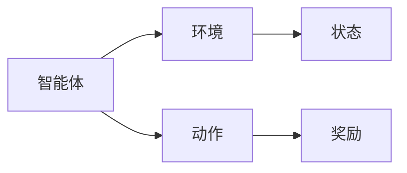
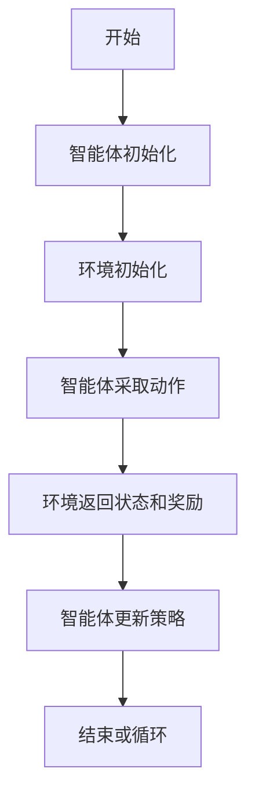
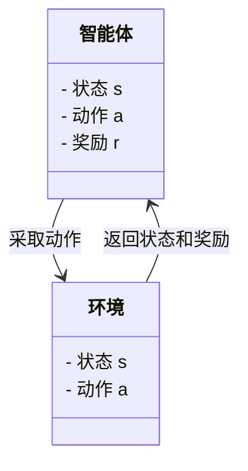
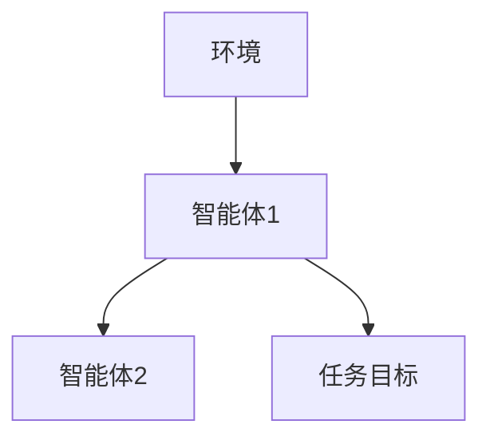
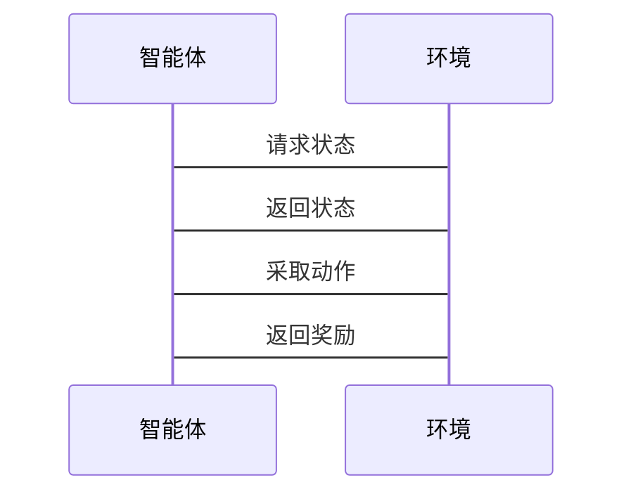

                 


# {{ 多智能体强化学习：复杂环境下的AI Agent协作 }}

> 关键词：多智能体强化学习，AI Agent协作，复杂环境，强化学习算法，智能体通信，分布式智能

> 摘要：多智能体强化学习是一种研究多个智能体在复杂环境中协作与竞争的理论框架，通过多个智能体之间的协作与通信，可以在复杂环境中实现更高效的任务完成。本文从多智能体强化学习的基本概念、核心算法、系统设计、项目实战等方面进行详细探讨，深入剖析其在复杂环境下的协作机制与实现方法。

---

# 第一部分：多智能体强化学习基础

## 第1章：多智能体强化学习概述

### 1.1 多智能体强化学习的背景与意义
- 1.1.1 多智能体强化学习的定义与特点
- 1.1.2 多智能体与单智能体强化学习的区别
- 1.1.3 多智能体强化学习的应用场景

### 1.2 多智能体强化学习的核心概念
- 1.2.1 智能体（Agent）的基本属性
- 1.2.2 协作与竞争的定义与区别
- 1.2.3 环境与任务的建模

### 1.3 多智能体强化学习的挑战
- 1.3.1 状态空间的复杂性
- 1.3.2 动作空间的协调性
- 1.3.3 学习效率的优化

## 第2章：多智能体强化学习的核心概念与联系

### 2.1 多智能体强化学习的核心原理
- 2.1.1 基于价值的多智能体学习
- 2.1.2 基于策略的多智能体学习
- 2.1.3 基于通信的多智能体学习

### 2.2 多智能体强化学习的核心概念对比
- 2.2.1 智能体类型对比（独立、协作、竞争）
- 2.2.2 协作机制对比（分布式、集中式）
- 2.2.3 通信方式对比（语言、动作、意图）

### 2.3 多智能体强化学习的ER实体关系图
```


## 第3章：多智能体强化学习的算法原理

### 3.1 基于价值的多智能体算法
- 3.1.1 Q-learning算法的基本原理
- 3.1.2 多智能体Q-learning的改进方法
- 3.1.3 基于价值的协作机制

### 3.2 基于策略的多智能体算法
- 3.2.1 多智能体策略梯度算法
- 3.2.2 基于策略的协作机制
- 3.2.3 基于策略的通信方式

### 3.3 基于通信的多智能体算法
- 3.3.1 基于语言的通信机制
- 3.3.2 基于动作的通信机制
- 3.3.3 基于意图的通信机制

### 3.4 多智能体强化学习的算法流程图
```


## 第4章：多智能体强化学习的数学模型与公式

### 4.1 基于价值的多智能体算法公式
- $$ Q(s, a) = Q(s, a) + \alpha (r + \gamma \max Q(s', a') - Q(s, a)) $$
- $$ V(s) = \max_a Q(s, a) $$

### 4.2 基于策略的多智能体算法公式
- $$ \theta_{\text{new}} = \theta + \alpha (\nabla J) $$
- $$ J = \mathbb{E}[\log \pi(a|s)] $$

### 4.3 基于通信的多智能体算法公式
- $$ c_{ij} = \text{通信内容} $$
- $$ a_i = \text{基于} c_{ij} \text{的动作} $$

---

# 第二部分：多智能体强化学习的系统设计与实现

## 第5章：多智能体强化学习的系统设计

### 5.1 项目背景与目标
- 5.1.1 项目背景介绍
- 5.1.2 项目目标设定

### 5.2 系统功能设计
- 5.2.1 领域模型设计（Mermaid 类图）
```


### 5.3 系统架构设计
```


### 5.4 系统接口设计
```


## 第6章：多智能体强化学习的项目实战

### 6.1 环境搭建
- 6.1.1 环境配置与安装
- 6.1.2 开发工具与库的使用

### 6.2 系统核心实现
- 6.2.1 智能体类的实现
- 6.2.2 环境类的实现
- 6.2.3 通信机制的实现

### 6.3 代码实现与解读
```python
class Agent:
    def __init__(self, state_space, action_space):
        self.state_space = state_space
        self.action_space = action_space
        # 其他初始化代码

    def take_action(self, state):
        # 根据策略采取动作
        pass

class Environment:
    def __init__(self):
        # 环境初始化代码
        pass

    def get_state(self):
        # 返回当前状态
        pass

    def get_reward(self, action):
        # 返回奖励
        pass
```

### 6.4 案例分析与结果解读
- 6.4.1 案例选择与分析
- 6.4.2 实验结果与优化
- 6.4.3 代码实现与解读

---

# 第三部分：总结与展望

## 第7章：总结与展望

### 7.1 多智能体强化学习的最佳实践
- 7.1.1 系统设计的注意事项
- 7.1.2 算法选择的建议
- 7.1.3 通信机制的优化

### 7.2 本章小结
- 7.2.1 核心内容回顾
- 7.2.2 未来研究方向

### 7.3 项目实战的经验与教训
- 7.3.1 项目实施中的问题
- 7.3.2 解决方案与优化
- 7.3.3 未来改进方向

## 第8章：附录与参考文献

### 8.1 附录
- 8.1.1 代码示例
- 8.1.2 图表补充说明

### 8.2 参考文献
- 8.2.1 主要参考文献列表
- 8.2.2 进一步阅读推荐

---

# 作者：AI天才研究院/AI Genius Institute & 禅与计算机程序设计艺术 /Zen And The Art of Computer Programming

