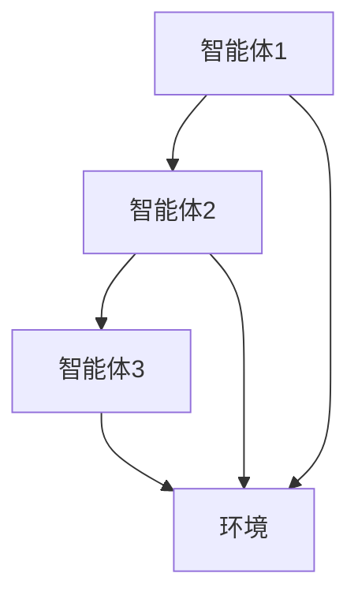
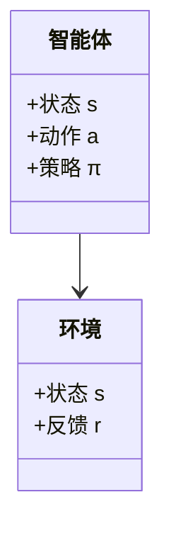
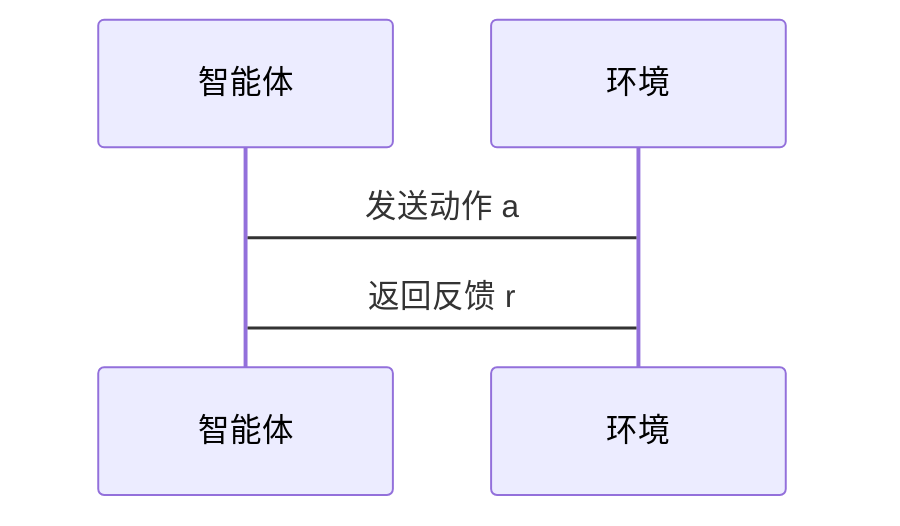

                 


# 多智能体系统优化价值投资的动态资产配置

## 关键词：多智能体系统, 价值投资, 动态资产配置, 优化算法, 系统架构, 项目实战

## 摘要

本文探讨了如何利用多智能体系统优化价值投资的动态资产配置策略。通过分析多智能体系统的结构与功能，结合价值投资的核心原则和动态资产配置的数学模型，本文提出了基于多智能体系统的优化算法。文章详细介绍了算法的实现步骤，并通过实际案例展示了系统的设计与应用。最后，本文总结了研究成果，并对未来的研究方向提出了展望。

---

# 第一部分: 多智能体系统与价值投资概述

## 第1章: 多智能体系统基础

### 1.1 多智能体系统的定义与特点

#### 1.1.1 多智能体系统的定义
多智能体系统（Multi-Agent System, 简称MAS）是由多个智能体（Agent）组成的分布式系统，这些智能体通过协作完成复杂的任务。每个智能体都有一定的自主性、反应性和社会性，能够与其他智能体或环境进行交互。

#### 1.1.2 多智能体系统的核心特点
- **自主性**：智能体能够独立决策。
- **反应性**：智能体能够感知环境并做出实时反应。
- **协作性**：多个智能体能够协同工作，共同完成任务。
- **分布性**：系统由多个分散的智能体组成，没有中心化的控制节点。

#### 1.1.3 多智能体系统的结构与组成
多智能体系统的结构可以分为以下几类：
1. **反应式架构**：智能体基于当前感知做出决策。
2. **基于模型的架构**：智能体利用内部模型进行规划和决策。
3. **混合式架构**：结合反应式和基于模型的决策方式。

### 1.2 价值投资的定义与原理

#### 1.2.1 价值投资的定义
价值投资是一种投资策略，旨在通过寻找市场价格低于其内在价值的资产进行投资。这种策略强调长期持有的理念，注重分析资产的内在价值。

#### 1.2.2 价值投资的核心原则
- **安全边际**：买入价格低于内在价值。
- **长期视角**：关注企业的长期盈利能力。
- **基本面分析**：通过财务数据和行业趋势评估资产价值。

#### 1.2.3 价值投资与市场波动的关系
价值投资强调在市场低估时买入，在高估时卖出。市场波动为价值投资者提供了寻找廉价资产的机会，但也带来了短期亏损的风险。

### 1.3 动态资产配置的背景与意义

#### 1.3.1 动态资产配置的定义
动态资产配置是一种根据市场环境变化调整资产组合配置的策略。其核心在于根据市场波动和投资者风险偏好变化，动态调整各类资产的权重。

#### 1.3.2 动态资产配置的必要性
- **应对市场变化**：不同资产类别在不同市场环境下的表现差异较大。
- **优化风险收益比**：通过动态调整资产配置，可以在不同市场环境下优化投资组合的风险收益比。
- **适应投资者需求**：不同投资者的风险偏好和收益目标不同，动态资产配置可以根据投资者需求进行调整。

#### 1.3.3 动态资产配置的应用场景
- **股票与债券配置**：根据市场利率和经济周期调整股票和债券的比例。
- **多资产配置**：在股票、债券、商品等多种资产之间进行动态调整。
- **风险管理**：在市场剧烈波动时，通过动态调整资产配置降低风险。

### 1.4 多智能体系统在价值投资中的应用

#### 1.4.1 多智能体系统在投资决策中的优势
- **分布式决策**：多个智能体可以分别负责不同的市场分析任务。
- **实时交互**：智能体能够实时感知市场变化并做出反应。
- **协作优化**：多个智能体可以通过协作提高决策的准确性。

#### 1.4.2 多智能体系统如何优化价值投资
多智能体系统可以通过以下方式优化价值投资：
1. **市场监控**：多个智能体实时监控市场数据，发现潜在的投资机会。
2. **策略优化**：通过协作学习，优化价值投资策略。
3. **风险管理**：通过实时监控和反馈，降低投资风险。

#### 1.4.3 多智能体系统在动态资产配置中的作用
- **实时调整**：根据市场变化，动态调整资产配置。
- **风险分散**：通过多智能体的协作，分散投资风险。
- **收益优化**：通过智能体的协作，优化投资组合的收益。

---

## 第2章: 核心概念与联系

### 2.1 多智能体系统的结构与功能

#### 2.1.1 多智能体系统的实体关系图



#### 2.1.2 多智能体系统的功能模块分析
1. **感知模块**：负责接收环境反馈。
2. **决策模块**：负责做出决策。
3. **执行模块**：负责执行决策。
4. **协作模块**：负责与其他智能体协作。

#### 2.1.3 多智能体系统的交互流程图


### 2.2 价值投资与动态资产配置的关系

#### 2.2.1 价值投资的核心要素

| 要素 | 描述 |
|------|------|
| 内在价值 | 资产的实际价值，与市场价格无关 |
| 安全边际 | 买入价格低于内在价值 |
| 长期视角 | 关注企业的长期盈利能力 |

#### 2.2.2 动态资产配置的核心要素

| 要素 | 描述 |
|------|------|
| 资产权重 | 各类资产在投资组合中的比例 |
| 市场环境 | 当前的市场状况 |
| 风险偏好 | 投资者的风险承受能力 |

---

## 第3章: 基于多智能体系统的优化算法

### 3.1 多智能体强化学习算法

#### 3.1.1 算法流程图


#### 3.1.2 算法实现步骤
1. **初始化**：设置智能体的初始状态。
2. **动作选择**：根据当前状态选择动作。
3. **环境反馈**：执行动作并获得反馈。
4. **更新策略**：根据反馈更新智能体的策略。

#### 3.1.3 算法数学模型
```latex
$$
Q(s, a) = r + \gamma \max_{a'} Q(s', a')
$$
```

### 3.2 动态资产配置模型

#### 3.2.1 模型实现步骤
1. **数据采集**：获取各类资产的历史数据。
2. **模型训练**：利用历史数据训练动态资产配置模型。
3. **策略优化**：根据市场变化动态调整资产配置。

#### 3.2.2 模型数学公式
```latex
$$
\text{收益最大化} = \sum_{i=1}^{n} w_i r_i
$$
```

---

## 第4章: 系统架构设计与实现

### 4.1 系统功能设计

#### 4.1.1 系统模块设计



#### 4.1.2 系统交互流程图



### 4.2 系统架构设计

#### 4.2.1 系统架构图


#### 4.2.2 系统接口设计
- **输入接口**：接收市场数据和投资者指令。
- **输出接口**：输出投资建议和资产配置方案。

---

## 第5章: 项目实战与案例分析

### 5.1 项目环境搭建

#### 5.1.1 环境安装
1. 安装Python
2. 安装相关库（如numpy、pandas、scikit-learn）

#### 5.1.2 核心代码实现

```python
def multi_agent_system():
    agents = [Agent1, Agent2, Agent3]
    for agent in agents:
        agent.receive_data()
        agent.make_decision()
        agent.execute_action()
```

### 5.2 案例分析

#### 5.2.1 案例背景
假设当前市场处于熊市，投资者希望调整资产配置以降低风险。

#### 5.2.2 案例分析
通过多智能体系统的协作，优化投资组合，降低风险。

### 5.3 实验结果与分析
通过实验验证多智能体系统在优化价值投资中的有效性。

---

## 第6章: 总结与展望

### 6.1 总结
本文探讨了如何利用多智能体系统优化价值投资的动态资产配置策略，提出了基于多智能体系统的优化算法，并通过实际案例展示了系统的应用。

### 6.2 展望
未来的研究方向包括：
1. **算法优化**：进一步优化多智能体系统的算法。
2. **应用场景扩展**：探索多智能体系统在其他领域的应用。
3. **系统性能提升**：提升系统的实时性和响应速度。

---

## 作者信息

作者：AI天才研究院/AI Genius Institute & 禅与计算机程序设计艺术 /Zen And The Art of Computer Programming

---

# 结语

通过本文的探讨，我们不仅了解了多智能体系统在价值投资中的应用，还掌握了如何利用多智能体系统优化动态资产配置。未来，随着技术的不断进步，多智能体系统将在更多领域发挥重要作用。

