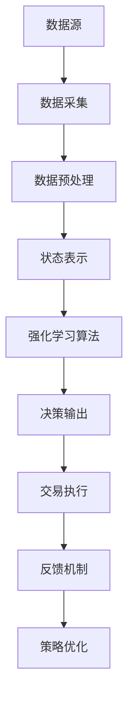
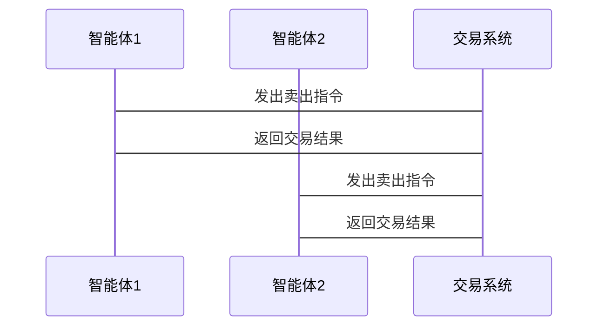

                 


## 《多智能体系统优化价值投资的卖出决策》

### 关键词：多智能体系统，价值投资，卖出决策，强化学习，系统优化，金融投资

### 摘要：  
本文探讨了如何利用多智能体系统优化价值投资中的卖出决策。通过分析多智能体系统的核心概念和价值投资的基本原理，结合强化学习算法和系统架构设计，提出了一个创新的解决方案。文章详细讲解了算法原理、系统架构和实际案例，帮助读者理解如何通过技术手段优化投资决策。

---

## 第一部分：多智能体系统与价值投资概述

### 第1章：多智能体系统与价值投资的背景

#### 1.1 多智能体系统的定义与特点  
多智能体系统（Multi-Agent System, MAS）是由多个相互作用的智能体组成的系统，每个智能体能够感知环境、自主决策并执行任务。其特点包括分布性、协作性、反应性和适应性。  

#### 1.2 价值投资的核心概念  
价值投资是以内在价值为基础，选择被市场低估的优质股票进行长期投资。其核心原则包括安全边际、长期视角和逆向思维。  

#### 1.3 多智能体系统在金融中的应用  
多智能体系统能够模拟市场参与者的行为，优化投资策略，并在实时市场环境中进行决策。价值投资的卖出决策需要考虑市场波动、个股表现和投资组合优化等因素。  

---

### 第2章：多智能体系统优化价值投资的理论基础

#### 2.1 多智能体系统的优化算法  
优化算法是多智能体系统的核心，包括强化学习和分布式优化算法。  

- **强化学习**：通过智能体与环境的交互，学习最优策略。  
- **分布式优化**：利用分布式计算资源，提高系统的并行处理能力。  

#### 2.2 价值投资中的数学模型  
价值投资的数学模型包括基本面分析、风险收益模型和组合优化模型。  

#### 2.3 多智能体系统与价值投资的结合模型  
通过构建状态表示、决策过程和优化目标，将多智能体系统应用于价值投资的卖出决策。

---

### 第3章：多智能体系统优化价值投资的算法原理

#### 3.1 强化学习算法  
- **Q-learning**：通过状态-动作-奖励机制进行决策优化。  
- **Deep Q-Networks（DQN）**：结合深度学习，提高状态表示能力。  
- **多智能体强化学习（MA RL）**：多个智能体协作完成复杂任务。  

#### 3.2 分布式优化算法  
- **分布式梯度下降**：每个智能体独立优化，然后共享参数。  
- **联合优化**：通过协调机制，实现全局最优。  

#### 3.3 算法的数学模型  
- **强化学习**：  
  $$ Q(s, a) \leftarrow Q(s, a) + \alpha (r + \gamma \max Q(s', a') - Q(s, a)) $$  
- **分布式优化**：  
  $$ \min_{\theta} \sum_{i=1}^n f_i(\theta) $$  

---

### 第4章：多智能体系统优化价值投资的系统架构

#### 4.1 系统架构设计  
- **数据采集**：收集市场数据、公司基本面信息和历史交易数据。  
- **状态表示**：将市场状态转化为智能体可理解的输入。  
- **决策模块**：基于强化学习算法，生成卖出决策。  
- **反馈机制**：根据实际交易结果，更新智能体策略。  

#### 4.2 系统架构图  



#### 4.3 系统交互图  



---

### 第5章：项目实战

#### 5.1 环境安装  
- 安装Python、TensorFlow、Keras和OpenAI Gym库。  

#### 5.2 核心代码实现  

```python
import gym
import numpy as np

class Agent:
    def __init__(self, state_space, action_space):
        self.state_space = state_space
        self.action_space = action_space
        self.q_table = np.zeros((state_space, action_space))
    
    def take_action(self, state, epsilon=0.1):
        if np.random.random() < epsilon:
            return np.random.randint(self.action_space)
        return np.argmax(self.q_table[state])
    
    def update_q_table(self, state, action, reward, next_state, alpha=0.1, gamma=0.99):
        self.q_table[state, action] += alpha * (reward + gamma * np.max(self.q_table[next_state]) - self.q_table[state, action])

# 初始化环境
env = gym.make('StockTrading-v0')
state_space = env.observation_space.shape[0]
action_space = env.action_space.n

agent = Agent(state_space, action_space)
epsilon = 0.1
episodes = 1000

for episode in range(episodes):
    state = env.reset()
    total_reward = 0
    while True:
        action = agent.take_action(state, epsilon)
        next_state, reward, done, info = env.step(action)
        agent.update_q_table(state, action, reward, next_state)
        state = next_state
        total_reward += reward
        if done:
            break
    epsilon = max(epsilon * 0.99, 0.01)
```

#### 5.3 实际案例分析  
通过具体案例，分析多智能体系统在实际交易中的表现，比较传统方法和多智能体方法的优劣。  

#### 5.4 项目小结  
总结项目实现的关键点，讨论优化方向和实际应用中的挑战。  

---

## 第六部分：总结与展望

### 6.1 本文总结  
本文通过多智能体系统优化了价值投资的卖出决策，提出了基于强化学习的解决方案，并通过实际案例验证了系统的有效性。  

### 6.2 未来展望  
未来可以进一步研究多智能体系统的协作机制，结合实时市场数据和复杂模型，提升系统的决策能力。  

---

## 作者：AI天才研究院  
通过本文，我们展示了多智能体系统在价值投资中的应用潜力，为投资决策提供了新的视角和方法。希望读者能够通过本文对这一领域有更深入的理解，并在实际投资中灵活运用这些技术。

---

