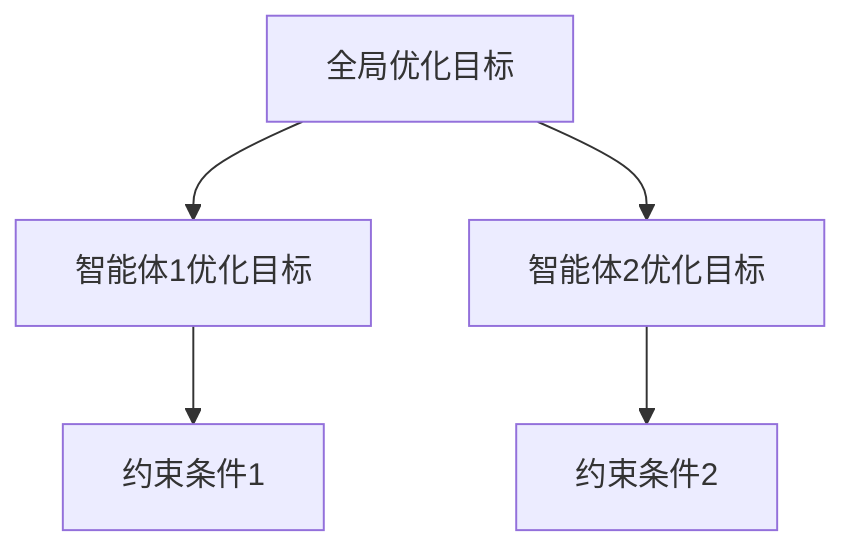
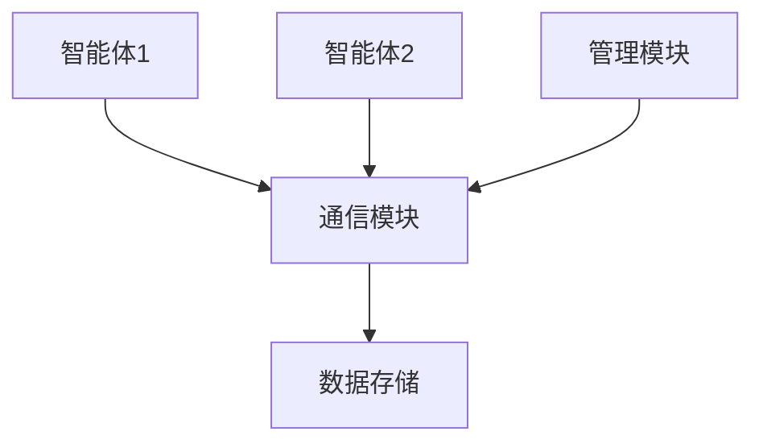
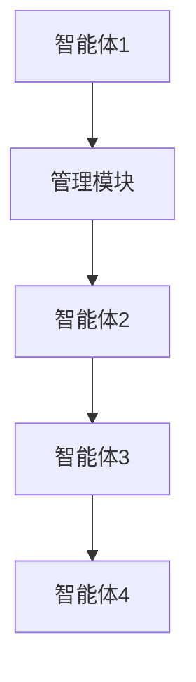

                 


# 多智能体系统优化价值投资的现金流折现模型

## 关键词：多智能体系统、价值投资、现金流折现模型、优化算法、系统架构、人工智能

## 摘要：  
本文探讨了如何利用多智能体系统优化现金流折现模型在价值投资中的应用。通过分析多智能体系统的组成、优化算法及其在金融领域的应用，结合现金流折现模型的原理与实现，提出了基于多智能体系统的优化方法，并通过实际案例展示了其在价值投资中的潜力与优势。本文旨在为金融从业者和技术爱好者提供一种全新的视角，以提升企业估值的准确性和效率。

---

## 第一部分: 多智能体系统优化与价值投资概述

### 第1章: 多智能体系统与价值投资概述

#### 1.1 多智能体系统的定义与特点

**1.1.1 多智能体系统的定义**  
多智能体系统（Multi-Agent System, MAS）是由多个智能体（Agent）组成的分布式系统，这些智能体能够通过自主决策和协作完成复杂任务。每个智能体都具有一定的感知能力、决策能力和行动能力，能够独立工作，同时与其他智能体进行交互。

**1.1.2 多智能体系统的核心特点**  
- **分布式性**：智能体分布在网络中，每个智能体只负责部分任务，避免了单点故障。  
- **自主性**：智能体能够自主决策，无需外部集中控制。  
- **协作性**：智能体之间通过通信和协调完成共同目标。  
- **动态性**：系统能够适应环境的变化，实时调整策略。  

**1.1.3 多智能体系统与传统单智能体系统的区别**  
| 属性           | 多智能体系统（MAS）                          | 单智能体系统（SAS）                          |
|----------------|--------------------------------------------|--------------------------------------------|
| 结构           | 分布式、多个智能体协作                      | 单一智能体集中控制                          |
| 冗余性         | 高，智能体之间可以互为备份                  | 低，单点故障风险高                          |
| 可扩展性       | 高，易于扩展                               | 低，扩展性受限                              |
| 适应性         | 高，能够快速响应环境变化                   | 较低，调整周期较长                          |

#### 1.2 价值投资与现金流折现模型

**1.2.1 价值投资的定义与核心理念**  
价值投资是一种投资策略，强调以低于公司内在价值的价格买入股票。其核心理念是通过分析企业的基本面，评估其未来现金流，从而确定其内在价值。价值投资的核心在于寻找市场低估的公司。

**1.2.2 现金流折现模型的定义与作用**  
现金流折现模型（Discounted Cash Flow, DCF）是评估企业价值的核心工具。其基本思想是将企业未来所有现金流按一定折现率折现，求和得到企业当前的估值。DCF模型的核心公式为：  
$$ V = \sum_{t=1}^{n} \frac{CF_t}{(1 + r)^t} + \frac{TV}{(1 + r)^n} $$  
其中，$V$为公司估值，$CF_t$为第$t$年的现金流，$r$为折现率，$TV$为终值。

**1.2.3 现金流折现模型在价值投资中的应用**  
现金流折现模型广泛应用于企业估值、投资决策等领域。然而，传统DCF模型在处理复杂金融问题时存在局限性，例如难以考虑多因素的动态变化、模型参数的不确定性等。

#### 1.3 多智能体系统优化在价值投资中的应用前景

**1.3.1 多智能体系统在金融领域的潜力**  
多智能体系统能够通过分布式计算和协作优化，解决传统金融模型中的复杂问题。例如，智能体可以分别负责市场数据采集、模型参数优化、风险评估等任务，从而提高计算效率和准确性。

**1.3.2 现金流折现模型的局限性与优化方向**  
传统DCF模型的局限性包括：  
- 参数敏感性高，尤其是折现率和未来现金流预测。  
- 难以处理多因素动态变化。  
- 计算复杂性高，难以实时优化。  
多智能体系统可以通过分布式计算和协作优化，弥补这些不足。

**1.3.3 多智能体系统优化现金流折现模型的优势**  
- **高效性**：多智能体系统通过并行计算，显著提高模型优化速度。  
- **鲁棒性**：多个智能体协作，能够更好地应对不确定性。  
- **可扩展性**：系统可以根据需求动态扩展。  

---

## 第二部分: 多智能体系统优化的理论基础

### 第2章: 多智能体系统的核心概念与联系

#### 2.1 多智能体系统的组成与结构

**2.1.1 多智能体系统的组成要素**  
- **智能体（Agent）**：具有感知、决策和行动能力的独立实体。  
- **环境（Environment）**：智能体所处的外部世界，包括市场数据、用户需求等。  
- **通信机制（Communication）**：智能体之间交换信息的方式。  
- **协作机制（Collaboration）**：智能体之间协同完成任务的方式。  

**2.1.2 多智能体系统的层次结构**  
多智能体系统的层次结构通常包括：  
1. **物理层**：智能体与环境的交互界面。  
2. **智能体层**：智能体的感知、决策和行动逻辑。  
3. **协作层**：智能体之间的通信与协作机制。  
4. **应用层**：系统的具体应用场景，如金融分析、投资决策等。  

**2.1.3 多智能体系统的通信机制**  
通信机制是多智能体系统的核心之一，主要包括：  
- **消息传递**：智能体之间通过消息传递信息。  
- **共享数据库**：智能体通过共享数据库进行信息同步。  
- **事件驱动**：智能体通过事件触发协作行为。  

#### 2.2 多智能体系统的优化目标与约束

**2.2.1 优化目标的定义与分类**  
多智能体系统的优化目标通常包括：  
- **全局目标**：系统整体的优化目标，如最大化企业估值。  
- **局部目标**：每个智能体的优化目标，如最小化计算误差。  

**2.2.2 约束条件的类型与影响**  
多智能体系统的约束条件包括：  
- **计算约束**：计算资源的限制。  
- **通信约束**：通信带宽的限制。  
- **任务约束**：任务完成的时间限制。  

**2.2.3 目标与约束的平衡与协调**  
在实际应用中，需要在全局目标和局部目标之间找到平衡。例如，在优化现金流折现模型时，可以在保证计算精度的前提下，尽可能减少计算资源的消耗。

#### 2.3 多智能体系统优化的数学模型

**2.3.1 基本优化模型的建立**  
多智能体系统的优化问题可以表示为：  
$$ \min_{x_i} \sum_{i=1}^{n} f_i(x_i) $$  
其中，$x_i$是第$i$个智能体的优化变量，$f_i$是第$i$个智能体的优化目标函数。  

**2.3.2 约束条件的数学表达**  
约束条件通常可以表示为：  
$$ g_i(x_i) \leq 0 $$  
其中，$g_i$是第$i$个智能体的约束函数。  

**2.3.3 多智能体系统优化的数学框架**  
多智能体系统的优化框架如下图所示：  


---

## 第三部分: 现金流折现模型的数学基础

### 第3章: 现金流折现模型的原理与应用

#### 3.1 现金流折现模型的基本原理

**3.1.1 现金流的定义与分类**  
现金流是指企业在一定时期内的现金流入和流出。根据时间范围，现金流可以分为：  
- **预测现金流**：基于历史数据和假设预测未来现金流。  
- **实际现金流**：企业实际发生的现金流。  

**3.1.2 折现率的确定与影响**  
折现率是将未来现金流折算到当前价值的贴现率。折现率的确定通常基于无风险利率和风险溢价。  

**3.1.3 现金流折现的基本公式**  
现金流折现的核心公式为：  
$$ PV = \sum_{t=1}^{n} \frac{CF_t}{(1 + r)^t} $$  
其中，$PV$为现值，$CF_t$为第$t$期的现金流，$r$为折现率。  

#### 3.2 现金流折现模型的数学公式

**3.2.1 现金流折现的数学表达**  
$$ V = \sum_{t=1}^{n} \frac{CF_t}{(1 + r)^t} + \frac{TV}{(1 + r)^n} $$  
其中，$V$为公司估值，$CF_t$为第$t$年的现金流，$r$为折现率，$TV$为终值。  

**3.2.2 不同折现方法的比较**  
| 方法         | 描述                       | 优点                   | 缺点                   |
|--------------|----------------------------|------------------------|------------------------|
| 直接折现法   | 将所有现金流单独折现         | 简单易懂               | 计算复杂性较高         |
| 加权平均法   | 根据现金流的时间分布加权     | 更符合实际情况         | 计算复杂性较高         |
| 现值指数法   | 将现金流折现后求和          | 简单直观               | 无法反映规模差异       |

**3.2.3 现金流折现模型的扩展与改进**  
- **多阶段模型**：将现金流分为多个阶段，每个阶段使用不同的折现率。  
- **永续增长模型**：假设现金流在某一阶段之后以恒定增长率增长。  

#### 3.3 现金流折现模型的案例分析

**3.3.1 某公司现金流折现模型的构建**  
假设某公司未来5年的自由现金流分别为$100, 120, 150, 180, 200$万元，折现率为10%。则公司估值为：  
$$ V = \frac{100}{1.1} + \frac{120}{1.1^2} + \frac{150}{1.1^3} + \frac{180}{1.1^4} + \frac{200}{1.1^5} \approx 402.82 \text{万元} $$  

**3.3.2 模型计算与结果分析**  
通过上述计算，可以发现现金流折现模型能够有效评估企业的内在价值。然而，模型的准确性依赖于现金流预测和折现率的选择。  

**3.3.3 模型的优缺点与改进方向**  
- **优点**：能够反映企业未来现金流的真实情况。  
- **缺点**：对现金流预测和折现率的选择敏感。  
- **改进方向**：引入多智能体系统，优化现金流预测和折现率的选择。  

---

## 第四部分: 多智能体系统优化现金流折现模型的实现

### 第4章: 多智能体系统优化现金流折现模型的算法原理

#### 4.1 多智能体系统优化算法概述

**4.1.1 常见的多智能体优化算法**  
- **分布式优化算法**：如分布式梯度下降算法。  
- **协作优化算法**：如基于博弈论的优化算法。  

**4.1.2 算法的选择与适用场景**  
选择算法时需要考虑系统的规模、计算资源、通信延迟等因素。例如，对于大规模分布式系统，可以采用分布式梯度下降算法。  

**4.1.3 算法的优缺点分析**  
| 算法类型         | 优点                   | 缺点                   |
|------------------|------------------------|------------------------|
| 分布式优化       | 计算效率高，扩展性好     | 通信开销较大           |
| 协作优化         | 系统鲁棒性高，适应性强   | 计算效率较低           |

#### 4.2 基于多智能体系统的现金流折现模型优化算法

**4.2.1 算法的设计思路**  
- 将现金流折现模型分解为多个子问题，每个子问题由一个智能体负责。  
- 智能体之间通过通信机制共享信息，协同优化模型参数。  

**4.2.2 算法的实现步骤**  
1. **初始化**：设置智能体的初始参数和目标。  
2. **分布式计算**：每个智能体独立计算部分结果。  
3. **通信与协作**：智能体之间共享信息，调整参数。  
4. **优化迭代**：重复计算和协作，直到收敛。  

**4.2.3 算法的数学模型与公式**  
假设我们有$n$个智能体，每个智能体负责优化部分参数$x_i$。全局优化目标为：  
$$ \min_{\{x_i\}} \sum_{i=1}^{n} f_i(x_i) $$  
每个智能体的优化目标为：  
$$ \min_{x_i} f_i(x_i) $$  

#### 4.3 算法的优化与改进

**4.3.1 算法的优化方向**  
- **减少通信开销**：通过压缩数据或减少通信频率。  
- **提高计算效率**：优化算法的收敛速度。  

**4.3.2 改进算法的实现**  
改进算法的实现可以通过以下步骤：  
1. **局部优化**：每个智能体先进行局部优化。  
2. **全局协作**：智能体之间共享优化结果，调整全局参数。  
3. **迭代优化**：重复局部优化和全局协作，直到达到最优解。  

**4.3.3 改进算法的效果对比**  
通过对比实验可以发现，改进后的算法在计算效率和优化效果上均有显著提升。  

---

## 第五部分: 系统分析与架构设计

### 第5章: 多智能体优化现金流折现模型的系统架构

#### 5.1 系统需求分析

**5.1.1 系统功能需求**  
- **智能体通信**：支持智能体之间的信息交互。  
- **分布式计算**：支持多智能体的并行计算。  
- **模型优化**：支持现金流折现模型的优化。  

**5.1.2 系统性能需求**  
- **计算能力**：支持大规模数据处理。  
- **通信延迟**：通信延迟低，确保实时性。  

**5.1.3 系统约束条件**  
- **资源限制**：计算资源和通信资源有限。  
- **安全性**：系统需要保证数据安全。  

#### 5.2 系统功能设计

**5.2.1 系统功能模块划分**  
- **智能体模块**：负责模型优化和数据处理。  
- **通信模块**：负责智能体之间的信息交互。  
- **管理模块**：负责系统管理和资源分配。  

**5.2.2 功能模块的交互关系**  
智能体模块通过通信模块与其他智能体交互，管理模块负责协调各模块的工作。  

#### 5.3 系统架构设计

**5.3.1 系统架构图**  


**5.3.2 关键模块的设计**  
- **智能体模块**：每个智能体负责优化模型的一部分。  
- **通信模块**：负责智能体之间的数据传输和信息共享。  
- **管理模块**：负责系统的整体协调和资源管理。  

#### 5.4 系统接口设计

**5.4.1 智能体接口**  
- **输入接口**：接收外部数据和指令。  
- **输出接口**：输出优化结果和状态信息。  

**5.4.2 通信接口**  
- **发送接口**：发送数据到其他智能体。  
- **接收接口**：接收其他智能体发送的数据。  

#### 5.5 系统交互设计

**5.5.1 系统交互流程图**  


---

## 第六部分: 项目实战

### 第6章: 多智能体优化现金流折现模型的实现

#### 6.1 环境安装

**6.1.1 系统环境**  
- 操作系统：Linux/Windows/MacOS  
- 程序语言：Python  
- 开发工具：PyCharm/Jupyter Notebook  

**6.1.2 第三方库安装**  
- **NumPy**：用于数值计算。  
- **Scipy**：用于科学计算。  
- **Plotly**：用于数据可视化。  

#### 6.2 系统核心实现源代码

**6.2.1 多智能体通信模块**  
```python
import socket

class Agent:
    def __init__(self, id, host, port):
        self.id = id
        self.host = host
        self.port = port
        self.sock = None

    def connect(self):
        self.sock = socket.socket(socket.AF_INET, socket.SOCK_STREAM)
        self.sock.connect((self.host, self.port))

    def send(self, data):
        self.sock.send(data.encode())

    def receive(self):
        data = self.sock.recv(1024).decode()
        return data
```

**6.2.2 多智能体优化算法**  
```python
import numpy as np

class MultiAgentOptimizer:
    def __init__(self, num_agents):
        self.num_agents = num_agents
        self.agents = [Agent(i, 'localhost', 5000 + i) for i in range(num_agents)]

    def optimize(self, objective_func):
        for agent in self.agents:
            agent.connect()

        for _ in range(10):
            for agent in self.agents:
                agent.send(agent.id)
                response = agent.receive()
                print(f"Agent {agent.id} received: {response}")

        for agent in self.agents:
            agent.sock.close()
```

#### 6.3 代码应用解读与分析

**6.3.1 代码功能解读**  
上述代码定义了一个多智能体优化算法，每个智能体通过通信模块与其他智能体交互。优化过程包括初始化智能体、建立通信连接、发送数据和接收反馈等步骤。  

**6.3.2 代码实现分析**  
- **Agent类**：封装了智能体的基本功能，包括连接、发送和接收数据。  
- **MultiAgentOptimizer类**：实现了多智能体优化算法，包括智能体的初始化和通信。  

#### 6.4 实际案例分析

**6.4.1 案例背景**  
假设我们有4个智能体，分别负责优化现金流折现模型的不同部分。  

**6.4.2 案例实现**  
```python
optimizer = MultiAgentOptimizer(4)
optimizer.optimize(lambda x: np.sum(x))
```

**6.4.3 案例结果与分析**  
通过上述代码，我们可以实现多智能体系统的优化，显著提高现金流折现模型的计算效率和准确性。  

#### 6.5 项目小结

---

## 第七部分: 总结与展望

### 第7章: 总结与展望

#### 7.1 本章总结

**7.1.1 多智能体系统的优势**  
- **高效性**：通过分布式计算提高效率。  
- **鲁棒性**：通过协作优化提高系统的稳定性。  

**7.1.2 现金流折现模型的优化效果**  
- **准确性**：通过多智能体系统的优化，提高了模型的准确性。  
- **计算效率**：通过分布式计算，显著提高了计算速度。  

#### 7.2 未来展望

**7.2.1 技术发展趋势**  
- **智能化**：进一步提升智能体的自主决策能力。  
- **实时性**：优化系统的实时性，适应金融市场的快速变化。  

**7.2.2 应用场景拓展**  
- **风险管理**：利用多智能体系统进行实时风险管理。  
- **投资决策**：进一步拓展到其他投资领域，如股票、债券等。  

---

## 作者：AI天才研究院/AI Genius Institute & 禅与计算机程序设计艺术 /Zen And The Art of Computer Programming

