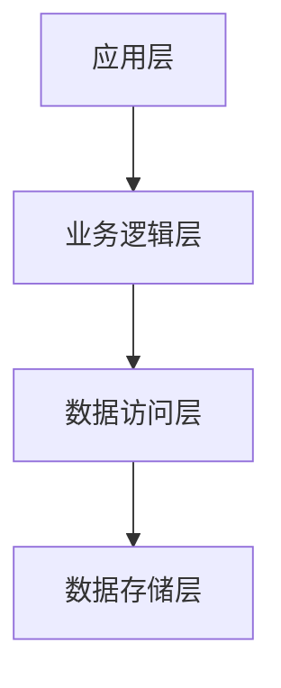
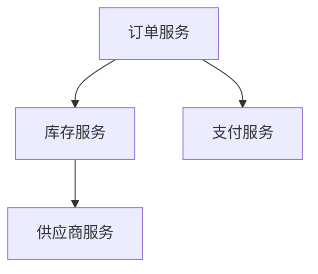

                 


# 多智能体系统分析产业生态系统

> 关键词：多智能体系统，产业生态系统，系统架构，协作算法，决策算法，系统设计

> 摘要：本文系统地分析了多智能体系统在产业生态系统中的应用，探讨了其核心概念、算法原理、系统架构设计以及实际项目实现。通过详细的技术分析和实际案例，展示了多智能体系统如何优化产业生态系统的运作。

---

## 第一部分: 多智能体系统与产业生态系统概述

### 第1章: 多智能体系统基础

#### 1.1 多智能体系统的基本概念
多智能体系统（Multi-Agent System, 简称MAS）是指由多个智能体（Agent）组成的系统，这些智能体能够通过感知环境、自主决策并采取行动，以实现特定目标。多智能体系统的特点包括分布式、协作性、动态性和智能性。与单智能体系统相比，多智能体系统能够更好地处理复杂任务，因为它利用多个智能体的协作和互补性。

#### 1.2 产业生态系统的概念
产业生态系统（Industrial Ecosystem）是一个由多个产业、企业、资源、技术和市场相互作用而形成的复杂网络。它包括产业链的上下游关系、合作伙伴关系以及竞争关系。产业生态系统的核心在于各个组成部分之间的协同与竞争，通过优化资源配置和信息流动，提升整体系统的效率和竞争力。

#### 1.3 多智能体系统与产业生态系统的联系
多智能体系统为产业生态系统的建模和分析提供了一种新的方法。将产业生态系统的各个组成部分（如企业、供应商、客户、合作伙伴）视为智能体，可以利用多智能体系统的技术来模拟和优化这些实体之间的互动。例如，通过协作算法优化供应链管理，通过决策算法提高市场预测能力。

---

### 第2章: 多智能体系统的核心概念与联系

#### 2.1 多智能体系统的核心概念
- **协作与竞争关系**：智能体之间的协作可以提高整体效率，而竞争则能够促进创新和优化。
- **信息共享与决策制定**：智能体需要共享信息以做出最优决策，但信息的共享和利用需要考虑隐私和安全问题。
- **系统的动态性与适应性**：产业生态系统是一个动态变化的系统，多智能体系统需要具备快速适应变化的能力。

#### 2.2 核心概念的属性特征对比
以下是多智能体系统和产业生态系统的核心概念的属性特征对比：

| **属性**       | **多智能体系统**                     | **产业生态系统**                     |
|----------------|------------------------------------|------------------------------------|
| **实体**       | 智能体（Agent）                    | 企业、供应商、客户、合作伙伴         |
| **关系**       | 协作、竞争                         | 供应链、价值链、合作关系             |
| **目标**       | 实现特定任务目标                   | 提高整体产业效率和竞争力             |
| **动态性**     | 系统动态变化                       | 产业动态变化                       |

#### 2.3 ER实体关系图架构
以下是多智能体系统和产业生态系统的ER实体关系图：

```mermaid
erd
    title 多智能体系统和产业生态系统 ER 图

    竞争关系 --> 智能体A
    竞争关系 --> 智能体B
    协作关系 --> 智能体A
    协作关系 --> 智能体B
    信息共享 --> 智能体A
    信息共享 --> 智能体B

    企业 --> 供应链
    供应链 --> 供应商
    供应商 --> 产品
    产品 --> 客户
    客户 --> 市场
```

---

## 第二部分: 多智能体系统的算法原理

### 第3章: 分布式计算与通信协议

#### 3.1 分布式计算的基本原理
分布式计算是指将计算任务分配到多个计算节点上，通过协调这些节点的计算结果来完成整体任务。多智能体系统的分布式计算需要考虑任务分配、资源分配、负载均衡等问题。

#### 3.2 多智能体系统中的通信协议
通信协议是智能体之间进行信息交换的规则。常见的通信协议包括HTTP、WebSocket和消息队列（如Kafka）。通信协议的设计需要考虑实时性、可靠性和安全性。

---

### 第4章: 协作与决策算法

#### 4.1 协作算法的数学模型
协作算法的目标是通过智能体之间的协作来实现整体目标。以下是协作算法的数学模型：

$$
\text{总收益} = \sum_{i=1}^{n} \text{智能体i的收益}
$$

其中，$n$ 是智能体的数量。

#### 4.2 决策算法的数学模型
决策算法的目标是通过智能体的决策来优化整体目标。以下是决策算法的数学模型：

$$
\text{最优决策} = \arg\max_{x} \sum_{i=1}^{n} f_i(x)
$$

其中，$f_i(x)$ 是智能体i的决策函数。

---

### 第5章: 系统架构设计

#### 5.1 分层架构设计
分层架构将系统划分为多个层次，每个层次负责不同的功能。以下是分层架构的示意图：



#### 5.2 微服务架构设计
微服务架构将系统划分为多个独立的服务，每个服务负责不同的功能。以下是微服务架构的示意图：



---

## 第三部分: 项目实战

### 第6章: 供应链优化项目

#### 6.1 环境安装
为了实现供应链优化项目，首先需要安装以下工具：

- Python 3.8+
- Django 或 Spring Boot 框架
- 数据库（如MySQL或PostgreSQL）

#### 6.2 核心代码实现
以下是供应链优化项目的Python代码实现：

```python
class Agent:
    def __init__(self, name):
        self.name = name
        self.goal = None

    def perceive(self, environment):
        pass

    def decide(self):
        pass

class SupplierAgent(Agent):
    def __init__(self, name):
        super().__init__(name)
        self.inventory = 0

    def perceive(self, environment):
        self.inventory = environment['inventory']

    def decide(self):
        if self.inventory < 100:
            return '补充库存'
        else:
            return '保持现状'

class CustomerAgent(Agent):
    def __init__(self, name):
        super().__init__(name)
        self.order = 0

    def perceive(self, environment):
        self.order = environment['order']

    def decide(self):
        if self.order > 50:
            return '增加订单'
        else:
            return '减少订单'

# 初始化环境
environment = {'inventory': 80, 'order': 60}

# 创建智能体
supplier = SupplierAgent('Supplier')
customer = CustomerAgent('Customer')

# 执行感知和决策
supplier.perceive(environment)
customer.perceive(environment)

# 获取决策结果
supplier_decision = supplier.decide()
customer_decision = customer.decide()

print(f"供应商决策: {supplier_decision}")
print(f"客户决策: {customer_decision}")
```

#### 6.3 代码解读与分析
上述代码实现了一个简单的供应链优化项目。通过供应商和客户的智能体协作，优化库存和订单管理。供应商根据当前库存情况决定是否补充库存，客户根据订单量决定是否调整订单。

#### 6.4 案例分析与详细讲解
通过上述代码，我们可以看到多智能体系统在供应链优化中的应用。供应商和客户作为智能体，通过感知环境和决策来优化库存和订单管理。这种协作机制能够提高供应链的整体效率，减少库存积压和订单延迟。

#### 6.5 项目小结
供应链优化项目展示了多智能体系统在产业生态系统中的实际应用。通过智能体的协作和决策，能够优化资源配置，提高整体系统的效率。

---

## 第四部分: 总结与展望

### 第7章: 总结
多智能体系统为产业生态系统的建模和优化提供了一种新的方法。通过协作算法和决策算法，能够优化产业生态系统的资源配置和信息流动。多智能体系统在供应链管理、市场预测、企业协作等领域具有广泛的应用前景。

### 第8章: 展望
随着人工智能和大数据技术的不断发展，多智能体系统在产业生态系统中的应用将更加广泛和深入。未来的研究方向包括智能体的自适应性、系统的可扩展性和系统的安全性。

---

## 作者

作者：AI天才研究院/AI Genius Institute & 禅与计算机程序设计艺术 /Zen And The Art of Computer Programming

