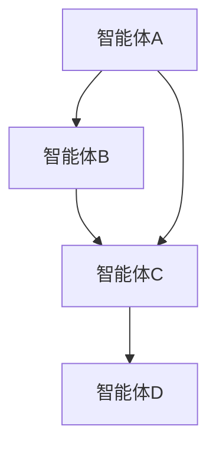
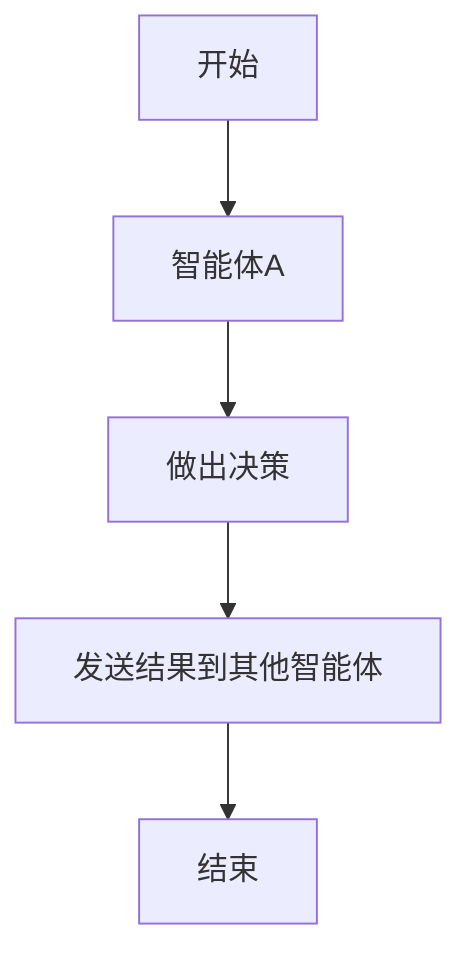
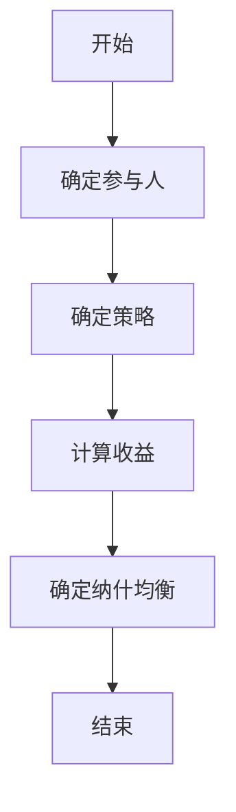
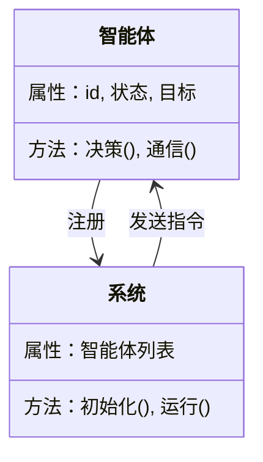

                 


# 多智能体系统分析全球经济联系

> 关键词：多智能体系统，全球经济联系，分布式计算，博弈论，系统架构，经济建模

> 摘要：本文深入探讨了多智能体系统在分析全球经济联系中的应用。通过系统的背景介绍、核心概念讲解、算法原理分析、系统架构设计、项目实战案例以及最佳实践总结，本文为读者提供了一套全面理解多智能体系统如何解析全球经济复杂关系的方法。从基础理论到实际应用，本文旨在帮助读者掌握多智能体系统的核心原理，并将其应用于全球经济联系的建模与分析中。

---

# {{文章标题}}

> 关键词：{{此处列出文章的5-7个核心关键词}}

> 摘要：{{此处给出文章的核心内容和主题思想}}

---

# 多智能体系统分析全球经济联系

## 作者：AI天才研究院/AI Genius Institute & 禅与计算机程序设计艺术 /Zen And The Art of Computer Programming

---

### 第1章 多智能体系统与全球经济联系的背景介绍

#### 1.1 多智能体系统的定义与特点

多智能体系统（Multi-Agent System，MAS）是由多个智能体（Agent）组成的复杂系统，这些智能体能够自主决策、协作和竞争。与传统的单智能体系统相比，多智能体系统具有以下特点：

- **分布式性**：智能体分布在不同的空间或逻辑位置，具有局部决策能力。
- **自主性**：每个智能体都能独立感知环境并采取行动。
- **协作性**：智能体之间通过通信和协作完成共同目标。
- **动态性**：系统的状态和智能体之间的关系会动态变化。

#### 1.2 经济系统中的多智能体模型

经济系统是一个高度复杂的系统，由政府、企业、消费者等多方参与者构成。这些参与者之间存在复杂的交互关系，传统的单一分析方法难以全面捕捉系统的动态行为。多智能体模型能够模拟这些复杂的交互关系，提供更全面的分析工具。

---

#### 1.3 全球经济联系的复杂性

全球经济联系涉及国际贸易、金融流动、产业链分工等多个方面。这些联系呈现出高度的动态性和复杂性，传统的经济模型难以准确描述。多智能体系统通过模拟各个经济主体的行为，能够更好地捕捉全球经济联系的动态变化。

---

### 第2章 多智能体系统的核心概念与联系

#### 2.1 多智能体系统的核心概念

智能体（Agent）是多智能体系统的基本单元，可以分为以下几类：

- **反应式智能体**：基于当前感知环境做出反应。
- **认知式智能体**：具有复杂推理能力，能够根据长期目标做出决策。
- **协作式智能体**：与其他智能体协作完成共同目标。

智能体之间的关系可以是竞争、合作或中立。例如，企业之间的竞争关系可以通过博弈论模型进行建模。

---

#### 2.2 多智能体系统的数学模型

多智能体系统的数学模型通常涉及以下内容：

- **智能体的决策函数**：$D(a) = \argmax_{a' \in A} U(a', a)$，其中$D(a)$表示智能体$a$的决策，$U(a', a)$表示智能体$a$对$a'$的效用评估。
- **系统整体行为的建模**：通过将所有智能体的决策函数综合起来，可以得到系统的整体行为。

---

#### 2.3 多智能体系统的ER实体关系图

以下是多智能体系统中智能体之间的关系示意图：



从图中可以看出，智能体之间的关系可以是多对多的，且可以形成复杂的网络结构。

---

### 第3章 多智能体系统的算法原理

#### 3.1 多智能体系统的分布式计算

分布式计算是多智能体系统的核心算法之一。以下是分布式计算的流程图：



以下是分布式计算的Python代码示例：

```python
def distributed_computation(agent):
    import random
    # 智能体做出决策
    decision = random.choice(['合作', '竞争'])
    return decision

# 示例运行
agents = ['A', 'B', 'C']
results = [distributed_computation(agent) for agent in agents]
print(results)
```

---

#### 3.2 多智能体系统的博弈论模型

博弈论是分析多智能体系统的重要工具。以下是博弈论模型的流程图：



以下是纳什均衡的数学定义：

$$ 纳什均衡：\forall i, \sigma_i \in \Sigma_i, u_i(\sigma) \geq u_i(\sigma'_i, \sigma_{-i}) $$

其中，$\sigma$表示策略组合，$\sigma'_i$表示智能体$i$改变策略后的结果，$u_i$表示智能体$i$的收益函数。

---

### 第4章 多智能体系统的系统分析与架构设计

#### 4.1 系统分析与需求分析

在分析全球经济联系时，我们需要考虑以下问题：

- **问题场景**：全球经济系统中的智能体包括企业、消费者、政府等。
- **系统需求**：需要模拟智能体之间的交互关系，分析系统的整体行为。

---

#### 4.2 系统架构设计

以下是系统的架构设计：



---

#### 4.3 系统接口设计

以下是系统接口设计的序列图：

```mermaid
sequenceDiagram
    participant 智能体A
    participant 智能体B
    智能体A ->> 系统：注册
    系统->> 智能体A：分配任务
    智能体A ->> 智能体B：通信
    智能体B --> 系统：反馈结果
```

---

### 第5章 项目实战：基于多智能体系统的全球经济联系分析

#### 5.1 环境安装

需要安装以下工具：

- Python 3.8+
- 图形库：Matplotlib
- 仿真框架： Mesa（用于多智能体建模）

安装命令：

```bash
pip install mesa matplotlib
```

---

#### 5.2 系统核心实现源代码

以下是全球经济联系分析的Python代码示例：

```python
import mesa

class 经济智能体(mesa.Agent):
    def __init__(self, unique_id, model):
        super().__init__(unique_id, model)
        self.财富 = 0
        self.目标 = '最大化财富'

    def step(self):
        # 智能体做出决策
        if self.财富 < 10:
            self.财富 += 1
        else:
            self.财富 -= 2

class 经济模型(mesa.Model):
    def __init__(self, 币种数量=10):
        self.智能体列表 = []
        for i in range(10):
            agent = 经济智能体(i, self)
            self.智能体列表.append(agent)
        self.schedule = mesa.schedule.RandomActivation(self)

    def step(self):
        self.schedule.step()

# 示例运行
model = 经济模型()
for _ in range(10):
    model.step()
    for agent in model.智能体列表:
        print(f'智能体{agent.id}的财富：{agent.财富}')
```

---

#### 5.3 代码应用解读与分析

上述代码实现了一个简单的经济模型，模拟了10个智能体的财富变化过程。智能体的目标是最大化自己的财富，但在实际操作中，智能体的财富会因为决策的不确定性而波动。

---

#### 5.4 实际案例分析和详细讲解剖析

假设我们分析的是国际贸易中的企业竞争关系。以下是企业的博弈模型：

$$ 收益函数：R_i = a_i \cdot p_i - b_i \cdot c_i $$

其中，$a_i$表示企业$i$的市场占有率，$p_i$表示价格，$c_i$表示成本，$b_i$表示成本系数。

---

### 第6章 最佳实践、小结与拓展阅读

#### 6.1 最佳实践 tips

- 在实际应用中，建议使用 Mesa 等多智能体仿真框架来简化开发过程。
- 需要注意智能体之间的通信和协作机制设计，避免系统出现死锁或无限循环。

---

#### 6.2 小结

通过本文的介绍，读者可以了解到多智能体系统在分析全球经济联系中的重要作用。从基础概念到实际应用，本文提供了一个全面的视角。

---

#### 6.3 注意事项

- 在实际应用中，需要根据具体问题调整智能体的行为模型和算法。
- 需要注意系统的可扩展性和可维护性。

---

#### 6.4 拓展阅读

- 推荐阅读《Multi-Agent Systems: Algorithm and Applications》
- 推荐学习相关课程：麻省理工学院的“Multi-Agent Systems”课程

---

### 作者介绍

作者：AI天才研究院/AI Genius Institute & 禅与计算机程序设计艺术 /Zen And The Art of Computer Programming

---

希望这篇文章能够帮助您更好地理解多智能体系统在分析全球经济联系中的应用。如果需要进一步探讨，欢迎随时联系！

