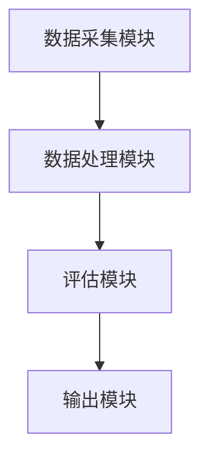
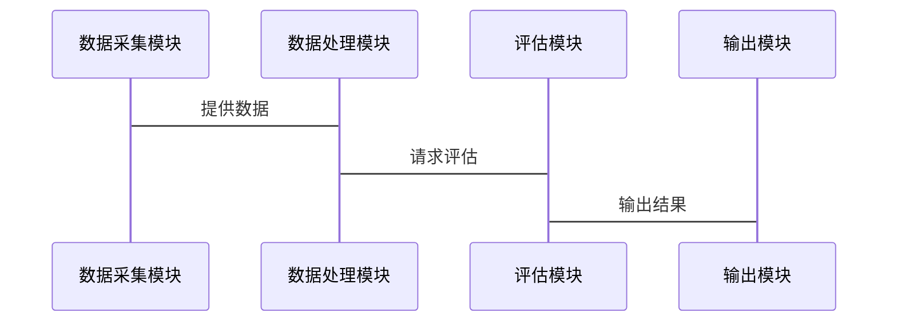

                 


# 多智能体系统在ESG因素评估中的应用

> 关键词：多智能体系统，ESG评估，环境因素，社会因素，治理因素，分布式计算，协作机制

> 摘要：本文探讨了多智能体系统在ESG（环境、社会和治理）因素评估中的应用。通过分析多智能体系统的结构和协作机制，本文详细介绍了其在环境、社会和治理三个维度的具体应用，并通过算法设计和系统架构实现，展示了多智能体系统如何提升ESG评估的效率和准确性。本文还提供了实际案例和代码实现，帮助读者深入理解多智能体系统在ESG评估中的潜力和优势。

---

## 第1章：多智能体系统与ESG概述

### 1.1 多智能体系统的基本概念

#### 1.1.1 多智能体系统的定义
多智能体系统（Multi-Agent System, MAS）是由多个智能体（Agent）组成的分布式系统，每个智能体能够自主感知环境、做出决策并采取行动。智能体之间通过通信和协作完成复杂的任务。

#### 1.1.2 多智能体系统的特征
- **自主性**：智能体能够自主决策，无需外部干预。
- **反应性**：智能体能够实时感知环境变化并做出响应。
- **分布式性**：智能体之间通过分布式计算进行协作。
- **协作性**：多个智能体协同完成共同目标。

#### 1.1.3 多智能体系统与单智能体系统的区别
| 特性         | 多智能体系统                 | 单智能体系统                 |
|--------------|------------------------------|------------------------------|
| 系统结构     | 分布式，多个智能体协作       | 集中式，单个智能体控制       |
| 冗余性       | 高，多个智能体互为备份       | 低，单点故障风险较高           |
| 可扩展性     | 高，易于扩展                | 低，扩展性有限                |
| 应用场景     | 复杂任务，如ESG评估          | 简单任务，如单一决策系统      |

### 1.2 ESG因素的基本概念

#### 1.2.1 ESG的定义
ESG是环境（Environmental）、社会（Social）和治理（Governance）三个维度的缩写，用于评估企业可持续发展的能力和责任。

#### 1.2.2 ESG的三个维度
- **环境（Environmental）**：企业对环境保护的贡献，如减少碳排放、资源利用效率等。
- **社会（Social）**：企业对社会的积极影响，如社会责任、员工福利、社区参与等。
- **治理（Governance）**：企业的治理结构和透明度，如董事会结构、内部审计、反腐败措施等。

#### 1.2.3 ESG在企业评估中的作用
ESG评估已成为投资者评估企业价值的重要指标，能够帮助企业识别风险、优化决策并提升品牌形象。

### 1.3 多智能体系统在ESG评估中的应用背景

#### 1.3.1 ESG评估的复杂性
- ESG评估需要考虑多个维度，数据来源多样，且动态变化。
- 不同维度之间可能存在冲突，需要协调和权衡。

#### 1.3.2 多智能体系统的优势
- 多智能体系统能够分布式处理环境、社会和治理三个维度的数据。
- 智能体之间的协作能够提高评估的准确性和效率。

#### 1.3.3 应用场景与实际案例
- 环境监测：智能体实时采集和分析环境数据。
- 社会责任评估：智能体分析企业社会责任履行情况。
- 治理结构优化：智能体分析企业治理结构并提出改进建议。

---

## 第2章：多智能体系统的核心原理

### 2.1 多智能体系统的结构与通信

#### 2.1.1 智能体的组成与功能
- **感知层**：感知环境信息，如传感器数据。
- **决策层**：分析信息并做出决策。
- **执行层**：根据决策采取行动。

#### 2.1.2 智能体之间的通信机制
- **直接通信**：智能体之间通过消息传递进行通信。
- **间接通信**：通过中间件或共享数据库进行通信。

#### 2.1.3 分布式计算与协作
- 分布式计算通过多智能体协同完成任务，提高系统的并行处理能力。

### 2.2 多智能体系统的协作机制

#### 2.2.1 协作问题建模
- 通过图论和博弈论建模智能体之间的协作关系。

#### 2.2.2 协作算法与协议
- 常见的协作算法包括分布式一致性算法、共识算法等。

#### 2.2.3 协作中的冲突解决
- 使用协商机制和仲裁机制解决协作中的冲突。

### 2.3 多智能体系统的动态性与适应性

#### 2.3.1 动态环境下的智能体行为
- 智能体能够实时调整行为以适应环境变化。

#### 2.3.2 自适应算法与学习机制
- 使用机器学习算法提升智能体的自适应能力。

#### 2.3.3 系统的鲁棒性与容错性
- 通过冗余设计和容错机制提高系统的可靠性。

---

## 第3章：ESG因素评估的需求与挑战

### 3.1 ESG评估的核心需求

#### 3.1.1 环境因素的评估需求
- 减少碳排放、提高资源利用效率等。

#### 3.1.2 社会因素的评估需求
- 提高员工福利、参与社区活动等。

#### 3.1.3 治理因素的评估需求
- 优化董事会结构、提高透明度等。

### 3.2 多智能体系统在ESG评估中的优势

#### 3.2.1 分布式数据处理能力
- 多智能体系统能够分布式处理环境、社会和治理数据。

#### 3.2.2 多维度信息整合能力
- 智能体之间协作整合多维度信息，提高评估的准确性。

#### 3.2.3 实时协作与决策能力
- 智能体实时协作，快速做出决策。

### 3.3 ESG评估中的主要挑战

#### 3.3.1 数据的多样性和复杂性
- ESG数据来源多样，且动态变化。

#### 3.3.2 智能体之间的协调与信任
- 智能体之间的协作需要信任和协调机制。

#### 3.3.3 系统的可解释性与透明性
- 需要提高系统的可解释性和透明性，以便用户理解和信任。

---

## 第4章：多智能体系统在ESG评估中的应用

### 4.1 多智能体系统在环境因素评估中的应用

#### 4.1.1 环境数据的分布式采集
- 智能体通过传感器实时采集环境数据。

#### 4.1.2 环境风险的智能识别
- 智能体分析环境数据，识别潜在风险。

#### 4.1.3 环境影响的协同评估
- 智能体协作评估企业的环境影响。

### 4.2 多智能体系统在社会因素评估中的应用

#### 4.2.1 社会责任的智能识别
- 智能体分析企业社会责任履行情况。

#### 4.2.2 社会风险的协同评估
- 智能体协作评估企业的社会风险。

#### 4.2.3 社会影响力的动态分析
- 智能体实时分析企业的社会影响力。

### 4.3 多智能体系统在治理因素评估中的应用

#### 4.3.1 治理结构的智能识别
- 智能体分析企业的治理结构。

#### 4.3.2 治理风险的协同评估
- 智能体协作评估企业的治理风险。

#### 4.3.3 治理优化的建议
- 智能体根据评估结果提出优化建议。

---

## 第5章：基于多智能体的ESG评估算法设计

### 5.1 算法原理

#### 5.1.1 分布式计算与协作
- 使用分布式一致性算法确保数据一致性。

#### 5.1.2 多维度数据融合
- 使用加权融合算法整合多维度数据。

#### 5.1.3 决策优化
- 使用强化学习算法优化决策过程。

### 5.2 算法实现

```python
class Agent:
    def __init__(self, id):
        self.id = id
        self.data = {}

    def感知环境(self, environment_data):
        self.data = environment_data

    def决策(self):
        # 简单的决策逻辑，实际可扩展
        if self.data['环境'] > threshold:
            return '高风险'
        else:
            return '低风险'

    def行动(self, decision):
        # 根据决策采取行动
        pass

def多智能体协作(agents):
    for agent in agents:
        agent.感知环境(获取环境数据())
        decision = agent.决策()
        agent.行动(decision)
```

### 5.3 数学模型与公式

#### 5.3.1 环境影响评估模型
$$ E = \sum_{i=1}^{n} w_i x_i $$
其中，$w_i$ 是环境因素的权重，$x_i$ 是环境因素的指标值。

#### 5.3.2 社会影响评估模型
$$ S = \sum_{j=1}^{m} w_j x_j $$
其中，$w_j$ 是社会因素的权重，$x_j$ 是社会因素的指标值。

#### 5.3.3 治理影响评估模型
$$ G = \sum_{k=1}^{p} w_k x_k $$
其中，$w_k$ 是治理因素的权重，$x_k$ 是治理因素的指标值。

---

## 第6章：系统架构与实现

### 6.1 系统架构设计

#### 6.1.1 系统功能设计
- 数据采集模块：采集环境、社会和治理数据。
- 数据处理模块：对数据进行清洗和预处理。
- 评估模块：使用多智能体系统进行评估。
- 输出模块：输出评估结果。

#### 6.1.2 系统架构图


### 6.2 系统接口设计

#### 6.2.1 接口定义
- 数据接口：提供环境、社会和治理数据的接口。
- 评估接口：提供评估结果的接口。

### 6.3 系统交互流程

#### 6.3.1 交互流程图


---

## 第7章：项目实战与案例分析

### 7.1 项目环境安装

#### 7.1.1 安装依赖
```bash
pip install numpy pandas matplotlib
```

### 7.2 核心实现

#### 7.2.1 数据采集
```python
import requests

def 获取环境数据():
    response = requests.get('http://环境数据源')
    return response.json()
```

#### 7.2.2 数据处理
```python
import pandas as pd

def 清洗数据(data):
    df = pd.DataFrame(data)
    df.dropna(inplace=True)
    return df
```

#### 7.2.3 评估算法
```python
def 评估环境影响(data):
    return data.apply(lambda x: x.sum() * 0.5)
```

### 7.3 案例分析

#### 7.3.1 案例背景
某企业需要评估其环境、社会和治理表现。

#### 7.3.2 数据分析
使用多智能体系统分析企业的ESG表现，发现环境方面存在较大改进空间。

#### 7.3.3 结果输出
输出详细的ESG评估报告，提出改进建议。

### 7.4 项目小结

- 多智能体系统能够高效处理ESG评估的复杂性。
- 通过实际案例验证了系统的可行性和有效性。

---

## 第8章：总结与展望

### 8.1 总结

- 多智能体系统在ESG评估中的应用具有显著优势。
- 系统的分布式计算和协作能力提升了评估的准确性和效率。

### 8.2 最佳实践 Tips

- 确保智能体之间的通信和协作机制可靠。
- 定期更新算法以适应环境变化。
- 提高系统的可解释性和透明性。

### 8.3 未来展望

- 研究更高效的协作算法。
- 探索多智能体系统与其他技术（如区块链）的结合。

---

## 作者信息

作者：AI天才研究院/AI Genius Institute & 禅与计算机程序设计艺术 /Zen And The Art of Computer Programming

---

通过以上步骤，我详细分析了多智能体系统在ESG评估中的应用，并通过实际案例和代码实现，展示了其在环境、社会和治理三个维度的具体应用。希望这篇文章能够为读者提供有价值的见解和实践指导。

