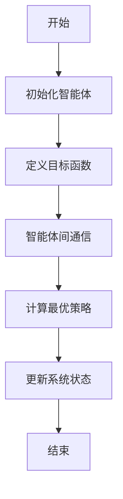

                 


# 多智能体系统在产业升级趋势预测中的应用：把握结构性机会

## 关键词：多智能体系统，产业升级，趋势预测，人工智能，系统架构

## 摘要：  
随着人工智能技术的快速发展，多智能体系统（Multi-Agent Systems, MAS）作为一种分布式智能系统，正在成为产业升级趋势预测的重要工具。本文从多智能体系统的概念、算法原理、数学模型、系统架构等多个维度，深入分析其在产业升级中的应用，并通过实际案例展示如何利用多智能体系统构建趋势预测模型。文章最后总结了多智能体系统在实际应用中的最佳实践和未来发展方向。

---

# 第一部分: 多智能体系统概述

## 第1章: 多智能体系统基础

### 1.1 多智能体系统的定义与特点  
多智能体系统（MAS）是由多个智能体（Agent）组成的分布式系统，每个智能体能够感知环境、自主决策并与其他智能体协作。MAS的核心特点包括：  
1. **自主性**：智能体能够自主决策，无需外部干预。  
2. **反应性**：智能体能够实时感知环境并做出反应。  
3. **协作性**：多个智能体能够协同完成复杂任务。  
4. **分布性**：智能体分布在网络中，通过通信协议进行交互。  

### 1.2 多智能体系统的组成与结构  
多智能体系统由以下组成要素构成：  
1. **智能体**：系统的最基本单元，能够执行任务并与其他智能体交互。  
2. **环境**：智能体所处的外部环境，包括物理环境和任务环境。  
3. **通信协议**：智能体之间的通信规则和数据交换格式。  
4. **任务目标**：系统需要完成的特定目标或任务。  

### 1.3 多智能体系统在产业升级中的应用背景  
产业升级是指通过技术、管理、模式等方面的优化，提升产业的竞争力和效率。多智能体系统在产业升级中的应用主要体现在以下几个方面：  
1. **趋势预测**：通过分析市场数据、政策变化等信息，预测产业升级的方向和趋势。  
2. **协同优化**：通过智能体的协作，优化产业链的各个环节，提高整体效率。  
3. **风险管理**：通过实时监测和预测，降低产业升级过程中的风险。  

### 1.4 本章小结  
本章介绍了多智能体系统的定义、特点、组成以及在产业升级中的应用背景，为后续章节的分析奠定了基础。

---

# 第二部分: 多智能体系统的核心算法与数学模型

## 第2章: 多智能体系统的算法原理  

### 2.1 多智能体系统的核心算法  
多智能体系统的算法主要包括以下几个方面：  
1. **博弈论算法**：用于智能体之间的策略选择和博弈分析。  
2. **分布式计算算法**：用于智能体之间的任务分配和协作。  
3. **通信协议设计**：用于智能体之间的数据交换和协同控制。  

#### 2.1.1 博弈论基础  
博弈论是分析智能体之间策略选择的重要工具。在多智能体系统中，常用纳什均衡（Nash Equilibrium）来描述智能体的最优策略。  
**纳什均衡的定义**：在策略组合 $(s_1, s_2, ..., s_n)$ 中，每个智能体 $i$ 的策略 $s_i$ 是其在其他智能体策略不变的情况下最优的反应。  
公式表示为：  
$$\text{如果 } s_i \text{ 是智能体 } i \text{ 的最优策略，那么 } (s_1, s_2, ..., s_n) \text{ 是纳什均衡。}$$  

#### 2.1.2 分布式计算与协调算法  
分布式计算算法用于智能体之间的任务分配和协作。常用算法包括：  
1. **一致性算法**：确保所有智能体的状态一致。  
2. **任务分配算法**：根据智能体的能力和资源分配任务。  

#### 2.1.3 多智能体系统的通信协议  
通信协议是智能体之间进行数据交换和协同控制的基础。常用的通信协议包括：  
1. ** publish-subscribe 模型**：智能体发布消息，其他智能体订阅消息。  
2. ** request-response 模型**：智能体请求服务，服务提供者响应。  

### 2.2 多智能体系统的数学模型  
多智能体系统的数学模型主要基于博弈论和优化理论。  
#### 2.2.1 纳什均衡的数学表达  
纳什均衡的数学表达式为：  
$$\text{对于所有智能体 } i, \text{ 策略 } s_i \text{ 满足：}$$  
$$\forall i, s_i = \arg\max_{a_i} \sum_{j=1}^{N} u_j(s_i, s_{-i})$$  
其中，$u_j$ 表示智能体 $j$ 的效用函数，$s_{-i}$ 表示其他智能体的策略。  

#### 2.2.2 多智能体系统中的状态转移方程  
多智能体系统中的状态转移方程可以表示为：  
$$P(s' | s, a)$$  
其中，$s$ 表示当前状态，$a$ 表示智能体采取的动作，$s'$ 表示新的状态。  

#### 2.2.3 联合策略的优化模型  
联合策略的优化模型可以表示为：  
$$\max_{\theta} \sum_{i=1}^{N} \text{Utility}_i(\theta)$$  
其中，$\text{Utility}_i(\theta)$ 表示智能体 $i$ 的效用函数，$\theta$ 表示系统参数。  

### 2.3 多智能体系统的算法流程图  
以下是一个多智能体系统算法的流程图：  


### 2.4 本章小结  
本章介绍了多智能体系统的算法原理和数学模型，重点分析了博弈论、分布式计算和通信协议在多智能体系统中的应用。

---

# 第三部分: 产业升级趋势预测模型

## 第3章: 产业升级趋势预测模型  

### 3.1 产业升级趋势预测的背景与意义  
产业升级趋势预测是指通过分析市场、技术、政策等因素的变化，预测产业升级的方向和时间。多智能体系统在产业升级趋势预测中的应用主要体现在以下几个方面：  
1. **市场分析**：分析市场需求变化，预测产业升级的方向。  
2. **政策解读**：分析政策变化对产业升级的影响。  
3. **技术预测**：分析技术创新对产业升级的推动作用。  

### 3.2 多智能体系统在产业升级趋势预测中的应用  
多智能体系统在产业升级趋势预测中的应用可以分为以下几个步骤：  
1. **数据收集**：收集市场、政策、技术等数据。  
2. **模型构建**：构建多智能体系统模型，模拟产业升级过程。  
3. **预测分析**：通过模型模拟，预测产业升级的趋势。  
4. **优化调整**：根据预测结果，优化产业升级策略。  

#### 3.2.1 产业升级趋势预测模型的构建  
产业升级趋势预测模型的构建主要包括以下几个步骤：  
1. **数据预处理**：对收集到的数据进行清洗和标准化。  
2. **模型训练**：使用机器学习算法对模型进行训练。  
3. **模型验证**：对模型进行验证，调整参数。  
4. **模型部署**：将模型部署到实际应用中。  

#### 3.2.2 产业升级趋势预测模型的案例分析  
以下是一个产业升级趋势预测模型的案例分析：  
假设我们需要预测某个行业的产业升级趋势，首先需要收集该行业的市场数据、政策数据和技术数据。然后，构建一个多智能体系统模型，模拟产业升级过程。通过模型模拟，我们可以预测出产业升级的方向和时间，并根据预测结果优化产业升级策略。  

### 3.3 多智能体系统在产业升级趋势预测中的系统架构  
多智能体系统在产业升级趋势预测中的系统架构主要包括以下几个部分：  
1. **数据采集模块**：负责采集市场、政策、技术等数据。  
2. **模型构建模块**：负责构建多智能体系统模型。  
3. **预测分析模块**：负责通过模型模拟，预测产业升级的趋势。  
4. **优化调整模块**：负责根据预测结果，优化产业升级策略。  

### 3.4 本章小结  
本章介绍了多智能体系统在产业升级趋势预测中的应用，通过案例分析和系统架构设计，展示了如何利用多智能体系统构建产业升级趋势预测模型。

---

# 第四部分: 多智能体系统的系统架构与实现

## 第4章: 多智能体系统的系统架构与实现  

### 4.1 系统架构设计  
多智能体系统的系统架构设计主要包括以下几个部分：  
1. **智能体设计**：设计智能体的结构和功能。  
2. **通信协议设计**：设计智能体之间的通信协议。  
3. **任务分配设计**：设计智能体之间的任务分配机制。  

#### 4.1.1 智能体设计  
智能体设计主要包括以下几个方面：  
1. **智能体的感知能力**：智能体需要能够感知环境并做出反应。  
2. **智能体的决策能力**：智能体需要能够根据感知信息做出决策。  
3. **智能体的协作能力**：智能体需要能够与其他智能体协作完成任务。  

#### 4.1.2 通信协议设计  
通信协议设计主要包括以下几个方面：  
1. **数据格式设计**：设计智能体之间的数据交换格式。  
2. **通信规则设计**：设计智能体之间的通信规则。  
3. **安全性设计**：设计智能体之间的通信安全性。  

### 4.2 系统实现  

#### 4.2.1 系统核心实现代码  
以下是一个多智能体系统的Python实现代码示例：  
```python
class Agent:
    def __init__(self, id):
        self.id = id
        self.state = 'idle'
    
    def get_state(self):
        return self.state
    
    def set_state(self, state):
        self.state = state

class MultiAgentSystem:
    def __init__(self, agent_ids):
        self.agents = [Agent(id) for id in agent_ids]
    
    def start(self):
        for agent in self.agents:
            agent.set_state('active')
    
    def stop(self):
        for agent in self.agents:
            agent.set_state('idle')

# 示例用法
mas = MultiAgentSystem([1, 2, 3])
mas.start()
for agent in mas.agents:
    print(f"Agent {agent.id} 的状态：{agent.get_state()}")
```

#### 4.2.2 系统交互流程图  
以下是一个多智能体系统交互流程图：  


### 4.3 本章小结  
本章介绍了多智能体系统的系统架构与实现，通过代码示例和系统交互流程图，展示了如何利用多智能体系统构建实际应用。

---

# 第五部分: 最佳实践与小结

## 第5章: 最佳实践与小结  

### 5.1 最佳实践  
在实际应用中，多智能体系统的最佳实践包括以下几个方面：  
1. **系统设计**：在设计系统时，需要充分考虑智能体的自主性、协作性和分布性。  
2. **通信协议**：在设计通信协议时，需要充分考虑数据格式、通信规则和安全性。  
3. **算法优化**：在实现算法时，需要充分考虑算法的效率和可扩展性。  

### 5.2 小结  
本文从多智能体系统的概念、算法原理、数学模型、系统架构等多个维度，深入分析了其在产业升级趋势预测中的应用。通过实际案例和系统架构设计，展示了如何利用多智能体系统构建产业升级趋势预测模型。未来，随着人工智能技术的不断发展，多智能体系统在产业升级中的应用将更加广泛和深入。

---

# 作者：AI天才研究院/AI Genius Institute & 禅与计算机程序设计艺术/Zen And The Art of Computer Programming

