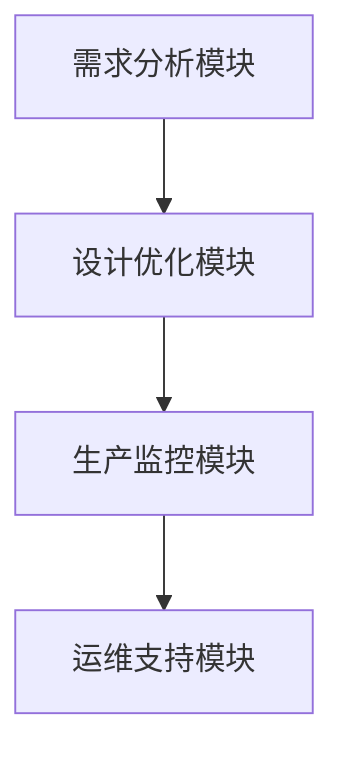
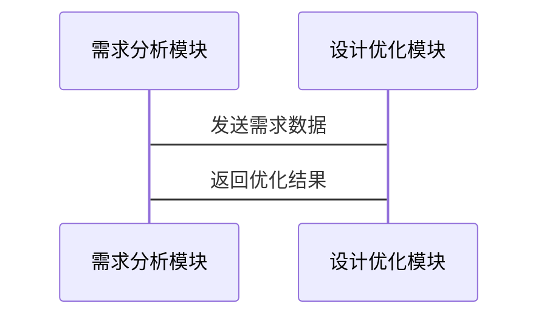
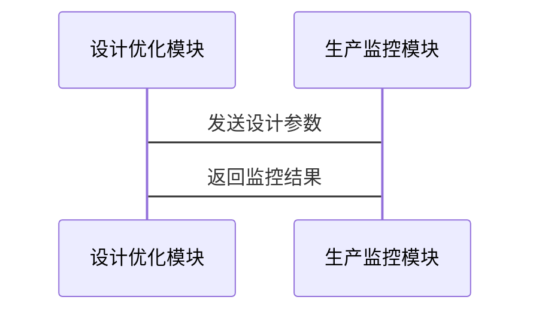

                 


# 多智能体系统在产品生命周期分析中的应用

## 关键词：
多智能体系统, 产品生命周期, 协作机制, 系统架构, 算法, 案例分析

## 摘要：
本文详细探讨了多智能体系统在产品生命周期分析中的应用，从基本概念到实际案例，系统地分析了多智能体系统的协作机制、算法实现及其在产品设计、生产、运维等阶段的具体应用。文章结合理论与实践，通过丰富的图表和代码示例，展示了多智能体系统如何提升产品生命周期管理的效率和质量。

---

# 第1章: 多智能体系统与产品生命周期背景

## 1.1 多智能体系统的定义与特点
### 1.1.1 多智能体系统的定义
多智能体系统（Multi-Agent System, MAS）是由多个智能体组成的系统，这些智能体能够自主决策、协作完成任务，并通过通信机制进行信息交换。

### 1.1.2 多智能体系统的核心特点
- **自主性**：每个智能体都能独立决策。
- **反应性**：能够感知环境并实时响应。
- **协作性**：通过通信和协作完成复杂任务。
- **分布性**：智能体分布在网络中，不依赖中心节点。

### 1.1.3 多智能体系统与传统单体系统的主要区别
| 特性 | 单体系统 | 多智能体系统 |
|------|----------|-------------|
| 结构 | 单一中心节点 | 分布式结构 |
| 决策 | 集中决策 | 分布式决策 |
| 可扩展性 | 较低 | 较高 |

## 1.2 产品生命周期的基本概念
### 1.2.1 产品生命周期的定义
产品从构思到报废的整个过程，包括需求分析、设计、生产、销售、维护等阶段。

### 1.2.2 产品生命周期的主要阶段
1. **需求分析阶段**：明确产品功能需求。
2. **设计阶段**：设计产品结构和功能。
3. **生产阶段**：制造产品。
4. **销售与运维阶段**：产品投放市场并进行维护。

### 1.2.3 产品生命周期管理的重要性
- 提高产品开发效率。
- 降低生产成本。
- 提升产品服务质量。

## 1.3 多智能体系统在产品生命周期中的应用背景
### 1.3.1 产品生命周期管理的复杂性
- 需求多样化。
- 环节复杂化。
- 跨部门协作需求高。

### 1.3.2 多智能体系统在产品生命周期管理中的优势
- 提高协作效率。
- 实现实时监控。
- 增强系统灵活性。

### 1.3.3 当前技术发展趋势与应用前景
- 人工智能技术的进步。
- 物联网的发展。
- 数字化转型的需求。

## 1.4 本章小结
本章介绍了多智能体系统的基本概念和特点，分析了产品生命周期的各个阶段，并探讨了多智能体系统在产品生命周期管理中的应用背景和优势。

---

# 第2章: 多智能体系统的核心概念与原理

## 2.1 多智能体系统的组成结构
### 2.1.1 智能体的定义与分类
- **定义**：智能体是具有感知、决策、执行能力的实体。
- **分类**：可分为简单反射型、基于模型的反应型、目标驱动型等。

### 2.1.2 多智能体系统的层次结构
- **物理层**：智能体的物理实现。
- **逻辑层**：智能体的逻辑结构。
- **通信层**：智能体之间的通信机制。

### 2.1.3 智能体之间的通信机制
- **消息传递**：通过消息传递信息。
- **服务调用**：通过服务接口进行交互。

## 2.2 多智能体系统的协作机制
### 2.2.1 协作的基本概念
协作是指多个智能体为了共同目标而协同工作。

### 2.2.2 常见的协作模型
- **基于规则的协作模型**：通过预定义规则进行协作。
- **基于协商的协作模型**：智能体之间通过协商达成一致。

### 2.2.3 协作中的冲突解决策略
- **优先级机制**：通过优先级解决冲突。
- **协商机制**：通过协商达成一致。

## 2.3 多智能体系统的决策机制
### 2.3.1 分布式决策的基本原理
- **分布式计算**：通过分布式计算进行决策。
- **局部决策**：每个智能体基于局部信息做出决策。

### 2.3.2 基于博弈论的决策模型
- **纳什均衡**：所有智能体都采取最优策略。
- **协同博弈**：智能体之间通过合作实现共同目标。

### 2.3.3 基于规则的决策方法
- **简单规则**：基于简单的规则进行决策。
- **复杂规则**：基于复杂的规则进行决策。

## 2.4 本章小结
本章详细介绍了多智能体系统的组成结构、协作机制和决策机制，为后续章节的应用分析奠定了基础。

---

# 第3章: 多智能体系统与产品生命周期的关联

## 3.1 产品生命周期各阶段的分析
### 3.1.1 需求分析阶段
- **需求收集**：通过智能体收集客户需求。
- **需求分析**：通过智能体分析需求优先级。

### 3.1.2 产品设计阶段
- **设计优化**：通过智能体进行设计协作。
- **设计验证**：通过智能体进行设计验证。

### 3.1.3 生产制造阶段
- **生产监控**：通过智能体实时监控生产过程。
- **质量控制**：通过智能体进行质量检测。

### 3.1.4 运维与维护阶段
- **故障诊断**：通过智能体诊断产品故障。
- **维护管理**：通过智能体管理产品维护。

## 3.2 多智能体系统在产品生命周期管理中的应用
### 3.2.1 需求分析中的应用
- **需求收集**：智能体通过传感器收集客户需求。
- **需求分析**：智能体通过数据分析工具分析需求。

### 3.2.2 设计优化中的应用
- **设计协作**：智能体通过协作工具进行设计协作。
- **设计验证**：智能体通过仿真工具验证设计。

### 3.2.3 生产监控中的应用
- **生产监控**：智能体通过物联网技术实时监控生产过程。
- **质量控制**：智能体通过机器学习算法进行质量检测。

### 3.2.4 运维支持中的应用
- **故障诊断**：智能体通过大数据分析诊断产品故障。
- **维护管理**：智能体通过区块链技术管理产品维护。

## 3.3 多智能体系统在产品生命周期中的优势
### 3.3.1 提高效率
- **自动化**：通过智能体实现自动化操作。
- **实时监控**：通过智能体实时监控生产过程。

### 3.3.2 降低风险
- **预测性维护**：通过智能体预测设备故障。
- **风险管理**：通过智能体进行风险评估。

### 3.3.3 增强灵活性
- **快速响应**：通过智能体快速响应客户需求。
- **灵活协作**：通过智能体实现灵活的协作模式。

## 3.4 本章小结
本章分析了多智能体系统在产品生命周期各阶段的应用，展示了其在提高效率、降低风险和增强灵活性方面的优势。

---

# 第4章: 多智能体系统的协作算法与实现

## 4.1 多智能体协作算法概述
### 4.1.1 分布式计算
- **定义**：通过分布式计算实现协作。
- **实现**：通过消息传递机制实现协作。

### 4.1.2 协商机制
- **定义**：通过协商机制达成一致。
- **实现**：通过拍卖算法实现协商。

## 4.2 基于博弈论的协作算法
### 4.2.1 博弈论基础
- **纳什均衡**：所有智能体都采取最优策略。

### 4.2.2 协作博弈
- **协同博弈**：智能体之间通过合作实现共同目标。

## 4.3 协作算法的数学模型
### 4.3.1 分布式计算模型
$$ f(x) = \sum_{i=1}^{n} f_i(x_i) $$

### 4.3.2 协商机制模型
$$ \text{协商结果} = \arg\max_{x} \sum_{i=1}^{n} u_i(x) $$

## 4.4 协作算法的实现
### 4.4.1 分布式计算实现
```python
def distributed_computation(x):
    return sum(f_i(x_i) for x_i in x)
```

### 4.4.2 协商机制实现
```python
def auction_protocol(bids):
    return max(bids, key=lambda x: x['bid'])
```

## 4.5 本章小结
本章详细介绍了多智能体系统的协作算法，包括分布式计算和协商机制，并通过数学模型和代码示例进行了详细讲解。

---

# 第5章: 多智能体系统的架构设计与实现

## 5.1 系统架构设计
### 5.1.1 系统模块划分
- **需求分析模块**：负责需求收集和分析。
- **设计优化模块**：负责设计协作和验证。
- **生产监控模块**：负责生产过程监控。
- **运维支持模块**：负责故障诊断和维护管理。

### 5.1.2 系统架构图


## 5.2 系统接口设计
### 5.2.1 接口定义
- **需求分析接口**：接收需求信息并返回分析结果。
- **设计优化接口**：接收设计参数并返回优化结果。
- **生产监控接口**：接收生产数据并返回监控结果。
- **运维支持接口**：接收故障信息并返回诊断结果。

### 5.2.2 接口实现
```python
class Interface:
    def analyze_demand(self, data):
        pass

    def optimize_design(self, data):
        pass

    def monitor_production(self, data):
        pass

    def diagnose_failure(self, data):
        pass
```

## 5.3 系统交互流程
### 5.3.1 需求分析流程


### 5.3.2 设计优化流程


## 5.4 本章小结
本章详细介绍了多智能体系统的架构设计与接口设计，并通过序列图展示了系统交互流程。

---

# 第6章: 多智能体系统的项目实战

## 6.1 项目背景与目标
### 6.1.1 项目背景
- **项目名称**：某智能家电产品的生命周期管理。
- **项目目标**：通过多智能体系统实现产品生命周期的智能化管理。

## 6.2 系统实现
### 6.2.1 环境安装
- **操作系统**：Ubuntu 20.04
- **编程语言**：Python 3.8
- **框架**：Django 3.0
- **工具**：ROS（Robot Operating System）

### 6.2.2 核心代码实现
```python
import rospy
from std_msgs.msg import String

class Agent:
    def __init__(self, name):
        self.name = name
        self.publisher = rospy.Publisher(self.name, String, queue_size=10)

    def send_message(self, message):
        self.publisher.publish(message)
```

## 6.3 代码解读与分析
### 6.3.1 智能体类实现
- **类名**：Agent
- **属性**：名称和发布者。
- **方法**：发送消息的方法。

### 6.3.2 系统交互实现
```python
agent1 = Agent("agent1")
agent2 = Agent("agent2")

agent1.send_message("start collaboration")
agent2.send_message("acknowledge")
```

## 6.4 案例分析
### 6.4.1 需求分析案例
- **输入**：客户需求：智能家电产品的功能需求。
- **输出**：需求分析结果：功能优先级排序。

### 6.4.2 设计优化案例
- **输入**：设计参数：产品结构和功能。
- **输出**：设计优化结果：最优设计方案。

### 6.4.3 生产监控案例
- **输入**：生产数据：设备状态和生产进度。
- **输出**：监控结果：生产异常报告。

## 6.5 项目小结
本章通过一个实际案例详细讲解了多智能体系统的实现过程，包括环境安装、代码实现和案例分析。

---

# 第7章: 总结与展望

## 7.1 总结
### 7.1.1 多智能体系统的应用价值
- 提高产品生命周期管理的效率。
- 降低生产成本。
- 提升产品质量。

### 7.1.2 本文的主要工作
- 介绍了多智能体系统的基本概念和原理。
- 分析了多智能体系统在产品生命周期各阶段的应用。
- 探讨了多智能体系统的协作算法和架构设计。
- 通过实际案例展示了多智能体系统的实现过程。

## 7.2 展望
### 7.2.1 技术发展趋势
- 更加智能化的协作算法。
- 更加高效的系统架构。
- 更加广泛的应用场景。

### 7.2.2 未来研究方向
- 多智能体系统在产品生命周期中的深度应用。
- 多智能体系统的安全性研究。
- 多智能体系统的可扩展性研究。

## 7.3 最佳实践 Tips
- 在产品生命周期管理中，合理设计智能体的协作机制和决策机制。
- 在系统架构设计中，注重模块划分和接口设计。
- 在项目实施中，注重代码实现和系统测试。

## 7.4 本章小结
本章总结了本文的主要工作，并展望了多智能体系统在产品生命周期管理中的未来发展方向。

---

# 作者：AI天才研究院/AI Genius Institute & 禅与计算机程序设计艺术 /Zen And The Art of Computer Programming

