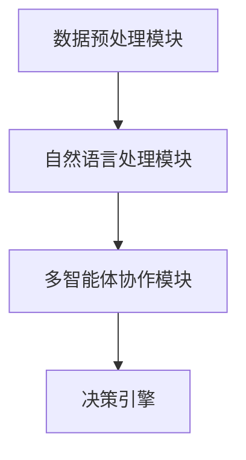

                 


# 多智能体系统在价值投资中的自然语言处理应用

---

## 关键词：多智能体系统, 自然语言处理, 价值投资, 金融分析, 机器学习

---

## 摘要：  
本文探讨了多智能体系统与自然语言处理技术在价值投资中的应用，详细分析了多智能体系统的核心原理、自然语言处理在金融信息分析中的作用，以及如何通过多智能体协作算法优化投资决策。文章结合实际案例，从系统架构设计到算法实现，全面展示了如何利用这些技术提升投资分析的准确性和效率。

---

# 第1章: 多智能体系统与自然语言处理概述

## 1.1 多智能体系统的定义与特点

### 1.1.1 多智能体系统的定义  
多智能体系统（Multi-Agent System, MAS）是由多个具有独立决策能力的智能体组成的系统，这些智能体能够通过交互和协作完成复杂的任务。每个智能体都有自己的目标、知识库和行动策略。

### 1.1.2 多智能体系统的核心特点  
- **分布式性**：智能体之间分布式协作，避免单点故障。  
- **自主性**：每个智能体能够自主决策。  
- **反应性**：能够实时感知环境变化并做出反应。  
- **协作性**：通过通信和协作完成复杂任务。  

### 1.1.3 多智能体系统与单智能体系统的区别  
| 特性         | 单智能体系统         | 多智能体系统         |
|--------------|---------------------|----------------------|
| 决策主体     | 单一主体             | 多个主体             |
| 任务处理     | 独立完成             | 分布式协作完成         |
| 故障容忍性   | 高                  | 更高                  |

---

## 1.2 自然语言处理的基本原理

### 1.2.1 自然语言处理的定义  
自然语言处理（NLP）是研究人机交互中自然语言的理解和生成的理论和技术，旨在让计算机能够像人类一样理解和处理文本。

### 1.2.2 自然语言处理的核心技术  
- **词嵌入**：将词语转换为低维向量表示（如Word2Vec、GloVe）。  
- **语言模型**：基于概率的文本生成模型（如Markov链、循环神经网络）。  
- **文本分类与情感分析**：对文本进行分类（如情感倾向分析）。  

### 1.2.3 自然语言处理在金融领域的应用  
- **金融文本分析**：从新闻、财报中提取关键信息。  
- **情感分析**：判断市场情绪对股价的影响。  
- **自动摘要**：生成投资报告的摘要。  

---

## 1.3 价值投资的基本概念

### 1.3.1 价值投资的定义  
价值投资是一种投资策略，通过分析企业的基本面（如财务状况、行业地位）来寻找被市场低估的投资标的。

### 1.3.2 价值投资的核心原则  
- **长期视角**：关注企业的长期价值。  
- **安全边际**：买入价格低于内在价值。  
- **分散投资**：降低风险。  

### 1.3.3 价值投资与技术分析的区别  
| 方面         | 价值投资           | 技术分析             |
|--------------|--------------------|----------------------|
| 基础         | 企业基本面         | 市场价格和成交量       |
| 时间框架     | 长期               | 短期或中期             |
| 方法         | 定性分析           | 定量分析             |

---

## 1.4 本章小结  
本章介绍了多智能体系统和自然语言处理的基本概念，以及它们在价值投资中的潜在结合点。接下来，我们将深入探讨多智能体系统在金融领域的应用背景，以及如何通过NLP技术提升投资决策的智能化水平。

---

# 第2章: 多智能体系统在金融领域的应用背景

## 2.1 金融领域的复杂性与挑战

### 2.1.1 金融市场的复杂性  
金融市场受多种因素影响，包括经济指标、政策变化、企业业绩等，具有高度不确定性。

### 2.1.2 传统投资分析的局限性  
传统分析方法依赖经验判断，难以量化分析，且容易受主观因素影响。

### 2.1.3 多智能体系统在金融中的潜在优势  
- **分布式计算**：提高数据处理效率。  
- **协作优化**：通过多智能体协作提升决策准确性。  

---

## 2.2 自然语言处理在金融信息分析中的作用

### 2.2.1 文本数据在金融分析中的重要性  
金融文本数据包括新闻、财报、社交媒体等，是理解市场情绪的重要来源。

### 2.2.2 自然语言处理在金融文本分析中的应用  
- **实体识别**：识别公司名称、金额等实体。  
- **情感分析**：判断市场情绪。  
- **信息提取**：从财报中提取财务数据。  

### 2.2.3 自然语言处理的挑战与解决方案  
- **数据稀疏性**：部分金融术语出现频率低，影响模型准确性。  
- **解决方案**：使用预训练模型（如BERT）进行迁移学习。  

---

## 2.3 多智能体系统与价值投资的结合

### 2.3.1 多智能体系统在价值投资中的角色  
多智能体系统可以模拟投资者的行为，帮助发现市场中的套利机会。

### 2.3.2 多智能体系统如何辅助投资决策  
- **信息整合**：多个智能体分别分析不同来源的信息，最终整合得出结论。  
- **协作优化**：通过协作提高决策的准确性和鲁棒性。  

### 2.3.3 多智能体系统与传统投资策略的对比  
| 特性         | 传统投资策略         | 多智能体系统           |
|--------------|---------------------|-----------------------|
| 决策方式     | 人工判断             | 自动化协作决策         |
| 效率         | 较低                 | 高                    |
| 可扩展性     | 有限                 | 强                    |

---

## 2.4 本章小结  
本章分析了多智能体系统在金融领域的应用背景，探讨了自然语言处理在金融信息分析中的作用，以及多智能体系统如何与价值投资结合。接下来，我们将深入探讨多智能体系统与自然语言处理的核心概念。

---

# 第3章: 多智能体系统与自然语言处理的核心概念

## 3.1 多智能体系统的核心原理

### 3.1.1 多智能体系统的组成与结构  
- **智能体**：独立决策的单元。  
- **通信机制**：智能体之间的信息交互方式。  
- **协作机制**：智能体如何协同完成任务。  

### 3.1.2 多智能体系统的核心算法  
- **分布式一致性算法**：确保系统中各个智能体的状态一致。  
- **协作算法**：如分布式马尔可夫决策过程（MDP）。  

---

## 3.2 自然语言处理的核心算法

### 3.2.1 词嵌入技术  
- **Word2Vec**：通过上下文预测单词，生成词向量。  
- **GloVe**：基于全局词频统计生成词向量。  

### 3.2.2 语言模型  
- **循环神经网络（RNN）**：用于序列建模。  
- **Transformer**：基于注意力机制的模型。  

### 3.2.3 文本分类与情感分析  
- **文本分类**：将文本划分为不同的类别。  
- **情感分析**：判断文本的情感倾向。  

---

## 3.3 多智能体系统与自然语言处理的结合

### 3.3.1 多智能体系统在自然语言处理中的应用  
- **分布式文本处理**：多个智能体分别处理不同部分的文本。  
- **协作优化**：通过协作提高文本分析的准确性和效率。  

### 3.3.2 自然语言处理在多智能体系统中的作用  
- **信息提取**：从文本中提取关键信息。  
- **意图识别**：识别文本的意图。  

---

## 3.4 本章小结  
本章详细介绍了多智能体系统和自然语言处理的核心概念，并探讨了它们如何结合以提升投资决策的智能化水平。接下来，我们将探讨多智能体系统在价值投资中的算法实现。

---

# 第4章: 多智能体系统在价值投资中的算法实现

## 4.1 多智能体系统与自然语言处理的算法原理

### 4.1.1 多智能体系统中的文本处理算法  
- **基于BERT的文本表示**：使用预训练模型生成文本向量。  
- **基于GPT的文本生成**：生成投资建议文本。  

### 4.1.2 多智能体协作算法  
- **分散式决策算法**：每个智能体独立决策。  
- **协作式强化学习**：通过协作提高决策质量。  

---

## 4.2 价值投资策略的数学模型

### 4.2.1 价值投资的数学表达  
- **内在价值计算**：通过财务指标（如市盈率、市净率）计算内在价值。  

### 4.2.2 基于多智能体的策略优化  
- **分布式优化**：通过多智能体协作优化投资组合。  

---

## 4.3 本章小结  
本章详细介绍了多智能体系统在价值投资中的算法实现，包括文本处理算法和协作优化算法。接下来，我们将探讨系统架构设计和项目实战。

---

# 第5章: 系统架构与项目实战

## 5.1 系统架构设计

### 5.1.1 系统功能设计  
- **数据预处理模块**：清洗和整理金融文本数据。  
- **自然语言处理模块**：提取关键信息。  
- **多智能体协作模块**：模拟投资者行为，生成投资策略。  

### 5.1.2 系统架构图  


---

## 5.2 项目实战

### 5.2.1 环境配置  
- **工具安装**：安装Python、TensorFlow、Keras等工具。  

### 5.2.2 核心代码实现  
```python
import tensorflow as tf
from tensorflow.keras import layers

# 定义BERT模型
def build_bert_model(max_seq_length=128):
    input_ids = layers.Input(shape=(max_seq_length,), dtype='int32')
    token_type_ids = layers.Input(shape=(max_seq_length,), dtype='int32')
    attention_mask = layers.Input(shape=(max_seq_length,), dtype='int32')
    
    bert_layer =(tf.keras.layers.Bert主干)  # 简化表示，实际需使用具体模型
    pooled_output = bert_layer(input_ids, token_type_ids, attention_mask)
    
    dense_layer = layers.Dense(2, activation='softmax')(pooled_output)
    model = tf.keras.Model(inputs=[input_ids, token_type_ids, attention_mask], outputs=dense_layer)
    return model
```

---

## 5.3 案例分析与实际应用

### 5.3.1 案例分析  
通过分析某公司的财报和新闻，生成投资建议。  

---

## 5.4 项目小结  
本章通过实际案例展示了多智能体系统与自然语言处理在价值投资中的应用，从系统架构到代码实现，全面介绍了项目的实施过程。

---

# 第6章: 最佳实践与未来展望

## 6.1 最佳实践 tips

### 6.1.1 数据质量管理  
确保数据的准确性和完整性。  

### 6.1.2 模型优化  
通过调参和模型融合提高准确率。  

---

## 6.2 小结  
本文详细探讨了多智能体系统与自然语言处理在价值投资中的应用，从理论到实践，全面展示了如何利用这些技术提升投资决策的智能化水平。

---

## 6.3 注意事项  
- **数据隐私**：注意数据的隐私保护。  
- **模型解释性**：确保模型的决策过程可解释。  

---

## 6.4 拓展阅读  
- 《深度学习入门：基于Python的实践》  
- 《自然语言处理实战：基于TensorFlow和Keras》  

---

# 作者：AI天才研究院 & 禅与计算机程序设计艺术

