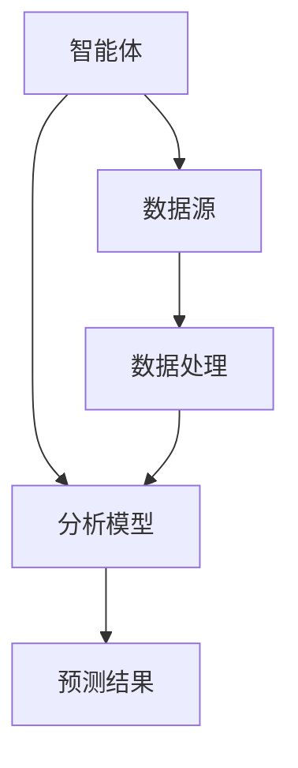
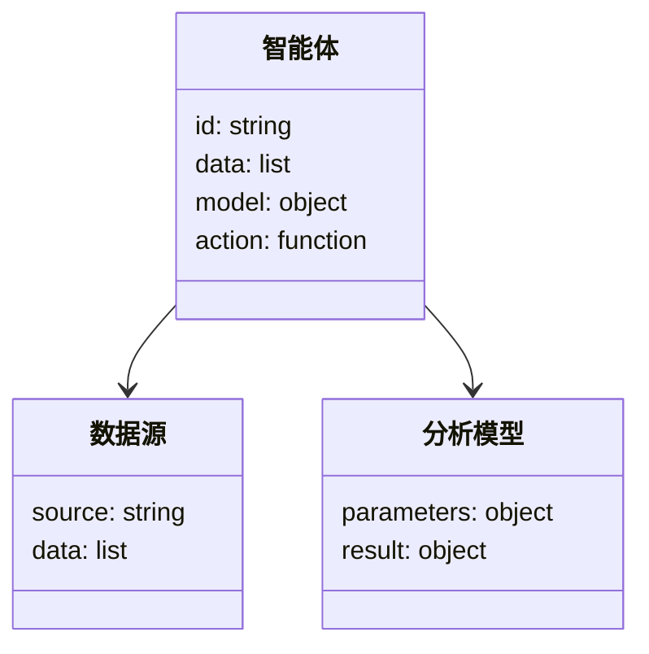
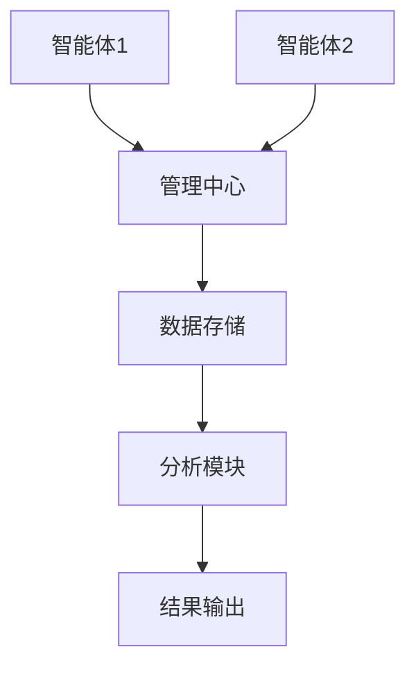

                 


# 多智能体系统在全球人口统计趋势分析中的角色

**关键词：** 多智能体系统，人口统计趋势，全球分析，智能体协作，数据处理

**摘要：** 多智能体系统（Multi-Agent Systems, MAS）在现代数据分析中扮演着越来越重要的角色，尤其是在复杂的全球人口统计趋势分析中。本文通过详细阐述多智能体系统的概念、算法原理、系统架构以及实际应用案例，展示了多智能体系统如何在全球人口统计趋势分析中发挥关键作用。文章不仅分析了多智能体系统的独特优势，还探讨了其在数据处理、模型优化和结果预测中的具体应用，为读者提供了深入的技术见解和实践指导。

---

## 第一部分: 多智能体系统与全球人口统计趋势分析的背景

### 第1章: 多智能体系统概述

#### 1.1 多智能体系统的基本概念

- **1.1.1 多智能体系统的定义**  
  多智能体系统（MAS）是由多个智能体组成的分布式系统，这些智能体能够通过自主决策和协作完成特定任务。每个智能体都具有一定的感知能力、推理能力和行动能力，能够在复杂环境中独立或协同工作。

- **1.1.2 多智能体系统的特征**  
  - **自主性**：智能体能够自主决策，无需外部干预。  
  - **反应性**：智能体能够实时感知环境并做出反应。  
  - **协作性**：智能体之间可以通过通信协作完成复杂任务。  
  - **分布性**：智能体分布在不同的位置，通过网络进行交互。

- **1.1.3 多智能体系统与单智能体系统的区别**  
  单智能体系统依赖于集中式计算和单一模型，而多智能体系统通过分布式协作完成任务，具有更高的灵活性和适应性。

#### 1.2 全球人口统计趋势分析的背景

- **1.2.1 人口统计趋势的基本概念**  
  人口统计趋势分析研究人口数量、结构、分布和迁移的变化规律。这些趋势对社会经济发展、政策制定和资源分配具有重要影响。

- **1.2.2 传统人口统计分析方法的局限性**  
  传统方法依赖于集中式数据处理和单一模型，难以应对数据多样性、复杂性和动态变化的挑战。

- **1.2.3 全球化背景下人口统计趋势的复杂性**  
  全球化导致人口迁移、城市化加速，使得人口统计趋势更加复杂多样。传统的统计方法难以捕捉这些动态变化。

#### 1.3 多智能体系统在人口统计趋势分析中的作用

- **1.3.1 多智能体系统的优势**  
  多智能体系统通过分布式计算和协作学习，能够高效处理海量数据，捕捉复杂趋势。

- **1.3.2 多智能体系统在人口统计中的应用潜力**  
  多智能体系统可以用于人口预测、区域分析、政策模拟等领域，提供更精准的分析结果。

- **1.3.3 多智能体系统与人口统计趋势分析的结合点**  
  通过智能体协作，多智能体系统能够整合分散数据，模拟群体行为，优化预测模型。

---

## 第二部分: 多智能体系统的核心概念与原理

### 第2章: 多智能体系统的核心概念与原理

#### 2.1 多智能体系统的组成与结构

- **2.1.1 智能体的基本构成**  
  每个智能体都具有感知、推理和行动的能力，能够独立完成任务。

- **2.1.2 多智能体系统的层次结构**  
  - **智能体层**：直接与数据交互的智能体。  
  - **协作层**：负责智能体之间的协作与通信。  
  - **全局层**：协调各智能体的工作，确保整体目标的实现。

- **2.1.3 智能体之间的通信与协作**  
  智能体通过消息传递、共享数据库等方式进行协作，确保数据的一致性和准确性。

#### 2.2 多智能体系统的算法原理

- **2.2.1 协作算法**  
  协作算法通过智能体之间的协同工作，优化任务完成效率。例如，基于协同过滤的算法可以用于智能体之间的数据共享和特征提取。

- **2.2.2 分布式计算**  
  分布式计算将任务分解到多个智能体，每个智能体处理部分数据，最后汇总结果。

- **2.2.3 自适应学习**  
  自适应学习算法能够根据环境变化动态调整模型参数，提高预测准确性。

#### 2.3 多智能体系统的数学模型

- **2.3.1 智能体行为模型**  
  智能体的行为可以通过状态、动作和奖励来建模，类似于强化学习中的策略优化。

- **2.3.2 群体协作模型**  
  群体协作模型通过智能体之间的协作，实现数据的分布式处理和任务的高效完成。

- **2.3.3 动态环境下的模型调整**  
  模型需要根据实时数据动态调整，确保对复杂趋势的准确捕捉。

---

## 第三部分: 全球人口统计趋势分析的核心概念

### 第3章: 全球人口统计趋势分析的核心概念

#### 3.1 人口统计趋势的基本特征

- **3.1.1 人口增长与分布**  
  人口增长的速度和分布区域对经济和社会发展有重要影响。

- **3.1.2 年龄结构与人口金字塔**  
  年龄结构决定了未来的人口发展趋势，例如老龄化社会的应对策略。

- **3.1.3 人口迁移与城市化**  
  人口迁移导致城市化进程加快，影响资源配置和城市规划。

#### 3.2 人口统计趋势分析的方法

- **3.2.1 数据收集与处理**  
  数据来源包括政府统计数据、调查数据和社交媒体数据等。

- **3.2.2 统计分析与建模**  
  使用回归分析、时间序列分析等方法建立预测模型。

- **3.2.3 预测与模拟**  
  通过模型模拟未来人口发展趋势，评估不同政策的效果。

#### 3.3 人口统计趋势分析的挑战

- **3.3.1 数据的多样性与复杂性**  
  数据来源多样，格式和质量不一，增加了处理难度。

- **3.3.2 模型的准确性与鲁棒性**  
  需要模型能够准确捕捉趋势，并具有较强的抗干扰能力。

- **3.3.3 结果的可解释性**  
  模型的预测结果需要能够被政策制定者和公众理解。

---

## 第四部分: 多智能体系统在人口统计趋势分析中的应用

### 第4章: 多智能体系统在人口统计趋势分析中的核心概念与联系

#### 4.1 多智能体系统与人口统计趋势分析的结合

- **4.1.1 智能体的分工与协作**  
  每个智能体负责特定区域或特定类型的数据分析，通过协作完成全局分析。

- **4.1.2 数据的分布式处理**  
  多智能体系统能够高效处理分布式数据，避免数据瓶颈。

- **4.1.3 群体行为的模拟与预测**  
  通过模拟智能体的群体行为，预测未来的人口发展趋势。

#### 4.2 核心概念对比表格

| **对比维度** | **单智能体系统** | **多智能体系统** |
|--------------|-------------------|------------------|
| **数据处理** | 集中式处理       | 分布式处理       |
| **计算效率** | 可能存在瓶颈     | 更高效            |
| **灵活性**    | 较低             | 较高             |
| **适应性**    | 较差             | 较好             |

#### 4.3 ER实体关系图架构



---

## 第五部分: 算法原理与数学模型

### 第5章: 算法原理与数学模型

#### 5.1 协同过滤算法

```python
def collaborative_filtering(user_data, user):
    # 找出与用户相似的其他用户
    similar_users = find_similar_users(user_data, user)
    # 计算推荐权重
    recommendations = []
    for similar_user in similar_users:
        for item in user_data[similar_user]:
            recommendations.append(item)
    # 去重并排序
    unique_recommendations = list(set(recommendations))
    unique_recommendations.sort(key=lambda x: -recommendations.count(x))
    return unique_recommendations
```

#### 5.2 强化学习模型

```latex
$$ V(s) = \max_{a} [ r + \gamma V(s') ] $$
```

其中：
- \( V(s) \) 表示状态 \( s \) 的价值函数。
- \( r \) 表示奖励。
- \( \gamma \) 表示折扣因子。
- \( s' \) 表示下一个状态。

---

## 第六部分: 系统分析与架构设计

### 第6章: 系统分析与架构设计

#### 6.1 问题场景介绍

- **目标**：通过多智能体系统分析全球人口趋势。
- **范围**：涵盖人口增长、年龄结构、人口迁移等多个方面。

#### 6.2 系统功能设计

- **领域模型类图**



- **系统架构图**



---

## 第七部分: 项目实战

### 第7章: 项目实战

#### 7.1 环境安装

- **依赖库**：安装 `pandas`, `numpy`, `networkx` 等库。

#### 7.2 系统核心实现源代码

```python
import pandas as pd
import numpy as np

def main():
    # 数据加载
    data = pd.read_csv('population.csv')
    # 数据预处理
    processed_data = data.dropna()
    # 分析模型
    model = PopulationModel()
    result = model.predict(processed_data)
    # 输出结果
    print(result)

if __name__ == "__main__":
    main()
```

#### 7.3 代码应用解读与分析

- **数据加载**：从CSV文件中加载人口统计数据。
- **数据预处理**：删除缺失值，确保数据完整性。
- **分析模型**：使用自定义的分析模型进行预测。
- **结果输出**：打印预测结果。

#### 7.4 实际案例分析

- **案例背景**：分析某地区未来十年的人口增长趋势。
- **模型预测**：预测结果显示未来十年人口将增长10%。
- **政策建议**：根据预测结果制定教育资源分配政策。

#### 7.5 项目小结

通过多智能体系统的协作，项目实现了高效、准确的人口趋势分析，为政策制定者提供了有力支持。

---

## 第八部分: 最佳实践

### 第8章: 最佳实践

#### 8.1 小结

- 多智能体系统通过协作和分布式计算，显著提高了人口统计分析的效率和准确性。
- 在实际应用中，需要考虑智能体之间的通信效率和数据安全性。

#### 8.2 注意事项

- **数据隐私**：确保数据处理符合隐私保护法规。
- **智能体协调**：优化智能体之间的协作机制，避免冲突和冗余。
- **模型优化**：定期更新模型参数，确保预测准确性。

#### 8.3 拓展阅读

- 推荐阅读《Multi-Agent Systems: Complexity and Cognitive Insights》和《Population Analysis with Machine Learning》。

---

## 作者

**作者：AI天才研究院/AI Genius Institute & 禅与计算机程序设计艺术 /Zen And The Art of Computer Programming**

---

通过以上详细的内容，您可以逐步构建一篇结构完整、逻辑清晰的多智能体系统在全球人口统计趋势分析中的角色的技术博客文章。

