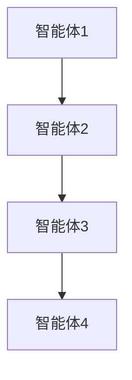

                 


# 多智能体系统在全球价值链分析中的角色

---

## 关键词：多智能体系统、全球价值链、智能体协作、经济分析、系统建模

---

## 摘要

多智能体系统（Multi-Agent Systems, MAS）作为一种分布式智能系统，近年来在复杂经济系统的建模与分析中展现了巨大的潜力。本文探讨了MAS在全球价值链分析中的角色，通过分析MAS的核心原理、算法实现以及实际应用场景，展示了如何利用MAS的分布式协作特性，解决全球价值链中的复杂问题。文章从理论基础到实际应用，系统性地阐述了MAS在提升全球价值链分析效率和精度中的独特优势。

---

# 第1章 引言

在全球化不断深化的今天，全球价值链（Global Value Chain）已成为国际经济分工与合作的重要体现。然而，全球价值链的复杂性使得传统的分析方法难以捕捉其动态变化和多主体间的互动关系。多智能体系统（MAS）作为一种新兴的技术，以其分布式、协作式的特性，为全球价值链分析提供了新的思路。本文旨在探讨MAS在全球价值链分析中的角色，揭示其在优化经济决策、提升系统效率方面的潜力。

---

# 第2章 多智能体系统概述

## 2.1 智能体的定义与特征

智能体（Agent）是具有感知环境、自主决策、主动行动能力的实体。MAS由多个智能体组成，这些智能体通过交互协作完成复杂任务。

### 2.1.1 智能体的定义

智能体可以是软件程序、机器人或其他具有智能行为的实体。智能体的核心特征包括：

1. **自主性**：智能体能够自主决策，无需外部干预。
2. **反应性**：智能体能够感知环境并实时调整行为。
3. **协作性**：智能体能够与其他智能体协作完成任务。

### 2.1.2 多智能体系统的构成要素

MAS由以下核心要素组成：

1. **智能体**：具有感知、决策和行动能力的主体。
2. **环境**：智能体所处的外部世界，包括物理环境和虚拟环境。
3. **通信机制**：智能体之间交换信息的渠道。
4. **协作协议**：智能体协作的规则和策略。

---

## 2.2 全球价值链分析的基本概念

### 2.2.1 全球价值链的定义

全球价值链是指跨国企业在全球范围内分工协作，将生产过程分解为不同环节（如设计、制造、物流、销售等），并将其分配到具有比较优势的地区进行的链条式分工体系。

### 2.2.2 全球价值链的复杂性

全球价值链涉及多个主体（如企业、政府、消费者等）的互动，具有高度的动态性和不确定性。传统的分析方法难以捕捉这些复杂关系。

### 2.2.3 多智能体系统的优势

MAS通过模拟多个智能体的互动行为，能够更真实地反映全球价值链的动态变化。通过MAS，可以实现对全球价值链的实时建模与优化。

---

# 第3章 多智能体系统的数学建模

## 3.1 智能体行为模型

智能体的行为可以通过状态、动作和目标的三元组表示：

$$
\text{行为} = (s, a, g)
$$

其中，$s$ 表示当前状态，$a$ 表示动作，$g$ 表示目标。

## 3.2 多智能体系统的协作模型

MAS的协作可以通过以下数学模型描述：

$$
\max_{a_i} \sum_{i=1}^{n} v_i(a_i)
$$

其中，$v_i(a_i)$ 表示智能体 $i$ 的效用函数，$a_i$ 表示智能体 $i$ 的动作。

---

# 第4章 全球价值链分析的MAS实现

## 4.1 问题场景描述

以汽车制造行业的全球价值链为例，涉及的设计、零部件生产、组装、销售等环节，可以通过MAS模拟不同参与者的行为。

## 4.2 MAS实现的关键步骤

### 4.2.1 系统设计

1. **智能体设计**：定义每个智能体的角色（如供应商、制造商、零售商）。
2. **通信协议设计**：定义智能体之间的信息交换规则。
3. **协作规则设计**：定义智能体协作的目标和约束条件。

### 4.2.2 系统实现

1. **环境建模**：构建全球价值链的虚拟环境。
2. **智能体实现**：编写智能体的感知、决策和行动逻辑。
3. **系统集成**：将多个智能体集成到统一的MAS平台中。

---

# 第5章 算法设计与实现

## 5.1 分布式问题解决算法

### 5.1.1 算法流程

1. **问题分解**：将复杂问题分解为多个子问题。
2. **智能体协作**：多个智能体分别解决子问题。
3. **结果整合**：整合各智能体的子问题解决方案，得到全局最优解。

### 5.1.2 算法实现

```python
def distributed_problem_solving(problem):
    agents = initialize_agents()
    sub_problems = decompose(problem)
    results = [solve(sub_problem, agent) for agent in agents]
    return aggregate(results)
```

---

## 5.2 协调机制设计

### 5.2.1 协调协议

智能体之间通过以下协议进行协作：

1. **信息共享**：智能体之间共享必要的信息。
2. **冲突解决**：通过协商或仲裁机制解决冲突。
3. **任务分配**：根据智能体的能力分配任务。

---

# 第6章 系统实现与应用分析

## 6.1 系统实现

### 6.1.1 系统架构设计



### 6.1.2 功能实现

1. **环境感知**：智能体感知全球价值链的变化。
2. **决策制定**：智能体根据感知信息制定决策。
3. **行动执行**：智能体根据决策执行行动。

---

## 6.2 应用分析

通过MAS模拟全球价值链的动态变化，可以实现对供应链优化、成本控制、风险预警等功能。例如，在汽车制造行业，可以通过MAS模拟不同供应商的协作，优化零部件的生产和配送流程。

---

# 第7章 结论与展望

本文探讨了MAS在全球价值链分析中的角色，通过理论分析和实际案例，展示了MAS在提升全球价值链分析效率和精度方面的潜力。未来，随着人工智能和分布式计算技术的进一步发展，MAS在全球价值链分析中的应用将更加广泛和深入。

---

## 作者：AI天才研究院/AI Genius Institute & 禅与计算机程序设计艺术 /Zen And The Art of Computer Programming

