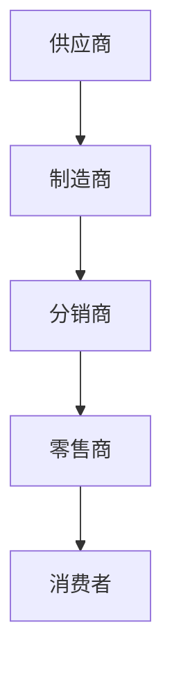
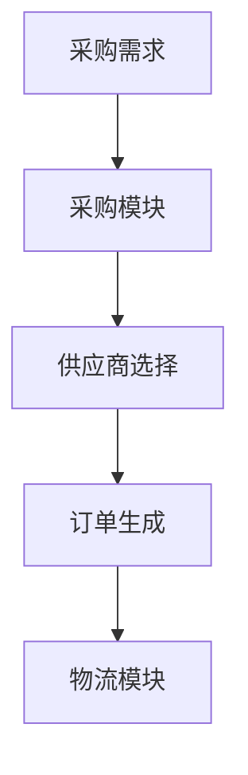
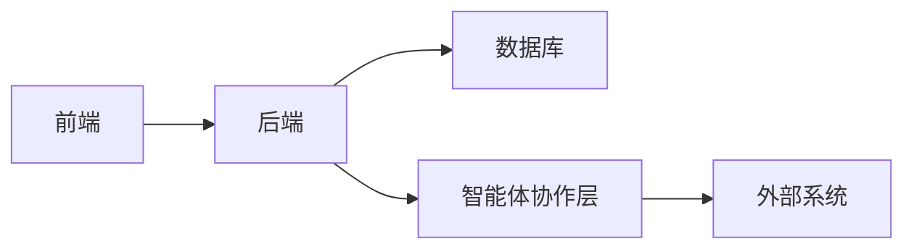
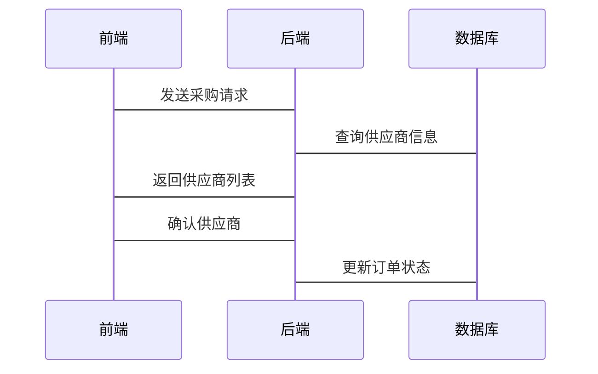

                 


# 多智能体系统在全球供应链优化中的应用：提升运营效率

## 关键词：多智能体系统，供应链优化，分布式计算，协作机制，博弈论

## 摘要：
多智能体系统在全球供应链优化中的应用是提升运营效率的重要方向。通过分析多智能体系统的核心原理，结合实际应用场景，本文详细探讨了多智能体系统如何优化供应链中的各个环节，包括采购、生产、物流和库存管理。文章从背景介绍、核心概念、算法原理、系统架构到项目实战，层层深入，结合Mermaid图表和数学模型，全面解析了多智能体系统在供应链优化中的潜力与实现路径。

---

# 第一部分：多智能体系统与全球供应链优化背景

## 第1章：多智能体系统概述

### 1.1 多智能体系统的基本概念

#### 1.1.1 智能体的定义与特征
- **智能体**：能够感知环境并采取行动以实现目标的实体。
- **特征**：自主性、反应性、协作性、学习能力。

#### 1.1.2 多智能体系统的定义
- 多智能体系统（Multi-Agent System, MAS）是由多个智能体组成的协作系统，各智能体通过通信和协作完成共同目标。

#### 1.1.3 多智能体系统的核心要素
- 智能体、通信协议、协作机制、环境。

### 1.2 全球供应链优化的背景与挑战

#### 1.2.1 全球供应链的基本结构
- 供应商、制造商、分销商、零售商、消费者。

#### 1.2.2 供应链优化的必要性
- 提高效率、降低成本、增强灵活性。

#### 1.2.3 当前供应链中的主要问题
- 牛鞭效应、信息不对称、协作效率低下。

### 1.3 多智能体系统在供应链优化中的应用前景

#### 1.3.1 多智能体系统的潜在应用领域
- 采购优化、库存管理、物流调度。

#### 1.3.2 企业采用多智能体系统的优势
- 提高决策效率、增强灵活性、优化资源分配。

#### 1.3.3 多智能体系统应用的挑战与机遇
- 技术复杂性、数据隐私、协作障碍。

---

## 第2章：多智能体系统的核心概念与联系

### 2.1 多智能体系统的核心原理

#### 2.1.1 分布式智能
- 多个智能体协同工作，而非集中式控制。

#### 2.1.2 协作与协商机制
- 智能体通过协商分配任务，优化资源利用。

#### 2.1.3 多智能体系统的通信协议
- 定义智能体之间的通信规则，确保信息传递高效。

### 2.2 多智能体系统与供应链优化的关系

#### 2.2.1 供应链优化的多智能体模型
- 将供应链中的各环节建模为多个智能体。

#### 2.2.2 多智能体系统在供应链中的角色
- 供应商智能体、制造商智能体、分销商智能体。

#### 2.2.3 供应链优化中的多智能体系统架构
- 分层架构：决策层、执行层、数据层。

### 2.3 多智能体系统的实体关系图

#### 2.3.1 实体关系图的定义
- 描述系统中各实体之间的关系。

#### 2.3.2 供应链优化中的实体关系图



#### 2.3.3 实体关系图的分析与应用
- 通过关系图分析各实体的协作方式，优化信息流。

---

## 第3章：多智能体系统在供应链优化中的算法原理

### 3.1 多智能体系统的核心算法

#### 3.1.1 分布式计算算法
- 分布式一致性算法（如Paxos、Raft）。

#### 3.1.2 协商与决策算法
- 协商算法：基于博弈论的决策优化。

#### 3.1.3 多智能体系统的博弈论算法
- Nash均衡：优化协作策略。

### 3.2 多智能体系统的通信与协作算法

#### 3.2.1 通信协议的设计
- 使用JSON-RPC或HTTP协议实现智能体间通信。

#### 3.2.2 协作机制
- 基于角色分配的任务协作。

### 3.3 多智能体系统的博弈论算法实现

#### 3.3.1 博弈论模型
- 利润最大化为目标，构建收益函数。

#### 3.3.2 算法实现
```python
def nash_equilibrium(players, strategies):
    # 计算各玩家的收益矩阵
    payoff = {}
    for player in players:
        payoff[player] = {}
        for strategy in strategies:
            payoff[player][strategy] = 0
    return payoff
```

#### 3.3.3 实际案例分析
- 通过收益矩阵分析供应商与制造商的协作策略。

---

## 第4章：系统分析与架构设计

### 4.1 系统功能设计

#### 4.1.1 问题场景介绍
- 优化全球供应链的采购、生产、物流和库存管理。

#### 4.1.2 系统功能模块
- 采购模块、生产模块、物流模块、库存模块。

#### 4.1.3 功能流程图


### 4.2 系统架构设计

#### 4.2.1 系统架构图


#### 4.2.2 接口设计
- RESTful API：`GET /api/suppliers`, `POST /api/orders`。

#### 4.2.3 交互流程图


---

## 第5章：项目实战

### 5.1 环境安装

#### 5.1.1 安装Python
```bash
python --version
```

#### 5.1.2 安装依赖
```bash
pip install flask requests
```

### 5.2 核心代码实现

#### 5.2.1 采购模块实现
```python
from flask import Flask
import requests

app = Flask(__name__)

@app.route('/api/suppliers', methods=['GET'])
def get_suppliers():
    # 模拟与供应商智能体通信
    response = requests.get('http://supplier-agent:5000/suppliers')
    return response.json()

if __name__ == '__main__':
    app.run()
```

#### 5.2.2 代码解读与分析
- 使用Flask构建API，通过requests库与供应商智能体通信。

### 5.3 实际案例分析

#### 5.3.1 案例背景
- 优化跨国物流调度。

#### 5.3.2 实施步骤
1. 部署智能体节点。
2. 测试API通信。
3. 部署到云平台。

#### 5.3.3 实施效果
- 提高订单处理速度，降低物流成本。

### 5.4 项目小结

---

## 第6章：最佳实践与总结

### 6.1 小结
- 多智能体系统在供应链优化中具有巨大潜力。
- 通过协作机制和分布式计算，实现高效的供应链管理。

### 6.2 注意事项
- 数据隐私保护。
- 系统容错设计。
- 智能体协作的公平性。

### 6.3 未来趋势
- 更智能的协作算法。
- 更广泛的应用场景。

### 6.4 扩展阅读
- 推荐书籍：《Multi-Agent Systems》。
- 推荐论文：博弈论在供应链优化中的应用。

---

## 作者：AI天才研究院 & 禅与计算机程序设计艺术

---

以上是完整的文章内容，涵盖了从背景到实际应用的各个方面，结合了理论分析和实际案例，确保读者能够全面理解多智能体系统在全球供应链优化中的应用。

