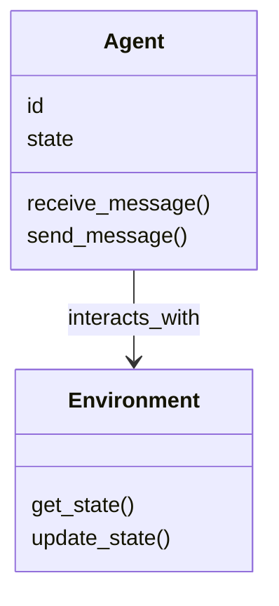
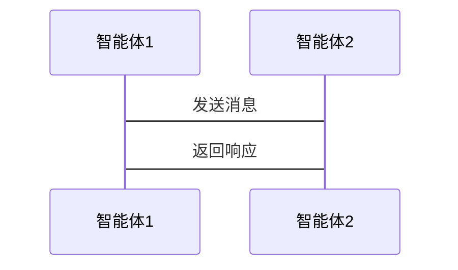

                 


# 多智能体系统在全球供应链分析中的角色

> 关键词：多智能体系统, 全球供应链, 供应链优化, 多智能体协作, 人工智能

> 摘要：随着全球经济一体化的深入发展，全球供应链的复杂性不断增加，传统的单一中心化管理方式已难以应对复杂的协作需求。多智能体系统（MAS）作为一种分布式的智能协作体系，为全球供应链的优化和管理提供了新的解决方案。本文将从多智能体系统的背景、核心概念、算法原理、系统架构设计、项目实战和最佳实践等多个方面进行深入分析，探讨多智能体系统在全球供应链分析中的角色与应用。

---

# 第一部分: 多智能体系统与全球供应链概述

## 第1章: 多智能体系统与全球供应链的背景介绍

### 1.1 多智能体系统（MAS）的基本概念

#### 1.1.1 多智能体系统的定义
多智能体系统（Multi-Agent System, MAS）是由多个智能体（Agent）组成的分布式系统，每个智能体都是一个能够感知环境、自主决策、并与其他智能体协作的实体。智能体可以是软件程序、算法或物理设备，具备以下核心特征：
- **自主性**：智能体能够自主决策，无需外部干预。
- **反应性**：智能体能够感知环境并实时响应。
- **协作性**：智能体之间可以通过通信和协作完成共同目标。

#### 1.1.2 多智能体系统的特征
与传统的集中式系统相比，MAS具有以下特点：
1. **分布式计算**：多个智能体协同工作，无单点依赖。
2. **动态协作**：智能体之间可以动态调整协作关系。
3. **适应性**：系统能够适应环境的变化。

#### 1.1.3 多智能体系统与传统供应链的区别
传统的供应链管理依赖于中心化的协调机构，而MAS通过分布式智能体实现去中心化的协作，提高了系统的灵活性和鲁棒性。

### 1.2 全球供应链分析的复杂性

#### 1.2.1 供应链的基本概念
供应链是指从原材料采购到最终产品交付的整个流程，包括供应商、制造商、分销商、零售商等多个环节。

#### 1.2.2 全球供应链的挑战
1. **全球化带来的不确定性**：跨国供应链面临汇率波动、政策变化等风险。
2. **信息孤岛**：不同环节之间的信息不透明，导致效率低下。
3. **协作复杂性**：涉及多个参与者，协作难度大。

#### 1.2.3 多智能体系统在供应链中的作用
MAS能够通过智能体之间的协作，优化供应链的运作效率，降低不确定性。

### 1.3 多智能体系统在全球供应链中的问题背景

#### 1.3.1 供应链中的不确定性
全球经济波动、疫情等不可抗力因素对供应链造成冲击。

#### 1.3.2 供应链中的信息孤岛
不同企业之间的信息不共享，导致资源浪费。

#### 1.3.3 供应链中的协作问题
传统供应链管理依赖中心化机构，协作效率低。

---

## 第2章: 多智能体系统的核心概念与联系

### 2.1 多智能体系统的原理

#### 2.1.1 多智能体系统的组成要素
1. **智能体**：具备自主性、反应性和协作性的实体。
2. **环境**：智能体所处的物理或数字空间。
3. **通信机制**：智能体之间的信息交互方式。
4. **协作协议**：智能体协作的规则和策略。

#### 2.1.2 多智能体系统的通信机制
智能体之间通过消息传递、状态共享等方式进行通信。

#### 2.1.3 多智能体系统的协作机制
智能体通过协商、协调等方式实现协作目标。

### 2.2 多智能体系统与供应链的关系

#### 2.2.1 供应链中的多智能体角色
1. **供应商智能体**：负责原材料的供应。
2. **制造商智能体**：负责产品的生产。
3. **分销商智能体**：负责产品的分销。
4. **零售商智能体**：负责产品的销售。

#### 2.2.2 多智能体系统如何优化供应链
通过智能体之间的协作，优化库存管理、物流调度和资源分配。

#### 2.2.3 多智能体系统的协同效应
1. **提高效率**：智能体协作减少了信息传递的延迟。
2. **增强灵活性**：系统能够快速适应环境变化。
3. **降低成本**：通过优化资源配置降低成本。

### 2.3 多智能体系统的属性特征对比

#### 表2.1 多智能体系统与传统供应链的对比

| 特性                | 多智能体系统                   | 传统供应链                   |
|---------------------|-------------------------------|-----------------------------|
| 结构                | 分布式                        | 集中式                      |
| 协作方式            | 智能体协作                    | 依赖中心机构                |
| 灵活性              | 高                            | 低                          |
| 可扩展性            | 高                            | 中                          |
| 应急响应能力        | 强                            | 弱                          |

---

### 2.4 ER实体关系图架构

```mermaid
er
actor(供应链参与者) --> role(角色分配)
actor --> task(任务分配)
role --> task
```

### 2.5 本章小结

---

## 第3章: 多智能体系统的算法原理

### 3.1 分布式计算与多智能体协调算法

#### 3.1.1 分布式计算的基本原理
分布式计算通过将任务分解到多个计算节点上并行执行，提高计算效率。

#### 3.1.2 多智能体协调算法的实现
智能体通过通信协议协商任务分配和协作策略。

#### 3.1.3 分布式计算与多智能体系统的结合
通过分布式计算实现智能体之间的高效协作。

### 3.2 多智能体系统中的通信协议

#### 3.2.1 通信协议的定义
智能体之间信息传递的规则和格式。

#### 3.2.2 常见的通信协议
1. **HTTP/HTTPS**：基于请求-响应的通信方式。
2. **WebSocket**：实时双向通信协议。
3. **Message Queue**：消息队列机制。

#### 3.2.3 通信协议在供应链中的应用
通过通信协议实现智能体之间的信息共享和任务协调。

### 3.3 多智能体系统的数学模型

#### 3.3.1 多智能体系统的数学表达
假设存在 `n` 个智能体，每个智能体的状态用向量 `s_i` 表示，智能体之间的协作关系可以用图论中的图结构表示。

#### 3.3.2 供应链优化的数学模型
目标函数：最小化总成本。
约束条件：满足供应链各环节的需求和资源限制。

### 3.4 算法实现的代码示例

#### 3.4.1 算法伪代码
```python
def distributed_algorithm():
    for each agent in agents:
        agent.initialize_state()
    while True:
        for each agent in agents:
            receive_messages(agent)
            update_state(agent)
            if check_convergence():
                break
        send_messages(agents)
```

#### 3.4.2 代码实现细节
```python
class Agent:
    def __init__(self, id):
        self.id = id
        self.state = initial_state
    def receive_message(self, message):
        self.state.update(message)
    def send_message(self, message):
        communicate(message)
```

---

## 第4章: 系统分析与架构设计方案

### 4.1 问题场景介绍

#### 4.1.1 供应链场景
以跨国物流为例，涉及供应商、制造商、分销商和零售商。

#### 4.1.2 项目介绍
设计一个基于MAS的全球供应链优化系统，实现库存管理、物流调度和资源分配。

### 4.2 系统功能设计

#### 4.2.1 领域模型mermaid类图


#### 4.2.2 系统架构设计
```mermaid
architectural
    多智能体系统
    -----------------
    |  智能体1  |  智能体2  |  智能体3  |
    -----------------
    通信协议
    -----------------
    供应链环境
```

#### 4.2.3 系统接口设计
智能体通过API接口与外部系统交互。

#### 4.2.4 系统交互mermaid序列图


---

## 第5章: 项目实战

### 5.1 环境安装
安装必要的依赖库，如Python的`agents`库。

### 5.2 系统核心实现源代码

#### 5.2.1 智能体实现
```python
class SupplyChainAgent(Agent):
    def __init__(self, role):
        super().__init__()
        self.role = role
    def update_state(self):
        if self.role == 'supplier':
            self.state.update_inventory()
        elif self.role == 'manufacturer':
            self.state.updateProduction()
```

#### 5.2.2 通信模块实现
```python
class Communicator:
    def __init__(self):
        self.agents = []
    def send(self, sender, message):
        for agent in self.agents:
            if agent.id == sender.id:
                agent.receive_message(message)
```

### 5.3 代码应用解读与分析
通过代码实现MAS在供应链中的具体应用，如库存管理。

### 5.4 实际案例分析
以跨国物流为例，分析MAS如何优化供应链运作。

---

## 第6章: 最佳实践

### 6.1 小结
总结MAS在全球供应链中的应用价值和优势。

### 6.2 注意事项
- 确保智能体之间的通信安全。
- 定期更新协作协议以适应变化。

### 6.3 拓展阅读
推荐相关书籍和论文，进一步深入学习MAS在供应链中的应用。

---

# 作者：AI天才研究院/AI Genius Institute & 禅与计算机程序设计艺术 /Zen And The Art of Computer Programming

---

**这篇文章全面分析了多智能体系统在全球供应链中的角色与应用，通过背景介绍、核心概念、算法原理、系统架构设计、项目实战和最佳实践等部分，为读者提供了从理论到实践的完整指导。**

