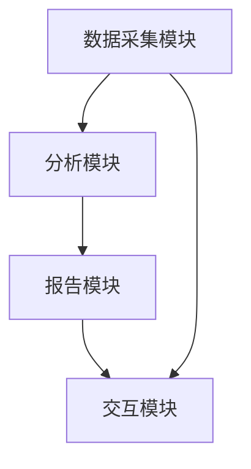
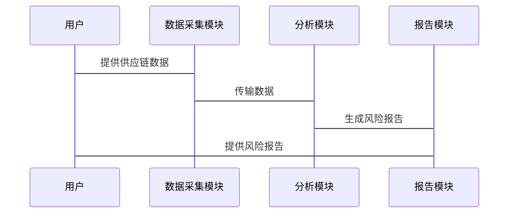

                 


```markdown
# 多智能体系统在全球供应链风险分析中的角色

> 关键词：多智能体系统, 供应链风险分析, 全球供应链, 系统架构设计, 项目实战

> 摘要：本文探讨多智能体系统在全球供应链风险分析中的应用，分析其核心概念、算法原理和系统架构设计，通过实际案例展示其在供应链风险管理中的优势。

---

## 第一部分：多智能体系统与全球供应链风险分析引言

### 第1章：多智能体系统与供应链风险分析概述

#### 1.1 多智能体系统（MAS）的基本概念
- **多智能体系统的定义**：由多个相互作用的智能体组成的系统，每个智能体具备自主性、反应性和协作性。
- **多智能体系统的核心特征**：分布性、协作性、自主性、反应性。
- **多智能体系统与传统单智能体系统的区别**：传统系统依赖中央控制，MAS强调分布式决策和协作。

#### 1.2 全球供应链的基本结构与风险分析
- **供应链的基本概念与组成部分**：供应商、制造商、分销商、零售商、消费者。
- **供应链风险的定义与分类**：供应风险、生产风险、物流风险、市场需求风险。
- **供应链风险分析的重要性**：降低风险，提高供应链弹性。

#### 1.3 多智能体系统在供应链风险分析中的角色
- **多智能体系统在供应链中的应用背景**：全球化和复杂性增加，需要灵活的风险管理工具。
- **多智能体系统如何帮助供应链风险分析**：实时信息共享、分布式决策、协作优化。
- **多智能体系统在供应链风险分析中的优势**：提高响应速度、增强决策准确性。

#### 1.4 本章小结
本章介绍了多智能体系统的基本概念及其在全球供应链中的应用，强调了MAS在供应链风险分析中的重要性。

---

## 第二部分：多智能体系统的核心概念与原理

### 第2章：多智能体系统的原理与设计

#### 2.1 多智能体系统的原理
- **多智能体系统的组成要素**：智能体、环境、通信机制、协作机制。
- **多智能体系统的通信机制**：基于消息传递或共享知识库。
- **多智能体系统的协作机制**：分布式任务分配、协商与协调。

#### 2.2 多智能体系统的协调与决策
- **分布式决策的基本原理**：每个智能体基于本地信息做出决策。
- **协作式决策的实现方法**：协商、拍卖、领导者选举。
- **多智能体系统中的冲突解决**：优先级规则、协商协议。

#### 2.3 多智能体系统的建模与仿真
- **多智能体系统的建模方法**：基于状态空间、基于规则、基于模型。
- **多智能体系统的仿真工具**：Repast、Netlogo、Mason。
- **供应链中的应用实例**：模拟供应链中断情况下的自适应恢复。

#### 2.4 本章小结
本章详细阐述了多智能体系统的原理和设计，为后续应用打下基础。

---

## 第三部分：多智能体系统在供应链风险分析中的应用

### 第3章：供应链风险分析的核心模型与方法

#### 3.1 供应链风险分析的基本模型
- **供应链风险的识别与评估模型**：层次分析法（AHP）。
- **供应链风险的定量分析模型**：贝叶斯网络。
- **供应链风险的定性分析模型**：事件影响分析。

#### 3.2 多智能体系统在供应链风险分析中的应用
- **多智能体系统用于风险识别**：实时数据采集与共享。
- **多智能体系统用于风险评估**：分布式计算和协作推理。
- **多智能体系统用于风险缓解**：动态调整供应链策略。

#### 3.3 实例分析：全球供应链风险分析
- **案例背景**：假设某电子公司供应链中断。
- **MAS的应用**：多个智能体分别监控不同环节，识别潜在风险并协作制定应对策略。

#### 3.4 本章小结
本章通过分析供应链风险分析的核心模型，展示了多智能体系统在其中的应用优势。

---

### 第4章：基于多智能体系统的供应链风险分析算法

#### 4.1 多智能体贝叶斯网络模型
- **贝叶斯网络的基本原理**：节点表示变量，边表示因果关系。
- **多智能体贝叶斯网络的构建**：每个智能体负责部分节点的计算。
- **算法流程**：数据采集→节点更新→风险评估。

#### 4.2 多智能体贝叶斯网络算法实现
- **算法步骤**：
  1. 初始化各节点的概率分布。
  2. 各智能体采集数据并更新本地节点。
  3. 通过通信机制共享更新信息。
  4. 综合各节点信息，评估整体风险等级。
- **实现代码示例**（Python）：
  ```python
  import networkx as nx
  import numpy as np

  # 初始化贝叶斯网络
  G = nx.DiGraph()
  G.add_nodes_from(['A', 'B', 'C'])
  G.add_edges_from([('A', 'B'), ('B', 'C')])

  # 多智能体更新
  agents = ['A', 'B', 'C']
  data = {'A': 0.8, 'B': 0.6, 'C': 0.4}

  for agent in agents:
      if agent == 'A':
          prob = data['A']
      elif agent == 'B':
          prob *= data['B']
      else:
          prob *= data['C']
      # 更新网络
      G.nodes[agent].attr['probability'] = prob

  # 风险评估
  total_prob = 1.0
  for node in G.nodes():
      total_prob *= G.nodes[node].attr['probability']
  
  print(f"风险评估结果：{total_prob}")
  ```

#### 4.3 算法的数学模型
- **贝叶斯网络的联合概率公式**：
  $$ P(A,B,C) = P(A) \times P(B|A) \times P(C|B) $$
- **风险评估公式**：
  $$ Risk = \sum_{A,B,C} P(A,B,C) \times Impact(A,B,C) $$

#### 4.4 算法优缺点分析
- **优势**：分布式计算能力强，实时性高。
- **劣势**：通信开销大，可能导致计算延迟。

#### 4.5 本章小结
本章详细讲解了基于多智能体系统的贝叶斯网络算法，并通过代码示例展示了其实现过程。

---

## 第四部分：系统架构与项目实战

### 第5章：系统架构设计

#### 5.1 系统功能设计
- **功能模块**：
  - 数据采集模块：实时采集供应链各环节数据。
  - 分析模块：运行多智能体贝叶斯网络算法。
  - 报告模块：生成风险评估报告。
  - 交互模块：用户与系统交互界面。

#### 5.2 系统架构图


#### 5.3 系统交互流程图


#### 5.4 本章小结
本章设计了一个基于多智能体系统的供应链风险分析系统的架构，并通过图表展示了系统交互流程。

---

### 第6章：项目实战

#### 6.1 环境安装与配置
- **安装Python**：确保安装Python 3.x以上版本。
- **安装依赖库**：`pip install networkx matplotlib numpy`
- **安装工具**：Jupyter Notebook、Git、IDE（如PyCharm）。

#### 6.2 系统核心实现源代码
- **主程序代码**：
  ```python
  import networkx as nx
  import numpy as np
  import matplotlib.pyplot as plt

  def multi_agent_bayes_network():
      G = nx.DiGraph()
      G.add_nodes_from(['Supplier', 'Manufacturer', 'Retailer'])
      G.add_edges_from([('Supplier', 'Manufacturer'), ('Manufacturer', 'Retailer')])
      
      # 初始化概率
      probabilities = {
          'Supplier': 0.95,
          'Manufacturer': 0.90,
          'Retailer': 0.85
      }
      
      # 计算风险
      total_prob = 1.0
      for node in G.nodes():
          total_prob *= probabilities[node]
      
      return total_prob

  # 执行算法
  result = multi_agent_bayes_network()
  print(f"供应链风险评估结果：{result}")

  # 可视化网络
  nx.draw(G, with_labels=True, node_color='white', edge_color='black')
  plt.show()

  ```

#### 6.3 代码实现解读与分析
- **代码功能**：构建贝叶斯网络，计算供应链中断的风险概率。
- **关键代码解释**：
  - `networkx`用于构建网络图。
  - `numpy`用于概率计算。
  - `matplotlib`用于可视化。

#### 6.4 实际案例分析
- **案例背景**：某汽车制造公司面临零部件供应风险。
- **MAS的应用**：多个智能体分别监控供应商、制造商和零售商的生产状态，实时更新风险概率。
- **结果分析**：通过算法计算出供应链中断的概率为12%，及时采取措施降低风险。

#### 6.5 本章小结
本章通过实际案例展示了多智能体系统在供应链风险分析中的应用，详细讲解了代码实现和实际效果。

---

## 第五部分：总结与展望

### 第7章：总结与展望

#### 7.1 本文章总结
- **总结MAS在供应链风险分析中的优势**：提高效率、增强协作、实时响应。
- **总结MAS在供应链风险管理中的应用潜力**：未来可以在更复杂的场景中发挥作用。

#### 7.2 项目小结
- **项目的成功经验**：MAS有效降低了供应链风险，提高了企业应对突发事件的能力。
- **项目中的问题与不足**：通信延迟、数据隐私问题。

#### 7.3 最佳实践 Tips
- **MAS的应用建议**：结合具体业务需求，选择合适的MAS架构。
- **MAS的优化建议**：改进通信机制，提高计算效率。
- **MAS的扩展建议**：与其他技术（如区块链）结合，增强系统安全性。

#### 7.4 未来研究方向
- **MAS与其他技术的结合**：如人工智能、大数据分析。
- **MAS在供应链中的高级应用**：如动态风险预测、自适应优化。

#### 7.5 拓展阅读
- 推荐书籍：《多智能体系统：原理与应用》。
- 推荐论文：《Multi-Agent Systems in Supply Chain Risk Management》。

#### 7.6 本章小结
本章总结了MAS在供应链风险分析中的应用，并展望了未来的发展方向。

---

## 作者：AI天才研究院/AI Genius Institute & 禅与计算机程序设计艺术 /Zen And The Art of Computer Programming
```

