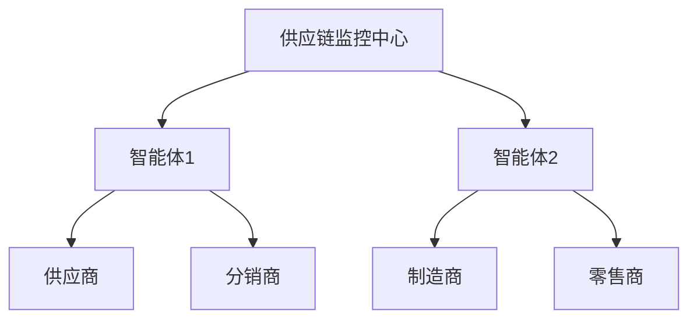

                 


# 多智能体系统在全球供应链风险评估中的应用

## 关键词：
多智能体系统, 供应链风险评估, 人工智能, 全球供应链, 风险管理, 系统架构

## 摘要：
随着全球化的发展，全球供应链的复杂性和脆弱性日益显著。多智能体系统（MAS）作为一种分布式、协作式的智能系统，能够有效应对供应链中的各种风险。本文将探讨多智能体系统在全球供应链风险评估中的应用，分析其核心概念、算法原理、系统架构及实际案例，为供应链风险管理提供新的思路和解决方案。

---

## 第1章: 多智能体系统与全球供应链概述

### 1.1 多智能体系统的基本概念
#### 1.1.1 多智能体系统的定义
多智能体系统（Multi-Agent System, MAS）是由多个智能体（Agent）组成的分布式系统，这些智能体能够通过通信和协作完成复杂的任务。智能体具有自主性、反应性、社会性和目标导向性。

#### 1.1.2 多智能体系统的组成部分
- **智能体**：具有感知环境、决策和行动能力的实体。
- **通信机制**：智能体之间通过消息传递进行信息交换。
- **协作机制**：智能体通过协作完成共同目标。
- **环境**：智能体所处的外部环境，包括物理环境和任务环境。

#### 1.1.3 多智能体系统的特点
- **分布式**：多个智能体协同工作，无中心控制。
- **协作性**：智能体之间通过协作完成任务。
- **动态性**：环境和任务可能动态变化。
- **智能性**：智能体具备自主决策能力。

### 1.2 全球供应链的基本概念
#### 1.2.1 供应链的定义与组成部分
供应链是指从原材料采购到最终产品交付的全过程，包括供应商、制造商、分销商、零售商和消费者。

#### 1.2.2 全球供应链的特点与挑战
- **全球化**：供应链跨越多个国家和地区。
- **复杂性**：涉及多个参与者和环节。
- **脆弱性**：容易受到外部因素（如自然灾害、疫情）的影响。
- **动态性**：市场需求和供应情况不断变化。

#### 1.2.3 供应链风险管理的重要性
供应链中断可能导致企业生产停滞、成本增加和声誉损失。因此，有效管理供应链风险是企业生存和发展的关键。

### 1.3 多智能体系统在供应链管理中的应用前景
#### 1.3.1 多智能体系统在供应链管理中的优势
- **分布式协作**：智能体可以分别负责不同的供应链环节。
- **实时响应**：智能体能够快速感知和应对环境变化。
- **智能决策**：通过智能体的协作，实现更优化的决策。

#### 1.3.2 企业采用多智能体系统的驱动力
- **提高效率**：通过智能体协作优化供应链流程。
- **增强灵活性**：快速适应市场变化。
- **降低成本**：通过智能决策减少资源浪费。

#### 1.3.3 多智能体系统应用的挑战与机遇
- **技术挑战**：智能体之间的通信和协作需要复杂的算法支持。
- **数据隐私**：多智能体系统可能涉及多个企业的数据，隐私问题需解决。
- **文化差异**：全球化供应链涉及不同国家和文化背景的企业，协作可能面临障碍。

---

## 第2章: 多智能体系统的原理与核心概念

### 2.1 多智能体系统的原理
#### 2.1.1 多智能体系统的通信机制
智能体之间的通信可以通过消息传递、状态共享等方式实现。通信机制需要考虑消息格式、通信协议和通信频率。

#### 2.1.2 多智能体系统的协作机制
协作机制包括任务分配、协调和冲突解决。智能体通过协作完成共同目标，可能采用分布式协商、拍卖机制等方法。

#### 2.1.3 多智能体系统的决策机制
智能体的决策基于感知到的信息和内部状态。决策机制可能采用基于规则的方法、启发式算法或基于模型的方法。

### 2.2 多智能体系统的组成部分
#### 2.2.1 智能体的定义与分类
智能体可以分为简单反应型智能体、基于模型的反射型智能体、目标驱动型智能体和效用驱动型智能体。

#### 2.2.2 智能体的属性与行为
- **属性**：智能体的属性包括知识库、目标、效用函数等。
- **行为**：智能体的行为包括感知、决策和行动。

#### 2.2.3 智能体之间的关系
智能体之间的关系可以是竞争关系、合作关系或混合关系。协作关系是供应链管理中常用的关系类型。

### 2.3 多智能体系统的通信与协作
#### 2.3.1 智能体之间的通信协议
通信协议需要定义消息的格式、内容和传输方式。常用的通信协议包括FIPA（基金会智能体通信）和KQML（知识查询与推理语言）。

#### 2.3.2 多智能体系统的协作模型
协作模型包括任务分配、分布式协商和协调。任务分配模型可以通过拍卖机制或基于角色的方法实现。

#### 2.3.3 多智能体系统的协调机制
协调机制包括同步、冲突解决和一致性检查。同步可以通过时间戳或事件触发实现。

---

## 第3章: 全球供应链风险评估的核心概念

### 3.1 供应链风险的定义与分类
#### 3.1.1 供应链风险的定义
供应链风险是指在供应链运营过程中可能发生的任何中断或问题，可能导致企业无法按时交付产品或增加成本。

#### 3.1.2 供应链风险的主要类型
- **供给链风险**：供应商无法按时交付原材料。
- **物流风险**：运输中断或延迟。
- **需求风险**：市场需求波动导致库存积压或短缺。
- **政策风险**：政策变化影响供应链运营。

#### 3.1.3 供应链风险的影响因素
- **自然灾害**：如地震、洪水等。
- **疫情**：如COVID-19导致的供应链中断。
- **政治经济因素**：如贸易限制、汇率波动等。

### 3.2 供应链风险评估的模型与方法
#### 3.2.1 供应链风险评估的主要模型
- **线性模型**：基于线性回归分析供应链风险的影响因素。
- **网络模型**：通过网络图分析供应链的脆弱性。
- **情景分析模型**：基于情景分析法评估不同情况下的供应链风险。

#### 3.2.2 供应链风险评估的关键指标
- **供应商可靠性**：供应商按时交付的能力。
- **物流成本**：物流环节的成本占比。
- **库存周转率**：库存周转速度反映供应链效率。
- **交付准时率**：交付产品的准时率反映供应链稳定性。

#### 3.2.3 供应链风险评估的步骤与流程
1. **识别风险源**：分析供应链各环节可能的风险。
2. **评估风险影响**：分析风险对企业的影响程度。
3. **制定应对策略**：根据风险评估结果制定应对措施。

### 3.3 多智能体系统在供应链风险评估中的作用
#### 3.3.1 多智能体系统在供应链风险识别中的应用
智能体可以实时监控供应链各环节的状态，识别潜在风险。

#### 3.3.2 多智能体系统在供应链风险量化中的应用
通过智能体协作，可以量化不同风险的影响程度，为决策提供依据。

#### 3.3.3 多智能体系统在供应链风险应对中的应用
智能体可以协调供应链各环节的资源，制定应对风险的策略。

---

## 第4章: 多智能体系统在供应链风险评估中的算法原理

### 4.1 多智能体系统的通信与协作算法
#### 4.1.1 智能体之间的通信协议
智能体之间的通信需要遵循特定的协议，如FIPA或KQML。

#### 4.1.2 智能体的协作算法
协作算法包括任务分配、协商和协调。任务分配可以通过拍卖机制或基于角色的方法实现。

#### 4.1.3 智能体的决策算法
智能体的决策算法可以基于规则、启发式或模型驱动的方法。

### 4.2 多智能体系统的风险评估算法
#### 4.2.1 风险识别算法
风险识别算法可以通过智能体协作，分析供应链各环节的潜在风险。

#### 4.2.2 风险量化算法
风险量化算法可以通过概率模型或统计方法，评估不同风险的影响程度。

#### 4.2.3 风险应对算法
风险应对算法可以通过智能体协作，制定应对策略，优化供应链运营。

### 4.3 算法原理的数学模型
#### 4.3.1 风险量化模型
$$ R_i = \sum_{j=1}^{n} w_j \cdot r_j $$
其中，$R_i$ 表示风险的综合评分，$w_j$ 表示第$j$个风险因素的权重，$r_j$ 表示第$j$个风险因素的评分。

#### 4.3.2 风险应对模型
$$ S_i = \argmin_{k} \sum_{j=1}^{m} c_{kj} $$
其中，$S_i$ 表示最优应对策略，$c_{kj}$ 表示第$k$个策略的第$j$个成本。

---

## 第5章: 多智能体系统在供应链风险评估中的系统设计

### 5.1 系统需求分析
#### 5.1.1 功能需求
- 实时监控供应链各环节的状态。
- 识别潜在风险并发出警报。
- 制定应对策略并优化供应链运营。

#### 5.1.2 性能需求
- 快速响应：智能体需要实时处理信息。
- 高可用性：系统需要保证高可用性。

### 5.2 系统架构设计
#### 5.2.1 系统架构图
使用mermaid绘制系统架构图，展示系统的主要组件及其交互关系。



#### 5.2.2 智能体设计
智能体设计包括智能体的属性、行为和通信接口。

#### 5.2.3 接口设计
系统接口设计需要定义智能体之间的通信接口和外部系统的接口。

### 5.3 系统实现
#### 5.3.1 环境安装
需要安装Python、Java等编程语言和相关库。

#### 5.3.2 系统核心实现
提供Python代码示例，展示智能体的设计和实现。

```python
class Agent:
    def __init__(self, id):
        self.id = id
        self.state = {}
    
    def receive_message(self, message):
        # 处理接收到的消息
        pass
    
    def send_message(self, message, recipient):
        # 发送消息
        pass
```

---

## 第6章: 多智能体系统在供应链风险评估中的项目实战

### 6.1 项目背景
#### 6.1.1 项目介绍
一个基于多智能体系统的全球供应链风险评估项目，旨在优化供应链运营，降低风险。

#### 6.1.2 项目目标
实现一个多智能体系统，实时监控供应链风险，制定应对策略。

### 6.2 项目实现
#### 6.2.1 环境安装
安装必要的软件和库，如Python、NumPy、Scipy等。

#### 6.2.2 核心代码实现
提供Python代码示例，展示智能体的通信和协作。

```python
import random

class Agent:
    def __init__(self, id):
        self.id = id
        self.state = {}
    
    def receive_message(self, message):
        # 处理接收到的消息
        print(f"Agent {self.id} received message: {message}")
    
    def send_message(self, message, recipient):
        # 发送消息
        print(f"Agent {self.id} sent message: {message} to {recipient}")

# 初始化智能体
agent1 = Agent(1)
agent2 = Agent(2)

# 发送消息
agent1.send_message("Hello", agent2.id)
agent2.receive_message("Hello")
```

#### 6.2.3 案例分析
分析实际案例，展示多智能体系统在供应链风险评估中的应用效果。

### 6.3 项目小结
总结项目实现的过程和成果，分析系统的优缺点。

---

## 第7章: 多智能体系统在全球供应链风险评估中的总结与展望

### 7.1 本章总结
回顾全文，总结多智能体系统在全球供应链风险评估中的应用。

### 7.2 最佳实践 tips
- 系统设计需要考虑智能体之间的通信和协作。
- 数据隐私和安全是系统设计的重要考虑因素。
- 系统需要具备动态适应能力，以应对供应链的复杂性和不确定性。

### 7.3 注意事项
- 系统设计需要考虑智能体之间的通信和协作。
- 数据隐私和安全是系统设计的重要考虑因素。
- 系统需要具备动态适应能力，以应对供应链的复杂性和不确定性。

### 7.4 拓展阅读
推荐相关书籍和论文，供读者进一步学习和研究。

---

## 作者：AI天才研究院/AI Genius Institute & 禅与计算机程序设计艺术 /Zen And The Art of Computer Programming

