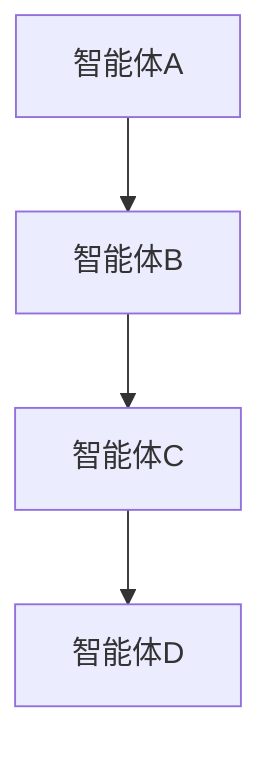
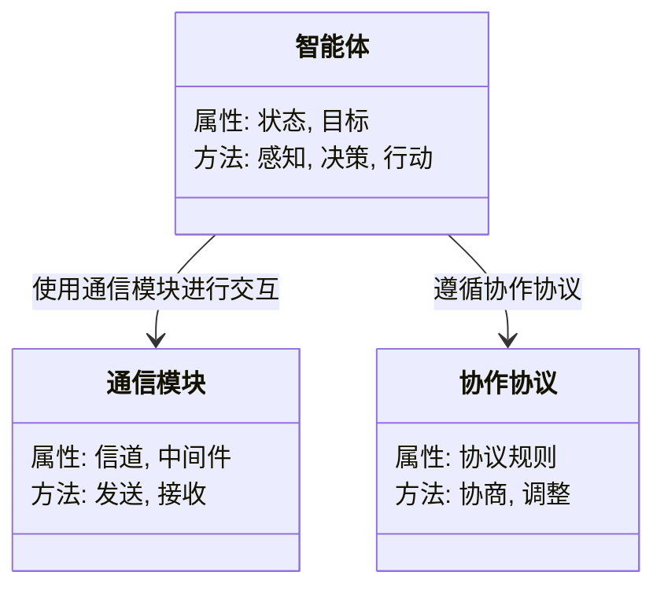
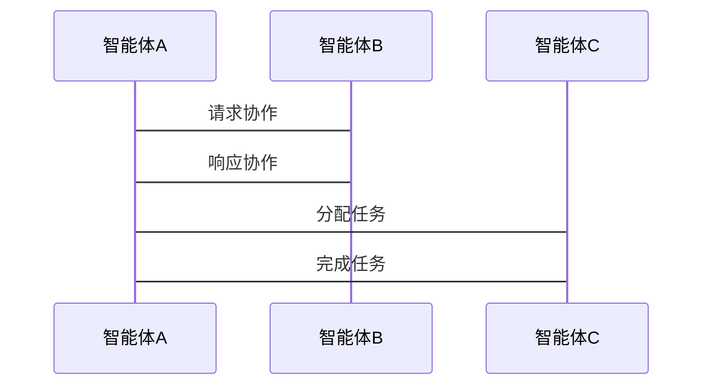

                 


# 多智能体系统在全球地缘政治风险分析中的角色

## 关键词
多智能体系统, 地缘政治风险, 博弈论, 分布式计算, 系统架构, 人工智能

## 摘要
多智能体系统（Multi-Agent Systems, MAS）是一种由多个智能体组成的分布式系统，这些智能体能够自主决策、协作和竞争。在地缘政治风险分析中，MAS可以模拟复杂的国际关系和多利益相关者的互动，提供更准确的风险评估和决策支持。本文将从MAS的基本概念、地缘政治风险分析的背景与挑战、MAS在地缘政治风险分析中的作用、MAS的核心概念与联系、MAS的算法原理、MAS的系统架构设计、MAS的项目实战、MAS的最佳实践与注意事项等方面，系统地探讨MAS在全球地缘政治风险分析中的角色。

---

# 第一部分: 多智能体系统与地缘政治风险分析的背景与基础

## 第1章: 多智能体系统概述

### 1.1 多智能体系统的基本概念

#### 1.1.1 多智能体系统的定义
多智能体系统（MAS）是由多个智能体组成的分布式系统，这些智能体能够通过感知环境、自主决策、协作和竞争完成复杂的任务。智能体可以是软件程序、机器人或其他能够感知和操作环境的实体。

#### 1.1.2 多智能体系统的特征
- **自主性**：智能体能够自主决策，无需外部干预。
- **反应性**：智能体能够实时感知环境并做出反应。
- **协作性**：多个智能体可以通过协作完成共同目标。
- **分布式性**：智能体分布在不同的位置，通过通信和协作完成任务。
- **动态性**：环境和智能体的目标可能随时间变化。

#### 1.1.3 多智能体系统的分类
- **基于任务的MAS**：智能体协作完成特定任务。
- **基于市场的MAS**：智能体通过市场机制进行资源分配和交易。
- **基于博弈论的MAS**：智能体在竞争环境中进行策略选择。

---

### 1.2 多智能体系统的核心原理

#### 1.2.1 分布式智能
MAS的核心思想是将问题分解为多个智能体的任务，通过智能体的协作完成整体目标。分布式智能能够提高系统的可靠性和容错性。

#### 1.2.2 协作与通信机制
协作是MAS的核心，智能体通过通信机制共享信息、协商任务和分配资源。通信机制可以是直接的点对点通信，也可以通过中间件实现。

#### 1.2.3 动态环境下的适应性
MAS能够适应动态变化的环境，智能体可以根据环境的变化调整自己的行为和策略。

---

## 第2章: 地缘政治风险分析的背景与挑战

### 2.1 地缘政治风险的定义与分类

#### 2.1.1 地缘政治风险的定义
地缘政治风险是指由于国家间的政治、经济、军事等因素的复杂互动而产生的潜在风险，可能对全球或地区的稳定性和经济发展造成影响。

#### 2.1.2 主要的地缘政治风险类型
- **军事冲突风险**：战争、武装冲突等。
- **经济风险**：贸易摩擦、经济制裁等。
- **政治风险**：政权更迭、政策变化等。
- **资源风险**：资源争夺、能源危机等。

#### 2.1.3 地缘政治风险的评估方法
- **定性分析**：通过专家判断和经验分析风险。
- **定量分析**：通过数学模型和数据分析量化风险。

---

### 2.2 地缘政治风险分析的复杂性

#### 2.2.1 数据的多样性与不确定性
地缘政治风险涉及多种类型的数据，包括文本、图像、语音等，且数据可能存在缺失或不一致的情况。

#### 2.2.2 多利益相关者的互动
地缘政治风险分析需要考虑多个利益相关者的互动，包括国家、企业、非政府组织等。

#### 2.2.3 动态变化的国际环境
国际环境复杂多变，地缘政治风险可能随时发生变化，传统的静态分析方法难以应对。

---

### 2.3 多智能体系统在地缘政治风险分析中的作用

#### 2.3.1 分布式计算的优势
MAS能够分布式地处理复杂问题，避免单点故障，提高系统的可靠性和计算效率。

#### 2.3.2 协作与通信机制的应用
通过MAS的协作机制，可以模拟多利益相关者的互动，帮助分析潜在的风险和冲突。

#### 2.3.3 动态适应性
MAS能够实时适应环境的变化，提供动态的地缘政治风险评估和预警。

---

# 第三部分: 多智能体系统的核心概念与联系

## 第3章: 多智能体系统的核心概念与属性

### 3.1 多智能体系统的实体关系

#### 3.1.1 实体关系图
使用Mermaid绘制的实体关系图可以清晰地展示MAS中的智能体及其之间的关系。



#### 3.1.2 实体间的交互关系
智能体之间的交互关系可以通过表格进行对比，例如：

| 关系类型 | 描述 | 示例 |
|----------|------|------|
| 协作关系 | 智能体之间通过协作完成共同目标 | 智能体A和智能体B协作完成任务X |
| 竞争关系 | 智能体之间通过竞争实现资源分配 | 智能体A和智能体B竞争资源Y |
| 中立关系 | 智能体之间无直接关系 | 智能体A和智能体C互不影响 |

---

### 3.2 多智能体系统的协作协议

#### 3.2.1 协作协议的定义
协作协议是智能体之间为了完成共同目标而达成的协议，包括任务分配、资源共享、信息传递等内容。

#### 3.2.2 协作协议的类型
- **简单协作协议**：适用于任务分解明确的场景。
- **复杂协作协议**：适用于任务分解复杂且需要多次协商的场景。

---

### 3.3 多智能体系统的通信机制

#### 3.3.1 通信机制的定义
通信机制是智能体之间共享信息和进行交互的方式，包括消息传递、广播通信等。

#### 3.3.2 通信机制的实现方式
- **点对点通信**：智能体之间直接通信。
- **基于中间件的通信**：通过中间件实现智能体之间的通信和协作。

---

## 第4章: 多智能体系统与地缘政治风险分析的联系

### 4.1 多智能体系统的地缘政治风险分析框架

#### 4.1.1 框架的定义
地缘政治风险分析框架是基于MAS构建的分析模型，用于模拟和预测地缘政治风险。

#### 4.1.2 框架的组成部分
- **智能体模型**：模拟不同国家或组织的行为。
- **通信机制**：模拟国家间的互动和信息共享。
- **协作协议**：模拟国家间的合作协议和冲突解决机制。

---

### 4.2 多智能体系统的地缘政治风险分析模型

#### 4.2.1 模型的定义
地缘政治风险分析模型是基于MAS构建的数学模型，用于量化地缘政治风险。

#### 4.2.2 模型的实现步骤
1. **定义智能体**：确定智能体的属性和行为。
2. **设计通信机制**：实现智能体之间的信息共享和交互。
3. **建立协作协议**：定义智能体之间的协作规则。
4. **模拟与分析**：通过模拟不同场景，分析地缘政治风险。

---

### 4.3 多智能体系统的地缘政治风险分析算法

#### 4.3.1 算法的定义
地缘政治风险分析算法是基于MAS的算法，用于模拟和预测地缘政治风险。

#### 4.3.2 算法的实现步骤
1. **初始化智能体**：定义智能体的初始状态和目标。
2. **通信与协作**：智能体通过通信机制共享信息并协商任务。
3. **决策与行动**：智能体根据协作结果做出决策并执行行动。
4. **评估与调整**：评估决策结果并调整智能体的行为策略。

---

## 第5章: 多智能体系统与地缘政治风险分析的算法实现

### 5.1 算法原理

#### 5.1.1 博弈论模型
博弈论模型是MAS的重要组成部分，用于模拟智能体之间的竞争和合作。

#### 5.1.2 多智能体协作算法
多智能体协作算法用于实现智能体之间的协作，例如基于任务分解的协作算法。

---

### 5.2 算法的数学模型

#### 5.2.1 博弈论模型的数学表达
博弈论模型可以用数学公式表示，例如纳什均衡的定义：

$$ 纳什均衡：在所有参与者策略均为最优反应的情况下达到的均衡状态。 $$

#### 5.2.2 多智能体协作算法的数学表达
多智能体协作算法可以用以下公式表示：

$$ \text{任务分配} = \arg\min_{i} \text{成本}(i) $$

---

## 第6章: 多智能体系统的系统架构设计

### 6.1 系统功能设计

#### 6.1.1 领域模型
使用Mermaid类图可以展示系统的领域模型。



---

### 6.2 系统架构设计

#### 6.2.1 系统架构图
使用Mermaid架构图可以展示系统的整体架构。


---

### 6.3 系统接口设计

#### 6.3.1 系统接口
系统接口是智能体之间的交互界面，可以是API或其他通信接口。

---

### 6.4 系统交互设计

#### 6.4.1 系统交互序列图
使用Mermaid序列图可以展示系统交互的过程。



---

## 第7章: 多智能体系统的项目实战

### 7.1 环境配置

#### 7.1.1 开发环境
推荐使用Python和相关的机器学习框架（如TensorFlow、PyTorch）进行开发。

---

### 7.2 核心实现源代码

#### 7.2.1 智能体类
```python
class Agent:
    def __init__(self, id):
        self.id = id
        self.state = None
        self.goal = None

    def perceive(self, environment):
        self.state = self.get_state(environment)

    def decide(self):
        # 假设使用简单的规则进行决策
        if self.state == 'high':
            return '合作'
        else:
            return '竞争'

    def act(self, decision):
        print(f"Agent {self.id}采取了{decision}行动")
```

---

### 7.3 代码应用解读与分析

#### 7.3.1 代码解读
上述代码定义了一个简单的智能体类，包括感知、决策和行动三个基本功能。智能体可以根据环境状态做出决策。

---

### 7.4 实际案例分析

#### 7.4.1 案例分析
以中美贸易摩擦为例，通过MAS模拟两国在贸易谈判中的互动和决策。

---

## 第8章: 多智能体系统的最佳实践与注意事项

### 8.1 最佳实践 tips

#### 8.1.1 智能体设计
- 确保智能体的行为符合实际需求。
- 考虑智能体的多样性和复杂性。

#### 8.1.2 系统架构设计
- 确保系统的可扩展性和可维护性。
- 考虑系统的实时性和响应速度。

---

### 8.2 小结

#### 8.2.1 总结
多智能体系统在地缘政治风险分析中具有重要的作用，可以通过MAS模拟复杂的国际关系和多利益相关者的互动，提供更准确的风险评估和决策支持。

---

### 8.3 注意事项

#### 8.3.1 系统设计
- 确保系统的安全性和隐私性。
- 考虑系统的鲁棒性和容错性。

#### 8.3.2 智能体行为设计
- 确保智能体的行为符合实际需求。
- 考虑智能体的多样性和复杂性。

---

## 作者

作者：AI天才研究院/AI Genius Institute & 禅与计算机程序设计艺术 /Zen And The Art of Computer Programming

