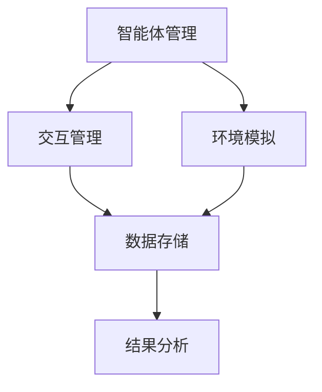
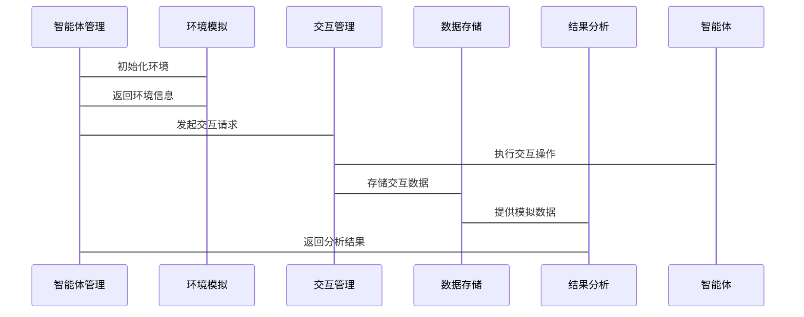

                 


# 多智能体系统在全球宏观经济分析中的角色

> 关键词：多智能体系统、宏观经济分析、智能体模型、经济预测、政策模拟、系统架构

> 摘要：多智能体系统（Multi-Agent Systems, MAS）在宏观经济分析中发挥着越来越重要的作用。本文系统地介绍了MAS的基本概念、核心原理及其在全球宏观经济分析中的应用。通过对比分析，探讨了MAS在市场机制模拟、宏观经济政策评估和经济预测中的优势，并结合实际案例，详细讲解了MAS的算法原理和系统架构设计。本文还通过项目实战，展示了如何基于MAS构建宏观经济分析系统，并提出了MAS在宏观经济分析中的未来发展方向和应用前景。

---

# 第一部分: 多智能体系统与宏观经济分析概述

## 第1章: 多智能体系统（MAS）的基本概念

### 1.1 智能体的基本概念

#### 1.1.1 智能体的定义与特点
智能体（Agent）是指具有感知环境、自主决策和执行任务能力的实体。智能体可以是软件程序、机器人或其他能够与环境交互的实体。

- **感知环境**：智能体通过传感器或数据输入接口获取外部信息。
- **自主决策**：智能体基于获取的信息，通过内部算法或规则做出决策。
- **执行任务**：智能体根据决策结果执行相应的操作。

#### 1.1.2 多智能体系统的定义与特点
多智能体系统（MAS）是由多个智能体组成的分布式系统，智能体之间通过交互和协作完成复杂任务。

- **分布式性**：智能体独立运行，不依赖中央控制。
- **协作性**：智能体之间通过通信和协调完成共同目标。
- **动态性**：智能体的交互和环境状态是动态变化的。

### 1.2 宏观经济分析的基本概念

#### 1.2.1 宏观经济的基本概念
宏观经济分析研究的是整个经济系统的运行规律，包括GDP、通货膨胀、失业率等宏观指标。

- **GDP（国内生产总值）**：衡量一个国家或地区的经济规模。
- **通货膨胀**：物价总水平的上涨。
- **失业率**：劳动力市场中失业人口占总劳动力的比例。

#### 1.2.2 宏观经济分析的主要方法
宏观经济分析的方法包括计量经济学方法、动态一般均衡模型（Dynamic Stochastic General Equilibrium, DSGE）和 Agent-Based Modeling（ABM）。

- **计量经济学方法**：基于统计数据和回归分析进行预测。
- **DSGE模型**：通过构建动态一般均衡模型模拟经济运行。
- **ABM方法**：通过模拟个体行为及其交互来分析宏观经济现象。

#### 1.2.3 宏观经济模型的分类
宏观经济模型可以分为以下几类：

- **凯恩斯主义模型**：强调政府干预和需求管理。
- **货币主义模型**：强调货币供应和价格稳定。
- **新古典主义模型**：基于市场出清和理性预期假设。

### 1.3 多智能体系统与宏观经济分析的结合

#### 1.3.1 MAS在宏观经济分析中的作用
MAS可以模拟经济系统中个体行为的复杂性，帮助理解宏观经济现象的动态演化过程。

- **个体行为模拟**：通过模拟个体决策过程，揭示宏观经济现象的微观基础。
- **政策模拟**：通过模拟政策干预的效果，评估政策的可行性和效果。
- **经济预测**：通过模拟经济系统的动态变化，预测未来经济走势。

#### 1.3.2 MAS与传统宏观经济模型的对比
MAS与传统宏观经济模型的主要区别在于：

- **微观基础**：MAS基于个体行为建模，而传统模型通常基于宏观指标和假设。
- **动态性**：MAS能够模拟经济系统的动态变化，而传统模型通常假设静态环境。
- **复杂性**：MAS能够处理复杂的个体互动和非线性关系，而传统模型通常假设线性关系。

#### 1.3.3 MAS在宏观经济研究中的优势
MAS在宏观经济研究中的优势包括：

- **微观基础**：MAS能够捕捉个体行为的复杂性，揭示宏观经济现象的微观机制。
- **动态性**：MAS能够模拟经济系统的动态变化，提供更加精确的经济预测。
- **政策模拟**：MAS能够模拟政策干预的效果，为政策制定提供科学依据。

## 1.4 本章小结
本章介绍了智能体的基本概念、多智能体系统的定义与特点，以及宏观经济分析的基本概念和方法。通过对比分析，揭示了MAS在宏观经济分析中的独特优势和重要作用。

---

## 第2章: 多智能体系统的核心概念与联系

### 2.1 多智能体系统的核心概念

#### 2.1.1 智能体的分类
智能体可以分为以下几类：

- **简单反射型智能体**：基于当前感知做出反应。
- **基于模型的智能体**：基于内部模型和规划做出决策。
- **效用驱动型智能体**：基于效用函数优化决策。
- **学习型智能体**：通过学习改进决策策略。

#### 2.1.2 智能体的行为模型
智能体的行为模型包括：

- **反应式模型**：基于当前感知做出反应。
- **规划式模型**：基于目标和规划做出决策。
- **效用驱动模型**：基于效用函数优化决策。
- **学习模型**：通过学习改进决策策略。

#### 2.1.3 智能体之间的交互方式
智能体之间的交互方式包括：

- **直接交互**：智能体之间直接通信和协作。
- **间接交互**：通过中间媒介（如市场）进行交互。
- **分布式交互**：智能体在分布式环境中独立运行并相互影响。

### 2.2 宏观经济中的MAS模型构建

#### 2.2.1 宏观经济MAS模型的构建步骤
构建宏观经济MAS模型的步骤包括：

1. **需求分析**：明确模型的目标和应用领域。
2. **模型设计**：设计智能体的行为模型和交互规则。
3. **模型实现**：编写代码实现模型。
4. **模型验证**：通过实验验证模型的合理性和准确性。
5. **模型应用**：将模型应用于实际问题的分析和预测。

#### 2.2.2 宏观经济MAS模型的核心要素
宏观经济MAS模型的核心要素包括：

- **智能体类型**：不同类型的智能体（如消费者、企业、政府）。
- **行为规则**：智能体的行为决策规则。
- **交互机制**：智能体之间的交互方式和规则。
- **环境模型**：模拟的经济环境（如市场、资源等）。

#### 2.2.3 宏观经济MAS模型的验证与评估
验证和评估宏观经济MAS模型的方法包括：

- **实验验证**：通过模拟实验验证模型的合理性和准确性。
- **参数敏感性分析**：分析模型对不同参数的敏感性。
- **对比分析**：将模型结果与实际数据或传统模型结果进行对比。

### 2.3 MAS与宏观经济的关系

#### 2.3.1 MAS在宏观经济中的应用领域
MAS在宏观经济中的应用领域包括：

- **市场机制模拟**：模拟市场供需关系和价格形成机制。
- **政策模拟**：模拟政策干预的效果。
- **经济预测**：预测经济走势和风险。

#### 2.3.2 MAS与宏观经济政策的关系
MAS可以为宏观经济政策的制定提供科学依据，帮助政策制定者更好地理解政策的可能效果。

- **政策模拟**：通过模拟政策干预的效果，评估政策的可行性和效果。
- **风险预警**：通过模拟经济系统的动态变化，预警潜在的经济风险。

#### 2.3.3 MAS对宏观经济预测的影响
MAS能够捕捉经济系统中的复杂性和非线性关系，提供更加精确的经济预测。

- **动态模拟**：MAS能够模拟经济系统的动态变化，提供更加准确的预测。
- **个体行为分析**：MAS能够捕捉个体行为的复杂性，揭示宏观经济现象的微观机制。

## 2.4 本章小结
本章详细介绍了多智能体系统的核心概念，包括智能体的分类、行为模型和交互方式。通过分析宏观经济MAS模型的构建步骤和核心要素，揭示了MAS在宏观经济分析中的重要作用。

---

## 第3章: 宏观经济分析中的MAS模型

### 3.1 宏观经济分析的基本方法

#### 3.1.1 宏观经济指标的定义与分类
宏观经济指标可以分为以下几类：

- **总量指标**：GDP、通货膨胀率等。
- **结构指标**：就业结构、产业结构等。
- **价格指标**：消费者价格指数（CPI）、生产者价格指数（PPI）等。

#### 3.1.2 宏观经济模型的构建与应用
宏观经济模型的构建与应用包括：

- **模型选择**：选择适合的研究问题的模型。
- **参数估计**：通过数据估计模型参数。
- **模型验证**：验证模型的合理性和准确性。
- **模型应用**：将模型应用于实际问题的分析和预测。

#### 3.1.3 宏观经济预测的基本方法
宏观经济预测的基本方法包括：

- **时间序列分析**：基于历史数据预测未来趋势。
- **计量经济学方法**：基于回归分析预测经济指标。
- **DSGE模型**：通过构建动态一般均衡模型进行预测。

### 3.2 MAS在宏观经济分析中的应用

#### 3.2.1 市场机制的MAS模拟
市场机制的MAS模拟包括：

- **供需关系模拟**：模拟市场供需关系的变化。
- **价格形成模拟**：模拟市场价格的形成机制。
- **市场行为模拟**：模拟市场参与者的决策行为。

#### 3.2.2 宏观经济政策的MAS评估
宏观经济政策的MAS评估包括：

- **政策效果模拟**：模拟政策干预的效果。
- **风险评估**：评估政策干预可能带来的风险。
- **政策优化**：通过模拟优化政策方案。

#### 3.2.3 宏观经济预测的MAS方法
宏观经济预测的MAS方法包括：

- **个体行为模拟**：通过模拟个体行为预测宏观经济走势。
- **动态模拟**：通过动态模拟预测经济系统的演变。
- **情景分析**：通过情景分析预测不同情况下经济的可能表现。

### 3.3 宏观经济MAS模型的优缺点

#### 3.3.1 MAS模型的优势
MAS模型的优势包括：

- **微观基础**：MAS模型能够捕捉个体行为的复杂性，揭示宏观经济现象的微观机制。
- **动态性**：MAS模型能够模拟经济系统的动态变化，提供更加精确的经济预测。
- **政策模拟**：MAS模型能够模拟政策干预的效果，为政策制定提供科学依据。

#### 3.3.2 MAS模型的局限性
MAS模型的局限性包括：

- **复杂性**：MAS模型的构建和实现相对复杂，需要较高的技术门槛。
- **数据需求**：MAS模型需要大量个体行为数据，数据获取可能困难。
- **计算成本**：MAS模型的模拟需要大量计算资源，计算成本较高。

#### 3.3.3 MAS模型的改进方向
MAS模型的改进方向包括：

- **简化模型**：通过简化模型降低复杂性和计算成本。
- **数据共享**：通过数据共享获取更多的个体行为数据。
- **算法优化**：通过优化算法提高模拟效率和准确性。

## 3.4 本章小结
本章分析了宏观经济分析的基本方法，详细探讨了MAS在宏观经济分析中的应用，包括市场机制模拟、政策评估和经济预测。通过对比分析，揭示了MAS模型的优势和局限性，并提出了改进方向。

---

## 第4章: 多智能体系统在宏观经济分析中的算法原理

### 4.1 宏观经济MAS模型的算法基础

#### 4.1.1 智能体行为模型的数学表达
智能体行为模型的数学表达可以表示为：

$$
\text{行为决策} = f(\text{感知}, \text{状态}, \text{目标})
$$

其中，$\text{感知}$是智能体从环境中获取的信息，$\text{状态}$是智能体的内部状态，$\text{目标}$是智能体的目标。

#### 4.1.2 多智能体系统的通信与协作
多智能体系统的通信与协作可以通过以下步骤实现：

1. **信息感知**：智能体感知环境信息。
2. **信息传递**：智能体之间通过通信传递信息。
3. **决策制定**：智能体基于传递的信息和自身状态制定决策。
4. **行动执行**：智能体根据决策执行相应的操作。

#### 4.1.3 多智能体系统的协调与冲突解决
多智能体系统的协调与冲突解决可以通过以下方法实现：

- **协商机制**：智能体通过协商解决冲突。
- **仲裁机制**：通过仲裁者解决冲突。
- **优先级机制**：通过设定优先级解决冲突。

### 4.2 宏观经济MAS模型的算法原理

#### 4.2.1 宏观经济MAS模型的建模步骤
宏观经济MAS模型的建模步骤包括：

1. **需求分析**：明确模型的目标和应用领域。
2. **模型设计**：设计智能体的行为模型和交互规则。
3. **模型实现**：编写代码实现模型。
4. **模型验证**：通过实验验证模型的合理性和准确性。
5. **模型应用**：将模型应用于实际问题的分析和预测。

#### 4.2.2 宏观经济MAS模型的仿真算法
宏观经济MAS模型的仿真算法包括：

1. **初始化**：设置初始状态和参数。
2. **感知环境**：智能体感知环境信息。
3. **决策制定**：智能体基于感知信息和内部状态制定决策。
4. **行动执行**：智能体根据决策执行相应的操作。
5. **状态更新**：更新环境和智能体的状态。
6. **结果记录**：记录模拟结果。

#### 4.2.3 宏观经济MAS模型的优化方法
宏观经济MAS模型的优化方法包括：

- **参数优化**：通过调整参数提高模型的准确性和效率。
- **算法优化**：通过优化算法提高模型的计算效率。
- **模型简化**：通过简化模型降低复杂性和计算成本。

### 4.3 本章小结
本章详细介绍了宏观经济MAS模型的算法原理，包括智能体行为模型的数学表达、多智能体系统的通信与协作，以及宏观经济MAS模型的建模步骤和仿真算法。通过优化方法的探讨，为提高模型的准确性和效率提供了参考。

---

## 第5章: 宏观经济MAS模型的系统架构设计

### 5.1 宏观经济MAS模型的系统架构

#### 5.1.1 问题场景介绍
本章以一个宏观经济MAS模型为例，探讨系统架构设计的具体实现。

#### 5.1.2 系统功能设计
系统功能设计包括：

- **智能体管理**：管理不同类型的智能体。
- **环境模拟**：模拟宏观经济环境。
- **交互管理**：管理智能体之间的交互。
- **数据存储**：存储模拟数据和结果。
- **结果分析**：分析模拟结果并生成报告。

#### 5.1.3 系统架构图
以下是宏观经济MAS模型的系统架构图：



#### 5.1.4 系统交互图
以下是系统交互图：



### 5.2 宏观经济MAS模型的实现步骤

#### 5.2.1 环境安装
以下是环境安装步骤：

1. **安装Python**：确保安装了Python 3.8或更高版本。
2. **安装依赖库**：安装必要的依赖库，如NumPy、Pandas、Matplotlib等。
3. **安装MAS框架**：安装多智能体系统框架，如 Mesa（Multi-Agent Simulation Environment）。

#### 5.2.2 系统核心实现
以下是宏观经济MAS模型的核心代码实现：

```python
# 宏观经济MAS模型的核心代码
import mesa

class Consumer(mesa.Agent):
    def __init__(self, unique_id, model):
        super().__init__(unique_id, model)
        self.consumption = 0
        self.income = 0

    def step(self):
        self.consumption = min(self.income, self.model.price)

class Firm(mesa.Agent):
    def __init__(self, unique_id, model):
        super().__init__(unique_id, model)
        self.production = 0
        self.cost = 0

    def step(self):
        self.production = max(0, self.model.demand - self.model.supply)

class Market(mesa.Agent):
    def __init__(self, unique_id, model):
        super().__init__(unique_id, model)
        self.supply = 0
        self.demand = 0
        self.price = 0

    def step(self):
        self.supply = sum(agent.production for agent in self.model.firms)
        self.demand = sum(agent.consumption for agent in self.model.consumers)
        self.price = max(0, self.demand - self.supply)

class MacroeconomicModel(mesa.Model):
    def __init__(self, N):
        super().__init__()
        self.N = N
        self.consumers = []
        self.firms = []
        self.markets = []
        # 初始化消费者
        for i in range(N):
            consumer = Consumer(i, self)
            self.consumers.append(consumer)
            self.add_agent(consumer)
        # 初始化企业
        for i in range(N):
            firm = Firm(i, self)
            self.firms.append(firm)
            self.add_agent(firm)
        # 初始化市场
        market = Market("market", self)
        self.markets.append(market)
        self.add_agent(market)

    def step(self):
        for agent in self.agents:
            agent.step()
```

#### 5.2.3 代码应用解读与分析
上述代码实现了一个简单的宏观经济MAS模型，包括消费者、企业

