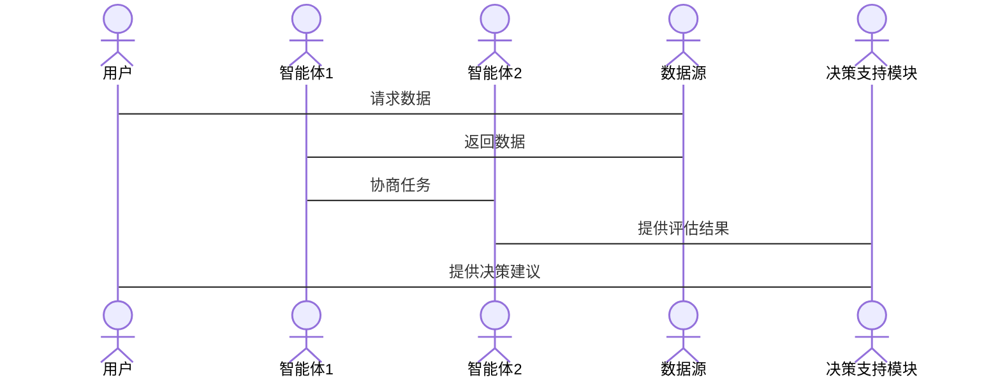

                 


# 多智能体系统在全球政治风险分析中的角色

## 关键词：多智能体系统、政治风险分析、全球政治、智能体协作、地缘政治、风险管理

## 摘要：  
多智能体系统（Multi-Agent Systems, MAS）作为一种分布式人工智能技术，近年来在多个领域展现出强大的应用潜力。本文探讨了多智能体系统在全球政治风险分析中的角色，分析了其在政治风险评估、预测和决策支持中的应用价值。通过详细阐述多智能体系统的定义、原理、优势及其在政治风险分析中的具体应用场景，本文为读者提供了理解多智能体系统如何在全球政治风险分析中发挥作用的框架。结合实际案例和系统设计，本文进一步展示了多智能体系统的技术实现和实践意义，为相关领域的研究和应用提供了有益的参考。

---

## 第一部分: 多智能体系统概述

### 第1章: 多智能体系统的基本概念

#### 1.1 多智能体系统的定义与特点

多智能体系统（Multi-Agent Systems, MAS）是由多个智能体（Agent）组成的分布式系统，这些智能体能够通过交互和协作完成复杂任务。与传统的人工智能系统不同，MAS强调智能体之间的动态交互和协同合作。

- **多智能体系统的定义**  
  多智能体系统是由多个智能体组成的分布式系统，这些智能体能够感知环境、自主决策，并通过通信和协作完成复杂任务。

- **多智能体系统的属性特征对比表格**  
  下表展示了多智能体系统与传统单智能体系统的对比：

| 属性                | 单智能体系统               | 多智能体系统               |
|---------------------|---------------------------|---------------------------|
| 系统结构            | 单点结构                   | 分布式结构                 |
| 智能体数量          | 1个                       | 多个                       |
| 任务处理方式        | 单点决策                   | 分布式决策                 |
| 通信需求            | 无                         | 高                         |
| 协作能力            | 无                         | 强                         |

- **多智能体系统的ER实体关系图（Mermaid流程图）**  
  下图展示了多智能体系统的实体关系图：

```mermaid
er
actor Multi-Agent System {
  id
  name
  description
}
actor Agent {
  id
  name
  role
}
actor Environment {
  id
  name
  state
}
```

#### 1.2 多智能体系统的核心原理

多智能体系统的运行依赖于以下几个核心原理：

- **多智能体系统的通信协议**  
  智能体之间的通信需要遵循特定的协议，例如基于消息传递的通信机制。通信协议可以确保智能体之间的信息传递准确无误。

- **多智能体系统的知识表示方法**  
  智能体需要通过知识表示来理解环境和任务。知识表示方法包括逻辑推理、语义网络和规则推理等。

- **多智能体系统的协作机制**  
  协作机制是多智能体系统的核心，包括任务分配、协商和协同决策。例如，基于协商的协作机制可以通过分布式算法实现。

#### 1.3 多智能体系统与传统单智能体系统的区别

- **传统单智能体系统的局限性**  
  传统单智能体系统依赖于中心化的决策机制，缺乏灵活性和适应性。在复杂任务中，单智能体系统难以处理多方面的信息和决策需求。

- **多智能体系统的优越性**  
  多智能体系统通过分布式计算和协作机制，能够更高效地处理复杂任务。多个智能体可以分工合作，提高系统的整体性能。

- **多智能体系统的应用场景**  
  多智能体系统适用于需要分布式决策和协作的任务，例如自动驾驶、机器人协作和金融交易等。

#### 1.4 多智能体系统的数学模型与算法

- **多智能体系统的基本数学模型**  
  多智能体系统可以表示为以下数学模型：

  $$
  S = \{A_1, A_2, \ldots, A_n\}
  $$

  其中，$S$ 表示多智能体系统，$A_i$ 表示智能体。

- **多智能体系统的核心算法**  
  多智能体系统的核心算法包括协商算法、共识算法和预测算法。以下是协商算法的一个简单示例：

  ```python
  def negotiate_agents(agent_list):
      for agent in agent_list:
          if agent.available:
              return agent
      return None
  ```

  - **协商算法**  
    协商算法用于智能体之间的任务分配和资源分配。例如，在多智能体系统中，协商算法可以帮助智能体找到最优的任务分配方案。

  - **共识算法**  
    共识算法用于智能体之间达成一致意见。例如，通过拜占庭容错算法（Byzantine Fault Tolerant, BFT）实现智能体之间的共识。

  - **预测算法**  
    预测算法用于智能体对未来的预测和决策。例如，基于历史数据和机器学习模型，智能体可以预测未来的政治风险。

---

## 第二部分: 政治风险分析的基本方法

### 第2章: 政治风险分析的传统方法

#### 2.1 政治风险的定义与分类

- **政治风险的定义**  
  政治风险是指由于政治因素导致的经济或社会不稳定的可能性。例如，政策变化、政权更迭和社会动荡都可能引发政治风险。

- **政治风险的分类**  
  政治风险可以分为国内政治风险、国际政治风险和地缘政治风险。

  - 国内政治风险：包括政策变化、社会动荡等。
  - 国际政治风险：包括国际冲突、贸易摩擦等。
  - 地缘政治风险：包括地缘政治紧张、资源争夺等。

- **政治风险的评估指标**  
  政治风险的评估指标包括政治稳定性、政策连续性、社会凝聚力等。

#### 2.2 政治风险分析的传统方法

- **定性分析方法**  
  定性分析方法依赖于专家判断和经验分析，通常用于初步评估。

- **定量分析方法**  
  定量分析方法通过数据建模和统计分析，量化政治风险的可能性和影响程度。

- **综合分析方法**  
  综合分析方法结合定性和定量分析方法，提供更全面的风险评估。

#### 2.3 传统政治风险分析的局限性

- **数据获取的局限性**  
  传统政治风险分析依赖于有限的数据来源，难以捕捉复杂的政治动态。

- **分析方法的单一性**  
  传统分析方法缺乏灵活性，难以应对复杂多变的政治环境。

- **模型的静态性**  
  传统模型难以动态调整，难以应对快速变化的政治风险。

---

## 第三部分: 多智能体系统在政治风险分析中的应用

### 第3章: 多智能体系统在政治风险分析中的核心作用

#### 3.1 多智能体系统在政治风险分析中的优势

- **数据处理能力**  
  多智能体系统能够处理海量数据，提供更精准的政治风险评估。

- **实时分析能力**  
  多智能体系统能够实时感知和分析政治动态，提供实时的风险预警。

- **多维度分析能力**  
  多智能体系统可以从多个维度分析政治风险，例如经济、社会和文化维度。

#### 3.2 多智能体系统在政治风险分析中的应用场景

- **国内政治风险分析**  
  多智能体系统可以分析国内政策变化、社会动荡等风险因素。

- **国际政治风险分析**  
  多智能体系统可以分析国际冲突、贸易摩擦等风险因素。

- **地缘政治风险分析**  
  多智能体系统可以分析地缘政治紧张、资源争夺等风险因素。

#### 3.3 多智能体系统在政治风险分析中的算法实现

- **多智能体系统的协商算法**  
  协商算法用于智能体之间的任务分配和资源分配。例如，智能体可以通过协商算法确定最优的任务分配方案。

- **多智能体系统的共识算法**  
  共识算法用于智能体之间达成一致意见。例如，智能体可以通过共识算法实现对政治风险的共同评估。

- **多智能体系统的预测算法**  
  预测算法用于智能体对未来的预测和决策。例如，智能体可以通过预测算法预测未来的政治风险。

---

## 第四部分: 多智能体系统的技术实现

### 第4章: 多智能体系统的体系结构与算法实现

#### 4.1 多智能体系统的体系结构

- **多智能体系统的体系结构**  
  多智能体系统的体系结构可以分为集中式、分布式和混合式。集中式系统有一个中心节点，分布式系统没有中心节点，混合式系统结合了集中式和分布式的特点。

- **多智能体系统的通信协议**  
  多智能体系统的通信协议可以分为同步协议和异步协议。同步协议要求所有智能体同时通信，异步协议允许智能体异步通信。

- **多智能体系统的知识表示方法**  
  多智能体系统的知识表示方法包括逻辑推理、语义网络和规则推理等。

#### 4.2 多智能体系统的算法实现

- **多智能体系统的协商算法**  
  协商算法用于智能体之间的任务分配和资源分配。例如，智能体可以通过协商算法确定最优的任务分配方案。

- **多智能体系统的共识算法**  
  共识算法用于智能体之间达成一致意见。例如，智能体可以通过共识算法实现对政治风险的共同评估。

- **多智能体系统的预测算法**  
  预测算法用于智能体对未来的预测和决策。例如，智能体可以通过预测算法预测未来的政治风险。

---

## 第五部分: 系统设计与项目实战

### 第5章: 系统设计与项目实战

#### 5.1 系统设计

- **需求分析**  
  系统需要具备多智能体协作、实时数据分析和政治风险评估等功能。

- **功能设计**  
  系统功能包括数据采集、数据分析、风险评估和决策支持。

- **系统架构设计**  
  系统架构可以采用微服务架构，包括数据采集模块、数据分析模块、风险评估模块和决策支持模块。

- **系统交互流程图**  
  下图展示了系统的交互流程：



#### 5.2 项目实战

- **项目背景**  
  本项目旨在构建一个多智能体系统，用于全球政治风险分析。

- **环境配置**  
  项目需要安装Python、Java和相关库。

- **核心代码实现**  
  以下是核心代码示例：

  ```python
  class Agent:
      def __init__(self, id):
          self.id = id
          self.state = "idle"
      
      def negotiate(self, agents):
          for agent in agents:
              if agent.state == "idle":
                  return agent
          return None

  def main():
      agent1 = Agent(1)
      agent2 = Agent(2)
      target = agent1.negotiate([agent2])
      if target:
          print(f"Task assigned to Agent {target.id}")
      else:
          print("No available agent")

  if __name__ == "__main__":
      main()
  ```

- **功能解读与分析**  
  本代码示例展示了多智能体系统中智能体的协商机制。智能体通过协商算法分配任务。

- **实际案例分析**  
  本项目可以应用于全球政治风险分析，帮助决策者提前识别和应对政治风险。

---

## 第六部分: 总结与展望

### 第6章: 总结与展望

#### 6.1 总结

多智能体系统在全球政治风险分析中具有重要的作用。通过多智能体系统的协作和分布式计算，可以更高效地处理复杂的政治风险分析任务。

#### 6.2 展望

未来，多智能体系统将在全球政治风险分析中发挥更大的作用。随着人工智能和大数据技术的不断发展，多智能体系统的应用前景将更加广阔。

---

## 作者：AI天才研究院/AI Genius Institute & 禅与计算机程序设计艺术 /Zen And The Art of Computer Programming

