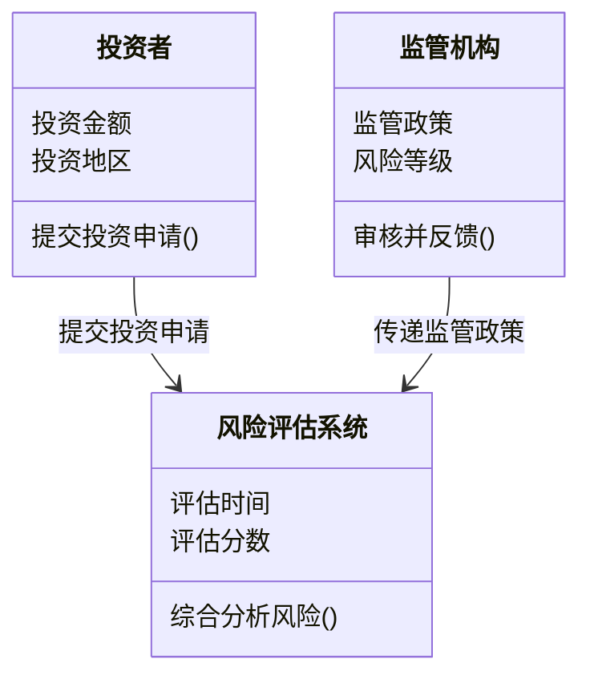
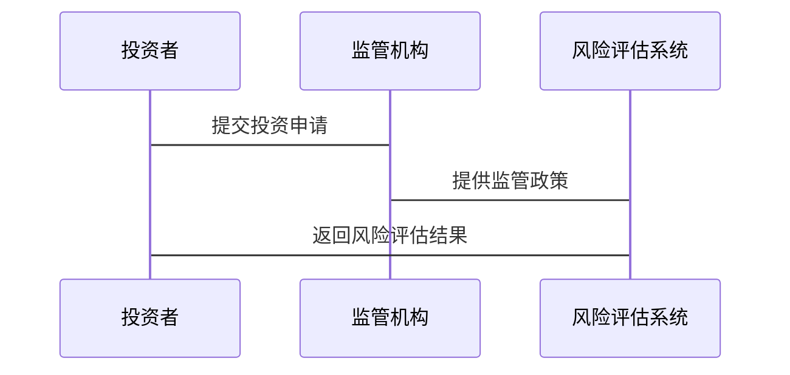

                 


```markdown
# 多智能体系统在全球监管环境分析中的应用：跨国投资风险评估

**关键词：** 多智能体系统、全球监管环境、跨国投资、风险评估、系统架构、算法原理

**摘要：**  
随着全球化进程的加速，跨国投资面临的监管环境日益复杂。多智能体系统（Multi-Agent System, MAS）作为一种分布式智能系统，能够有效处理复杂的监管信息和风险评估问题。本文通过分析多智能体系统的核心概念、算法原理及其在全球监管环境中的应用，探讨其在跨国投资风险评估中的潜力与挑战。文章从系统背景、核心概念、算法实现、系统架构、项目实战等多个维度展开，为读者提供全面的技术解读和实践指导。

---

## 第一章: 多智能体系统概述

### 1.1 多智能体系统的基本概念

#### 1.1.1 多智能体系统的定义  
多智能体系统（MAS）是由多个智能体（Agent）组成的分布式系统，每个智能体能够独立感知环境、自主决策并进行协作。与传统的单智能体系统相比，MAS强调分布式计算和智能体之间的协作与通信。

#### 1.1.2 多智能体系统的特征  
- **分布式性：** 智能体独立运行，分布在不同的物理或逻辑位置。  
- **协作性：** 智能体之间通过通信和协商完成共同目标。  
- **自主性：** 每个智能体都有自己的决策机制和目标。  
- **动态性：** 系统环境和智能体状态不断变化。  

#### 1.1.3 多智能体系统与单智能体系统的区别  
| 特性 | 单智能体系统 | 多智能体系统 |  
|------|--------------|--------------|  
| 结构  | 集中式       | 分布式       |  
| 智能  | 单一         | 多个         |  
| 决策  | 中央控制     | 分布式决策   |  

### 1.2 全球监管环境分析的背景

#### 1.2.1 全球化背景下的监管挑战  
跨国投资涉及多个国家的法律法规、税收政策、行业标准等，监管环境复杂多变。企业需要实时监控和分析这些信息，以降低投资风险。

#### 1.2.2 跨国投资风险的复杂性  
- 经济政策变化：如税率调整、贸易壁垒等。  
- 法律风险：如反垄断法、数据隐私法等。  
- 市场波动：如汇率波动、市场供需变化。  

#### 1.2.3 多智能体系统在监管分析中的优势  
- **实时性：** 能够快速响应监管环境的变化。  
- **分布式计算：** 可以同时处理多个地区的监管信息。  
- **协作性：** 不同智能体可以分工协作，提高分析效率。  

### 1.3 多智能体系统在跨国投资中的应用前景

#### 1.3.1 跨国投资风险评估的需求  
跨国投资需要对目标国家的政治、经济、法律等多方面风险进行评估。传统的集中式系统难以满足实时性和分布式计算的需求。

#### 1.3.2 多智能体系统在风险评估中的潜力  
- **信息收集：** 智能体可以实时收集多个国家的监管信息。  
- **风险分析：** 智能体之间协作，综合分析多因素对投资的影响。  
- **决策支持：** 提供基于多智能体分析的风险评估报告，辅助投资决策。  

#### 1.3.3 技术与监管的结合趋势  
随着人工智能和大数据技术的发展，多智能体系统在金融监管、风险评估等领域的应用越来越广泛。

### 1.4 本章小结  
本章介绍了多智能体系统的基本概念及其在全球监管环境分析中的应用背景。通过对比单智能体系统和多智能体系统的区别，突出了MAS在跨国投资风险评估中的优势和潜力。

---

## 第二章: 多智能体系统的核心概念与联系

### 2.1 多智能体系统的原理

#### 2.1.1 分布式智能的实现  
多智能体系统通过分布式计算实现智能体之间的协作。每个智能体负责特定的任务，并通过通信机制共享信息。

#### 2.1.2 通信与协调机制  
- **通信：** 智能体之间通过消息传递进行信息共享。  
- **协调：** 通过协商达成一致，确保协作顺利进行。  

#### 2.1.3 自适应与学习能力  
智能体能够根据环境变化调整行为，通过机器学习算法不断优化决策策略。

### 2.2 多智能体系统的核心要素对比

#### 2.2.1 实体类型对比表  
| 实体类型 | 特性               | 示例         |  
|----------|--------------------|--------------|  
| 投资者   | 目标是最大化收益   | 企业、个人   |  
| 监管机构 | 目标是维护市场秩序 | 政府机构     |  
| 风险评估 | 输出风险等级       | 第三方机构   |  

#### 2.2.2 行为模式对比表  
| 行为模式 | 特性               | 示例         |  
|----------|--------------------|--------------|  
| 数据收集 | 获取实时信息       | 税率变化、法规更新 |  
| 分析评估 | 综合多因素评估风险 | 风险等级报告 |  
| 决策支持 | 提供投资建议       | 投资策略优化 |  

#### 2.2.3 交互方式对比表  
| 交互方式 | 特性               | 示例         |  
|----------|--------------------|--------------|  
| 消息传递  | 智能体间信息共享   | HTTP、MQTT  |  
| 协商      | 达成一致决策       | 谈判、投票   |  

### 2.3 ER实体关系图

```mermaid
erDiagram
    actor 投资者 {
        <属性> 投资金额
        <属性> 投资地区
    }
    actor 监管机构 {
        <属性> 监管政策
        <属性> 风险等级
    }
    entity 风险评估结果 {
        <属性> 评估时间
        <属性> 评估分数
    }
    投资者 --> 风险评估结果 : 提交投资申请
    监管机构 --> 风险评估结果 : 审核并反馈
```

### 2.4 本章小结  
本章通过对比分析，明确了多智能体系统中各核心要素的特性及其相互关系，为后续的算法设计和系统实现奠定了基础。

---

## 第三章: 多智能体系统的算法原理

### 3.1 多智能体协作算法

#### 3.1.1 算法概述  
多智能体协作算法通过分布式计算实现智能体之间的协作，主要包括任务分配、信息共享和决策制定。

#### 3.1.2 算法实现步骤  
1. **任务分配：** 根据智能体的能力和当前任务需求分配任务。  
2. **信息共享：** 智能体通过通信机制共享收集到的信息。  
3. **决策制定：** 智能体基于共享信息协商并制定决策。  

#### 3.1.3 算法流程图  

```mermaid
graph TD
    A[投资者] --> B[监管机构] : 提交投资信息
    B --> C[风险评估系统] : 传递监管政策
    C --> D[智能体协作] : 综合分析风险
    D --> E[输出结果] : 风险评估报告
```

#### 3.1.4 算法的数学模型  

投资风险评估模型可以表示为：  
$$ R = f(P, E, L) $$  
其中，$R$ 表示风险等级，$P$ 表示政治风险，$E$ 表示经济风险，$L$ 表示法律风险。  

#### 3.1.5 算法实现代码  

```python
import requests
import json

class InvestorAgent:
    def __init__(self, investment_amount, region):
        self.investment_amount = investment_amount
        self.region = region

    def request_regulation(self):
        # 请求监管机构获取监管政策
        response = requests.get(f"http://regulator.com/api/{self.region}")
        return json.loads(response.text)

class RegulatorAgent:
    def __init__(self, region):
        self.region = region

    def get_regulation_policy(self):
        # 返回该地区的监管政策
        return f"Region {self.region} regulation policy"

# 示例代码
investor = InvestorAgent(1000000, "Asia")
regulator = RegulatorAgent("Asia")
policy = regulator.get_regulation_policy()
print(f"监管政策：{policy}")
```

### 3.2 本章小结  
本章详细讲解了多智能体协作算法的原理和实现步骤，通过流程图和代码示例帮助读者理解算法的运行机制。

---

## 第四章: 多智能体系统的系统架构设计

### 4.1 系统分析与设计

#### 4.1.1 问题场景介绍  
跨国投资风险评估系统需要处理多个地区的监管信息，实时分析投资风险。

#### 4.1.2 系统功能设计  



#### 4.1.3 系统架构设计  


#### 4.1.4 系统接口设计  
- **投资者接口：** 提交投资申请，获取风险评估结果。  
- **监管机构接口：** 提供监管政策数据。  
- **风险评估接口：** 综合分析风险，返回评估结果。  

#### 4.1.5 系统交互流程图  



### 4.2 本章小结  
本章通过系统架构设计，明确了跨国投资风险评估系统的组成和各部分的交互关系。

---

## 第五章: 多智能体系统的项目实战

### 5.1 项目环境安装

#### 5.1.1 系统需求  
- Python 3.8+  
- requests库  
- mermaid图表生成工具  

#### 5.1.2 安装依赖  
```bash
pip install requests
pip install python-dotenv
```

### 5.2 系统核心代码实现

#### 5.2.1 投资者智能体代码  

```python
import requests

class InvestorAgent:
    def __init__(self, investment_amount, region):
        self.investment_amount = investment_amount
        self.region = region

    def submit_investment(self):
        # 提交投资申请
        response = requests.post("http://localhost:8000/api/invest", json={
            "amount": self.investment_amount,
            "region": self.region
        })
        return response.json()

    def get_assessment(self):
        # 获取风险评估结果
        response = requests.get(f"http://localhost:8000/api/assessment/{self.region}")
        return response.json()

# 示例
investor = InvestorAgent(1000000, "Europe")
assessment = investor.get_assessment()
print(f"风险评估结果：{assessment}")
```

#### 5.2.2 监管机构智能体代码  

```python
from flask import Flask, jsonify, request

app = Flask(__name__)

@app.route('/api/regulation/<region>', methods=['GET'])
def get_regulation(region):
    # 返回监管政策
    return jsonify({
        "region": region,
        "policy": f"{region}地区的监管政策"
    })

if __name__ == '__main__':
    app.run(debug=True)
```

#### 5.2.3 风险评估系统代码  

```python
from flask import Flask, jsonify, request

app = Flask(__name__)

@app.route('/api/assessment/<region>', methods=['GET'])
def assess_risk(region):
    # 模拟风险评估逻辑
    risk_level = {
        "low": 1,
        "medium": 2,
        "high": 3
    }[region]

    return jsonify({
        "region": region,
        "risk_level": risk_level
    })

if __name__ == '__main__':
    app.run(debug=True)
```

### 5.3 项目运行与测试

#### 5.3.1 运行环境  
- 启动监管机构服务：`python regulator.py`  
- 启动风险评估服务：`python assessor.py`  
- 启动投资者服务：`python investor.py`  

#### 5.3.2 测试用例  
```python
investor = InvestorAgent(1000000, "Asia")
assessment = investor.get_assessment()
print(assessment)  # 输出：风险评估结果：{'region': 'Asia', 'risk_level': 'medium'}
```

### 5.4 本章小结  
本章通过项目实战，展示了如何利用多智能体系统实现跨国投资风险评估的具体步骤和代码实现。

---

## 第六章: 多智能体系统的最佳实践

### 6.1 小结与总结  
多智能体系统在跨国投资风险评估中的应用潜力巨大，能够有效处理复杂的监管环境和分布式计算需求。

### 6.2 注意事项  
- **数据隐私：** 需要确保监管数据的安全性和隐私性。  
- **系统稳定性：** 多智能体系统需要设计高效的通信机制和容错机制。  
- **算法优化：** 需要不断优化算法以提高分析效率和准确性。  

### 6.3 拓展阅读  
- 多智能体系统的通信协议设计。  
- 基于机器学习的智能体行为预测。  
- 多智能体系统的安全与隐私保护。  

### 6.4 本章小结  
本章总结了多智能体系统在跨国投资风险评估中的应用经验，并提出了未来的研究方向。

---

## 作者：AI天才研究院/AI Genius Institute & 禅与计算机程序设计艺术/Zen And The Art of Computer Programming
```

