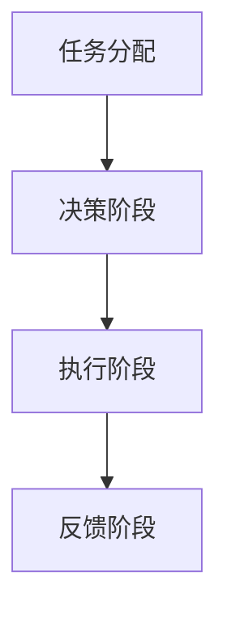
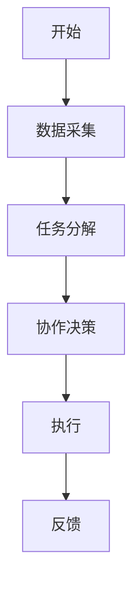
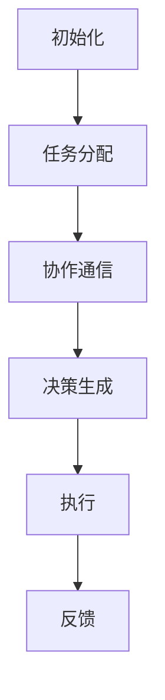
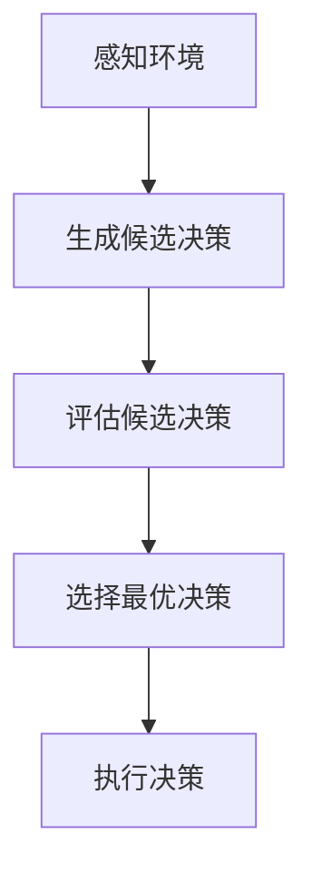
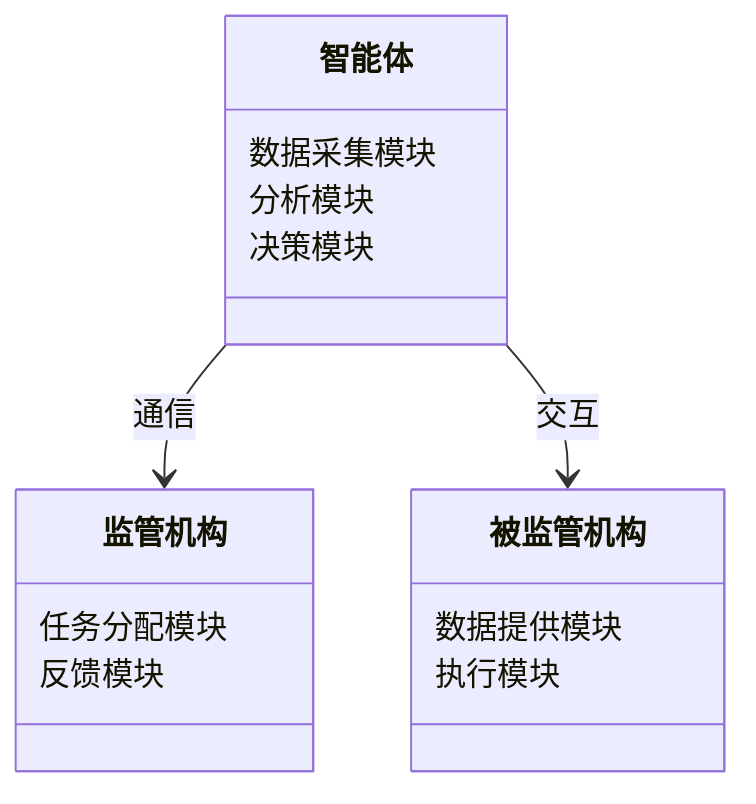
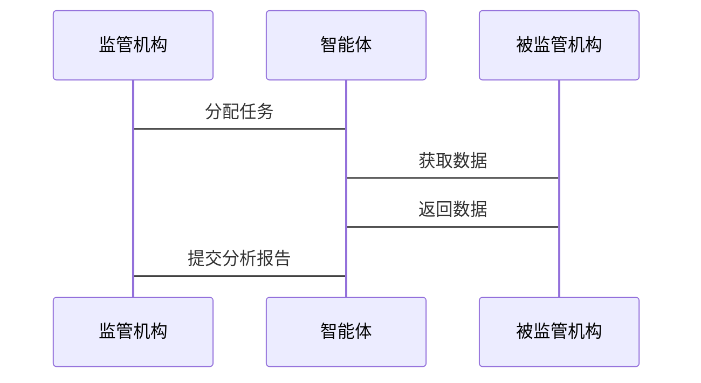

                 


# 多智能体系统在全球监管环境分析中的角色

## 关键词：多智能体系统、监管环境分析、全球监管、协作机制、人工智能

## 摘要：  
随着全球化进程的加速，监管环境的复杂性日益增加。多智能体系统（Multi-Agent Systems, MAS）作为一种分布式、协作式的智能系统，为全球监管环境分析提供了新的解决方案。本文将从多智能体系统的定义、核心概念、算法原理、系统架构、项目实战等方面，详细探讨多智能体系统在全球监管环境分析中的角色和应用。通过实际案例分析和数学模型推导，本文揭示了多智能体系统在提升监管效率、降低合规成本方面的巨大潜力。

---

# 第1章: 多智能体系统与全球监管环境分析概述

## 1.1 多智能体系统的基本概念

### 1.1.1 多智能体系统的定义  
多智能体系统（Multi-Agent Systems, MAS）是由多个智能体（Agent）组成的分布式系统，这些智能体能够通过协作完成复杂任务。每个智能体都是一个独立的实体，具备感知环境、自主决策和执行任务的能力。

### 1.1.2 多智能体系统的核心特征  
- **分布式性**：多个智能体独立运行，协同完成任务。  
- **协作性**：智能体之间通过通信和协作完成目标。  
- **自主性**：智能体能够自主决策，无需外部干预。  
- **反应性**：智能体能够实时感知环境并做出反应。  

### 1.1.3 多智能体系统与传统单智能体系统的区别  
传统单智能体系统依赖中央控制，而多智能体系统通过分布式协作完成任务，具备更高的灵活性和容错性。

## 1.2 全球监管环境分析的背景与挑战

### 1.2.1 全球化背景下的监管需求  
全球化导致监管对象复杂化，企业需要遵守不同国家和地区的法律法规，监管环境分析的需求日益迫切。

### 1.2.2 监管环境分析的复杂性  
监管环境涉及多个维度，包括法律、合规、风险评估等，传统方法难以高效处理。

### 1.2.3 多智能体系统在监管环境分析中的优势  
多智能体系统通过分布式协作，能够高效处理复杂监管环境下的多任务需求。

## 1.3 多智能体系统在全球监管环境分析中的角色

### 1.3.1 多智能体系统的协作机制  
- 智能体之间的通信与协作协议。  
- 协作规则的制定与执行。

### 1.3.2 多智能体系统在监管决策中的应用  
- 数据采集与分析。  
- 风险评估与预警。

### 1.3.3 多智能体系统对全球监管环境分析的推动作用  
通过分布式协作，多智能体系统能够快速响应监管需求，提高监管效率。

---

# 第2章: 多智能体系统的核心概念与联系

## 2.1 多智能体系统的组成与属性

### 2.1.1 实体关系图（ER图）  
```mermaid
erDiagram
    actor 监管机构 {
        <属性> 法律法规
        <属性> 监管要求
    }
    actor 被监管机构 {
        <属性> 业务数据
        <属性> 合规记录
    }
    actor 智能体 {
        <属性> 数据采集
        <属性> 分析结果
    }
    监管机构 --> 智能体 : 任务分配
    被监管机构 --> 智能体 : 数据提供
    智能体 --> 监管机构 : 分析报告
```

### 2.1.2 多智能体系统的属性特征对比表格  
| 属性 | 单智能体系统 | 多智能体系统 |
|------|--------------|--------------|
| 分布式 | 中央控制     | 分布式协作   |
| 独立性 | 高           | 高           |
| 协作性 | 低           | 高           |
| 灵活性 | 低           | 高           |

## 2.2 多智能体系统的协作机制

### 2.2.1 协作协议与通信模型  
```mermaid
graph TD
    A[智能体A] --> B[智能体B] : 通信
    B --> C[智能体C] : 协作
    C --> A : 反馈
```

### 2.2.2 协作规则与决策过程  


## 2.3 多智能体系统的算法原理

### 2.3.1 多智能体系统算法的流程图  


---

# 第3章: 多智能体系统的算法原理与数学模型

## 3.1 多智能体系统的协作算法

### 3.1.1 协作算法的流程图  


### 3.1.2 协作算法的数学模型  
$$ \text{协作度} = \sum_{i=1}^{n} \frac{1}{d_i} $$
其中，\( d_i \) 表示第 \( i \) 个智能体的决策延迟。

## 3.2 多智能体系统的决策算法

### 3.2.1 决策算法的流程图  


### 3.2.2 决策算法的数学模型  
$$ \text{决策结果} = \arg \max_{j} \sum_{i=1}^{n} w_{ij} \cdot x_i $$
其中，\( w_{ij} \) 表示第 \( i \) 个智能体对第 \( j \) 个决策的权重。

---

# 第4章: 多智能体系统的系统分析与架构设计

## 4.1 问题场景介绍

### 4.1.1 监管环境分析的需求  
企业需要实时监控全球法律法规的变化，确保合规性。

### 4.1.2 项目目标  
设计一个多智能体系统，用于全球监管环境的实时分析和风险评估。

## 4.2 系统功能设计

### 4.2.1 领域模型  


### 4.2.2 系统架构设计  


### 4.2.3 系统交互设计  


---

# 第5章: 项目实战

## 5.1 环境安装

### 5.1.1 安装Python和相关库  
```bash
pip install numpy pandas scikit-learn matplotlib
```

## 5.2 系统核心实现源代码

### 5.2.1 数据采集模块  
```python
import requests

def fetch_data(url):
    response = requests.get(url)
    return response.json()
```

### 5.2.2 分析模块  
```python
from sklearn import cluster

def analyze(data):
    model = cluster.KMeans(n_clusters=3)
    model.fit(data)
    return model.labels_
```

### 5.2.3 决策模块  
```python
def make_decision(labels):
    return "低风险" if max(labels) < 2 else "高风险"
```

## 5.3 实际案例分析

### 5.3.1 案例背景  
分析一家跨国公司的全球合规风险。

### 5.3.2 数据采集与分析  
```python
data = fetch_data("https://api.example.com/regulatory_data")
labels = analyze(data)
decision = make_decision(labels)
print(decision)
```

### 5.3.3 结果解读  
输出结果为“高风险”，表明需要进一步审查。

---

# 第6章: 最佳实践与总结

## 6.1 小结  
多智能体系统通过协作和分布式计算，显著提升了全球监管环境分析的效率。

## 6.2 注意事项  
- 数据隐私保护至关重要。  
- 系统设计需考虑容错性和可扩展性。  

## 6.3 拓展阅读  
- 《Multi-Agent Systems: Complexity, Decentralization, and Adaptation》  
- 《Artificial Intelligence and Global Regulation》

---

# 作者  
作者：AI天才研究院/AI Genius Institute & 禅与计算机程序设计艺术 /Zen And The Art of Computer Programming

