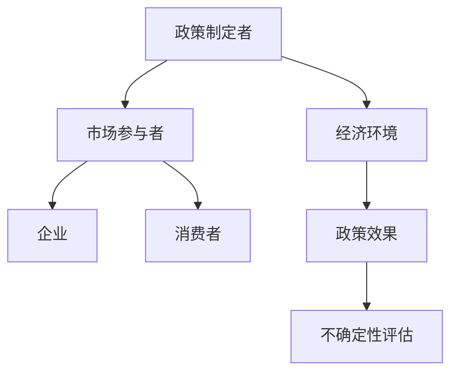
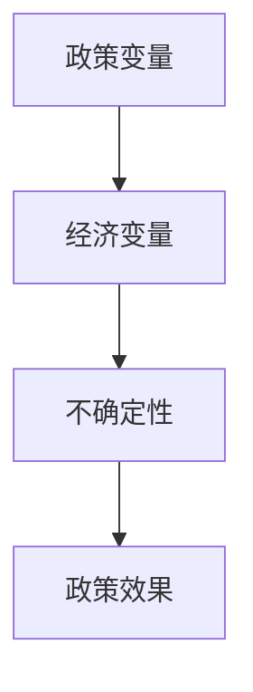
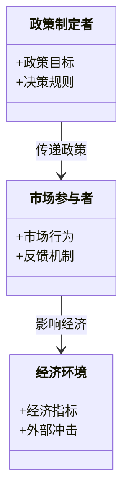
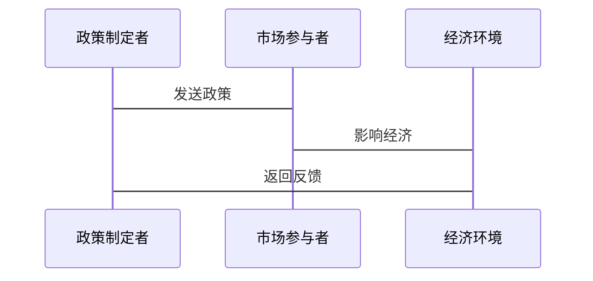

                 


# 多智能体系统在全球经济政策不确定性评估中的应用

> 关键词：多智能体系统，全球经济政策，不确定性评估，贝叶斯网络，Dempster-Shafer证据理论

> 摘要：本文探讨了多智能体系统（MAS）在全球经济政策不确定性评估中的应用。通过分析MAS的基本原理、核心概念及其在经济政策评估中的优势，结合实际案例，详细阐述了MAS在不确定性建模、分布式计算与协作、动态适应性等方面的优势。文章还通过具体算法（如贝叶斯网络和Dempster-Shafer证据理论）的实现，展示了MAS在全球经济政策不确定性评估中的潜力和应用前景。

---

## 第一章: 多智能体系统的基本概念与全球经济政策的不确定性

### 1.1 多智能体系统（MAS）的定义与核心要素

#### 1.1.1 多智能体系统的定义
多智能体系统（Multi-Agent System, MAS）是由多个智能体（Agent）组成的复杂系统。智能体是具有感知、决策、行动和协作能力的实体，能够独立运行并与其他智能体或环境进行交互。

#### 1.1.2 多智能体系统的核心要素
| 核心要素 | 描述 |
|----------|------|
| 智能体   | 具有自主性、反应性、社会性和目标性的实体 |
| 环境     | 智能体所处的外部世界，包括物理环境和任务环境 |
| 交互     | 智能体之间的通信与协作机制 |
| 协作     | 智能体通过协作完成共同目标的能力 |

#### 1.1.3 多智能体系统的分类与特点
- **分类**：MAS可以分为基于规则的MAS、基于模型的MAS、基于效用的MAS等。
- **特点**：分布式、动态性、协作性、适应性。

### 1.2 全球经济政策的复杂性与不确定性

#### 1.2.1 经济政策的基本概念
经济政策是政府或组织为了实现特定经济目标（如稳定增长、就业保障、通货膨胀控制等）而采取的措施。

#### 1.2.2 全球化背景下的经济政策复杂性
- 全球化导致经济政策的相互影响增强。
- 不同国家和地区的政策差异可能引发连锁反应。

#### 1.2.3 经济政策不确定性的影响与挑战
- 不确定性可能导致政策效果的不可预测性。
- 政策制定者需要在复杂环境中做出决策。

---

## 第二章: 多智能体系统的核心概念与联系

### 2.1 多智能体系统的原理

#### 2.1.1 智能体的定义与属性
- **智能体**：具有感知、决策、行动和协作能力的实体。
- **属性**：自主性、反应性、社会性、目标性。

#### 2.1.2 智能体的分类与特征对比
| 智能体类型 | 描述                     | 特征对比         |
|------------|--------------------------|----------------|
| 反应式     | 基于当前感知做出反应     | 响应速度快       |
| 规则式     | 基于预定义规则进行决策   | 简单且易于实现   |
| 学习式     | 通过学习优化决策策略     | 具有自适应能力   |
| 效用式     | 通过效用函数进行决策     | 适用于多目标优化 |

#### 2.1.3 智能体之间的交互与协作
- **交互方式**：通信、协商、协调。
- **协作机制**：任务分配、角色分配、信息共享。

### 2.2 多智能体系统的概念模型

#### 2.2.1 实体关系模型


#### 2.2.2 概念属性特征对比
| 概念 | 描述                     | 特征对比         |
|------|--------------------------|----------------|
| MAS  | 多智能体系统的整体结构   | 分布式、动态性   |
| 智能体 | 系统的基本组成单元       | 自主性、协作性   |
| 交互 | 智能体之间的通信与协作   | 实时性、复杂性   |

---

## 第三章: 多智能体系统的算法原理

### 3.1 贝叶斯网络在不确定性评估中的应用

#### 3.1.1 贝叶斯网络的基本原理
贝叶斯网络是一种概率图模型，用于表示变量之间的概率关系。

#### 3.1.2 贝叶斯网络的构建步骤


#### 3.1.3 贝叶斯网络的实现
```python
# 安装必要的库
import numpy as np
from sklearn.naive_bayes import GaussianNB

# 示例数据
X = np.array([[-1, -1], [-1, 1], [1, -1], [1, 1]])
y = np.array([0, 1, 1, 0])

# 训练模型
model = GaussianNB()
model.fit(X, y)

# 预测
print(model.predict([[0, 0]]))
```

#### 3.1.4 贝叶斯网络的数学模型
$$ P(y|x) = \frac{P(x|y)P(y)}{P(x)} $$

### 3.2 Dempster-Shafer证据理论在MAS中的应用

#### 3.2.1 Dempster-Shafer理论的基本原理
Dempster-Shafer证据理论是一种用于处理不确定性信息的数学框架。

#### 3.2.2 Dempster-Shafer理论的实现
```python
def d_s_combination(a, b):
    return (a + b - a * b) / (1 - a * b)

# 示例数据
a = 0.8
b = 0.7

# 组合证据
result = d_s_combination(a, b)
print(result)
```

#### 3.2.3 Dempster-Shafer理论的数学模型
$$ \text{Bel}(x) = \frac{m(x)}{1 - \sum_{y \neq x} m(y)} $$

---

## 第四章: 多智能体系统的系统分析与架构设计

### 4.1 系统功能设计

#### 4.1.1 领域模型设计


#### 4.1.2 系统架构设计


#### 4.1.3 接口与交互设计


---

## 第五章: 多智能体系统的项目实战

### 5.1 项目环境与工具安装

#### 5.1.1 安装必要的库
```bash
pip install numpy matplotlib networkx
```

#### 5.1.2 编写 MAS 模型代码
```python
import networkx as nx

# 创建多智能体系统
G = nx.DiGraph()

# 添加节点
G.add_nodes_from(['政策制定者', '市场参与者', '经济环境'])

# 添加边
G.add_edges_from([('政策制定者', '市场参与者'), ('市场参与者', '经济环境')])

# 可视化
nx.draw(G, with_labels=True, edge_color='blue')
plt.show()
```

### 5.2 实际案例分析与解读

#### 5.2.1 案例分析
假设某国政府制定一项新的货币政策，通过MAS模拟其对市场和经济环境的影响。

#### 5.2.2 代码实现与解读
```python
# 定义智能体行为
class PolicyMaker:
    def __init__(self, target):
        self.target = target

    def decide(self, environment):
        # 根据环境做出决策
        return f"政策决策：{self.target}，环境状态：{environment}"

# 定义市场参与者
class MarketParticipant:
    def __init__(self, action):
        self.action = action

    def react(self, policy):
        # 根据政策做出反应
        return f"市场反应：{self.action}，政策：{policy}"

# 定义经济环境
class EconomicEnvironment:
    def __init__(self, state):
        self.state = state

    def update(self, action):
        # 更新经济环境状态
        return f"环境变化：{self.state}，市场行为：{action}"

# 实验模拟
pm = PolicyMaker("经济增长")
mp = MarketParticipant("投资增加")
ee = EconomicEnvironment("稳定")

policy = pm.decide(ee.state)
reaction = mp.react(policy)
environment_change = ee.update(mp.action)

print(policy)
print(reaction)
print(environment_change)
```

### 5.3 项目小结
通过上述实现，展示了MAS在经济政策评估中的潜力。政策制定者、市场参与者和经济环境之间的交互关系可以通过MAS模拟和优化。

---

## 第六章: 总结与展望

### 6.1 总结
多智能体系统在经济政策不确定性评估中的应用具有显著优势。通过MAS模拟复杂经济环境中的多方互动，能够有效捕捉政策实施中的不确定性，并提供实时反馈。

### 6.2 未来展望
未来研究可以进一步探索MAS在经济政策评估中的优化算法，如强化学习和深度学习的结合，以及如何在实际政策制定中应用这些技术。

---

作者：AI天才研究院/AI Genius Institute & 禅与计算机程序设计艺术 /Zen And The Art of Computer Programming

