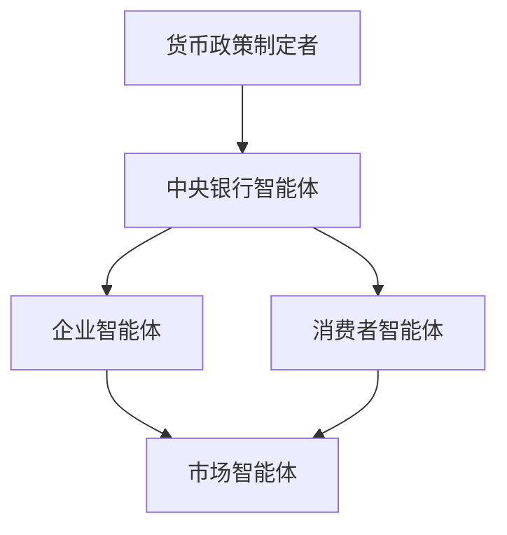
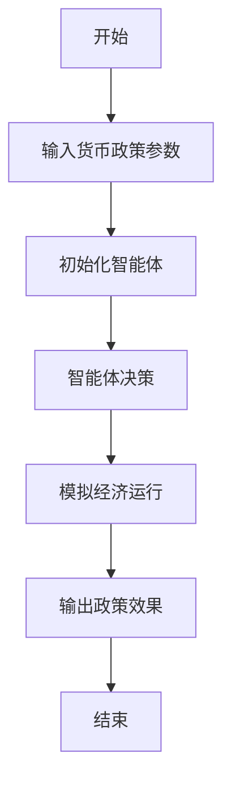

                 


```markdown
# 多智能体系统在全球货币政策影响分析中的角色

> 关键词：多智能体系统，货币政策，全球影响，经济模型，智能体协作

> 摘要：本文探讨了多智能体系统在全球货币政策分析中的应用，详细阐述了多智能体系统的基本概念、理论基础、系统架构及其在货币政策传导和效果评估中的具体应用。通过实际案例分析和系统设计，展示了多智能体系统如何帮助理解和预测全球货币政策的相互作用及其对经济的综合影响。

---

# 第一部分: 多智能体系统与货币政策概述

## 第1章: 多智能体系统的定义与特点
### 1.1 多智能体系统的定义
多智能体系统（Multi-Agent Systems, MAS）是由多个智能体（Agent）组成的复杂系统，每个智能体能够独立感知环境、自主决策并与其他智能体协作或竞争，以实现共同或个体目标。

### 1.2 多智能体系统的核心特点
- **自主性**：每个智能体都能独立决策。
- **反应性**：智能体能够实时感知环境并做出反应。
- **协作性**：多个智能体之间可以通过通信和协作完成复杂任务。
- **分布式性**：智能体分布在不同的空间或网络节点上，不存在中心控制。

### 1.3 多智能体系统与传统单智能体系统的区别
| 特性 | 单智能体系统 | 多智能体系统 |
|------|--------------|--------------|
| 结构 | 单一中心化 | 分布式，去中心化 |
| 决策 | 单一决策者 | 多个决策者，可能协作或竞争 |
| 通信 | 无或有限 | 高频通信与协作 |
| 应用 | 单点任务 | 复杂任务分解到多个智能体 |

## 第2章: 货币政策的定义与机制
### 2.1 货币政策的基本概念
货币政策是国家或地区为实现经济发展目标（如通胀控制、就业最大化、经济增长等）而采取的调节货币供应量和利率等措施。

### 2.2 货币政策的传导机制
货币政策通过调整利率、货币供应量等手段，影响企业和消费者的行为，进而影响投资、消费和整体经济运行。

### 2.3 全球货币政策的复杂性与挑战
- **全球化背景**：各国货币政策相互影响，导致全球经济波动。
- **不确定性**：货币政策效果受多种因素影响，如市场预期、国际资本流动等。
- **多目标平衡**：各国在货币政策制定中需平衡通胀、就业、经济增长等多个目标。

## 第3章: 多智能体系统在货币政策分析中的角色
### 3.1 多智能体系统在货币政策分析中的优势
- **分布式决策**：模拟不同经济主体（企业和消费者）的决策过程。
- **实时模拟**：能够实时模拟货币政策变化对经济的多方面影响。
- **复杂系统建模**：适合分析高度复杂的经济系统。

### 3.2 多智能体系统在全球货币政策中的应用背景
- **全球化经济**：需要分析跨国货币政策的影响。
- **实时经济模拟**：需要快速响应和实时分析。
- **政策效果预测**：需要准确预测不同政策组合的效果。

### 3.3 多智能体系统与货币政策分析的结合意义
通过多智能体系统模拟经济主体的行为，能够更准确地预测货币政策的效果，为政策制定者提供科学依据。

---

# 第二部分: 多智能体系统的理论基础

## 第4章: 多智能体系统的理论框架
### 4.1 多智能体系统的模型构建
- **智能体定义**：每个智能体具有目标、知识、信念、意图和能力。
- **环境建模**：构建经济环境模型，包括市场、企业、消费者等。

### 4.2 多智能体系统的通信与协作机制
- **通信协议**：定义智能体之间的信息交换规则。
- **协作策略**：制定智能体协作的目标和方法。

### 4.3 多智能体系统的决策与行为建模
- **决策模型**：基于环境信息和目标，智能体做出决策。
- **行为建模**：模拟智能体在不同环境下的行为表现。

## 第5章: 多智能体系统的博弈论分析
### 5.1 博弈论的基本概念
- **博弈**：参与者在策略选择中互动，追求自身利益最大化。
- **纳什均衡**：所有参与者在给定其他参与者策略的情况下，选择最优策略。

### 5.2 多智能体系统中的博弈模型
- **非合作博弈**：智能体之间不进行合作，独立决策。
- **合作博弈**：智能体之间通过合作实现共同目标。

### 5.3 多智能体系统在货币政策博弈中的应用
- **政策制定者的博弈**：不同国家的货币政策制定者在博弈中寻求最优策略。
- **市场参与者的行为**：企业和消费者在货币政策变化中的博弈行为。

---

# 第三部分: 货币政策分析的理论框架

## 第6章: 货币政策的传导路径与影响
### 6.1 货币政策的传导路径
- **利率渠道**：通过调整利率影响投资和消费。
- **货币供应渠道**：通过调整货币供应量影响信贷和投资。
- **预期渠道**：通过影响市场预期改变经济主体行为。

### 6.2 货币政策对经济的主要影响
- **经济增长**：适度宽松的货币政策可以刺激经济增长。
- **通胀控制**：紧缩性货币政策可以抑制通胀。
- **就业**：货币政策通过影响经济活动影响就业率。

### 6.3 全球化背景下的货币政策相互作用
- **汇率影响**：货币政策变化影响汇率，进而影响国际贸易。
- **资本流动**：货币政策变化影响国际资本流动。

## 第7章: 多智能体系统在货币政策影响分析中的应用
### 7.1 多智能体系统在货币政策传导中的角色
- **模拟经济主体行为**：模拟企业和消费者在不同货币政策下的行为。
- **预测政策效果**：通过模拟预测货币政策的实际效果。

### 7.2 多智能体系统在货币政策效果评估中的作用
- **多维度分析**：从多个维度（如经济增长、通胀、就业）评估货币政策效果。
- **情景分析**：模拟不同政策组合下的经济表现。

### 7.3 多智能体系统在全球货币政策协调中的应用
- **跨国协作**：模拟不同国家货币政策协作的效果。
- **政策协调机制**：设计和优化跨国货币政策协调机制。

---

# 第四部分: 多智能体系统在货币政策分析中的具体应用

## 第8章: 多智能体系统的货币政策模拟实验
### 8.1 实验设计
- **实验目标**：验证多智能体系统在货币政策分析中的有效性。
- **实验场景**：设定不同货币政策情景，如加息、降息等。

### 8.2 实验结果与分析
- **经济增长预测**：模拟不同货币政策下的经济增长情况。
- **通胀控制效果**：分析货币政策对通胀的控制效果。
- **政策协调优化**：通过实验优化跨国货币政策协调机制。

## 第9章: 多智能体系统的货币政策优化策略
### 9.1 基于多智能体系统的货币政策优化方法
- **智能体协作优化**：通过智能体协作优化货币政策组合。
- **动态调整策略**：根据经济环境动态调整货币政策。

### 9.2 多智能体系统在货币政策优化中的优势
- **实时优化**：能够实时调整货币政策策略。
- **全局最优**：通过智能体协作实现全局最优。

---

# 第五部分: 系统架构与实现

## 第10章: 系统架构设计
### 10.1 系统功能模块
- **智能体模块**：实现经济主体的决策和行为。
- **通信模块**：实现智能体之间的信息交换。
- **数据采集模块**：采集经济数据，如GDP、通胀率等。
- **模拟模块**：模拟货币政策变化对经济的影响。

### 10.2 系统架构图


### 10.3 系统接口设计
- **API接口**：提供给其他系统调用的接口，如数据接口、决策接口等。
- **消息队列**：智能体之间通过消息队列进行通信。

---

# 第六部分: 算法与数学模型

## 第11章: 基于多智能体系统的货币政策分析算法
### 11.1 算法原理
- **分布式计算**：多智能体系统通过分布式计算实现政策分析。
- **博弈论算法**：基于博弈论的智能体决策算法。

### 11.2 算法流程图


### 11.3 数学模型
货币政策效果评估模型：
$$
E = \alpha \cdot M + \beta \cdot R
$$
其中：
- \( E \) 表示政策效果
- \( M \) 表示货币政策参数
- \( R \) 表示市场反应
- \(\alpha\) 和 \(\beta\) 是权重系数

---

# 第七部分: 项目实战

## 第12章: 项目环境配置与核心代码实现
### 12.1 环境配置
- **编程语言**：Python
- **框架**：使用Multi-Agent Framework（MAF）框架
- **工具**：安装必要的库，如`networkx`、`matplotlib`等。

### 12.2 核心代码实现
```python
class Agent:
    def __init__(self, id):
        self.id = id
        self.state = 'idle'
    
    def decide(self, environment):
        # 根据环境信息做出决策
        pass

class CentralBank:
    def __init__(self):
        self.agents = []
    
    def set_policy(self, policy):
        for agent in self.agents:
            agent.decide(environment)
```

### 12.3 实验结果与分析
- **实验结果**：模拟不同货币政策下的经济指标变化。
- **结果分析**：验证模型的有效性和准确性。

---

# 第八部分: 结论与展望

## 第13章: 结论
### 13.1 全文总结
通过多智能体系统模拟货币政策变化对经济的影响，为政策制定者提供科学依据。

### 13.2 未来展望
未来可以进一步研究多智能体系统在货币政策优化中的应用，以及如何提高系统的实时性和准确性。

---

# 作者：AI天才研究院/AI Genius Institute & 禅与计算机程序设计艺术 /Zen And The Art of Computer Programming
```

