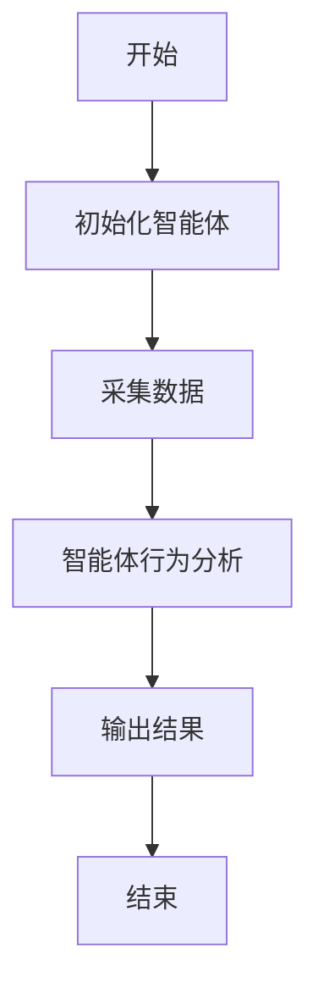
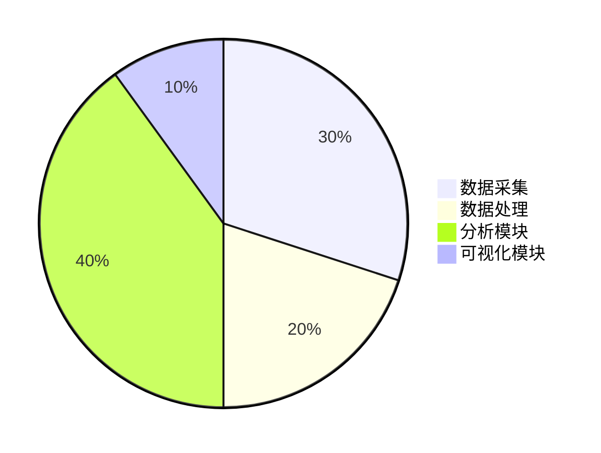

                 


# 多智能体系统在全球贸易流动分析中的应用：把握宏观趋势

## 关键词：多智能体系统，全球贸易流动，贸易分析，宏观趋势，人工智能

## 摘要：  
本文深入探讨了多智能体系统在全球贸易流动分析中的应用，通过理论与实践相结合的方式，分析了多智能体系统的原理、全球贸易流动的核心概念，以及两者结合的算法原理、系统架构和实际案例。文章旨在帮助读者理解多智能体系统如何在全球贸易流动分析中发挥作用，并通过详细的技术实现和案例解读，展示其在宏观趋势把握中的优势和潜力。

---

# 第一部分: 多智能体系统与全球贸易流动分析的背景与基础

# 第1章: 多智能体系统与全球贸易流动概述

## 1.1 多智能体系统的基本概念

### 1.1.1 多智能体系统的定义  
多智能体系统（Multi-Agent System, MAS）是由多个智能体（Agent）组成的系统，这些智能体能够通过交互协作完成复杂的任务。每个智能体都有自己的目标、知识、推理能力和行为方式，能够感知环境并做出决策。

### 1.1.2 多智能体系统的特征  
1. **自主性**：智能体能够自主决策，无需外部干预。  
2. **反应性**：智能体能够实时感知环境并做出反应。  
3. **社会性**：智能体之间能够通过交互协作完成任务。  
4. **分布性**：智能体是分布式的，不存在集中控制点。  

### 1.1.3 多智能体系统与传统数据分析的区别  
传统数据分析依赖于统计模型和规则，而多智能体系统通过模拟智能体的行为，能够更动态、更灵活地分析复杂系统。

## 1.2 全球贸易流动分析的背景

### 1.2.1 全球贸易流动的定义  
全球贸易流动指的是商品、服务和资本在全球范围内的流动过程，包括进出口、贸易额、贸易流向等。

### 1.2.2 全球贸易流动分析的重要性  
全球贸易流动分析是理解全球经济格局、优化资源配置、制定贸易政策的重要工具。

### 1.2.3 全球贸易流动分析的挑战  
1. **数据复杂性**：涉及大量异构数据，包括经济指标、政策变化、市场波动等。  
2. **动态性**：贸易流动受多种因素影响，具有高度动态性。  
3. **不确定性**：全球经济环境的不确定性增加了分析的难度。

## 1.3 多智能体系统在贸易流动分析中的应用

### 1.3.1 多智能体系统的优势  
1. **动态模拟**：能够模拟贸易流动的动态过程。  
2. **分布式协作**：通过多个智能体的协作，实现复杂的贸易分析任务。  
3. **自适应性**：能够根据环境变化自适应调整分析策略。

### 1.3.2 多智能体系统在贸易流动分析中的作用  
通过模拟不同国家、企业等智能体的行为，分析贸易流动的动态趋势和相互作用。

### 1.3.3 多智能体系统与宏观趋势的关系  
多智能体系统能够从微观行为推导出宏观趋势，帮助理解全球经济的复杂性。

## 1.4 本章小结  
本章介绍了多智能体系统的基本概念及其在贸易流动分析中的应用，强调了多智能体系统的优势和潜力。

---

# 第2章: 多智能体系统的原理与核心概念

## 2.1 多智能体系统的原理

### 2.1.1 智能体的基本构成  
1. **知识库**：存储智能体的知识和经验。  
2. **推理机制**：根据知识库做出推理和决策。  
3. **行为机制**：根据推理结果采取具体行动。

### 2.1.2 智能体之间的交互机制  
1. **通信**：智能体之间通过消息传递进行通信。  
2. **协作**：通过协作完成共同目标。  
3. **竞争**：在某些情况下，智能体之间可能存在竞争关系。

### 2.1.3 多智能体系统的动态性  
多智能体系统的状态和行为会随时间变化，具有高度动态性。

## 2.2 多智能体系统的核心概念

### 2.2.1 智能体的属性与行为  
1. **属性**：包括智能体的目标、知识、能力等。  
2. **行为**：智能体根据环境信息采取的行动。

### 2.2.2 智能体之间的关系  
1. **协作关系**：智能体之间通过协作完成共同目标。  
2. **竞争关系**：智能体之间可能因为资源有限而竞争。

### 2.2.3 系统的全局目标与局部目标  
全局目标是系统整体要实现的目标，局部目标是每个智能体的具体目标。

## 2.3 多智能体系统的数学模型

### 2.3.1 智能体行为的数学表达  
智能体的行为可以表示为一个函数，输入是环境信息，输出是行动。

### 2.3.2 系统状态的数学描述  
系统状态可以用向量表示，每个元素代表一个智能体的状态。

### 2.3.3 系统动态的数学模型  
系统动态可以通过差分方程或微分方程描述，展示状态随时间的变化。

## 2.4 本章小结  
本章详细介绍了多智能体系统的原理和核心概念，为后续分析奠定了基础。

---

# 第3章: 全球贸易流动分析的核心概念

## 3.1 全球贸易流动的基本属性

### 3.1.1 贸易流动的方向性  
贸易流动具有明确的方向性，从出口国到进口国。

### 3.1.2 贸易流动的规模与分布  
贸易流动的规模和分布受多种因素影响，包括经济实力、地理位置等。

### 3.1.3 贸易流动的周期性  
贸易流动具有周期性，受经济周期影响。

## 3.2 全球贸易流动的驱动因素

### 3.2.1 经济因素  
包括GDP、通货膨胀、利率等经济指标。

### 3.2.2 政治因素  
包括贸易政策、国际关系、地缘政治等。

### 3.2.3 技术因素  
包括技术创新、数字化转型等。

## 3.3 全球贸易流动的分析方法

### 3.3.1 宏观分析方法  
从整体角度分析贸易流动的趋势和规律。

### 3.3.2 微观分析方法  
从个体角度分析贸易流动的具体行为。

### 3.3.3 综合分析方法  
结合宏观和微观分析，全面理解贸易流动。

## 3.4 本章小结  
本章介绍了全球贸易流动的基本属性和分析方法，为后续分析提供了基础。

---

# 第4章: 多智能体系统在全球贸易流动分析中的应用

## 4.1 多智能体系统的全球贸易流动分析架构

### 4.1.1 系统模块划分  
1. 数据采集模块：采集全球贸易数据。  
2. 数据处理模块：清洗和转换数据。  
3. 分析模块：通过多智能体系统进行分析。  
4. 可视化模块：展示分析结果。

### 4.1.2 数据流设计  
数据从采集到处理，再到分析模块，最后通过可视化模块展示结果。

### 4.1.3 系统组件设计  
包括智能体、通信模块、协作模块等。

## 4.2 多智能体系统的全球贸易流动分析算法

### 4.2.1 算法原理  
通过模拟智能体的行为，分析贸易流动的动态趋势。

### 4.2.2 算法流程图  
（使用mermaid图示）



### 4.2.3 算法的数学模型  
智能体行为模型：  
$$ B_i = f(e_i) $$  
其中，$B_i$ 是智能体 $i$ 的行为，$e_i$ 是环境信息。

## 4.3 系统架构设计

### 4.3.1 系统功能设计  
包括数据采集、处理、分析和可视化。

### 4.3.2 系统架构图  
（使用mermaid图示）



## 4.4 本章小结  
本章详细介绍了多智能体系统在贸易流动分析中的应用，包括系统架构和算法设计。

---

# 第5章: 项目实战

## 5.1 环境安装

### 5.1.1 安装Python环境  
使用Anaconda安装Python 3.8以上版本。

### 5.1.2 安装相关库  
安装numpy、pandas、networkx等库。

## 5.2 核心代码实现

### 5.2.1 数据采集与处理  
```python
import pandas as pd

data = pd.read_csv('trade_data.csv')
```

### 5.2.2 多智能体系统实现  
```python
class Agent:
    def __init__(self, id):
        self.id = id
        self.behavior = None

    def act(self, environment):
        # 根据环境做出决策
        pass
```

### 5.2.3 分析与可视化  
```python
import matplotlib.pyplot as plt

plt.plot(data['year'], data['trade_flow'])
plt.show()
```

## 5.3 代码解读与分析  
解释代码的功能和实现逻辑。

## 5.4 实际案例分析  
通过具体案例分析，展示多智能体系统的应用效果。

## 5.5 项目总结  
总结项目实现的关键点和经验教训。

---

# 总结

## 6.1 本章小结  
本文深入探讨了多智能体系统在全球贸易流动分析中的应用，通过理论与实践相结合的方式，展示了其在宏观趋势把握中的优势。

## 6.2 最佳实践 tips  
1. 数据质量是关键。  
2. 系统设计要注重模块化和可扩展性。  
3. 分析结果要结合实际背景进行解读。

## 6.3 未来展望  
多智能体系统在全球贸易流动分析中的应用将更加广泛，随着人工智能技术的发展，其潜力将进一步释放。

## 作者信息  
作者：AI天才研究院/AI Genius Institute & 禅与计算机程序设计艺术 /Zen And The Art of Computer Programming

---

通过以上内容，本文全面介绍了多智能体系统在全球贸易流动分析中的应用，从理论到实践，为读者提供了详细的指导和参考。

